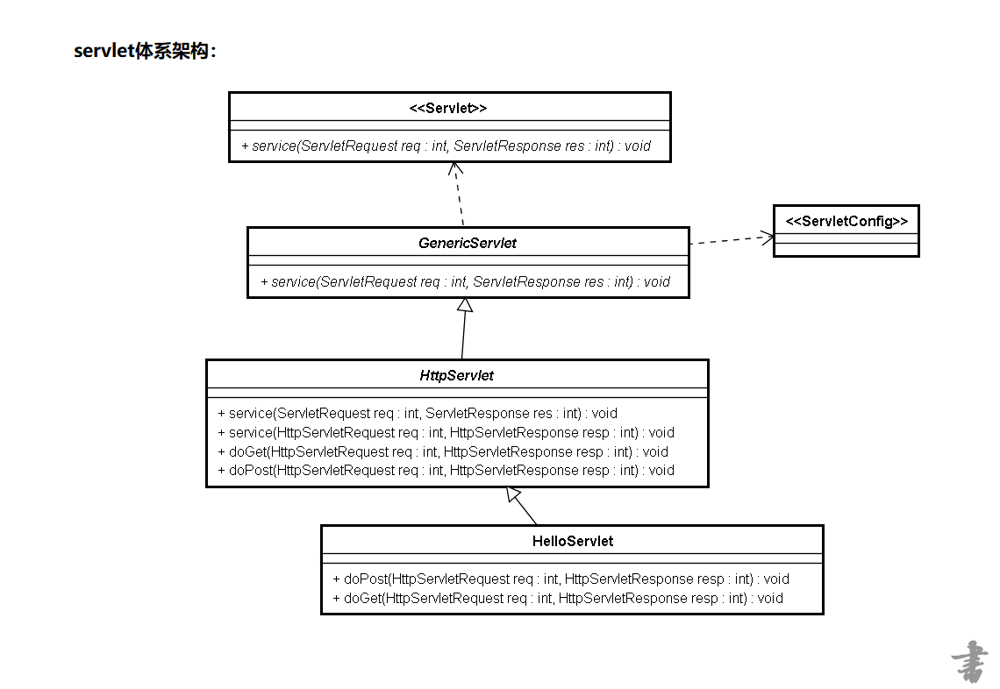

## servlet 概念
servlet是服务端的应用程序，专门用于接受网络请求以及响应。
## 接受参数方式
1. request.getParameter()；返回字符串
2.  request.getParameterValues()；返回参数值数组
3. request.getParameterNames()；返回name数组
4. request.getParameterMap()；返回name和值对应的map

## 乱码
- 页面乱码： html中加入meta标签，jsp中调整字符集。
- 服务器：tomcat上的connector中设置字符集
- servlet：post请求，给request设置字符集，get请求，给request重新编码。设置response字符集以及contentType为“text/html;charset='utf-8'”
- 数据库：配置中设置好字符集，且确认新建的database字符集为utf-8

## 体系架构
自定义的Servlet继承HttpServlet继承GenericServlet实现Servlet和ServletConfig接口）




## 生命周期
1. 加载serlvet并实例化
- 第一次访问的时候实例化，**servlet是个单例**
- 服务器启动的时候： 
```
<servlet>
  <servlet-name>addEmployee</servlet-name>
  <servlet-class>cn.kgc.servlet.HelloServlet</servlet-class>
  <load-on-startup>1</load-on-startup>
</servlet>
```

2. 初始化 init
第一次访问的时候初始化，在实例化之后，初始化一次
假设有一些逻辑需要在实例化之后提供服务之前就行，并且只执行一次，那么就放在这里
两个init,一个带参（参数为servletConfig，该方法为父类保存config使用的，并调用后一个init方法），一个不带参数（写自己想写的逻辑，一般采用该方法）。

3. 提供服务
提供多次服务
4. 销毁
服务器关闭的时候
## 跳转
1. 重定向(客户端跳转)：
resp.sendRedirect("xx.html"); 最后跳转完的地址就是xx.html的地址
2. 转发(服务端跳转):
req.getRequestDispatcher("xx.html").forward(req, resp); 地址栏不会发生改变，一次请求，携带的属性也会跟着传递
## servletConfig
常用来配置字符集，数据库连接信息等，并获取
```
<servlet>
  <servlet-name>ajaxServlet</servlet-name>
  <servlet-class>cn.kgc.servlet.AjaxServlet</servlet-class>
  <init-param>
    <param-name>age</param-name>
    <param-value>300</param-value>
  </init-param>
</servlet>
<servlet-mapping>
  <servlet-name>ajaxServlet</servlet-name>
  <url-pattern>/ajaxServlet</url-pattern>
</servlet-mapping>

 在servlet中：
  ServletConfig config = this.getServletConfig();
  String value = config.getInitParameter("age");
  System.out.println("----------->" + value);
```

## /和/*的区别
根据tomcat的web.xml配置文件，就可以看出“/”能接受所有的非jsp和jspx文件的请求，而“/*”会接受所有的请求。同时，也意味着servlet也可以做过滤器。

## servlet3.0新特性
1. 注解的支持
2. 文件上传的支持
3. 插件的支持
4. 异步的支持
## cookie
在客户端解决http协议无状态的方式。
#### domain和path
domain是域名，path是路径，两者一起使用来限制cookie能被哪些url访问。例如damain设置为“baidu.com”，path设置为“/”，那么baidu.com域名及其子域名下的，路径为"/"及其子路径的url能访问该cookie，其他路径则被拒绝。
#### cookie存储内容的特点：
1. key value(key String,value String)
2. cookie是将内容存储在客户端的
3. 由于数据存储客户端所以不安全，所以cookie一般不用于做核心业务。
4. 由于数据存在客户端，所以对安全性稍高一点的数据应该加密存储。
5. cookie默认是在当前浏览器有效，setMaxAge来调整。
#### 用途
- 商城的购物车等临时存放用户数据
- 登陆时的自动填写登录信息
- 多少天免登陆
- SSO(单点登录)

## session
在服务端解决http协议无状态的方式。
#### 获取session
- request.getSession()<=>request.getSession(true) :如果没有取到session对象，就创建一个，如果有就返回这个session对象
- request.getSession(boolean):request.getSession(false):如果没有取到session对象，就返回null，如果有就返回这个session对象
#### 原理
当用户请求来自应用程序的 Web 页时，如果该用户还没有会话，则 Web 服务器将自动创建一个 Session 对象。当会话过期或被放弃后，服务器将终止该会话。
#### 与cookie的关系
都是用来存储用户访问相关信息，但有如下区别：
1. 隐私策略的不同
cookie对于所有用户是可见的，二session存放在服务器上，相对隐私更高。且客户端的一些程序是可以窥探、复制以至修正Cookie中的内容。
2. 有效期上的不同
cookie的有效期通过设置可以长期有效。而session再一次会话结束后失效，通过设置可以延长session的时间，但超时时间过长，服务器累计的Session就会越多，越容易招致内存溢出。
3. 服务器压力的不同
session存放在服务器上，若用户有高并发量，会对服务器压力大大增加。
4. 依托关系
session依托于cookie存在，一旦cookie被禁用，session只能通过url重写的方式生效。
5. 储存大小
cookie有大小限制（4K），session没有。
6. 集群环境
单机session不能在集群服务器上面生效，而cookie不受限制。

#### url重写
```
HttpSession session  = req.getSession();
//调用这行代码之前先调用以下上面一条代码.
String path  = resp.encodeRedirectURL("/world");
这两行代码可以弥补因为禁用Cookie而产生的用户session丢失的"假象".
```
使用URL重写应该注意下面几点：
1.如果使用URL重写，应该在应用程序的所有页面中，对所有的URL编码，包括所有的超链接和表单的action属性值。
2.应用程序的所有的页面都应该是动态的。因为不同的用户具有不同的会话ID，因此在静态HTML页面中无法在URL上附加会话ID。
3.所有静态的HTML页面必须通过Servlet运行，在它将页面发送给客户时会重写URL。

#### session失效
1. 自动失效
2. 手动失效 ：```req.getSession().invalidate()```;

#### 集中式session
单机session不能在集群服务器上面生效，因为产生了集中式session的概念
1. Session Replication 方式管理 (即session复制)
简介：将一台机器上的Session数据广播复制到集群中其余机器上
使用场景：机器较少，网络流量较小
优点：实现简单、配置较少、当网络中有机器Down掉时不影响用户访问
缺点：广播式复制到其余机器有一定廷时，带来一定网络开销

2. Session Sticky 方式管理
简介：即粘性Session、当用户访问集群中某台机器后，强制指定后续所有请求均落到此机器上
使用场景：机器数适中、对稳定性要求不是非常苛刻
优点：实现简单、配置方便、没有额外网络开销
缺点：网络中有机器Down掉时、用户Session会丢失、容易造成单点故障,失去负载均衡的意义

3. 缓存集中式管理
简介：将Session存入分布式缓存集群中的某台机器上，当用户访问不同节点时先从缓存中拿Session信息
使用场景：集群中机器数多、网络环境复杂
优点：可靠性好
 缺点：实现复杂、稳定性依赖于缓存的稳定性、Session信息放入缓存时要有合理的策略写入

## filter
```

 implements Filter{
 	init(){}

 	doFilter(){}

 	destroy(){}

 }
```
Filter的实例化和初始化是在服务器启动的时候
 如果有多个filter的时候，首先是配置在最上面的filter先执行，然后在执行其他的filter
过滤器路径匹配会采用精准匹配，目录匹配，扩展名匹配，全部匹配的顺序过滤。
#### filter经常用来做什么？
1. 统一编码
2. 验证登录
3. 权限
4. 许多web层框架采用filter分发请求到相应的处理方法。

## listener
当web应用中的某些状态发生改变时，listener接受这些事件，同时可以做出相应处理。
一些主流框架如spring，经常采用listener实现加载配置文件等工作。
主要针对servletContext，session，request的变化做出监听。
如servletContext的contextInitialized：经常用来放一些初始化工作，这些初始化的工作是随着容器的启动而初始化的。contextDestroyed ：资源的收尾工作


	 