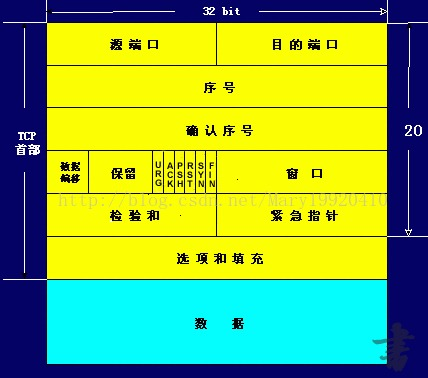

### ISO提出OSI参考模型七层
物理层、数据链路层、网络层、传输层、会话层、表示层、应用层
- ISO:国际标准化组织（International Organization for Standardization）
- 国际标准化组织（ISO）制定了OSI模型，该模型定义了不同计算机互联的标准是并设计和描述计算机网络通信的框架。
- OSI:Open System Interconnection的缩写，意为开放式系统互联
### TCP/IP模型
1. 应用层
对应于OSI参考模型的高层，为用户提供所需要的各种服务，例如：FTP、Telnet、DNS、SMTP、**HTTP**等.
2. 传输层
对应于OSI参考模型的传输层，为应用层实体提供端到端的通信功能，保证了数据包的顺序传送及数据的完整性。该层定义了两个主要的协议：传输控制协议
- TCP协议提供的是一种可靠的、通过“三次握手”来连接的数据传输服务；
- UDP协议提供的则是不保证可靠的（并不是不可靠）、无连接的数据传输服务.
3. 网络层
主要解决主机到主机的通信问题。它所包含的协议设计数据包在整个网络上的逻辑传输。注重重新赋予主机一个IP地址来完成对主机的寻址。该层有三个主要协议：网际协议（IP）、互联网组管理协议（IGMP）和互联网控制报文协议（ICMP）。
4. 网络接入层（即物理-数据链路层）
网络接入层与OSI参考模型中的物理层和数据链路层相对应。它负责监视数据在主机和网络之间的交换。
**********
### TCP：传输控制协议
Transmission Control Protocol/Internet Protocol的简写，TCP/IP 定义了电子设备如何连入因特网，以及数据如何在它们之间传输的标准。
提供面向连接的服务，在传送数据之前必须先建立连接，数据传送完成后要释放连接。因此TCP是一种可靠的的运输服务，但是正因为这样，不可避免的增加了许多的开销，比如确认，流量控制等。
###### 三次握手
最开始的时候客户端和服务器都是处于CLOSED状态。主动打开连接的为客户端，被动打开连接的是服务器。
1. 服务器建立数据传输块TCB，被动打开连接，状态变为“监听”。
客户端建立TCB，主动打开连接，向服务器请求连接，状态变为“同步已发送”。客户端发送syn包（syn=j）到服务器（syn：同步序列编号）
2. 服务器接受请求，返回同意连接信息，状态变为“同步收到”。服务端发送确认包ack（j+1），同时发送自己的syn包（syn=k）。
客户端接受同意信息，发送确认信息，状态变为“已建立连接”。发送确认包ack（k+1）。
3. 服务器接受确认信息，状态变为“已建立连接”。
此后双方就可以开始通信了。 
###### 四次挥手
1. 客户端服务端发送释放链接的请求，将控制位FIN置1,状态变为“终止等待1”。
服务端接受信息后发送确认信息，状态变为“关闭等待”。
2. 客户端接受服务端确认信息后，状态进入“终止等待2”,将ACK置1，并继续等待服务端最后的数据传输。
3. 服务端将最后的数据发送完毕后，发送连接关闭的信息，将FIN置1，状态变为“最终确认”。
4. 客户端收到关闭信息后，向服务端发送确认信息，状态变为“时间等待”。
服务端收到确认信息后，将ACK置1，状态变为“closed”，撤销TCB，客户端相应撤销TCB。
###### TCP数据报文格式

- 序号和确认号：是TCP可靠传输的关键部分。序号确保了TCP传输的有序性。
- 校验和：奇偶校验，此校验和是对整个的 TCP 报文段，包括 TCP 头部和 TCP 数据，由发送端计算和存储，并由接收端进行验证。
************
### UDP：用户数据报协议
User Datagram Protocol的简称， 一种无连接的传输层协议，提供面向事务的简单不可靠信息传送服务。
UDP协议并不提供数据传送的保证机制。如果在从发送方到接收方的传递过程中出现数据报的丢失，协议本身并不能做出任何检测或提示。
不同于TCP，UDP并不能确保数据的发送和接收顺序。
**UDP没有客户端和服务端的区别，双方平等**
**在java中采用datagramPacket对象作为数据存储的对象，datagramSocket对象作为发送和接受数据的对象**
###### 应用
包括视频电话会议系统在内的许多应用都证明了UDP协议的存在价值。因为相对于可靠性来说，这些应用更加注重实际性能，所以为了获得更好的使用效果（例如，更高的画面帧刷新速率）往往可以牺牲一定的可靠性（例如，画面质量）。这就是UDP和TCP两种协议的权衡之处。根据不同的环境和特点，两种传输协议都将在今后的网络世界中发挥更加重要的作用。
********
### UDP与TCP的区别
1、TCP面向连接（如打电话要先拨号建立连接）; UDP是无连接的，即发送数据之前不需要建立连接
2、TCP提供可靠的服务，通过TCP连接传送的数据，无差错，不丢失，不重复，且按序到达; UDP尽最大努力交付，即不保证可靠交付
3、TCP面向字节流，实际上是TCP把数据看成一连串无结构的字节流;   UDP是面向报文的
4、每一条TCP连接只能是点到点的;   UDP支持一对一，一对多，多对一和多对多的交互通信
###### 为什么tcp更可靠
1. 确认和重传机制
 建立连接时三次握手同步双方的“序列号 + 确认号 + 窗口大小信息”，是确认重传、流控的基础
传输过程中，如果Checksum校验失败、丢包或延时，发送端重传
2. 数据排序
TCP有专门的序列号SN字段，可提供数据re-order
3. 流量控制
窗口和计时器的使用。  TCP窗口中会指明双方能够发送接收的最大数据量
4. TCP的拥塞控制由4个核心算法组成。“慢启动”（Slow Start），“拥塞避免”（Congestion avoidance），“快速重传 ”（Fast Retransmit），“快速恢复”（Fast Recovery）。
*****
### ip地址分类
- A类地址：A类地址的表示范围为：0.0.0.0~126.255.255.255，
默认网络掩码为：255.0.0.0；A类地址分配给规模特别大的网络使用。
A类网络用第一组数字表示网络本身的地址，后面三组数字作为连接于网络上的主机的地址。
分配给具有大量主机而局域网络个数较少的大型网络。
- B类IP地址 ：一个B类IP地址由2个字节的网络地址和2个字节的主机地址组成。
地址范围从128.0.0.0到191.255.255.255。默认子网掩码255.255.0.0；
可用的B类网络有16382个，每个网络能容纳6万多个主机 。 
- C类地址：表示范围为：192.0.0.0~223.255.255.255，默认网络掩码为：255.255.255.0；
C类地址分配给小型网络，如一般的局域网和校园网，它可连接的主机数量是最少的，采用把所属的用户分为若干的网段进行管理。
C类网络用前三组数字表示网络的地址，最后一组数字作为网络上的主机地址。

###### 子网掩码
子网掩码是一个32位地址，是与IP地址结合使用的一种技术。
它的主要作用有两个：
1.  用于屏蔽IP地址的一部分以区别网络标识和主机标识，并说明该IP地址是在局域网上，还是在远程网上。
2. 用于将一个大的IP网络划分为若干小的子网络。
意义：使用子网是为了减少IP的浪费。因为随着互联网的发展，越来越多的网络产生，有的网络多则几百台，有的只有区区几台，这样就浪费了很多IP地址，所以要划分子网。使用子网可以提高网络应用的效率。
*************
### DNS域名解析
1.浏览器缓存：浏览器会按照一定的频率缓存DNS记录。
2. 操作系统缓存：如果浏览器缓存中找不到需要的DNS记录，那就去操作系统中找。
3. 路由缓存：路由器也有DNS缓存。
4. DNS服务器：DNS服务器应对DNS查询请求。
5. 根服务器：DNS服务器还找不到的话，它就会向根服务器发出请求，进行递归查询（DNS服务器先问根域名服务器.com域名服务器的IP地址，然后再问.com域名服务器，依次类推）。

