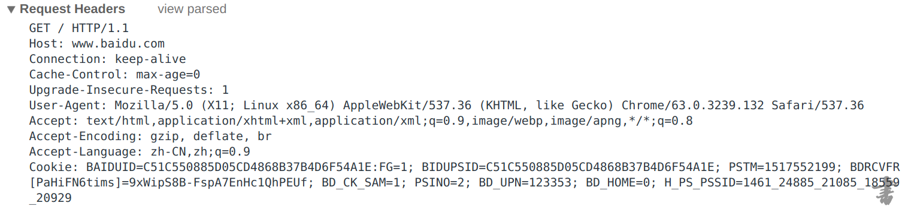
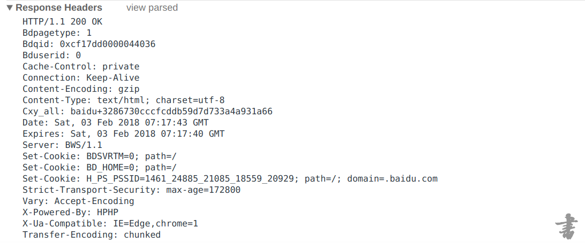

# 正文

### 1\. 输入网址

网址，也就是**[URL（统一资源定位符）](https://link.jianshu.com?t=https%3A%2F%2Fzh.wikipedia.org%2Fwiki%2F%25E7%25BB%259F%25E4%25B8%2580%25E8%25B5%2584%25E6%25BA%2590%25E5%25AE%259A%25E4%25BD%258D%25E7%25AC%25A6)**，用来定位用户想要访问的网页。它的标准格式是这样的：

> 协议类型:[//服务器地址[:端口号]][/资源层级UNIX文件路径]文件名[?查询][#片段ID]

然而一般情况只需要输入域名就可以了，比如直接输入[www.baidu.com](https://link.jianshu.com?t=http%3A%2F%2Fwww.baidu.com)就可以直接跳转到百度。因为浏览器会自动补全协议类型（http）、端口号（80）和路径（/）。

### 2\. 解析域名

单独只靠域名是无法找到对应的服务器的，为了找到服务器，需要先得到服务器的IP地址。这里就需要使用**[DNS（域名系统）](https://link.jianshu.com?t=https%3A%2F%2Fzh.wikipedia.org%2Fwiki%2F%25E5%259F%259F%25E5%2590%258D%25E7%25B3%25BB%25E7%25BB%259F)**将域名解析为对应的IP地址。而DNS实际上就是一个存储域名与IP相互映射的数据库。

### 3\. 浏览器发送请求

拿到IP地址之后浏览器便可以向服务器发送请求。而请求的格式需要遵守一种约定，也就是**[HTTP（超文本传输协议）](https://link.jianshu.com?t=https%3A%2F%2Fzh.wikipedia.org%2Fwiki%2F%25E8%25B6%2585%25E6%2596%2587%25E6%259C%25AC%25E4%25BC%25A0%25E8%25BE%2593%25E5%258D%258F%25E8%25AE%25AE)**，HTTP是客户端和服务器请求和应答的标准，也是必须遵守的规定。这个标准规定了请求大概是这样的：

看下第一行就可以了。其中GET表示请求方式，中间的“ / ”表示请求的路径，后面的HTTP/1.1就是HTTP协议版本。这样浏览器就把请求交给了服务器并且等它回应。

### 4\. 服务器响应请求

服务器拿到请求之后会根据请求的路径返回不同的文件内容。例如访问某服务器的/index.html路径时，服务器内部就会响应请求并将这个路径对应的文件内容传输回客户端。这里涉及到**[TCP（传输控制协议）](https://link.jianshu.com?t=https%3A%2F%2Fzh.wikipedia.org%2Fwiki%2F%25E4%25BC%25A0%25E8%25BE%2593%25E6%258E%25A7%25E5%2588%25B6%25E5%258D%258F%25E8%25AE%25AE)**，只需要了解HTTP传输是基于TCP即可。

根据HTTP协议，服务器相应返回的结果大概是这样的：

同样只需要看下第一行就好了。中间的200是**[HTTP状态码](https://link.jianshu.com?t=https%3A%2F%2Fzh.wikipedia.org%2Fwiki%2FHTTP%25E7%258A%25B6%25E6%2580%2581%25E7%25A0%2581)**，200就表示成功，后面的OK跟状态码一起的，用来解释状态码。

（服务器端需要指定Content-Type的值以确定返回文件类型）

### 5\. 浏览器解析文件内容

浏览器接收到文件后就开始逐行解析文件的内容。如果文件中又包含另外的请求，如在html文件中遇到link标签，则需要根据指定路径再次发送请求，也就是重复第3到4步。直到所有文件全部解析请求完毕。

### 6\. 将请求结果呈现到页面

当所有请求与接收全部完成之后，一个完整的页面就被呈现到了用户的面前。

**********
### 7\. 页面响应优化
1. 响应内容应经过压缩
2. 多利用浏览器缓存静态文件
3. 使用cdn优化不同地域响应速度
