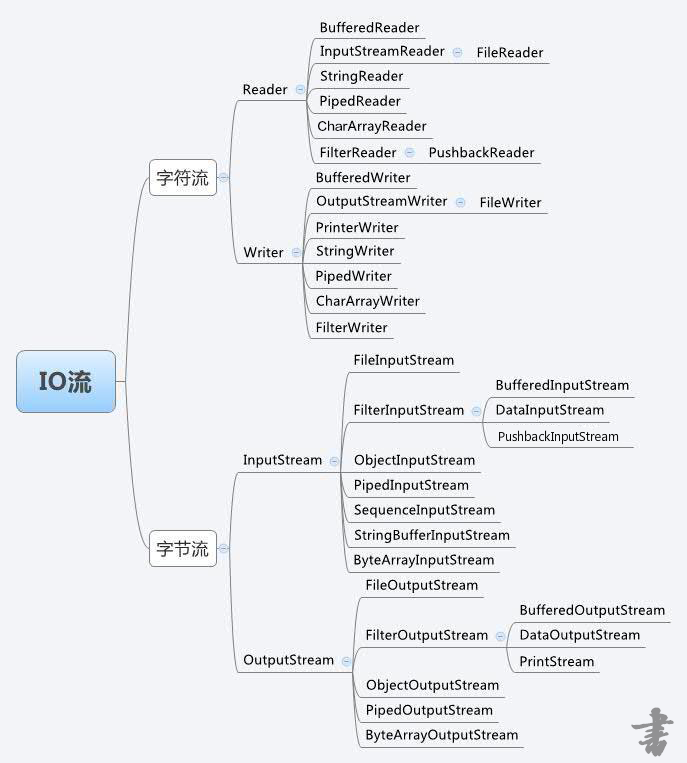
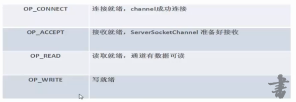

## 流
一个流可以理解为一个数据的序列。输入流表示从一个源读取数据，输出流表示向一个目标写数据。
## 流的分类
- 根据流向分为输入流和输出流
- 根据传输数据单位分为字节流和字符流
- 根据功能分为节点流和包装流
## 流家族

## 还没用过的流
- ByteArrayInputStream：字节数组输入流在内存中创建一个字节数组缓冲区，从输入流读取的数据保存在该字节数组缓冲区中。
- ByteArrayOutputStream：同理。
```
      ByteArrayOutputStream bOutput = new ByteArrayOutputStream(12);

      while( bOutput.size()!= 10 ) {
         // 获取用户输入值
         bOutput.write(System.in.read());
      }

      byte b [] = bOutput.toByteArray();
      System.out.println("Print the content");
      for(int x= 0 ; x < b.length; x++) {
         // 打印字符
         System.out.print((char)b[x]  + "   ");
      }
      System.out.println("   ");

      int c;

      ByteArrayInputStream bInput = new ByteArrayInputStream(b);

      System.out.println("Converting characters to Upper case " );
      for(int y = 0 ; y < 1; y++ ) {
         while(( c= bInput.read())!= -1) {
            System.out.println(Character.toUpperCase((char)c));
         }
         bInput.reset();
      }
```

- CharArrayReader：与ByteArrayInputStream类似，区别为缓冲为字符数组
- CharArrayWriter：与ByteArrayOutoutStream类似，区别为缓冲为字符数组
- PrintWriter：向文本输出流打印对象的格式化表示形式，如果PrintWriter开启了自动刷新，那么当PrintWriter调用println，prinlf或format方法时，输出流中的数据就会自动刷新出去。PrintWriter不但能接收字符流，也能接收字节流。
- PrintStream：
- InputStreamReader：从字节到字符的桥梁
- OutputStreamWriter：从字节到字符的桥梁
## 序列化
1. 什么是序列化
- 序列化：将对象的状态信息转换为二进制的形式保存起来或者通过网络进行传输。
- 反序列化：将存储的二进制信息或者通过网络收到的信息还原成对象的过程。  
- 用于存储，网络之间传输
      
2. jdk中的序列化使用
      1、将要序列化的对象所在的类实现Serializable接口
	2、使用ObjectOutputStream来进行序列化 ，使用ObjectInputStream来进行反序列化
3. 细节
      1、serialVersionUID:用于序列化和反序列化的时候使用同一个类
	  2、transient修饰符，在序列化的时候不会保存用transient修饰的属性
	  3、static修饰的属性，序列化的时候也不考虑
	  4、继承关系
	      如果父类不实现Serializable，父类上面的属性是不会被序列化的，如果想序列化，那么父类也要实现Serializable
	  
4. 序列化的问题
		1、序列化了之后文件比较大
		2、序列化比较慢
		3、不能跨语言
5. 其他的序列化
        1. json:jackson,fastjson
	2. 二进制:protobuff,kryo,hessian2
## 文件，文件夹拷贝
```
package cn.kgc.test;

import java.io.*;

/**
 * @author 徐鑫
 */
public class CopyFileAndDirectory {
    private InputStream is;
    private OutputStream os;

    public static void main(String[] args) {

        CopyFileAndDirectory test = new CopyFileAndDirectory();
        try {
            test.copyFileAndDirectory(new File("c:/upload"),"c:/copyFile");
        } catch (IOException e) {
            e.printStackTrace();
        } finally {
            test.close();
        }

    }


    private void copyFileAndDirectory(File file,String newUrl) throws IOException {
        if(file == null) {
            return;
        }
        File newFile = new File(newUrl);
        if(!newFile.exists()) {
            //noinspection ResultOfMethodCallIgnored
            newFile.mkdirs();
        }
        newUrl += File.separator + file.getName();
        if(file.isDirectory()) {
            //noinspection ConstantConditions
            for (File subFile: file.listFiles()) {
                copyFileAndDirectory(subFile,newUrl);
            }
        } else {
            copyFile(file,newUrl);
        }
    }

    private void copyFile(File file,String newUrl) throws IOException {
        os = new PrintStream(newUrl);
        is = new BufferedInputStream(new FileInputStream(file));
        byte[] buffer = new byte[1024];
        int len;
        while ((len = is.read(buffer)) != -1) {
            os.write(buffer,0,len);
        }
    }

    private void close() {
        if(is != null) {
            try {
                is.close();
            } catch (IOException e) {
                e.printStackTrace();
            }
        }
        if(os != null) {
            try {
                os.close();
            } catch (IOException e) {
                e.printStackTrace();
            }
        }
    }
}

```
## NIO

- NIO 是一种同步非阻塞的 IO 模型。同步是指线程不断轮询 IO 事件是否就绪，非阻塞是指线程在等待 IO 的时候，可以同时做其他任务。
- 同步的核心就是 Selector，Selector 代替了线程本身轮询 IO 事件，避免了阻塞同时减少了不必要的线程消耗；非阻塞的核心就是通道和缓冲区，当 IO 事件就绪时，可以通过写道缓冲区，保证 IO 的成功，而无需线程阻塞式地等待。
- 详情请看网页：https://www.cnblogs.com/geason/p/5774096.html
### NIO 底层通信框架
Netty，Mina
### NIO缓冲器
### 服务器与通道选择器
###### SelectionKey


###### 服务器代码示范
```
package nio;

import java.io.IOException;  
import java.net.InetSocketAddress;  
import java.nio.ByteBuffer;  
import java.nio.channels.SelectableChannel;  
import java.nio.channels.SelectionKey;  
import java.nio.channels.Selector;  
import java.nio.channels.ServerSocketChannel;  
import java.nio.channels.SocketChannel;  
import java.util.Iterator;  
import java.util.Set;  
 
public class NIOServer {  
   // 通道管理器  
   private Selector selector;  
 
   public void initServer(int port) throws Exception {  
       // 获得一个ServerSocket通道  
       ServerSocketChannel serverChannel = ServerSocketChannel.open();  
       // 设置通道为 非阻塞  
       serverChannel.configureBlocking(false);  
       // 将该通道对于的serverSocket绑定到port端口  
       serverChannel.socket().bind(new InetSocketAddress(port));  
       // 获得一通道管理器  
       this.selector = Selector.open();  
 
       // 将通道管理器和该通道绑定，并为该通道注册selectionKey.OP_ACCEPT事件  
       // 注册该事件后，当事件到达的时候，selector.select()会返回，  
       // 如果事件没有到达selector.select()会一直阻塞  
 
       serverChannel.register(selector, SelectionKey.OP_ACCEPT);  
   }  
 
   // 采用轮训的方式监听selector上是否有需要处理的事件，如果有，进行处理  
   public void listen() throws Exception {  
       System.out.println("start server");  
       // 轮询访问selector  
       while (true) {  
           // 当注册事件到达时，方法返回，否则该方法会一直阻塞  
           selector.select();  
           // 获得selector中选中的相的迭代器，选中的相为注册的事件  
           Iterator ite = this.selector.selectedKeys().iterator();  
           while (ite.hasNext()) {  
               SelectionKey key = (SelectionKey) ite.next();  
               // 删除已选的key 以防重负处理  
               ite.remove();  
               // 客户端请求连接事件  
               if (key.isAcceptable()) {  
                   ServerSocketChannel server = (ServerSocketChannel) key.channel();  
                   // 获得和客户端连接的通道  
                   SocketChannel channel = server.accept();  
                   // 设置成非阻塞  
                   channel.configureBlocking(false);  
                   // 在这里可以发送消息给客户端  
//                   channel.write(ByteBuffer.wrap(new String("hello client").getBytes()));  
                   // 在客户端 连接成功之后，为了可以接收到客户端的信息，需要给通道设置读的权限  
                   channel.register(this.selector, SelectionKey.OP_READ);  
                   // 获得了可读的事件  
               } else if (key.isReadable()) {  
                   read(key);  
               }  
 
           }  
       }  
   }  
 
   // 处理 读取客户端发来的信息事件  
   private void read(SelectionKey key) throws Exception {  
       // 服务器可读消息，得到事件发生的socket通道  
       SocketChannel channel = (SocketChannel) key.channel();  
       // 创建读取的缓冲区  
       ByteBuffer buffer = ByteBuffer.allocate(1024);   
       int len=channel.read(buffer);
     if(len<0){
    	 channel.finishConnect();
         return;
     }
     byte[] data = buffer.array();  
       buffer.flip();
       channel.write(buffer);  
   }  
 
   public static void main(String[] args) throws Throwable {  
       NIOServer server = new NIOServer();  
       server.initServer(8000);  
       server.listen();  
   }  
} 
``` 