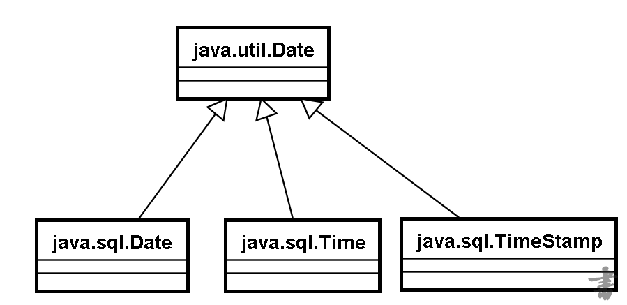
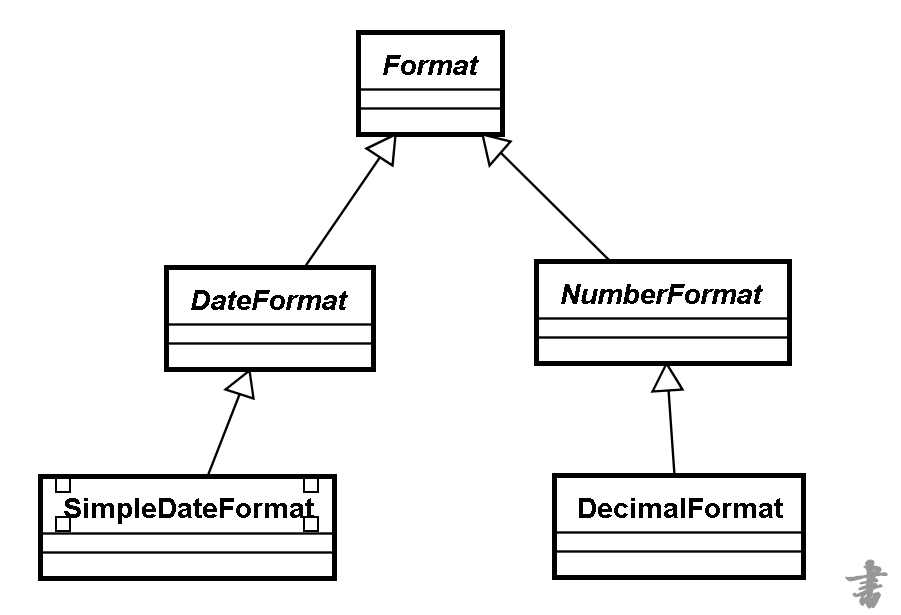

## String
String：不可变的字符序列
不可变：只要改变就是另外一个String对象，原因是因为里面的字符数组是final修饰。
###### 特点
1、由final修饰
2、底层是字符数组，并且该数组由final修饰，数组默认长度为0

###### 字符串常量的方式
1. 接口定义
2. final修饰
3. 枚举定义
#### 创建字符串对象两种方式的区别 
###### 直接赋值方式创建对象 
  直接赋值方式创建对象是在方法区的常量池
###### 通过构造方法创建字符串对象 
  通过构造方法创建字符串对象是在堆内存
###### 总结：两种实例化方式的区别 
 
1. 直接赋值 String str = "hello" ：只开辟一块堆内存空间，并且会自动入池，不会产生垃圾。 
2. 构造方法 String str= new String("hello") :会开辟两块堆内存空间，其中一块堆内存会变成垃圾被系统回 收，而且不能够自动入池，需要通过 public String intern(); 方法进行手工入池。
3. 在开发的过程中不会采用构造方法进行字符串的实例化。 
#### 常见API
charAt(int index)
		compareTo(String anotherString)
		compareToIgnoreCase(String str)
		concat(String str)
		endsWith(String suffix)
		equals(Object anObject)
		getBytes()
		getBytes(Charset charset)
		indexOf(int ch)
		indexOf(int ch, int fromIndex)
		indexOf(String str)
		indexOf(String str, int fromIndex)
		isEmpty()
		lastIndexOf(int ch)
		length()
		replace(char oldChar, char newChar)
		split(String regex)
		startsWith(String prefix)
		substring(int beginIndex)
		substring(int beginIndex, int endIndex)
		toCharArray()
		toLowerCase()
		toUpperCase()
		trim()
		valueOf(boolean b)	

#### 手写String的逆序
```
 private String reverse(String str) {
  if(str != null && !str.isEmpty()) {
   char[] charArray = str.toCharArray();
   int len =  charArray.length;
   for(int i=0;i<len>>1;i++) {
    // i
    //len-1-i
    char temp = charArray[i];
    charArray[i] = charArray[len-1-i];
    charArray[len-1-i] = temp;
   }
   return new String(charArray);
  }
  return str;
 }
```
#### 手写String的equals
```
 private boolean equals(String anObject) {
   if (this == anObject) {
            return true;
        }
        if (anObject instanceof String) {
            String anotherString = (String)anObject;
            int n = value.length;
            if (n == anotherString.value.length) {
                char[] v1 = value;
                char[] v2 = anotherString.toCharArray();
                for(int i=0;i<n;i++) {
                        if (v1[i] != v2[i])
                        return false;
                }
                return true;
            }
        }
        return false;
 }
```
#### concat实现
判断需要添加的字符串是否为空，为空则返回本身字符串。不为空则进行下一步：
1. 数组拷贝出一个新数组，长度为原字符串长度和新字符串长度的和，并把原字符串的字符数组放到新数组的前面几个格子。
2. 再通过数组拷贝，把添加字符串的字符数组，放到新数组的后面部分。
3. 再通过newString创建一个新的字符串，把新数组放进去，返回回去。
## String、StringBuffer、StringBuilder区别？
1. String是不可变的字符序列（实现了charSequence），StringBuffer和StringBuilder是可变的字符序列（实现了charSequence）
2. StringBuffer是线程安全的，效率低，StringBuilder线程不安全的，效率高,他们同属一个父类AbstractStringBuilder
#### StringBuffer、StringBuilder常用API
```public int length() // 用于返回当前对象的字符个数。```
 
```public int capacity()   //用于获取当前对象的容量并返回```
 
```public StringBuffer append(String str)  //用于将str追加到当前字符串的末尾位置```
 
```public StringBuffer insert(int offset,String str) //实现向字符串对象sb1中插入指定的字符串内容```
 
```public StringBuffer delete(int start,int end)//实现字符串中内容的删除```
 
```public StringBuffer reverse() //实现字符串中内容的反转```
 
```public String toString()    //实现StringBuilder类型向String类型的转换```
## String、StringBuffer、StringBuilder的底层实现
1. String底层是由final修饰的char[]
2. StringBuffer、StringBuilder底层是由无final修饰的char[]
3. StringBuffer大多数方法都有synchronized修饰，保证同步。
## 包装类
基本数据类型对应的包装类：
	byte --》Byte
	short --》Short
	char --》Character
	int --》Integer
	long --》Long
	float --》Float
	double --》Double
	boolean --》Boolean
## Number这个类下的子类
所有数值类型的包装类都是这个类的子类
####  String--->int
```int int1 = Integer.parseInt(String)```
####  int--->Integer
```Integer integer1 = new Integer(int)```
```Integer integer2 = Integer.valueOf(int)```
####  Integer--->String
```String intStr = Integer.toString()```
####  String--->Integer
```Integer integer1 = Integer.valueOf(String)```
####  Integer--->int
```int int1 = integer.intValue()```
####  int--->String
```String intStr = int + ""```
```String intStr = String.valueOf(int)```
## 自动打包与解包
装箱应该理解为 封装对象 ，即把基础数据类型（如 int）转换成基础类型封装类的对象（如 new Integer()）
拆箱就是装箱的反过程，即把基础类型封装类的对象（如 new Integer()）转换为基础数据类型（如 int）。
```
例子如下：
装箱： Integer a = new Integer() ;
              a = 100 ; //1.5以前不支持为对象如此赋值
拆箱： int b = new Integer(100) ;
自动拆装箱 是JDK1.5中新增加的内容 ，它可以将基本数据类型自动转换为它的包装类。或者相反。
```
## 日期相关类
#### java.util.Date下的子类


#### Calendar
- Calendar提供了一个类方法getInstance，以获得此类型的一个通用的对象，getInstance方法返回一个Calendar 对象（该对象为Calendar的子类对象），其日历字段已由当前日期和时间初始化。
- Calendar类对YEAR、MONTH、DAY_OF_MONTH、HOUR等日历字段之间的转换提供了一些方法，并为操作日历 字段（例如获得下星期的日期）提供了一些方法 :
```
    // 获取年    
int year = calendar.get(Calendar.YEAR);
 
    // 获取月，这里需要需要月份的范围为0~11，因此获取月份的时候需要+1才是当前月份值    
int month = calendar.get(Calendar.MONTH) + 1;
 
    // 获取日    
int day = calendar.get(Calendar.DAY_OF_MONTH);
 
    // 获取时    
int hour = calendar.get(Calendar.HOUR);    
// int hour = calendar.get(Calendar.HOUR_OF_DAY); // 24小时表示
 
    // 获取分   
 int minute = calendar.get(Calendar.MINUTE);
 
 
    // 获取秒    
int second = calendar.get(Calendar.SECOND);
```
#### 日期的格式化


DateFormat针对日期进行格式化和针对字符串进行解析的类，但是是抽象类，所以使用其子类SimpleDateFormat 
- SimpleDateFormat(String pattern) 给定模式 yyyy-MM-dd HH:mm:ss 
- 日期和字符串的 转换 
1. Date--->String format()
2. String--->Date parse()
## 其他常用类
#### Math
(1)针对数学运算进行操作的类 
(2)常见方法 A:绝对值 B:向上取整 C:向下取整 D:两个数据中的大值 E:a的b次幂 F:随 机数 G:四舍五入 H:正平方根 
#### Random 
(1)用于产生随机数的类 
(2)构造方法: A:Random() 默认种子，每次产生的随机数不同 Random(long seed) 指定种子，每次种子相同，随机数就相同 
(3)成员方法: A:int nextInt() 返回int范围内的随机数 B:int nextInt(int n) 返回 [0,n)范围内的随机数
#### File
## 编码集
iso-8859-1  1字节表示 256
gb2312 2字节
gbk    2字节
gb18030  支持藏语
utf-8