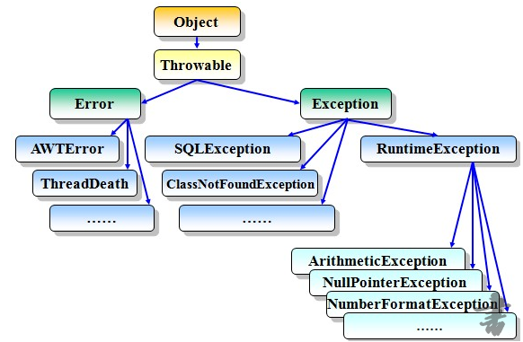

## 异常组织图


StackOverFlowError栈溢出
OutOfMemoryError内存溢出             	
RunTimeException运行期异常    	    
其他Exception 
ArithmeticException 算术异常
ClassCastException  类型转换异常 
ClassNotFoundException 类无法加载异常
NullPointException  空指针异常
ArrayIndexOutOfBoundsException 数组下标越界
## Error与Exception区别？
Error是程序无法处理的错误，它是由JVM产生和抛出的，比如OutOfMemoryError、ThreadDeath等。这些异常发生时，Java虚拟机（JVM）一般会选择线程终止。
Exception是程序本身可以处理的异常，这种异常分两大类运行时异常和非运行时异常。程序中应当尽可能去处理这些异常。

## RuntimeException与其他的Exception区别？
- 运行时异常都是RuntimeException类及其子类异常，如NullPointerException、IndexOutOfBoundsException等，
这些异常是不检查异常，程序中可以选择捕获处理，也可以不处理。这些异常一般是由程序逻辑错误引起的，程序应该从逻辑角度尽可能避免这类异常的发生。
- 非运行时异常是RuntimeException以外的异常，类型上都属于Exception类及其子类。从程序语法角度讲是必须进行处理的异常，如果不处理，程序就不能编译通过。
如IOException、SQLException,ClassNotFoundException 等以及用户自定义的Exception异常，一般情况下不自定义检查异常。

## 能说出5个常见RuntimeException？说出2个常见的Error
- RuntimeException：
		ArithmeticException    算术异常
		ClassCastException   类型转换异常
		NullPointException  空指针异常
		ArrayIndexOutOfBoundsException 数组下标越界
		IllegalArgumentException 非法数据异常
		NumberFormatException 数值格式化异常
		
- Error：
		StackOverFlowError栈溢出   
		OutOfMemoryError内存溢出
## 异常的处理（throws ,try ,catch）
两种方式：
1. 使用try,catch捕获异常
			A、异常抓取得从小到大
			B、e.printStackTrace();
			e.getMessage()
			C、千万不能吃异常
2. 使用throws抛出异常


#### try，catch，finally，return的执行顺序
1. 不管有没有出现异常，finally块中代码都会执行；
2. 当try和catch中有return时，finally仍然会执行；
3. finally是在return后面的表达式运算后执行的（此时并没有返回运算后的值，而是先把要返回的值保存起来，
		不管finally中的代码怎么样，返回的值都不会改变，任然是之前保存的值），所以函数返回值是在finally执行前确定的；
4. finally中最好不要包含return，否则程序会提前退出，返回值不是try或catch中保存的返回值。
	任何执行try 或者catch中的return语句之前，都会先执行finally语句，如果finally存在的话。
	如果finally中有return语句，那么程序就return了，所以finally中的return是一定会被return的，
	编译器把finally中的return实现为一个warning。

#### finally块唯一不执行的情况是什么？
除非在try块或者catch块中调用了退出虚拟机的方法:System.exit(1);
#### 同步锁
线程中异常后，没有处理，导致了线程停止，同步锁会释放
	
## 自定义异常
1 继承Exception，加入几个构造方法
2. 使用 throw new
3. 要使用throws抛出去


## junit测试
一种单元测试，回归测试框架
#### 测试
##### 功能测试
功能测试就是对产品的各功能进行验证，根据功能测试用例，逐项测试，检查产品是否达到用户要求的功能。
##### 压力测试
通常要进行软件压力测试的资源包括内部内存、CPU 可用性、磁盘空间和网络带宽。
常用软件jmeter
##### 回归测试
1.回归测试是指重复以前的全部或部分的相同测试。
2.新加入测试的模组，可能对其他模组产生副作用，故须进行某些程度的回归测试。
3.回归测试的重心，以关键性模组为核心。
#### 断言
```Assert.assertEquals(method,result)```
#### 其他注解
1. @Before
2. @After
3. @BeforeClass
4. @AfterClass
5. @Ignore