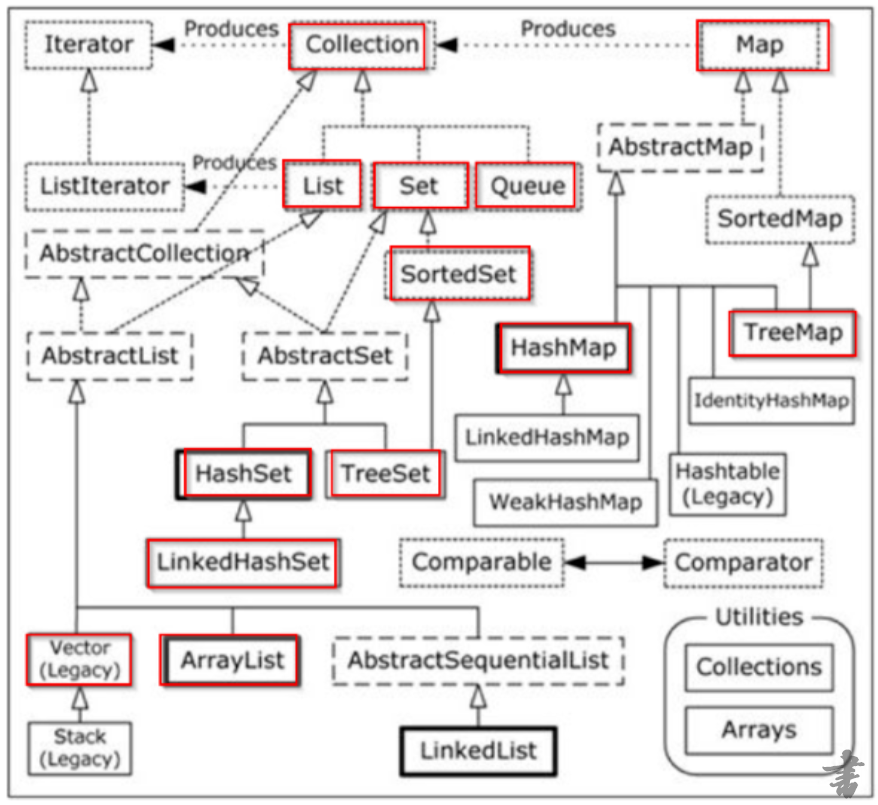
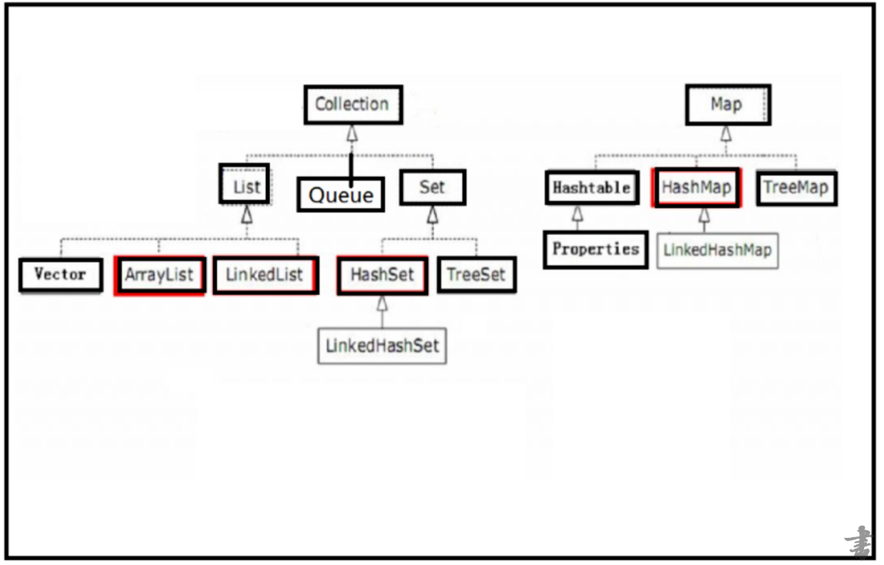
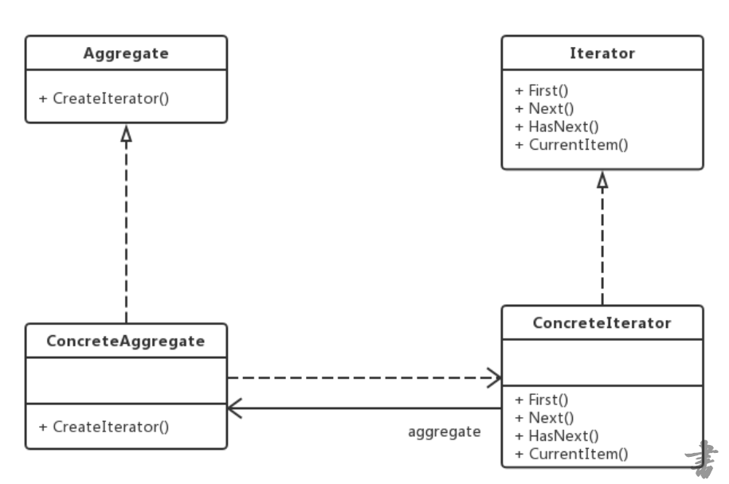

## 容器和数组区别
1. 数组可以存储基本数据类型，也可以存储引用数据类型，集合只能存储引用数据类型。     
2. 数组是固定长度的，集合的长度是可变的。     
3. 数组存储的元素必须是同一个数据类型；集合存储的对象可以是不同数据类型。 
## 容器组织图



***其中,list,set,queue,map,collection,iterator都是接口***
## List的实现有哪些？ArrayList、LinkedList、Vector区别
####  List的实现
1. ArrayList：底层的数据结构使用的是数组结构（数组长度是可变的百分之五十延长）（特点是查询很快，但增删较慢）线程不同步              
2. LinkedList：底层的数据结构是链表结构（特点是查询较慢，增删较快）              
3. Vector：底层是数组数据结构 线程同步（数组长度是可变的百分之百延长）（无论查询还是增删都很慢，被ArrayList替代了） 
注意:***1. 虽然arraylist比linkedlist的查询效率高,但是不代表比它遍历效率高。如果采用迭代器或者增强的for循环遍历的话，由于链表更符合迭代器选择下一个的逻辑，它效率更高***
***2. 数据结构一共有：线性表，树，图。list是线性表的一种数据储存形式***
## List与Set区别？Set怎么来区分重复？
1. Set 不允许重复,List允许重复 。
2. Set 没有顺序，List有顺序 。
#### 区分重复方法
由于set底层是相对应的map，而map本身是不重复的。所以重复的判断其实由map处理的，其核心equals和hashcode。
 - HashSet区分重复元素：先使用hashcode方法判断已经存在HashSet中元素的hashcode值和将要加入元素hashcode 值是否相同。如果不同，直接添加；如果相同，再调用equals方法判断，如果返回true表示HashSet中已经添加该对象了，不需要再次添加（重复），如果返回false就表示不重复，可以直接加Hash中。                 
- TreeSet区分重复元素：TreeSet中的元素对象如果实现Comparable接口，使用compareTo方法区分元素是否重复，如果没实现Comparable接口，自定义比较器（该类实现Comparator接口，覆盖compare方法）比较该元素对象，调用TreeSet的构造方法new TreeSet(自定义比较器参数)，这样就可以比较元素对象了。 
- hashcode和equals的区别：二者是两种不同的方法，主要联系在于作比较的时候，hashcode一致的，不一定equals，equals的一定hashcode一致。
- 所以hashmap再判断hashcode一致以后。还要判断是否equals
## set
底层是使用map实现，是使用add的这个数据来作为map的key，使用一个常量Object对象来作为value
## hashMap
在jdk8之前使用的是：数据+链表
在jdk8：数组+连接+红黑树(解决链表上单链上节点过多的搜索效率问题)
#### hash算法
将数据通过hash算法把数据均匀的分布在一定范围中
#### hash碰撞
在hashmap中的解决方案 ，单向链表，当链表节点大于8个的时候会转换为一棵红黑树
#### 加载因子
因为数组的容量如果需要将数组中全填满的话，那么必然产生太多的hash碰撞，会导致链表的链越长，链越长就影响搜索效率，所以引入了因子，重新计算数组的长度及元素放到新数组
满足条件的时候那么就需要对数组进行从新计算长度
将原来的数组的长度*2作为新数组的长度，需要将旧数组中的数据放到新数组中来。

怎么放：
需要将旧数组中的每个元素拿出来，重新计算位置（hash &(新数组.length-1)) 
然后将数据放在这个位置
#### hash算法
hash广泛运用于数据存储和加密上面（md5和sha）
###### hash表
- 散列表,它是基于高速存取的角度设计的，也是一种典型的“空间换时间”的做法。顾名思义，该数据结构能够理解为一个线性表，可是当中的元素不是紧密排列的，而是可能存在空隙。
- 散列表（Hash table，也叫哈希表），是依据关键码值(Key value)而直接进行訪问的数据结构。也就是说，它通过把关键码值映射到表中一个位置来訪问记录，以加快查找的速度。这个映射函数叫做散列函数，存放记录的数组叫做散列表。
## 各种容器的操作（添加，修改，删除，遍历）？
#### collection操作
```
//我们这里将 ArrayList集合作为 Collection 的实现类        
Collection collection = new ArrayList();        
//添加元素        
collection.add("Tom");        
collection.add("Bob");                
//删除指定元素        
collection.remove("Tom");                
//删除所有元素        
Collection c = new ArrayList();        
c.add("Bob");        
collection.removeAll(c);                
//检测是否存在某个元素        
collection.contains("Tom");                
//判断是否为空        
collection.isEmpty();                
//利用增强for循环遍历集合        
for(Object obj : collection){            
  System.out.println(obj);        
}        
//利用迭代器 Iterator        
Iterator iterator = collection.iterator();        
while(iterator.hasNext()){            
  Object obj = iterator.next();            
  System.out.println(obj);        
}
```
#### linkedList队列和栈方法
push：顶入栈
pop：顶出栈
peek：获取顶元素

add：尾入队
poll：顶出队
#### list的遍历删除
由于list删除元素后，后面的元素自动向前填充原来的位置。所以想要通过遍历批量删除某些元素的话，需要倒着遍历或者使用迭代器。
#### map的遍历 
```
 //通过 map.values() 方法得到 Map 中的 value 集合        
Collection<Object> value = hashMap.values();        
for(Object obj : value){            
  System.out.println(obj);        
}                 
//通过 map.keySet() 得到 Map 的key 的集合，然后 通过 get(key) 得到 Value        
Set<String> set = hashMap.keySet();        
for(String str : set){            
  Object obj = hashMap.get(str);            
  System.out.println(str+"="+obj);        
}                 
//通过 Map.entrySet() 得到 Map 的 Entry集合，然后遍历
Set<Map.Entry<String, Object>> entrys = hashMap.entrySet();        
for(Map.Entry<String, Object> entry: entrys){            
  String key = entry.getKey();            
  Object value2 = entry.getValue();            
  System.out.println(key+"="+value2);        
}                 

```
## 迭代器设计模式（Iterator）            
迭代器模式是一种对象行为型模式，提供一种方法来访问聚合对象，而不用暴露这个对象的内部表示。



###### 主要优点 　　          
1. 支持以不同方式遍历一个聚合对象，在同一个聚合对象上可以定义多种便利方式。　　          
2. 增加新的聚合类和迭代器类都很方便 => 无须修改原有代码，符合开闭原则。 
###### 主要缺点 　　           
1. 增加新的聚合类需要对应增加新的迭代器类 => 类的个数会成对增。
###### 核心方法
public boolean hasNext();
public Object next();
public void remove();
## HashMap与Hashtable
1. 两者主要的区别在于Hashtable（synchronized）是线程安全，而HashMap则非线程安全。           
2. HashMap可以使用null作为key，HashMap以null作为key时，总是存储在table数组的第一个节点上。而 Hashtable则不允许null作为key。           
3. HashMap继承了AbstractMap，HashTable继承Dictionary抽象类，两者均实现Map接口。          
4. HashMap的初始容量为16，Hashtable初始容量为11，两者的填充因子默认都是0.75。          
5. HashMap扩容时是当前容量翻倍（capacity\*2），Hashtable扩容时是容量翻倍+1（capacity\*2+1）
## 对象的排序
```
方式一： 
public class User implements Comparable<User>{  
  @Override    
  public int compareTo(User o) {        
  //返回值是int   如果是正数：当前的this比o大   负数 this<o  0 this ==o        
    return this.id - o.id;    
  } 
}
方式二： 
import java.util.Comparator; 
// 自己定义比较器 
public class UserCompare implements Comparator<User> {
  @Override    
  public int compare(User o1, User o2) {        
    return -(o1.getId() - o2.getId());    
  } 
} 
使用方式：
Collections.sort(list, new UserCompare());
```
## Properties的操作
hashtable的子类
- void load(InputStream inStream)：从输入流中加载属性列表； 
- void store(OutputStream out, String comments)：根据输出流将属性列表保存到文件中； 
- String  getProperty(String key)：获取指定键的值； 
- void setProperty(String key, String value)：设置指定键的值，若指定键已经在原属性值列表中存在，则覆盖；若指定键在原属性值列表中不存在，则新增； 
#### 写入 Properties 文件
```
 // 创建一个 Properties 实例； 
Properties p = new Properties(); 
// 为 Properties 设置属性及属性值； 
p.setProperty("name", "shawearn"); 
p.setProperty("address", "XX 省 XX 市"); 
// 保存 Properties 到 shawearn.properties 文件中； 
FileOutputStream out = new FileOutputStream("shawearn.properties"); 
p.store(out, "Create by Shawearn!"); 
out.close(); 
```
#### 读取 Properties 文件
```
// 创建一个 Properties 实例；  
Properties p = new Properties(); 
// 读取配置文件； 
FileInputStream in = new FileInputStream("shawearn.properties"); 
//或者是 
//FileInputStream in = TestProperties.class.getClassLoader().getResourceAsStream("shawearn.properties"); 
// 加载配置文件到 Properties 实例中； 
p.load(in);  
in.close();
```
## 手写源代码
#### ArrayList
```
package cn.kgc.java0613;

public class MyArrayList {
	 Object[] elementData;//用来存储我们装数据
	 
	 private int size;//用来记录当前元素的个数
	 
	 public MyArrayList() {
		 elementData = new Object[3];
	 }
	 
	 //添加方法
	 public void add(Object obj) {
		 //判断容量是否够
		 if(size >= elementData.length) {
			 //扩容
			 Object[] newArray = new Object[elementData.length + (elementData.length >> 1)];
			 //需要将原数组的数据拷贝到新数组
			 System.arraycopy(elementData, 0, newArray, 0, elementData.length);
			 //将原来的引用指向新数组
			 elementData = newArray;
		 }
		 elementData[size] = obj;
		 size++;
	 }

	 //获取index位置上数据
	 public Object get(int index) {
		 checkRangeOfIndex(index);
		 return elementData[index];
	 }
	 
	 //检验下标的范围
	 public void checkRangeOfIndex(int index) {
		 if(index < 0 || index >= elementData.length) {
			 throw new IllegalArgumentException("index 不合法");
		 }
	 }
	 
	 //获取容器的元素的个数
	 public int size() {
		 return size;
	 }
	 
	 //判断容器是否为空
	 public boolean isEmpty() {
		 return size == 0;
	 }
	 
	 //查找
	 public int indexOf(Object obj) {
		 for(int i=0;i<size;i++) {
			 if(obj.equals(elementData[i])) {
				 return i;
			 }
		 }
		 
		 return -1;
	 }
	 
	 //移除元素
	 public void remove(int index) {
		 checkRangeOfIndex(index);
		 System.arraycopy(elementData, index + 1, elementData, index, size -1 -index);
		 elementData[size - 1] = null;
		 size--;
	 }
	 
	 public void remove(Object object) {
		 //查找object所在的位置
		 int index = indexOf(object);
		 remove(index);
	 }
	 
	 
	 @Override
	public String toString() {
		 if (isEmpty()) {
			 return "[]";
		 }
		 String str = "[";
		 //遍历拼接
		 for(int i=0;i<size;i++) {
			 if(i== size -1) {
				 str += elementData[i];
			 }else {
				 str += elementData[i] + ",";
			 }
		 }
		 
		 str += "]";
		 
		return str;
	}
}
```
#### LinkedList
```
package cn.kgc.java0613;


public class MyLinkedList {
	int size = 0;//放当前的list中的元素个数
	//头
	MyNode first;
	//尾
	MyNode last;
	
	public void add(Object object) {
		MyNode l = last;//拿出当前链中的最后一个节点
		//包装成节点对象
		MyNode newNode = new MyNode(l, null, object);//说明当前节点的前一个节点是之前链上最后一个节点，下一个节点为null
		last = newNode;//现在链上的最后一个节点就是当前我们产生的节点
		
		 if (l == null) {//如果节点的尾部是空的，就说明当前链上一个元素也没有
			 first = newNode;//当前节点作为头节点
		 }else {
			 l.next = newNode;//之前脸上的最后一个节点指向新产生的节点   由于是(双向链表)
		 }
		 size++;
	}
	
	
	public Object get(int index) {
		 MyNode x = first;
         for (int i = 0; i < index; i++)
             x = x.next;
         return x.data;//x指的是找到的节点
	}
	
	public int size() {
		return this.size;
	}
	
	public boolean isEmpty() {
		return size == 0;
	}
	
	 @Override
	public String toString() {
		 if (isEmpty()) {
			 return "[]";
		 }
		 String str = "[";
		 //遍历拼接
		 for(int i=0;i<size;i++) {
			 if(i== size -1) {
				 str += this.get(i);
			 }else {
				 str += this.get(i) + ",";
			 }
		 }
		 
		 str += "]";
		 
		return str;
	}
	 
	 private class MyNode{
		 MyNode previous;//上一节点
		MyNode next;//下一节点
		Object data;//该节点存放的数据
		
		
		public MyNode(MyNode previous, MyNode next, Object data) {
			this.previous = previous;
			this.next = next;
			this.data = data;
		}
	 }
}


```
#### HashSet
```
public class SxtHashSet {             
  HashMap map;             
  private static final Object PRESENT = new Object();             
  SxtHashSet(){                 
    map = new HashMap();            
  }             
  public int size(){                
    return map.size();             
  }             
  public void put(Object o){                    
    map.put(o,PRESENT);//set的不重复就是利用了map里面键对象不可重复             
  }             
  public static void main(String args[]){                     
    SxtHashSet hashSet = new SxtHashSet(); hashSet.put("aaa");
    hashSet.put(new String("aaa"));                     
    System.out.println(hashSet.size());             
  } 
}
```
#### HashMap
```
 public interface DIYMap<K,V> { 
//Map双列集合 基本功能是 快速取 public V put(K k,V v); //快速取 public V get(K k); //定义一个内部接口 public interface Entry<K,V>{ public K getKey(); public V getValue(); } }
 public class DIYHashMap<K, V> implements DIYMap<K, V>{ //定义默认数组大小 private int defaultLenth=16; //负载因子，扩容标准 useSize/数组长度>0.75扩容 private double defaultAddSizeFactor=0.75; //使用数组位置的总数 private double useSize; //定义Map 骨架之一数组 private Entry<K, V>[] table; public DIYHashMap(int defaultLenth, double defaultAddSizeFactor) { if(defaultLenth<0){ throw new IllegalArgumentException("数组长度为负数"+defaultLenth); } if(defaultAddSizeFactor<=0 || Double.isNaN(defaultAddSizeFactor)){ throw new IllegalArgumentException("扩容标准必须大于0的数字"+defaultLenth); } this.defaultLenth = defaultLenth; this.defaultAddSizeFactor = defaultAddSizeFactor; table=new Entry[defaultLenth]; } //快速存取 hash算法 public V put(K k, V v) {
 if(useSize>defaultAddSizeFactor*defaultLenth){ //扩容 up2Size(); } //通过key来计算出 存储的位置 int index=getIndex(k,table.length); Entry<K, V> entry=table[index]; Entry<K, V> newEntry=new Entry<K, V>(k, v, null); if(entry==null){ table[index]=newEntry; useSize++; }else{//维护数组相同位置队列 Entry<K, V> tmp; while((tmp=table[index])!=null){ tmp=tmp.next; } tmp.next=newEntry; } return newEntry.getValue(); } private int getIndex(K k, int length) { //通常hashCode 取膜法 int m=length-1; int index=hash(k.hashCode()) & m; return index >= 0 ? index : -index; } //创建自己的hash算法，保证计算出的位置 在数组中均匀分布 private int hash(int hashCode) { hashCode=hashCode^((hashCode>>>20)^(hashCode>>>12)); return hashCode^((hashCode>>>7)^(hashCode>>>4)); } //扩容数组 private void up2Size() { Entry<K, V>[] newTable=new Entry[defaultLenth*2]; //将原table中的entry重新，散列到新的table中 againHash(newTable); } //将原table中的entry重新，散列到新的table中 private void againHash(Entry<K, V>[] newTable) { //数组里面对象 封装到list中,包括同一位置 有列表结构的都解析出来 List<Entry<K,V>> entryList=new ArrayList<Entry<K,V>>(); for(int i=0;i<table.length;i++){ if(table[i]==null){ continue; } findEntryByNext(table[i],entryList); } if(entryList.size()>0){ useSize=0; defaultLenth=defaultLenth*2; table=newTable; for (Entry<K, V> entry : entryList) { if(entry.next!=null){ entry.next=null; } put(entry.getKey(), entry.getValue()); } } } private void findEntryByNext(Entry<K, V> entry, List<Entry<K, V>> entryList) { if(entry!=null && entry.next!=null){ //这个entry对象已经形成链表结构 entryList.add(entry); //递归 将链表中的entry实体 都一次封装到entryList链表中 findEntryByNext(entry.next, entryList); }else{ entryList.add(entry); } } //快取
 public V get(K k) { //通过key来计算出 存储的位置 int index=getIndex(k,table.length); Entry<K, V> entry=table[index]; if(entry==null){ throw new NullPointerException(); } return findValueByKey(k,entry); } private V findValueByKey(K k, Entry<K, V> entry) { if(k == entry.getKey() || k.equals(entry.getKey())){ return entry.v; }else if(entry.next!=null){ return findValueByKey(k,entry.next); } return null; } class Entry<K, V> implements DIYMap.Entry<K, V>{ K k; V v; //指向被this挤压下去的entry Entry<K, V> next; public Entry(K k, V v, Entry<K, V> next) { this.k = k; this.v = v; this.next = next; } @Override public K getKey() { return k; } @Override public V getValue() { return v; } } }

```