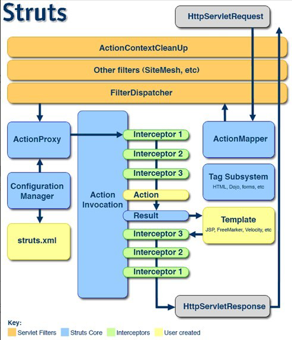
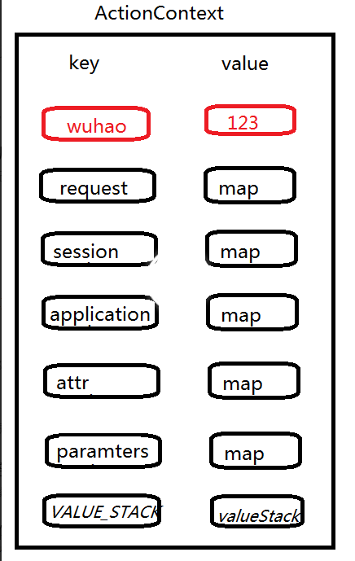
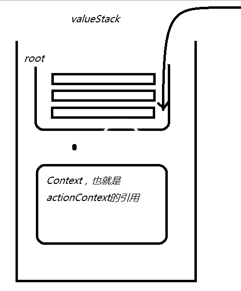
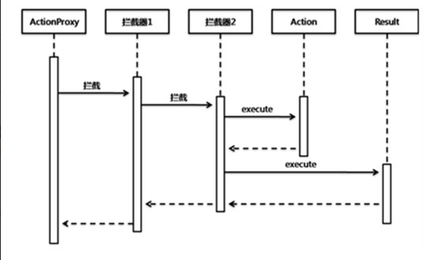

## Struts2
### 1.简介
Struts2是一个基于MVC设计模式的Web应用框架，它本质上相当于一个servlet，在MVC设计模式中，Struts2作为控制器(Controller)来建立模型与视图的数据交互。Struts 2是Struts的下一代产品，是在 struts 1和WebWork的技术基础上进行了合并的全新的Struts 2框架。其全新的Struts 2的体系结构与Struts 1的体系结构差别巨大。Struts 2以WebWork为核心，采用拦截器的机制来处理用户的请求，这样的设计也使得业务逻辑控制器能够与Servlet API完全脱离开，所以Struts 2可以理解为WebWork的更新产品。虽然从Struts 1到Struts 2有着太大的变化，但是相对于WebWork，Struts 2的变化很小。

#### 1.1	常见的web应用框架

​	struts1，struts2，webwork，springmvc，jsf。

#### 1.2	实例

1、导包

​	参考struts2下的apps/struts2-blank/web-inf/lib

2、在web.xml中配置过滤器

```java
<filter>
    <filter-name>struts2</filter-name>
    <filter-class>
    	org.apache.struts2.dispatcher.ng.filter.StrutsPrepareAndExecuteFilter
    </filter-class>
</filter>
<filter-mapping>
    <filter-name>struts2</filter-name>
    <url-pattern>/*</url-pattern>
</filter-mapping>
```

3、在src下准备struts.xml配置文件

4、写代码

```java
public class HelloWorldController extends ActionSupport{
	public String execute() {
		System.out.println("*********HelloWorldController************");
		return "success";
	}
}
```

5、在struts.xml中进行映射

```java
package元素:封装Action配置,方便项目的模块开发
    name属性:给包起个名称,不能重复
    namespace属性:命名空间,指定Action资源名前的访问路径
        不写该属性,相当于填写"/",该属性值可以重复
    extends属性:继承另一个包,会将配置信息继承,必须继承struts-default.

action元素:配置action对象
    name属性:指定访问action时填写的资源名称
    class属性:填写Action完整类名,用于struts2框架创建action对象
    method属性:定位类中处理请求的方法,填写方法名.

result元素:定义结果
    name属性:对应Action中方法的返回值
    type属性:指定交给那个结果处理器来处理
        转发(默认值) dispatcher
        重定向 redirect
    标签体:指定跳转的资源路径,相对目录WebContent

<?xml version="1.0" encoding="UTF-8" ?>
<!DOCTYPE struts PUBLIC
	"-//Apache Software Foundation//DTD Struts Configuration 2.3//EN"
	"http://struts.apache.org/dtds/struts-2.3.dtd">
<struts>
    <package name="default" namespace="/" extends="struts-default" >
    
    	<action name="hello" class="cn.kgc.controller.HelloWorldController" method="execute">
    		<result name="success">/hello.jsp</result>
    	</action>
    </package>
</struts>
```

6、启动服务，测试

#### 1.3	strut2架构

如图：



依照上图，我们可以看出一个请求在struts的处理大概有如下步骤：

1、客户端初始化一个指向Servlet容器（例如Tomcat）的请求；

2、这个请求经过一系列的过滤器（Filter）（这些过滤器中有一个叫做ActionContextCleanUp的可选过滤器，这个过滤器对于Struts2和其他框架的集成很有帮助，例如：SiteMesh Plugin）；

3、接着StrutsPrepareAndExecuteFilter被调用，StrutsPrepareAndExecuteFilter询问ActionMapper来决定这个请求是否需调用某个Action；

4、如果ActionMapper决定需要调用某个Action，FilterDispatcher把请求的处理交给ActionProxy；

5、ActionProxy通过Configuration Manager询问框架的配置文件，找到需要调用的Action类；

6、ActionProxy创建一个ActionInvocation的实例。

7、ActionInvocation实例使用命名模式来调用，在调用Action的过程前后，涉及到相关拦截器（Intercepter）的调用。

8、一旦Action执行完毕，ActionInvocation负责根据struts.xml中的配置找到对应的返回结果。返回结果通常是（但不总是，也可能是另外的一个Action链）一个需要被表示的JSP或者FreeMarker的模版。在表示的过程中可以使用Struts2 框架中继承的标签。在这个过程中需要涉及到ActionMapper。

#### 1.4	源码分析

 web容器一启动，就会初始化核心过滤器StrutsPrepareAndExecuteFilter，并执行初始化方法，初始化方法如下：

```java
public void init(FilterConfig filterConfig) throws ServletException {
        InitOperations init = new InitOperations();
        Dispatcher dispatcher = null;
        try {
			//封装filterConfig，其中有个主要方法getInitParameterNames将参数名字以String格式存储在List
            FilterHostConfig config = new FilterHostConfig(filterConfig);
            //初始化struts内部日志
            init.initLogging(config);
            //创建dispatcher ，并初始化
            dispatcher = init.initDispatcher(config);
            init.initStaticContentLoader(config, dispatcher);
            //初始化类属性：prepare 、execute
            this.prepare = new PrepareOperations(dispatcher);
            this.execute = new ExecuteOperations(dispatcher);
            this.excludedPatterns =init.buildExcludedPatternsList(dispatcher);
            //回调空的postInit方法
            this.postInit(dispatcher, filterConfig);
        } finally {
            if (dispatcher != null) {
                dispatcher.cleanUpAfterInit();
            }
            init.cleanup();
        }

    }
```

 关于封装filterConfig，首先看下FilterHostConfig ，源码如下：

```java
public class FilterHostConfig implements HostConfig {
    private FilterConfig config;
	//构造方法
    public FilterHostConfig(FilterConfig config) {
        this.config = config;
    }
	//根据init-param配置的param-name获取param-value的值
    public String getInitParameter(String key) {
        return this.config.getInitParameter(key);
    }
	//返回初始化参数名的迭代器 
    public Iterator<String> getInitParameterNames() {
        return MakeIterator.convert(this.config.getInitParameterNames());
    }
	//返回Servlet上下文
    public ServletContext getServletContext() {
        return this.config.getServletContext();
    }
}
```

只有短短的几行代码，getInitParameterNames是这个类的核心，将Filter初始化参数名称有枚举类型转为Iterator。此类的主要作为是对filterConfig 封装。

接下来，看下StrutsPrepareAndExecuteFilter中init方法中dispatcher = init.initDispatcher(config);这是初始化dispatcher的，是通过init对象的initDispatcher方法来初始化的，init是InitOperations类的对象，我们看看InitOperations中initDispatcher方法：

```java
public Dispatcher initDispatcher( HostConfig filterConfig ) {
    Dispatcher dispatcher = createDispatcher(filterConfig);
    dispatcher.init();
    return dispatcher;
}
```

创建Dispatcher，会读取 filterConfig 中的配置信息，将配置信息解析出来，封装成为一个Map，然后根绝servlet上下文和参数Map构造Dispatcher ：

```java
private Dispatcher createDispatcher(HostConfig filterConfig) {
	//存放参数的Map
    Map<String, String> params = new HashMap();
    Iterator e = filterConfig.getInitParameterNames();
	//将参数存放到Map
    while(e.hasNext()) {
        String name = (String)e.next();
        String value = filterConfig.getInitParameter(name);
        params.put(name, value);
    }
	//根据servlet上下文和参数Map构造Dispatcher 
    return new Dispatcher(filterConfig.getServletContext(), params);
}
```

这样dispatcher对象创建完成，接着就是dispatcher对象的初始化，打开Dispatcher类，看到它的init方法如下：

```java
public void init() {
        if (this.configurationManager == null) {
            this.configurationManager = this.createConfigurationManager("struts");
        }

        try {
            this.init_FileManager();
            //加载org/apache/struts2/default.properties
            this.init_DefaultProperties();
            //加载struts-default.xml,struts-plugin.xml,struts.xml
            this.init_TraditionalXmlConfigurations();
            this.init_LegacyStrutsProperties();
            //用户自己实现的ConfigurationProviders类 
            this.init_CustomConfigurationProviders();
            //Filter的初始化参数 
            this.init_FilterInitParameters();
            this.init_AliasStandardObjects();
            Container container = this.init_PreloadConfiguration();
            container.inject(this);
            this.init_CheckWebLogicWorkaround(container);
            if (!dispatcherListeners.isEmpty()) {
                Iterator i$ = dispatcherListeners.iterator();
                while(i$.hasNext()) {
                    DispatcherListener l = (DispatcherListener)i$.next();
                    l.dispatcherInitialized(this);
                }
            }
            this.errorHandler.init(this.servletContext);
        } catch (Exception var4) {
            if (LOG.isErrorEnabled()) {
                LOG.error("Dispatcher initialization failed", var4, new String[0]);
            }
            throw new StrutsException(var4);
        }
    }
```

现在，我们回到StrutsPrepareAndExecuteFilter类中，刚才我们分析了StrutsPrepareAndExecuteFilter类的init方法，该方法在web容器一启动就会调用的，当用户访问某个action的时候，首先调用核心过滤器StrutsPrepareAndExecuteFilter的doFilter方法，该方法内容如下：

```java
public void doFilter(ServletRequest req, ServletResponse res, FilterChain chain) throws IOException, ServletException {
        HttpServletRequest request = (HttpServletRequest)req;
        HttpServletResponse response = (HttpServletResponse)res;
        try {
            if (this.excludedPatterns != null && this.prepare.isUrlExcluded(request, this.excludedPatterns)) {
                chain.doFilter(request, response);
            } else {
            	//设置编码和国际化
                this.prepare.setEncodingAndLocale(request, response);
                //创建action上下文
                this.prepare.createActionContext(request, response);
                this.prepare.assignDispatcherToThread();
                request = this.prepare.wrapRequest(request);
                ActionMapping mapping = this.prepare.findActionMapping(request, response, true);
                //如果mapping为空，则认为不是调用action,会调用下一个过滤器链，直到获取到mapping才调用
                if (mapping == null) {
                    boolean handled = this.execute.executeStaticResourceRequest(request, response);
                    if (!handled) {
                        chain.doFilter(request, response);
                    }
                } else {
                    //执行action
                    this.execute.executeAction(request, response, mapping);
                }
            }
        } finally {
            this.prepare.cleanupRequest(request);
        }

    }
```

### 2. 参数接收

#### 2.1	属性接收

 controller:声明对应页面上元素的name作为controller的属性。

```java
<form action="${pageContext.request.contextPath }/regist1.action" method="post">  
    用户名 <input type="text" name="username" /><br/>  
    <input type="submit" value="注册" />  
</form>   
public class RegistAction1 extends ActionSupport {  
    //提交的有什么参数就设置什么字段，并写好setter方法  
    private String username;   
    public void setUsername(String username) {  
        this.username = username;  
    }  
}  
```

#### 2.2	域模型

创建独立model对象，页面通过ognl表达式封装。

在页面上使用controller中声明的属性名作为前缀。

```java
<form action="${pageContext.request.contextPath }/regist2.action" method="post">  
    用户名 <input type="text" name="user.username" /><br/>   
    <input type="submit" value="注册" />  
</form>     
// 页面中使用ognl写法 name="user.username"  底层就会执行 Action的setUser() --- > setUsername();  
//在action中的写法  
public class RegistAction2 extends ActionSupport {  
    private User user;//持有对象  
    public void setUser(User user) {  
        this.user = user;  
    }  
// 必须提供get方法 ----- 如果不提供只能封装一个属性，下次再封装第二个属性的时候又是一个新的user  
    public User getUser() {  
        return this.user;  
    }  
}  
//单独创建一个user的javabean 
public class User {  
    private String username;  
    public User(){}
    public User(String name) {
    	this.username=name;
    }
    public String getUsername() {
    	return username;
    }
    public void setUsername(String name) {
    	this.username=name;
    }
}  
```

#### 2.3 模型驱动

使用ModelDriven接口，对请求数据进行封装。

controller实现接口ModelDriven 重写getModel方法（告诉struts2 model是谁）。

发起请求后， struts2 会调用 getModel().setUsername()，因此必须手动 对model进行初始化。

```java
<form action="${pageContext.request.contextPath }/regist3.action" method="post">  
    用户名 <input type="text" name="username" /><br/>  
    <input type="submit" value="注册" />  
</form>  
  
public class RegistAction3 extends ActionSupport  implements ModelDriven<User> {  
    private User user = new User(); // 必须手动new，不然就出现空指针异常  
    @Override  
    public User getModel() {  
        return user;  
    }  
}  
//单独创建一个user的javabean  
public class User {  
     private String username;  
    public User(){}
    public User(String name) {
    	this.username=name;
    }
    public String getUsername() {
    	return username;
    }
    public void setUsername(String name) {
    	this.username=name;
    }
}  
```
### 3. namespace

http://localhost:8080/struts2-namespace/a/b/abc

namespace:/a/b 下去找abc

namespace:/a 下去找abc

namesapce:/  找abc		

### 4. 自定义action

1、继承ActionSupport

2、实现Action接口

3、什么都不写，默认继承ActionSupport，一般使用第一种。

### 5. 方法method

#### 5.1 execute

action元素中的method属性:定位类中处理请求的方法,填写方法名。不写method默认调用execute方法。

#### 5.2 method指定

method中可以指定你自己写的方法名。

#### 5.3 动态方法调用

开启动态方法调用

properties（$STRUTS2_HOME\lib\struts2-core-2.3.20\org\apache\struts2\default.properties），这里面包含所有的struts使用的常量。

在struts.xml中：
​      <constant name="struts.enable.DynamicMethodInvocation" value="true"></constant>

使用！访问。

在struts2.xml配置文件中需要**添加常量指明可以动态调用方法**

```java
<constant name="struts.enable.DynamicMethodInvocation" value="true"></constant>
<package name="Login" namespace="/" extends="struts-default">
    <action name="mylogin" class="org.danni.web.action.LoginAction">
        <result name="loginSuccess">/index.jsp</result>
        <result name="login">login.jsp</result>
        <allowed-methods>login</allowed-methods>
    </action>
</package>
```

在调用的时候在**action名字加上感叹号加上你要调用的方法名**

```javascript
<form action="mylogin!login" method="post">
```

#### 5.4 约定优于配置原则

也就是说name属性中的占位符*可以用来指定你想指定的值。

```
<constant name="struts.enable.DynamicMethodInvocation" value="true"></constant>
    <package name="default" namespace="/" extends="struts-default" >
    	<action name="*_*" class="cn.kgc.controller.{1}Action" method="{2}">
    		<result name="{2}">/{1}/{2}.jsp</result>
    	</action>
    </package>
```

访问时，例如访问/User_add，{1}指定User，{2}指定add。即需通过约定设置文件名。

### 6. defaultAction

默认的action，当你没有申明action时，会执行默认的action。如果没有默认action，就会抛出异常。

### 7. 模块包含

对struts.xml文件能包含另一个xml文件，代码如下：

```
<include file="struts-user.xml"></include>
```

### 8. 取web元素

#### 8.1	map形式

```java
//主动获取：
Map request = (Map)ActionContext.getContext().get("request");
Map session = (Map)ActionContext.getContext().getSession();
//依赖注入：
implements RequestAware,SessionAware
```

#### 8.2 原生

```java 
//主动获取：
HttpServletRequest request = ServletActionContext.getRequest();
HttpSession session = request.getSession();
HttpServletResponse response = ServletActionContext.getResponse();
//依賴注入：
implements ServletRequestAware
```

### 9. result type

dispatcher：默认  跳转到页面(服务端跳转)

chain：转发   往action跳（服务端跳转）

redirect ： 跳转到页面(客户端跳转)

redirectAction：跳转到action(客户端跳转)

文件上传：

```html
<html>
  <head>
    <title>$Title$</title>
  </head>
  <body>
  <form action="uploads" method="post" enctype="multipart/form-data">
    文件：
    <input type="file" name="uploadImage">
    <input type="submit" value="提交">
  </form>
  </body>
</html>
```

```java
public class FileUploadController extends ActionSupport {

    private File uploadImage; //得到上传的文件
    private String uploadImageContentType; //得到文件的类型
    private String uploadImageFileName; //得到文件的名称

    @Override
    public String execute(){
        System.out.println("fileName:"+this.getUploadImageFileName());
        System.out.println("contentType:"+this.getUploadImageContentType());
        System.out.println("File:"+this.getUploadImage());

        //获取要保存文件夹的物理路径(绝对路径)
        String realPath= ServletActionContext.getServletContext().getRealPath("/upload");
        System.out.println("realPath" + realPath);
        File file = new File(realPath);

        //测试此抽象路径名表示的文件或目录是否存在。若不存在，创建此抽象路径名指定的目录，包括所有必需但不存在的父目录。
        if(!file.exists()) {
            file.mkdirs();
        }

        try {
            //保存文件
            FileUtils.copyFile(uploadImage, new File(file,uploadImageFileName));
        } catch (IOException e) {
            e.printStackTrace();
        }
        return SUCCESS;
    }

    public File getUploadImage() {
        return uploadImage;
    }

    public void setUploadImage(File uploadImage) {

        this.uploadImage = uploadImage;
    }

    public String getUploadImageContentType() {

        return uploadImageContentType;
    }

    public void setUploadImageContentType(String uploadImageContentType) {
        this.uploadImageContentType = uploadImageContentType;
    }

    public String getUploadImageFileName() {

        return uploadImageFileName;
    }

    public void setUploadImageFileName(String uploadImageFileName) {

        this.uploadImageFileName = uploadImageFileName;
    }
}
```

```xml
<struts>
	<!--<constant name="struts.action.extension" value="action,,do,"></constant>-->
    <package name="default" namespace="/" extends="struts-default" >
		<action name="uploads" class="cn.kgc.controller.FileUploadController">

			<!-- 指定（限制）上传文件的类型，定义局部拦截器，修改默认拦截器的属性
                "fileUpload.maximumSize" ：限制上传最大的文件大小。
                "fileUpload.allowedTypes"：允许上传文件的类型。
                "fileUpload.allowedExtensions"：允许上传文件的可扩展文件类型。 -->
			<interceptor-ref name="defaultStack">
				<param name="fileUpload.maximumSize">500000000</param>
				<param name="fileUpload.allowedTypes">text/plain,application/vnd.ms-powerpoint</param>
				<param name="fileUpload.allowedExtensions">.txt,.ppt</param>
			</interceptor-ref>

			<result>/success.jsp</result>
			<!-- 出现错误自动会返回input结果，进入结果视图 -->
			<result name="input" >/error.jsp</result>
		</action>
		<action name="downLoad" class="cn.kgc.controller.DownLoadController">
			<!--结果类型为String-->
			<result type="stream">

				<param name="contentType">${contentType}</param>
				<!--默认就是inputStream,它将会指示StreamResult通过
                  inputName属性值的getter和setter方法，如这里就是
                  getInputStream()来获取下载文件的内容,意味着Action
                  要有这个方法
                  -->
				<param name="inputName">inputStream</param>
				<!--默认为inline（在线打开）,设置为attachment将会告诉浏览器下载
                    该文件,filename指定下载文件时的文件名，若未指定将会以浏览器
                    页面名作为文件名,如：以download.action作为文件名
                  -->
				<param name="contentDisposition">attachment;filename=${filename}</param>
				<!--指定下载文件的缓冲大小-->
				<param name="bufferSize">4096</param>

			</result>
		</action>
    </package>
</struts>
```

文件下载：

```html
<html>
  <head>
    <title>$Title$</title>
  </head>
  <body>
  　　请下载中文课件：<a href="downLoad?downPath=add.png">中</a><br>
  　　请下载英文课件：<a href="downLoad?downPath=accept.png">英</a><br>
  </body>
</html>
```

```java
public class DownLoadController extends ActionSupport{
	private String downPath;        // 下载时的文件名
	private String contentType;     // 保存文件类型
	private String filename;        // 保存时的文件名

	@Override
	public String  execute() {
		// 下载保存时的文件名和被下载的文件名一样
		filename = downPath;
		// 下载的文件路径，请在webapps目录下创建images
		downPath = "D:/upload/" + downPath;
		// 保存文件的类型
		contentType = "image/png";

		/*
		 *对下载的文件名按照UTF-8进行编码，解决下载窗口中的中文乱码问题
		 * 其中,MyUtil是自己定义的一个类
		 */

		return SUCCESS;
	}

	public InputStream getInputStream(){
		try {
			return new FileInputStream(downPath);
		} catch (FileNotFoundException e) {
			e.printStackTrace();
		}
		return null;
	}

	public String getDownPath() {
		return downPath;
	}

	public void setDownPath(String downPath) {
		try {
			// 解决下载时候的中文文件乱码问题
			downPath = new String(downPath.getBytes("ISO-8859-1"),"UTF-8");
		}catch (UnsupportedEncodingException e){
			e.printStackTrace();
		}
		this.downPath = downPath;
	}

	public String getContentType() {
		return contentType;
	}

	public void setContentType(String contentType) {
		this.contentType = contentType;
	}

	public String getFilename() {
		return filename;
	}

	public void setFilename(String filename) {
		this.filename = filename;
	}
}
```

### 10.	action扩展名

```
<!--<constant name="struts.action.extension" value="action,,do,"></constant>-->
```

### 11.	线程安全

Struts1是对Java web servlet接口的直接实现，所以它继承了tomcat对servlet的实现，每一个struts1里面的action都对应的是一个servlet class，所以这里的action在被tomcat实例化之后也是单例的，所以，struts1就产生了多线程问题。

Strtus2会获取到用户的http请求，然后负责给每个请求实例化一个Action 对象，但是大家注意，这里的action对象和Struts1里面的action对象完全不是一个概念，struts1里面的action类就是一个servlet类，而这里的action类只是一个普通的java class。这也就是为什么Struts1里面的action是线程不安全的，而struts2里面的action是线程安全的原因。

Strtus2截获servlet请求，然后给每个请求实例化一个Action对象，请求结束之后销毁Action对象。

Action是线程安全的，ActionContext是线程安全的。

### 12.	ognl

OGNL是Object-Graph Navigation Language的缩写，它是一种功能强大的表达式语言，通过它简单一致的表达式语法，可以存取对象的任意属性，调用对象的方法，遍历整个对象的结构图，实现字段类型转化等功能。它使用相同的表达式去存取对象的属性。

OGNL表达式的计算是围绕OGNL上下文进行的。

OGNL上下文实际上就是一个Map对象，由ognl.OgnlContext类表示。它里面可以存放很多个JavaBean对象。它有一个上下文根对象。上下文中的根对象可以直接使用名来访问或直接使用它的属性名访问它的属性值。否则要加前缀“#key”。

```java
public void test5() throws OgnlException {
		User user1 = new User("zs","123456");
		User user2 = new User("ls","123456");
	
		List<User> userList = new ArrayList<>();
		userList.add(user1);
		userList.add(user2);
		
		Role role = new Role("系统管理员");
		
		Map map1 = new HashMap<>();
		map1.put("key1", user1);
		map1.put("key2", user2);
		
		
		Map map = new HashMap<>();
		map.put("list", userList);
		map.put("role", role);
		map.put("map1",map1);
	//在ognl中一定要根对象，如果取根对象 上的属性，直接写属性即可，但是如果取非根对象上的属性，就必须使用#来进行获取
		System.out.println(Ognl.getValue("#map1", map,role ));
		System.out.println(Ognl.getValue("#map1.get('key2').name", map,role ));
		System.out.println(Ognl.getValue("#map1['key1'].name", map,role ));
		System.out.println(Ognl.getValue("size()", map,map1 ));
		System.out.println(Ognl.getValue("get('key2').name", map,map1 ));
		System.out.println(Ognl.getValue("['key1'].name", map,map1 ));
	}
```

Struts2的标签库都是使用OGNL表达式来访问ActionContext中的对象数据的。如：

```
<s:property value="xxx"/>
```

Struts2将ActionContext设置为OGNL上下文，并将值栈作为OGNL的根对象放置到ActionContext中。

#### 12.1ActionContext：

充当OGNL的context。是action的上下文，也可以叫做action的数据中心，本质是一个map。

actionContext是一个map，所以其中都是以键值对的形式存储对象，如下图所示，			

​	request、session、application这种我们熟知的作用域，注意是作用域，而不是对象，

​	paramters：这个是表单提交的参数，全部都会放到这个map中，

​	attr(attributes)：三个作用域所有的属性都会放在该map下，如果有重复的，那么以request域中的为准。

​	VALUE_STACK：值栈，存放着valueStack对象，也就是说，通过ActionContext能够获取到valueStack。

如果我们使用actionContext.put();  那么会将该键值对直接放入到ActionContext下。

注意：除了request外，其他都可以直接通过getXxx()获得。而想要获取request作用域，必须通过key值的方式来获取，ActionContext.getContext().get("request");   为什么这样呢？因为struts2对request进行了增强。比如在actionContext中put了一个普通的key和value，该键值对并没有在request域中，但是在jsp中，通过在request域查找key，也能找到该键值对，底层进行了两步：第一步：从request域中查找数据，第二步：如果没有找到，将从值栈中执行findValue()。这样就解释了为什么通过ActionContext不能直接获取request，并且为什么不在request作用域中的数据，而通过在request域中查找也能够获取到。



#### 12.2ValueStack

valueStack：值栈，本质是一个ArrayList，作用，充当ognl的root，给一次请求中共享数据的功能。



​	root:源码中的名称为CompoundRoot，它也是一个栈，而每次值栈中入栈和出栈等操作其实就是对CompoundRoot进行对应的操作。

​	Context:对actionContext的引用，也就是通过valueStack也能够获取到上下文，通过getContext();

在我们访问一个action时，会将action加入到栈顶，也就是action会在CompoundRoot的栈顶，而我们提交的各种表单参数(充当了ognl表达式)会在valueStack从顶向下查找对应的属性进行赋值。这就是值栈的作用。

### 13	标签

#### 1.通用标签

##### 数据标签

数据标签主要用于访问ActionContext和值栈中数据，数据标签包括：

- property

  property标签用于输出值栈中对象的属性值，value属性就是要输出的值。如果没有执行value属性，那么默认就会输出栈顶对象。

| 名称    | 是否必需 | 说明                                   |
| ------- | -------- | -------------------------------------- |
| default | 否       | 如果value属性是null，则输出default的值 |
| value   | 否       | 进行求值的表达式                       |

- set

  set标签是将一个值赋给指定范围的变量。如下前面的OGNL表达式文章中就多次使用了set标签。set标签的属性包括：

| 名称  | 是否必需 | 说明|
| :---: | :------: | :-------------: |
| name  | 是  | 变量的名字|
| value | 否  | 指定一个表达式，将计算的结果赋给变量。如果没有执行value属性，默认将栈顶对象赋给变量 |
| scope | 否 | 变量的范围，有application、session、request、page和action（默认值） |

```
<p>action范围中获取值</p>
<p>
    <s:set name="name" value="user.name"></s:set>
    <s:property value="#name"/>
</p>
<p>request范围中获取</p>
<p>
	<s:property value="#request.name"/>
</p>
<p>session范围中获取</p>
<p>
    <s:set name="name" value="user.name" scope="session"></s:set>
    <s:property value="#session.name"/>
</p>
```

- push

  push标签的作用是将一个对象放入值栈中，所以push对象位于栈顶，但是push标签结束之后，栈顶的元素将会被删除，因此需要访问push的对象需要在push标签的内部访问。push标签只有属性value，这也是一个必需提供的属性。简化对属性的访问。

  ```
  <s:push value="#request.user">
      姓名：<s:property value="name"/>
      年龄：<s:property value="age"/>
  </s:push>
  ```

- param

  param标签通常是作为其他标签的子标签，用于为其他标签提供参数。param标签有两个非必需属性name和value。其中的name属性是要设置参数的名字，value则是该参数的值。使用param标签有两种方式：

  ```jsp
  <param name="username" value="zhangsan"/>
  <param name="username">zhangsan</param>。
  ```

- bean

  bean标签相当于jsp中的useBean标签，bean标签通常用于实例化一个JavaBean对象，一个bean标签内部可以有多个param标签，用于为bean实例设置属性值（要求有set方法）。bean标签有两个属性：name和id。

- action

  通过指定action的名字和可选的命名空间，action标签允许在jsp页面直接访问action。

- include

  该标签类似于jsp中`<jsp:include></jsp:include>`标签。在标签的内部可以包含多个param标签，用于向被包含的页面传递参数。include标签只有一个value属性，用于指定被包含的jsp或者Servlet。

  ```
  <s:include value="includeJsp.jsp">
      <s:param name="username">刘备</s:param>
      <s:param name="age">52</s:param>
  </s:include>
  ```

- url

  url标签用于创建一个url，在标签内部可以提供url附加的参数信息。

- i18n

  i18n标签把一个资源包放入值栈中，主要用于国际化的支持。

- text

  text标签用于从资源包中获取消息，主要用于国际化的支持。

- date

  date标签主要用于格式化日期的输出。

- debug

  debug标签主要用于辅助测试，它在页面上生成一个超链接，通过该链接可以查看ValueStack和Stack Context 中的所有值信息。

  ```
    <s:debug></s:debug>
  ```

##### 控制标签

- if/else if/else

  ```jsp
  <s:set name="score" value="75"></s:set>
          成绩等级：
  <s:if test="#score < 60">不及格</s:if>
  <s:else if test="#score < 80">良好</s:else if>
  <s:else>优秀</s:else>
  ```

- iterator

  iterator标签用于迭代一个集合的元素，在迭代的过程中，会暂时把迭代的对象压入栈顶，这样在标签的内部可以访问对象的属性值了。访问结束之后，会把栈顶的迭代对象移除，并把下一次迭代的对象压入栈顶。这样一直到所有的对象迭代完毕。iterator标签有三个属性：id、value和status。id属性几乎不使用，value属性用于指定迭代的集合，status属性可以获取迭代中的一个状态信息（比如索引值、是否是奇数、偶数等）。

  ```
   <s:iterator value="{'刘备','张飞','关羽'}" status="s">
          <p>当前元素：<s:property /></p>
          <p>当前元素总数：<s:property value="#s.count"/></p>
          <p>当前元素索引：<s:property value="#s.index"/></p>
          <p>当前元素是否为偶数：<s:property value="#s.even"/></p>
          <p>当前元素是否是奇数：<s:property value="#s.odd"/></p>
          <p>当前元素是否是第一个数：<s:property value="#s.first"/></p>
          <p>当前元素是否是最后一个数：<s:property value="#s.last"/></p>
          <hr>
      </s:iterator>
  ```

- generator

  generator标签主要是根绝分隔符对元素进行处理，该标签一般和iterator标签使用，在generator标签的内部可以使用iterator标签对处理之后的元素进行迭代。

  ```jsp
  <s:generator separator="," val="'刘备,张飞,关羽'">
      <s:iterator>
          <s:property/>
      </s:iterator>
  </s:generator>
  ```

#### 2.UI标签

常用标签：

```
<s:form>…</s:form> 表单标签
<s:textfield>…</s: textfield > 文本输入框
<s:password>…</s: password > 密码输入框
<s:textarea>…</s: textarea > 文本域输入框
<s:radio>…</s: radio > 单选按钮
<s:checkbox>…</s: checkbox > 多选框
<s:submit /> 提交标签
<s:reset /> 重置标签
<s:hidden /> 隐藏域标签
```

### 14.拦截器

拦截是**AOP（Aspect Objected Programing：面向切面编程）**的一种实现策略。

拦截器是动态拦截Action调用的对象。它提供了一种机制可以使开发者可以**定义在一个action执行的前后执行的代码，也可以在一个action执行前阻止其执行。**同时也是提供了一种可以提取action中可重用的部分的方式。

拦截器链就是将拦截器按一定的顺序联结成一条链。在访问被拦截的方法或字段时，拦截器链中的拦截器就会按其之前定义的顺序被调用。

#### 1.原理：

当请求到达Struts 2的ServletDispatcher时，Struts 2会查找配置文件，并根据其配置实例化相对的拦截器对象，然后串成一个列表（list），最后一个一个地调用列表中的拦截器。我们之所以能够如此灵活地使用拦截器，完全归功于“动态代理”的使用。

 当Action请求到来的时候，会由系统的代理生成一个Action的代理对象，由这个代理对象调用Action的execute()或指定的方法，并在 struts.xml中查找与该Action对应的拦截器。如果有对应的拦截器，就在Action的方法执行前（后）调用这些拦截器；如果没有对应的拦截器则执行Action的方法。其中系统对于拦截器的调用，是通过ActionInvocation来实现的。

可以发现Action并没有与拦截器发生直接关联，而完全是“代理”在组织Action与拦截器协同工作。如下图：



拦截器调用栈的最底层，是Action方法的调用，却不知道Result的调用也是在栈底调用，之后才返回给上一个拦截器，层层退出。

Struts2的拦截器结构的设计，实际上是一个典型的**责任链模式**的应用。首先将整个执行划分成若干相同类型的元素，每个元素具备不同的逻辑责任，并将他们纳入到一个链式的数据结构中（我们可以把堆栈结构也看作是一个递归的链式结构），而每个元素又有责任负责链式结构中下一个元素的执行调用。

#### 2.代码实现拦截器链

```java
/**
*拦截器接口
*/
public interface Interceptor {
	public void intercept(ActionInvocation invocation);

}
/**
*第一个拦截器
*/
public class FirstInterceptor implements Interceptor {

	@Override
	public void intercept(ActionInvocation invocation) {
		System.out.println("-------FirstInterceptor begin------------");
		
		invocation.invoke();
		
		System.out.println("-------FirstInterceptor end------------");
	}
}
/**
*第二个拦截器
*/
public class SecondInterceptor implements Interceptor {

	@Override
	public void intercept(ActionInvocation invocation) {
		System.out.println("-------SecondInterceptor begin------------");
		
		invocation.invoke();
		
		System.out.println("-------SecondInterceptor end------------");
	}
}
/**
*第三个拦截器
*/
public class ThirdInterceptor implements Interceptor {

	@Override
	public void intercept(ActionInvocation invocation) {
		System.out.println("-------ThirdInterceptor begin------------");
		
		invocation.invoke();
		
		System.out.println("-------ThirdInterceptor end------------");
	}
}
/**
*action
*/
public class Action {
	
	public void execute() {
		System.out.println("*************action************");
	}

}
/**
*action拦截链
*/
public class ActionInvocation {
	private List<Interceptor> interceptors;
	
	public ActionInvocation() {
		interceptors = new ArrayList<>();
		interceptors.add(new FirstInterceptor());
		interceptors.add(new SecondInterceptor());
		interceptors.add(new ThirdInterceptor());
	}
	
	int index = -1;
	public void invoke() {
		//获取list中的每个拦截器进行执行
		index++;
		if(index<interceptors.size()) {
			interceptors.get(index).intercept(this);
		}else {
			Action action = new Action();
			action.execute();
		}	
	}
}
/**
*测试
*/
public class Test {

	public static void main(String[] args) {
		ActionInvocation ai = new ActionInvocation();
		ai.invoke();
	}
}
```

#### 3.struts2中自定义拦截器

1、实现Interceptor ，在struts.xml中进行配置

2、继承AbstractInterceptor

3、extends MethodFilterInterceptor

```java
public class MyInterceptor implements Interceptor{
	@Override
	public void init() {
	}
	@Override
	public String intercept(ActionInvocation invocation) throws Exception {
		System.out.println("=============MyInterceptor============");
		return invocation.invoke();
	}
	@Override
	public void destroy() {		
	}
}

public class MyInterceptor3 extends AbstractInterceptor{
	@Override
	public String intercept(ActionInvocation invocation) throws Exception {
		System.out.println("=============MyInterceptor33333333============"	
		return invocation.invoke();
	}
}
                           
public class MyInterceptor4 extends MethodFilterInterceptor{
@Override
	public String doIntercept(ActionInvocation invocation) throws Exception {		System.out.println("===MethodFilterInterceptor444444444===");           		return invocation.invoke();
	}
}
```

配置：

```xml
<struts>
	<constant name="struts.enable.DynamicMethodInvocation" value="true"></constant>
    <package name="default" namespace="/" extends="struts-default" >
    	<interceptors>
            <!-- 自定义拦截器 -->
    		<interceptor name="myInterceptor" class="cn.kgc.interceptor.MyInterceptor"></interceptor>
            <!-- 自定义拦截器 -->
    		<interceptor name="myInterceptor2" class="cn.kgc.interceptor.MyInterceptor2"></interceptor>
            <!-- 自定义拦截器 -->
    		<interceptor name="myInterceptor4" class="cn.kgc.interceptor.MyInterceptor4"></interceptor>
    		 <!-- 自定义拦截器栈 -->
    		<interceptor-stack name="myInterceptorStack">
    			<!-- <interceptor-ref name="myInterceptor2"></interceptor-ref> -->
                <!-- 引用自己的拦截器 -->
    			<interceptor-ref name="myInterceptor"></interceptor-ref>
                <!-- 必须引用struts-default.xml中的拦截器栈 -->
    			<interceptor-ref name="defaultStack"></interceptor-ref>
    		</interceptor-stack>
    		
    	</interceptors>
    
    	<action name="user" class="cn.kgc.controller.UserAction" >
            <!-- 引用拦截器栈 -->
    		<interceptor-ref name="myInterceptorStack">
                <!-- 需要拦截的方法 -->
    			<!-- <param name="includeMethods">add,delete</param> -->
    		</interceptor-ref>
    		<result >/user.jsp</result>
    		<result name="add">/user.jsp</result>
    		<result name="update">/user.jsp</result>
    		<result name="delete">/user.jsp</result>
    		<result name="query">/user.jsp</result>
    	</action>
    </package>
</struts>
```

加入了自己定义的拦截器之后，那么原来所有的默认的拦截器都失效了，因此需要将原来的拦截器加入进来。

#### 4.拦截器和过滤器的区别

1.拦截器是基于java的反射机制的，而过滤器是基于函数回调。　　

2.拦截器不依赖与servlet容器，过滤器依赖与servlet容器。　　

3.拦截器只能对action请求起作用，而过滤器则可以对几乎所有的请求起作用。　　

4.拦截器可以访问action上下文、值栈里的对象，而过滤器不能访问。　　

5.在action的生命周期中，拦截器可以多次被调用，而过滤器只能在容器初始化时被调用一次。

6.拦截器可以获取IOC容器中的各个bean，而过滤器就不行，这点很重要，在拦截器里注入一个service，可以调用业务逻辑。

总结：过滤器包裹住servlet，servlet包裹住拦截器。

#### 5.拦截器作用

1、验证用户是否登录

2、权限控制

### 15.校验

#### 1.struts2手动校验

**1.重写actionsupport类的validate方法,action需要继承ActionSupport类**

**在validate()、validateXxx()方法中使用addFieldError()方法保存校验错误信息**

```java
//  @Override
//  public void validate() {//手动后台校验
//      System.out.println("后台手动校验");
//      if(user.getUsername()==null||user.getUsername().trim().equals("")){
//          this.addFieldError("username", "用户名不能为空");
//      }
//      if(user.getPassword()==null||user.getPassword().trim().equals("")){
//          this.addFieldError("password", "密码不能为空");
//      }
//      
//  }
//  public void validateLogin() {//手动后台校验  只校验login方法
//      System.out.println("后台手动校验");
//      if(user.getUsername()==null||user.getUsername().trim().equals("")){
//          this.addFieldError("username", "用户名不能为空");
//      }
//      if(user.getPassword()==null||user.getPassword().trim().equals("")){
//          this.addFieldError("password", "密码不能为空");
//      }
//      
//  }
```

上面的这种方式会对LoginAction里面所有的action方法进行拦截校验，如果只想对login方法进行校验，需要修改validate方法名为validateLogin。

Action的配置信息中要加入name=“input”的视图，确定错误显示页面

```xml
<result name=“input”>/xxx.jsp</result> 
```

**前台页面如果要看到错误信息：**

1.页面引入Struts标签 

2.

```jsp
<form action="user_execute">
用户名：<input type="text" id="username" name="user.username"/><s:fielderror fieldName="user.username"></s:fielderror><br>

密码：<input type="password" id="password" name="user.password"/><s:fielderror fieldName="user.password"></s:fielderror><br>
<input type="submit" value="login" />
</form>
```

#### 2.Struts2 业务逻辑错误校验

ActionSupport类中提供了addActionError()和addActionMessage()这两种方法 
​	public void addActionError(String anErrorMessage) 
​	public void addActionMessage(String aMessage) 
​	页面显示的时候，使用和来显示错误信息 
​	显示addActionError()方法保存的信息 
​	显示addActionMessage()方法保存的信息

#### 3 .采用struts2校验框架

就是把上面的在action里写java代码验证用户名密码的代码，写成一个xml文件。校验规则配置文件与Action类必须在同一文件夹下，校验规则配置文件文件名必须是，Action类名-validation.xml 或Action类名-别名-validation.xml ，别名对应的是Action配置中name属性的值 ,也就是只校验一个action中的某个方法。

```xml
<validators>
 <field name="user.username">
        <field-validator type="requiredstring">
            <param name="trim">true</param>
            <message>用户名不能为空！</message>
        </field-validator>
    </field>
    <field name="user.password">
        <field-validator type="stringlength">
            <param name="minLength">1</param>
            <param name="trim">true</param>
            <message>密码不能小于${minLength}位！</message>
        </field-validator> 
    </field>
    <field name="user.address">
        <field-validator type="regex">
        <param name="expression"><![CDATA[([a-zA-Z_]+)]]></param>
        <message>地址只能是英文字符和下划线</message>
        </field-validator>
     </field>
</validators>
```

**字段校验器配置风格**

根元素是validators，元素下有field或者validator节点 
​	field是字段校验，节点下有field-validator子节点 
​	name属性表示要校验的字段名称 
​	field-validator表示使用的校验器，有param和message节点 
​	type属性表示校验器类型，可从struts2内置校验器选择，也可自定义类型 
​	short-circuit属性表示是否使用短路校验，默认为false 
​	param表示校验器的参数 
​	messsage表示字段校验没有通过的时候的提示信息 
​	validator是非字段校验

**Struts2 的验证规则大概有以下数种：**

required:必填校验器 
​	requiredstring:必填字符串校验器 
​	int:整数校验器 
​	double:双精度浮点数校验器 
​	date:日期校验器 
​	expression:表达式校验器 
​	fieldexpression:字段表达式校验器 
​	email:电子邮件校验器 
​	url:网址校验器 
​	visitor:Visitor校验器 
​	conversion:转换校验器 
​	stringlength:字符串长度校验器 
​	regex:正则表达式校验器

```xml
1。必填检验
<validators>
<field name="username">
<field-validator type="required">
<message>指定检验失败的提示信息</message>
</field-validator>
</field>
</validators>

2。必填字符串检验
<validators>
<field name="username">
<field-validator type="requiredstring">
<param name="trim">true</param>
<message>指定检验失败的提示信息</message>
</field-validator>
</field>
</validators>

3。整数检验器/浮点检验
<validators>
<field name="age">
<field-validator type="int">
<param name="min">1</param>
<param name="max">150</param>
<message>年纪必须在1到150之间</message>
</field-validator>
</field>
</validators>

4。日期检验
<validators>
<field name="birth">
<field-validator type="date">
<param name="min">1900-01-01</param>
<param name="max">2050-02-21</param>
<message key="birth.range"/>
</field-validator>
</field>
</validators>

5.字段表达式检验器(要求指定字段满足一个逻辑表达式)
<validators>
<field name="re_pass">
<field-validator type="fieldexpression">
<!--指定逻辑表达式 -->
<param name="expression"> (pass eq re_pass)</param>
<message>密码必须和确认密码相等</message>
</field-validator>
</field>
</validators>

6.邮件地址校验
<validators>
<field name="email">
<field-validator type="email">
<message>你的电子邮件地址必须是一个有效的电邮地址</message>
</field-validator>
</field>
</validators>

7。网址检验
<validators>
<field name="url">
<field-validator type="url">
<message>你的主页地址必须是一个有效的网址</message>
</field-validator>
</field>
</validators>

8.字符串长度检验
<validators>
<field name="user">
<field-validator type="stringlength">
<param name="minlength">4</param>
<param name="maxlength">20</param>
<message>你的用户名长度必须在4到20之间</message>
</field-validator>
</field>
</validators>

9.正则表达式检验
<validators>
<field name="user">
<field-validator type="regex">
<param name="expression"><![CDATA[(\w{4,25})]]></param>
<message>您输入的用户名只能是字母和数组，且长度必须在4到25之间</message>
</field-validator>
</field>
</validators>
这里有个地方需要注意：form中要加入validate=“true”这个属性。
```

### 16异常

假设项目为dao、service、web.action三层。正常的异常处理流程为，从底层dao开始向上抛，抛到上层service层后try-cache捕获处理。 
　　web.action只负责调用服务service，本身不做业务，可将多个服务封装事务，该层的异常处理——可以try-cache自己捕获处理；可以继续上抛给struts2框架，但struts.xml内要配置global-exception-mappings捕获异常，并配置global-results映射异常到具体的显示页面。

```xml
<struts>
    <package name="base" extends="struts-default">
        // action未处理的异常会上抛给框架
        <global-exception-mappings>
            // exception，配置框架可捕获的异常，可直接来个Exception，什么都可以捕
            // result，框架返回的结果字符串
            <exception-mapping exception="....xxException" result="exception" />
            ....
        </global-exception-mappings>

        // 内层结果字符串无法匹配的，最后会在此匹配
        <global-results>
            // 配置框架异常后匹配的结果字符串，给出异常处理页面路径
            <result name="exception">/WEB-INF/vm/exception/..</result>
            ....
        </global-results>
        ....
     </package>
 </struts>
```

### 17.类型转换

struts2给我们提供了常用的数据类型的转换。

**类型转换的详细流程** 

1、用户进行请求，根据请求名在struts.xml中寻找Action 
​	2、在Action中，根据请求域中的名字去寻找对应的set方法。找到后在赋值之前会检查这个属性有没有自定义的类型转换。没有的话，按照默认进行转换；如果某个属性已经定义好了类型转换，则会去检查在Action同一目录下的action文件名-conversion.properties文件(局部)和src下xwork-conversion.properties文件(全局)（同时存在后者优先）。 
​	3、从文件中找到要转换的属性及其转换类。 
​	4、然后进入转换类中，在此类中判断转换的方向。我们是先从用户请求开始的，所以这时先进入从字符串到类的转换。返回转换后的对象。流程返回Action。 
​	5、将返回的对象赋值给Action中的属性，执行Action中的execute() 
​	6、执行完execute()方法，根据struts.xml的配置转向页面 
​	7、在jsp中显示内容时，根据页面中的属性名去调用相应的get方法，以便输出 
​	8、在调用get方法之前，会检查有没有此属性的自定义类型转换。如果有，再次跳转到转换类当中。 
​	9、在转换类中再次判断转换方向，进入由类到字符串的转换，完成转换后返回字符串。 
​	10、将返回的值直接带出到要展示的页面当中去展示。

**1、Point.java**

```java
private int x;
private int y;
```

**2、Pointaction.java**

```java
public class Pointaction extends ActionSupport {
    private Point point;
    public Point getPoint() {
        return point;
    }
    public void setPoint(Point point) {
        this.point = point;
    }
    @Override
    public String execute() throws Exception {
        // TODO 自动生成的方法存根
        return SUCCESS;
    }
}
```

**3、Pointconverter.java**

```java
//此方法主要是 继承StrutsTypeConverter
public class Pointconverter extends StrutsTypeConverter{
    //重写
    @Override
    public Object convertFromString(Map arg0, String[] arg1, Class arg2) {
        // TODO 自动生成的方法存根
        System.out.println("you in converter");
        //根据自己需要来写
        Point point=new Point();
        String x=arg1[0].split(",")[0];
        String y=arg1[0].split(",")[1];
        point.setX(Integer.parseInt(x));
        point.setY(Integer.parseInt(y));
        return point;
    }
    //重写
    @Override
    public String convertToString(Map arg0, Object arg1) {
        // TODO 自动生成的方法存根
        Point point = (Point)arg1;
        return "("+point.getX()+","+point.getY()+")";
    }

}
```

**4、xwork-conversion.properties(需要和struts.xml同一个目录下即src)**

```properties
//(包名+类名) 需要转换的类 = 类型转换器类
com.po.Point=com.converter.Pointconverter
```

### 18.防重复提交

   Struts 2已经内置了能够防止用户重复提交同一个HTML表单的功能。它的工作原理：让服务器生成一个唯一标记，并在服务器和表单里各保存一份这个标记的副本。此后，在用户提交表单的时候，表单里的标记将随着其他请求参数一起发送到服务器，服务器将对他收到的标记和它留存的标记进行比较。如果两者匹配，这次提交的表单被认为是有效的，服务器将对之做出必要的处理并重新设置一个新标记。随后，提交相同的表单就会失败，因为服务器上的标记已经重置。 

Struts 2标签中的token标签，可以用来生成一个独一无二的标记。这个标记必须嵌套在form标签中使用，它会在表单里插入一个隐藏字段并把标记保存到HttpSession对象里。toke标签必须与Token或Token Session拦截器配合使用，两个拦截器都能对token标签进行处理。Token拦截器遇到重复提交表单的情况，会返回一个"invalid.token"结果并加上一个动作级别的错误。Token Session拦截器扩展了Token拦截器并提供了一种更复杂的服务，它采取的做法与Token拦截器不同，它只是阻断了后续的提交，这样用户不提交多少次，就好像只是提交了一次。 

**示例：使用Token拦截器预防表单重复提交**

**1.配置struts.xml文件，声明动作**

此时，需要在动作的声明中，为动作添加token拦截器，因为token拦截器不在defaultStack拦截器栈中，注意，需要将拦截器放在拦截器栈的第一位，这是因为判断表单是否被重复提交的逻辑应该在表单处理前。

```xml
<struts>
    <package name="avoidPackage" extends="struts-default">
        <action name="avoid" class="struts2.action.AvoidAction">
            <interceptor-ref name="token"></interceptor-ref>
            <interceptor-ref name="defaultStack"></interceptor-ref>
            <!-- 当表单重复提交，Token拦截器会返回一个"invalid.token"结果，结果将页面转到这个页面，提示用户错误信息。 -->
            <result name="invalid.token">/error.jsp</result>
            <result name="input">/input.jsp</result>
            <result name="success">/output.jsp</result>
        </action>
    </package>
</struts>
```

**2.创建动作类**

这个动作逻辑处理为挂起4秒钟，让我们有机会多次点击提交按钮，测试效果。

```java
public class AvoidAction extends ActionSupport {
    private static final long serialVersionUID = 2676453800249807631L;
    
    private String username;
    private Date birthday;
    
    public String getUsername() {
        return username;
    }
    public void setUsername(String username) {
        this.username = username;
    }
    public Date getBirthday() {
        return birthday;
    }
    public void setBirthday(Date birthday) {
        this.birthday = birthday;
    }
    
    @Override
    public String execute()
    {
        try {
            Thread.sleep(4000);
        } catch (InterruptedException e) {
            e.printStackTrace();
        }
        
        return SUCCESS;
    }

}
```

**3.创建页面：**

要使用Struts 2的防止表单重复提交功能，需要在form标签中使用token标签，他会产生一个唯一的标识符，与其他参数一起提交到服务器，服务器会根据token标签所产生的标识符判断表单是否为重复提交的表单，这个功能是由Token拦截器完成的。

```jsp
<s:form action="avoid">
    <s:token></s:token>
    <s:textfield name="username" label="Enter your name"></s:textfield>
    <s:textfield name="birthday" label="Enter your birthday"></s:textfield>
    <s:submit value="submit"></s:submit>
</s:form>
```

当表单重复提交，Token拦截器会返回一个"invalid.token"结果，结果将页面转到错误页面，提示用户错误信息。

处理表单重复提交的另一个拦截器是 tokenSession，使用该拦截器与使用token拦截器并没有什么差异只需要，引用该拦截器，其他与token拦截器完全一致。

```xml
<action name="avoid" class="struts2.action.AvoidAction">
    <interceptor-ref name="tokenSession"></interceptor-ref>
    <interceptor-ref name="defaultStack"></interceptor-ref>

    <result name="invalid.token">/error.jsp</result>
    <result name="input">/input.jsp</result>
    <result name="success">/output.jsp</result>
</action>
```

