# 0.学习目标

- 了解SpringBoot的作用
- 掌握java配置的方式
- 了解SpringBoot自动配置原理
- 掌握SpringBoot的基本使用
- 了解Thymeleaf的基本使用


# 1. 了解SpringBoot

在这一部分，我们主要了解以下3个问题：

- 什么是SpringBoot
- 为什么要学习SpringBoot
- SpringBoot的特点


## 1.1.什么是SpringBoot

SpringBoot是Spring项目中的一个子工程，与我们所熟知的Spring-framework 同属于spring的产品:


我们可以看到下面的一段介绍：

> Takes an opinionated view of building production-ready Spring applications. Spring Boot favors convention over configuration and is designed to get you up and running as quickly as possible.

翻译一下：

> 用一些固定的方式来构建生产级别的spring应用。Spring Boot 推崇约定大于配置的方式以便于你能够尽可能快速的启动并运行程序。

其实人们把Spring Boot 称为搭建程序的`脚手架`。其最主要作用就是帮我们快速的构建庞大的spring项目，并且尽可能的减少一切xml配置，做到开箱即用，迅速上手，让我们关注与业务而非配置。


## 1.2.为什么要学习SpringBoot

java一直被人诟病的一点就是臃肿、麻烦。当我们还在辛苦的搭建项目时，可能Python程序员已经把功能写好了，究其原因注意是两点：

- 复杂的配置，

  项目各种配置其实是开发时的损耗， 因为在思考 Spring 特性配置和解决业务问题之间需要进行思维切换，所以写配置挤占了写应用程序逻辑的时间。

- 一个是混乱的依赖管理。

  项目的依赖管理也是件吃力不讨好的事情。决定项目里要用哪些库就已经够让人头痛的了，你还要知道这些库的哪个版本和其他库不会有冲突，这难题实在太棘手。并且，依赖管理也是一种损耗，添加依赖不是写应用程序代码。一旦选错了依赖的版本，随之而来的不兼容问题毫无疑问会是生产力杀手。


而SpringBoot让这一切成为过去！

> Spring Boot 简化了基于Spring的应用开发，只需要“run”就能创建一个独立的、生产级别的Spring应用。Spring Boot为Spring平台及第三方库提供开箱即用的设置（提供默认设置，存放默认配置的包就是启动器），这样我们就可以简单的开始。多数Spring Boot应用只需要很少的Spring配置。

我们可以使用SpringBoot创建java应用，并使用java –jar 启动它，就能得到一个生产级别的web工程。

## 1.3.SpringBoot的特点

Spring Boot 主要目标是：

- 为所有 Spring 的开发者提供一个非常快速的、广泛接受的入门体验
- 开箱即用（启动器starter-其实就是SpringBoot提供的一个jar包），但通过自己设置参数（.properties），即可快速摆脱这种方式。
-  提供了一些大型项目中常见的非功能性特性，如内嵌服务器、安全、指标，健康检测、外部化配置等
- 绝对没有代码生成，也无需 XML 配置。

更多细节，大家可以到[官网](http://projects.spring.io/spring-boot/)查看。


# 2.快速入门

接下来，我们就来利用SpringBoot搭建一个web工程，体会一下SpringBoot的魅力所在！

## 2.1.创建工程

我们先新建一个空的工程：


工程名为demo：

 

新建一个model：

 

使用maven来构建：


然后填写项目坐标：

 

目录结构：

 

项目结构：

 

## 2.2.添加依赖

看到这里很多同学会有疑惑，前面说传统开发的问题之一就是依赖管理混乱，怎么这里我们还需要管理依赖呢？难道SpringBoot不帮我们管理吗？

别着急，现在我们的项目与SpringBoot还没有什么关联。SpringBoot提供了一个名为spring-boot-starter-parent的工程，里面已经对各种常用依赖（并非全部）的版本进行了管理，我们的项目需要以这个项目为父工程，这样我们就不用操心依赖的版本问题了，需要什么依赖，直接引入坐标即可！

### 2.2.1.添加父工程坐标

```xml
    <parent>
        <groupId>org.springframework.boot</groupId>
        <artifactId>spring-boot-starter-parent</artifactId>
        <version>2.0.0.RELEASE</version>
    </parent>
```

### 2.2.2.添加web启动器

为了让SpringBoot帮我们完成各种自动配置，我们必须引入SpringBoot提供的自动配置依赖，我们称为`启动器`。因为我们是web项目，这里我们引入web启动器：

```xml
    <dependencies>
        <dependency>
            <groupId>org.springframework.boot</groupId>
            <artifactId>spring-boot-starter-web</artifactId>
        </dependency>
    </dependencies>
```

需要注意的是，我们并没有在这里指定版本信息。因为SpringBoot的父工程已经对版本进行了管理了。

这个时候，我们会发现项目中多出了大量的依赖：

 

这些都是SpringBoot根据spring-boot-starter-web这个依赖自动引入的，而且所有的版本都已经管理好，不会出现冲突。

### 2.2.3.管理jdk版本

默认情况下，maven工程的jdk版本是1.5，而我们开发使用的是1.8，因此这里我们需要修改jdk版本，只需要简单的添加以下属性即可：

```xml
    <properties>
        <java.version>1.8</java.version>
    </properties>
```

### 2.2.4.完整pom

```xml
<?xml version="1.0" encoding="UTF-8"?>
<project xmlns="http://maven.apache.org/POM/4.0.0"
         xmlns:xsi="http://www.w3.org/2001/XMLSchema-instance"
         xsi:schemaLocation="http://maven.apache.org/POM/4.0.0 http://maven.apache.org/xsd/maven-4.0.0.xsd">
    <modelVersion>4.0.0</modelVersion>

    <groupId>com.leyou.demo</groupId>
    <artifactId>springboot-demo</artifactId>
    <version>1.0-SNAPSHOT</version>

    <properties>
        <java.version>1.8</java.version>
    </properties>

    <parent>
        <groupId>org.springframework.boot</groupId>
        <artifactId>spring-boot-starter-parent</artifactId>
        <version>2.0.0.RELEASE</version>
    </parent>

    <dependencies>
        <dependency>
            <groupId>org.springframework.boot</groupId>
            <artifactId>spring-boot-starter-web</artifactId>
        </dependency>
    </dependencies>
</project>
```


## 2.3.启动类

Spring Boot项目通过main函数即可启动，我们需要创建一个启动类：

 

然后编写main函数：

```java
@SpringBootApplication
public class Application {
    public static void main(String[] args) {
        SpringApplication.run(Application.class, args);
    }
}
```

## 2.4.编写controller

接下来，我们就可以像以前那样开发SpringMVC的项目了！

我们编写一个controller：

 

代码：

```java
@RestController
public class HelloController {

    @GetMapping("hello")
    public String hello(){
        return "hello, spring boot!";
    }
}

```

## 2.5.启动测试

接下来，我们运行main函数，查看控制台：

 

并且可以看到监听的端口信息：

 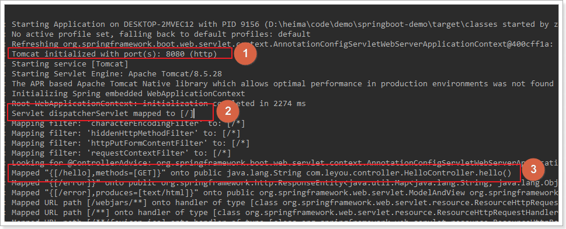

- 1）监听的端口是8080
- 2）SpringMVC的映射路径是：/
- 3）`/hello`路径已经映射到了`HelloController`中的`hello()`方法

打开页面访问：http://localhost:8080/hello

 


测试成功了！

# 3.Java配置

在入门案例中，我们没有任何的配置，就可以实现一个SpringMVC的项目了，快速、高效！

但是有同学会有疑问，如果没有任何的xml，那么我们如果要配置一个Bean该怎么办？比如我们要配置一个数据库连接池，以前会这么玩：

```xml
<!-- 配置连接池 -->
<bean id="dataSource" class="com.alibaba.druid.pool.DruidDataSource"
      init-method="init" destroy-method="close">
    <property name="url" value="${jdbc.url}" />
    <property name="username" value="${jdbc.username}" />
    <property name="password" value="${jdbc.password}" />
</bean>
```

现在该怎么做呢？


## 3.1.回顾历史

事实上，在Spring3.0开始，Spring官方就已经开始推荐使用java配置来代替传统的xml配置了，我们不妨来回顾一下Spring的历史：

- Spring1.0时代

  在此时因为jdk1.5刚刚出来，注解开发并未盛行，因此一切Spring配置都是xml格式，想象一下所有的bean都用xml配置，细思极恐啊，心疼那个时候的程序员2秒

- Spring2.0时代

  Spring引入了注解开发，但是因为并不完善，因此并未完全替代xml，此时的程序员往往是把xml与注解进行结合，貌似我们之前都是这种方式。

- Spring3.0及以后

  3.0以后Spring的注解已经非常完善了，因此Spring推荐大家使用完全的java配置来代替以前的xml，不过似乎在国内并未推广盛行。然后当SpringBoot来临，人们才慢慢认识到java配置的优雅。

有句古话说的好：拥抱变化，拥抱未来。所以我们也应该顺应时代潮流，做时尚的弄潮儿，一起来学习下java配置的玩法。

## 3.2.尝试java配置

java配置主要靠java类和一些注解，比较常用的注解有：

- `@Configuration`：声明一个类作为配置类，代替xml文件
- `@Bean`：声明在方法上，将方法的返回值加入Bean容器，代替`<bean>`标签
- `@value`：属性注入
- `@PropertySource`：指定外部属性文件，

我们接下来用java配置来尝试实现连接池配置：

首先引入Druid连接池依赖：

```xml
<dependency>
    <groupId>com.alibaba</groupId>
    <artifactId>druid</artifactId>
    <version>1.1.6</version>
</dependency>
```

创建一个jdbc.properties文件，编写jdbc属性：

```properties
jdbc.driverClassName=com.mysql.jdbc.Driver
jdbc.url=jdbc:mysql://127.0.0.1:3306/leyou
jdbc.username=root
jdbc.password=123
```

然后编写代码：

```java
@Configuration
@PropertySource("classpath:jdbc.properties")
public class JdbcConfig {

    @Value("${jdbc.url}")
    String url;
    @Value("${jdbc.driverClassName}")
    String driverClassName;
    @Value("${jdbc.username}")
    String username;
    @Value("${jdbc.password}")
    String password;

    @Bean
    public DataSource dataSource() {
        DruidDataSource dataSource = new DruidDataSource();
        dataSource.setUrl(url);
        dataSource.setDriverClassName(driverClassName);
        dataSource.setUsername(username);
        dataSource.setPassword(password);
        return dataSource;
    }
}
```

解读：

- `@Configuration`：声明我们`JdbcConfig`是一个配置类
- `@PropertySource`：指定属性文件的路径是:`classpath:jdbc.properties`
- 通过`@Value`为属性注入值
- 通过@Bean将 `dataSource()`方法声明为一个注册Bean的方法，Spring会自动调用该方法，将方法的返回值加入Spring容器中。

然后我们就可以在任意位置通过`@Autowired`注入DataSource了！


我们在`HelloController`中测试：

```java
@RestController
public class HelloController {

    @Autowired
    private DataSource dataSource;

    @GetMapping("hello")
    public String hello() {
        return "hello, spring boot!" + dataSource;
    }
}
```

然后Debug运行并查看：

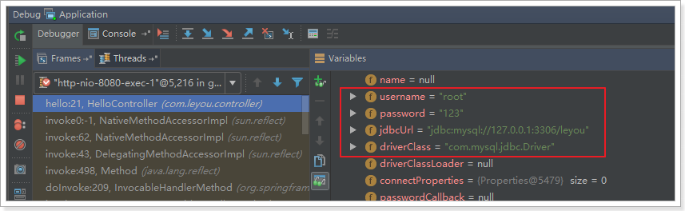

属性注入成功了！


## 3.3.SpringBoot的属性注入

在上面的案例中，我们实验了java配置方式。不过属性注入使用的是@Value注解。这种方式虽然可行，但是不够强大，因为它只能注入基本类型值。

在SpringBoot中，提供了一种新的属性注入方式，支持各种java基本数据类型及复杂类型的注入。

1）我们新建一个类，用来进行属性注入：

```java
@ConfigurationProperties(prefix = "jdbc")
public class JdbcProperties {
    private String url;
    private String driverClassName;
    private String username;
    private String password;
    // ... 略
    // getters 和 setters
}

```

- 在类上通过@ConfigurationProperties注解声明当前类为属性读取类

- `prefix="jdbc"`读取属性文件中，前缀为jdbc的值。

- 在类上定义各个属性，名称必须与属性文件中`jdbc.`后面部分一致

- 需要注意的是，这里我们并没有指定属性文件的地址，所以我们需要把jdbc.properties名称改为application.properties，这是SpringBoot默认读取的属性文件名：

   

2）在JdbcConfig中使用这个属性：

```java
@Configuration
@EnableConfigurationProperties(JdbcProperties.class)
public class JdbcConfig {

    @Bean
    public DataSource dataSource(JdbcProperties jdbc) {
        DruidDataSource dataSource = new DruidDataSource();
        dataSource.setUrl(jdbc.getUrl());
        dataSource.setDriverClassName(jdbc.getDriverClassName());
        dataSource.setUsername(jdbc.getUsername());
        dataSource.setPassword(jdbc.getPassword());
        return dataSource;
    }
}
```

- 通过`@EnableConfigurationProperties(JdbcProperties.class)`来声明要使用`JdbcProperties`这个类的对象

- 然后你可以通过以下方式注入JdbcProperties：

  - @Autowired注入

    ```java
    @Autowired
    private JdbcProperties prop;
    ```

  - 构造函数注入

    ```java
    private JdbcProperties prop;
    public JdbcConfig(Jdbcproperties prop){
        this.prop = prop;
    }
    ```

  - 声明有@Bean的方法参数注入

    ```java
    @Bean
    public Datasource dataSource(JdbcProperties prop){
        // ...
    }
    ```

本例中，我们采用第三种方式。

3）测试结果：


大家会觉得这种方式似乎更麻烦了，事实上这种方式有更强大的功能，也是SpringBoot推荐的注入方式。两者对比关系：


优势：

- Relaxed binding：松散绑定

  - 不严格要求属性文件中的属性名与成员变量名一致。支持驼峰，中划线，下划线等等转换，甚至支持对象引导。比如：user.friend.name：代表的是user对象中的friend属性中的name属性，显然friend也是对象。@value注解就难以完成这样的注入方式。

  - meta-data support：元数据支持，帮助IDE生成属性提示（写开源框架会用到）。

    ​

## 3.4.更优雅的注入

事实上，如果一段属性只有一个Bean需要使用，我们无需将其注入到一个类（JdbcProperties）中。而是直接在需要的地方声明即可：

```java
@Configuration
public class JdbcConfig {
    
    @Bean
    // 声明要注入的属性前缀，SpringBoot会自动把相关属性通过set方法注入到DataSource中
    @ConfigurationProperties(prefix = "jdbc")
    public DataSource dataSource() {
        DruidDataSource dataSource = new DruidDataSource();
        return dataSource;
    }
}
```

我们直接把`@ConfigurationProperties(prefix = "jdbc")`声明在需要使用的`@Bean`的方法上，然后SpringBoot就会自动调用这个Bean（此处是DataSource）的set方法，然后完成注入。使用的前提是：**该类必须有对应属性的set方法！**

我们将jdbc的url改成：/heima，再次测试：


# 4.自动配置原理

使用SpringBoot之后，一个整合了SpringMVC的WEB工程开发，变的无比简单，那些繁杂的配置都消失不见了，这是如何做到的？

一切魔力的开始，都是从我们的main函数来的，所以我们再次来看下启动类：

 

我们发现特别的地方有两个：

- 注解：@SpringBootApplication
- run方法：SpringApplication.run()

我们分别来研究这两个部分。

## 4.1.了解@SpringBootApplication

点击进入，查看源码：


这里重点的注解有3个：

- @SpringBootConfiguration
- @EnableAutoConfiguration
- @ComponentScan

### 4.1.1.@SpringBootConfiguration

我们继续点击查看源码：


通过这段我们可以看出，在这个注解上面，又有一个`@Configuration`注解。通过上面的注释阅读我们知道：这个注解的作用就是声明当前类是一个配置类，然后Spring会自动扫描到添加了`@Configuration`的类，并且读取其中的配置信息。而`@SpringBootConfiguration`是来声明当前类是SpringBoot应用的配置类，项目中只能有一个。所以一般我们无需自己添加。


### 4.1.2.@EnableAutoConfiguration

关于这个注解，官网上有一段说明：

> The second class-level annotation is `@EnableAutoConfiguration`. This annotation
> tells Spring Boot to “guess” how you want to configure Spring, based on the jar
> dependencies that you have added. Since `spring-boot-starter-web` added Tomcat
> and Spring MVC, the auto-configuration assumes that you are developing a web
> application and sets up Spring accordingly.

简单翻译以下：

> 第二级的注解`@EnableAutoConfiguration`，告诉SpringBoot基于你所添加的依赖，去“猜测”你想要如何配置Spring。比如我们引入了`spring-boot-starter-web`，而这个启动器中帮我们添加了`tomcat`、`SpringMVC`的依赖。此时自动配置就知道你是要开发一个web应用，所以就帮你完成了web及SpringMVC的默认配置了！

总结，SpringBoot内部对大量的第三方库或Spring内部库进行了默认配置，这些配置是否生效，取决于我们是否引入了对应库所需的依赖，如果有那么默认配置就会生效。

所以，我们使用SpringBoot构建一个项目，只需要引入所需框架的依赖，配置就可以交给SpringBoot处理了。除非你不希望使用SpringBoot的默认配置，它也提供了自定义配置的入口。

### 4.1.3.@ComponentScan

我们跟进源码：

 

并没有看到什么特殊的地方。我们查看注释：

 

大概的意思：

> 配置组件扫描的指令。提供了类似与`<context:component-scan>`标签的作用
>
> 通过basePackageClasses或者basePackages属性来指定要扫描的包。如果没有指定这些属性，那么将从声明这个注解的类所在的包开始，扫描包及子包

而我们的@SpringBootApplication注解声明的类就是main函数所在的启动类，因此扫描的包是该类所在包及其子包。因此，**一般启动类会放在一个比较前的包目录中。**


## 4.2.默认配置原理

### 4.2.1默认配置类

通过刚才的学习，我们知道@EnableAutoConfiguration会开启SpringBoot的自动配置，并且根据你引入的依赖来生效对应的默认配置。那么问题来了：

- 这些默认配置是在哪里定义的呢？
- 为何依赖引入就会触发配置呢？

其实在我们的项目中，已经引入了一个依赖：spring-boot-autoconfigure，其中定义了大量自动配置类：

 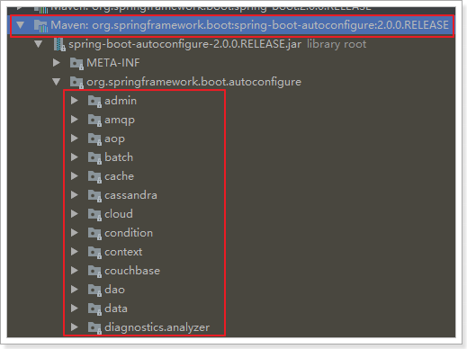

还有：

 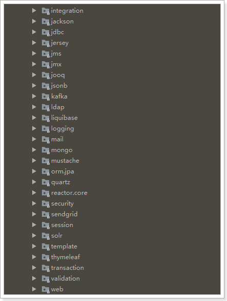

非常多，几乎涵盖了现在主流的开源框架，例如：

- redis
- jms
- amqp
- jdbc
- jackson
- mongodb
- jpa
- solr
- elasticsearch

... 等等

我们来看一个我们熟悉的，例如SpringMVC，查看mvc 的自动配置类：

 

打开WebMvcAutoConfiguration：


我们看到这个类上的4个注解：

- `@Configuration`：声明这个类是一个配置类


- `@ConditionalOnWebApplication(type = Type.SERVLET)`

  ConditionalOn，翻译就是在某个条件下，此处就是满足项目的类是是Type.SERVLET类型，也就是一个普通web工程，显然我们就是

- `@ConditionalOnClass({ Servlet.class, DispatcherServlet.class, WebMvcConfigurer.class })`

  这里的条件是OnClass，也就是满足以下类存在：Servlet、DispatcherServlet、WebMvcConfigurer，其中Servlet只要引入了tomcat依赖自然会有，后两个需要引入SpringMVC才会有。这里就是判断你是否引入了相关依赖，引入依赖后该条件成立，当前类的配置才会生效！

- `@ConditionalOnMissingBean(WebMvcConfigurationSupport.class)`

  这个条件与上面不同，OnMissingBean，是说环境中没有指定的Bean这个才生效。其实这就是自定义配置的入口，也就是说，如果我们自己配置了一个WebMVCConfigurationSupport的类，那么这个默认配置就会失效！

接着，我们查看该类中定义了什么：

视图解析器：

 

处理器适配器（HandlerAdapter）：

 

还有很多，这里就不一一截图了。

### 4.2.2.默认配置属性

另外，这些默认配置的属性来自哪里呢？


我们看到，这里通过@EnableAutoConfiguration注解引入了两个属性：WebMvcProperties和ResourceProperties。这不正是SpringBoot的属性注入玩法嘛。

我们查看这两个属性类：

 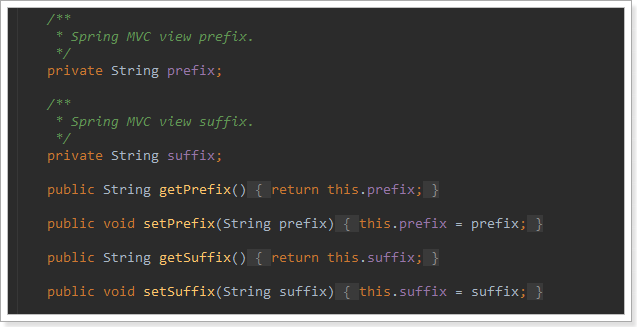

找到了内部资源视图解析器的prefix和suffix属性。

ResourceProperties中主要定义了静态资源（.js,.html,.css等)的路径：

 

如果我们要覆盖这些默认属性，只需要在application.properties中定义与其前缀prefix和字段名一致的属性即可。

## 4.3.总结

SpringBoot为我们提供了默认配置，而默认配置生效的条件一般有两个：

- 你引入了相关依赖
- 你自己没有配置Bean

1）启动器

所以，我们如果不想配置，只需要引入依赖即可，而依赖版本我们也不用操心，因为只要引入了SpringBoot提供的stater（启动器），就会自动管理依赖及版本了。

因此，玩SpringBoot的第一件事情，就是找启动器，SpringBoot提供了大量的默认启动器，参考课前资料中提供的《SpringBoot启动器.txt》

2）全局配置

另外，SpringBoot的默认配置，都会读取默认属性，而这些属性可以通过自定义`application.properties`文件来进行覆盖。这样虽然使用的还是默认配置，但是配置中的值改成了我们自定义的。

因此，玩SpringBoot的第二件事情，就是通过`application.properties`来覆盖默认属性值，形成自定义配置。我们需要知道SpringBoot的默认属性key，非常多，参考课前资料提供的：《SpringBoot全局属性.md》


属性文件支持两种格式，application.properties和application.yml

yml的语法实例：

```yaml
jdbc:
  driverClassName: com.mysql.jdbc.Driver
  url: jdbc:mysql://127.0.0.1:3306/leyou
  username: root
  password: 123

server:
  port: 80
```


# 5.SpringBoot实践

接下来，我们来看看如何用SpringBoot来玩转以前的SSM,我们沿用之前讲解SSM用到的数据库tb_user和实体类User

## 5.1.整合SpringMVC

虽然默认配置已经可以使用SpringMVC了，不过我们有时候需要进行自定义配置。

### 5.1.1.修改端口

查看SpringBoot的全局属性可知，端口通过以下方式配置：

```properties
# 映射端口
server.port=80
```

重启服务后测试：

 

### 5.1.2.访问静态资源

现在，我们的项目是一个jar工程，那么就没有webapp，我们的静态资源该放哪里呢？

回顾我们上面看的源码，有一个叫做ResourceProperties的类，里面就定义了静态资源的默认查找路径：

 

默认的静态资源路径为：

- classpath:/META-INF/resources/
- classpath:/resources/
- classpath:/static/
- classpath:/public

只要静态资源放在这些目录中任何一个，SpringMVC都会帮我们处理。

我们习惯会把静态资源放在`classpath:/static/`目录下。我们创建目录，并且添加一些静态资源：

 

重启项目后测试：

 


### 5.1.3.添加拦截器

拦截器也是我们经常需要使用的，在SpringBoot中该如何配置呢？

拦截器不是一个普通属性，而是一个类，所以就要用到java配置方式了。在SpringBoot官方文档中有这么一段说明：

> If you want to keep Spring Boot MVC features and you want to add additional [MVC configuration](https://docs.spring.io/spring/docs/5.0.5.RELEASE/spring-framework-reference/web.html#mvc) (interceptors, formatters, view controllers, and other features), you can add your own `@Configuration` class of type `WebMvcConfigurer` but **without** `@EnableWebMvc`. If you wish to provide custom instances of `RequestMappingHandlerMapping`, `RequestMappingHandlerAdapter`, or `ExceptionHandlerExceptionResolver`, you can declare a `WebMvcRegistrationsAdapter` instance to provide such components.
>
> If you want to take complete control of Spring MVC, you can add your own `@Configuration` annotated with `@EnableWebMvc`.

翻译：

> 如果你想要保持Spring Boot 的一些默认MVC特征，同时又想自定义一些MVC配置（包括：拦截器，格式化器, 视图控制器、消息转换器 等等），你应该让一个类实现`WebMvcConfigurer`，并且添加`@Configuration`注解，但是**千万不要**加`@EnableWebMvc`注解。如果你想要自定义`HandlerMapping`、`HandlerAdapter`、`ExceptionResolver`等组件，你可以创建一个`WebMvcRegistrationsAdapter`实例 来提供以上组件。
>
> 如果你想要完全自定义SpringMVC，不保留SpringBoot提供的一切特征，你可以自己定义类并且添加`@Configuration`注解和`@EnableWebMvc`注解


总结：通过实现`WebMvcConfigurer`并添加`@Configuration`注解来实现自定义部分SpringMvc配置。

首先我们定义一个拦截器：

```java
public class LoginInterceptor implements HandlerInterceptor {

    private Logger logger = LoggerFactory.getLogger(LoginInterceptor.class);
    @Override
    public boolean preHandle(HttpServletRequest request, HttpServletResponse response, Object handler) {
        logger.debug("preHandle method is now running!");
        return true;
    }

    @Override
    public void postHandle(HttpServletRequest request, HttpServletResponse response, Object handler, ModelAndView modelAndView) {
        logger.debug("postHandle method is now running!");
    }

    @Override
    public void afterCompletion(HttpServletRequest request, HttpServletResponse response, Object handler, Exception ex) {
        logger.debug("afterCompletion method is now running!");
    }
}
```


然后，我们定义配置类，注册拦截器：

```java
@Configuration
public class MvcConfig implements WebMvcConfigurer{
    /**
     * 通过@Bean注解，将我们定义的拦截器注册到Spring容器
     * @return
     */
    @Bean
    public LoginInterceptor loginInterceptor(){
        return new LoginInterceptor();
    }

    /**
     * 重写接口中的addInterceptors方法，添加自定义拦截器
     * @param registry
     */
    @Override
    public void addInterceptors(InterceptorRegistry registry) {
        // 通过registry来注册拦截器，通过addPathPatterns来添加拦截路径
        registry.addInterceptor(this.loginInterceptor()).addPathPatterns("/**");
    }
}
```

结构如下：

 

接下来运行并查看日志：

你会发现日志中什么都没有，因为我们记录的log级别是debug，默认是显示info以上，我们需要进行配置。

SpringBoot通过`logging.level.*=debug`来配置日志级别，*填写包名

```properties
# 设置com.leyou包的日志级别为debug
logging.level.com.leyou=debug
```

再次运行查看：

```verilog
2018-05-05 17:50:01.811 DEBUG 4548 --- [p-nio-80-exec-1] com.leyou.interceptor.LoginInterceptor   : preHandle method is now running!
2018-05-05 17:50:01.854 DEBUG 4548 --- [p-nio-80-exec-1] com.leyou.interceptor.LoginInterceptor   : postHandle method is now running!
2018-05-05 17:50:01.854 DEBUG 4548 --- [p-nio-80-exec-1] com.leyou.interceptor.LoginInterceptor   : afterCompletion method is now running!
```


## 5.2.整合jdbc和事务

spring中的jdbc连接和事务是配置中的重要一环，在SpringBoot中该如何处理呢？

答案是不需要处理，我们只要找到SpringBoot提供的启动器即可：

```xml
<dependency>
    <groupId>org.springframework.boot</groupId>
    <artifactId>spring-boot-starter-jdbc</artifactId>
</dependency>
```

当然，不要忘了数据库驱动，SpringBoot并不知道我们用的什么数据库，这里我们选择MySQL：

```xml
<dependency>
    <groupId>mysql</groupId>
    <artifactId>mysql-connector-java</artifactId>
</dependency>
```

至于事务，SpringBoot中通过注解来控制。就是我们熟知的`@Transactional`

```java
@Service
public class UserService {

    @Autowired
    private UserMapper userMapper;

    public User queryById(Long id){
        return this.userMapper.selectByPrimaryKey(id);
    }

    @Transactional
    public void deleteById(Long id){
        this.userMapper.deleteByPrimaryKey(id);
    }
}
```


## 5.3.整合连接池

其实，在刚才引入jdbc启动器的时候，SpringBoot已经自动帮我们引入了一个连接池：

 

HikariCP应该是目前速度最快的连接池了，我们看看它与c3p0的对比：

 

因此，我们只需要指定连接池参数即可：

```properties
spring:
  datasource:
    driver-class-name: com.mysql.jdbc.Driver
    url: jdbc:mysql://localhost:3306/heima30
    username: root
    password: 123
```


当然，如果你更喜欢Druid连接池，也可以使用Druid官方提供的启动器：

```xml
<!-- Druid连接池 -->
<dependency>
    <groupId>com.alibaba</groupId>
    <artifactId>druid-spring-boot-starter</artifactId>
    <version>1.1.6</version>
</dependency>
```

而连接信息的配置与上面是类似的，只不过在连接池特有属性上，方式略有不同：

```properties
#初始化连接数
spring.datasource.druid.initial-size=1
#最小空闲连接
spring.datasource.druid.min-idle=1
#最大活动连接
spring.datasource.druid.max-active=20
#获取连接时测试是否可用
spring.datasource.druid.test-on-borrow=true
#监控页面启动
spring.datasource.druid.stat-view-servlet.allow=true

```

## 5.4.整合mybatis

### 5.4.1.mybatis

SpringBoot官方并没有提供Mybatis的启动器，不过Mybatis[官网](https://github.com/mybatis/spring-boot-starter)自己实现了：

```xml
<!--mybatis -->
<dependency>
    <groupId>org.mybatis.spring.boot</groupId>
    <artifactId>mybatis-spring-boot-starter</artifactId>
    <version>1.3.2</version>
</dependency>

```

配置，基本没有需要配置的：

```properties
# mybatis 别名扫描
mybatis.type-aliases-package=com.heima.pojo
# mapper.xml文件位置,如果没有映射文件，请注释掉
mybatis.mapper-locations=classpath:mappers/*.xml
```

需要注意，这里没有配置mapper接口扫描包，因此我们需要给每一个Mapper接口添加`@Mapper`注解，才能被识别。

```java
@Mapper
public interface UserMapper {
}
```

或者，我们也可以不加注解，而是在启动类上添加扫描包注解：

```java
@SpringBootApplication
@MapperScan("cn.itcast.demo.mapper")
public class Application {
    public static void main(String[] args) {
        // 启动代码
        SpringApplication.run(Application.class, args);
    }
}
```


### 5.4.2.通用mapper

通用Mapper的作者也为自己的插件编写了启动器，我们直接引入即可：

```xml
<!-- 通用mapper -->
<dependency>
    <groupId>tk.mybatis</groupId>
    <artifactId>mapper-spring-boot-starter</artifactId>
    <version>2.0.2</version>
</dependency>
```

不需要做任何配置就可以使用了。

```java
@Mapper
public interface UserMapper extends tk.mybatis.mapper.common.Mapper<User>{
}
```

## 5.5.启动测试

将controller进行简单改造：

```java
@RestController
public class HelloController {

    @Autowired
    private UserService userService;

    @GetMapping("/hello")
    public User hello() {
        User user = this.userService.queryById(8L);
        return user;
    }
}

```


我们启动项目，查看：

 


# 6.JDK1.8

参考课前资料：《JDK1.8新特性.md》

 


----------

# 0.学习目标

- 了解系统架构的演变
- 了解RPC与Http的区别
- 掌握HttpClient的简单使用
- 知道什么是SpringCloud
- 独立搭建Eureka注册中心
- 独立配置Robbin负载均衡


# 1.系统架构演变

随着互联网的发展，网站应用的规模不断扩大。需求的激增，带来的是技术上的压力。系统架构也因此也不断的演进、升级、迭代。从单一应用，到垂直拆分，到分布式服务，到SOA，以及现在火热的微服务架构，还有在Google带领下来势汹涌的Service Mesh。我们到底是该乘坐微服务的船只驶向远方，还是偏安一隅得过且过？

其实生活不止眼前的苟且，还有诗和远方。所以我们今天就回顾历史，看一看系统架构演变的历程；把握现在，学习现在最火的技术架构；展望未来，争取成为一名优秀的Java工程师。

## 1.1. 集中式架构

当网站流量很小时，只需一个应用，将所有功能都部署在一起，以减少部署节点和成本。此时，用于简化增删改查工作量的数据访问框架(ORM)是影响项目开发的关键。

 

存在的问题：

- 代码耦合，开发维护困难
- 无法针对不同模块进行针对性优化
- 无法水平扩展
- 单点容错率低，并发能力差


## 1.2.垂直拆分

当访问量逐渐增大，单一应用无法满足需求，此时为了应对更高的并发和业务需求，我们根据业务功能对系统进行拆分：

 

优点：

- 系统拆分实现了流量分担，解决了并发问题
- 可以针对不同模块进行优化
- 方便水平扩展，负载均衡，容错率提高

缺点：

- 系统间相互独立，会有很多重复开发工作，影响开发效率

## 1.3.分布式服务

当垂直应用越来越多，应用之间交互不可避免，将核心业务抽取出来，作为独立的服务，逐渐形成稳定的服务中心，使前端应用能更快速的响应多变的市场需求。此时，用于提高业务复用及整合的分布式调用是关键。

 

优点：

- 将基础服务进行了抽取，系统间相互调用，提高了代码复用和开发效率

缺点：

- 系统间耦合度变高，调用关系错综复杂，难以维护


## 1.4.服务治理（SOA）

SOA ：面向服务的架构

当服务越来越多，容量的评估，小服务资源的浪费等问题逐渐显现，此时需增加一个调度中心基于访问压力实时管理集群容量，提高集群利用率。此时，用于提高机器利用率的资源调度和治理中心(SOA)是关键


以前出现了什么问题？

- 服务越来越多，需要管理每个服务的地址
- 调用关系错综复杂，难以理清依赖关系
- 服务过多，服务状态难以管理，无法根据服务情况动态管理

服务治理要做什么？

- 服务注册中心，实现服务自动注册和发现，无需人为记录服务地址
- 服务自动订阅，服务列表自动推送，服务调用透明化，无需关心依赖关系
-  动态监控服务状态监控报告，人为控制服务状态

缺点：

- 服务间会有依赖关系，一旦某个环节出错会影响较大
- 服务关系复杂，运维、测试部署困难，不符合DevOps思想

## 1.5.微服务

前面说的SOA，英文翻译过来是面向服务。微服务，似乎也是服务，都是对系统进行拆分。因此两者非常容易混淆，但其实缺有一些差别：

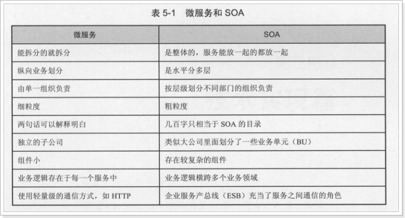

微服务的特点：

- 单一职责：微服务中每一个服务都对应唯一的业务能力，做到单一职责
- 微：微服务的服务拆分粒度很小，例如一个用户管理就可以作为一个服务。每个服务虽小，但“五脏俱全”。
- 面向服务：面向服务是说每个服务都要对外暴露Rest风格服务接口API。并不关心服务的技术实现，做到与平台和语言无关，也不限定用什么技术实现，只要提供Rest的接口即可。
- 自治：自治是说服务间互相独立，互不干扰
  - 团队独立：每个服务都是一个独立的开发团队，人数不能过多。
  - 技术独立：因为是面向服务，提供Rest接口，使用什么技术没有别人干涉
  - 前后端分离：采用前后端分离开发，提供统一Rest接口，后端不用再为PC、移动段开发不同接口
  - 数据库分离：每个服务都使用自己的数据源
  - 部署独立，服务间虽然有调用，但要做到服务重启不影响其它服务。有利于持续集成和持续交付。每个服务都是独立的组件，可复用，可替换，降低耦合，易维护


微服务结构图：

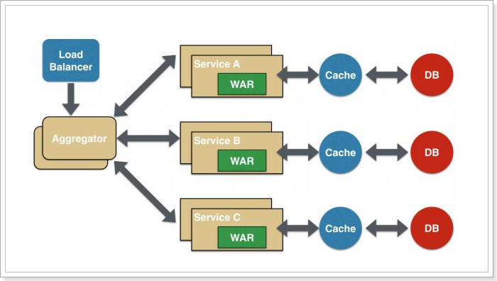


# 2.远程调用方式

无论是微服务还是SOA，都面临着服务间的远程调用。那么服务间的远程调用方式有哪些呢？

常见的远程调用方式有以下几种：

- RPC：Remote Produce Call远程过程调用，类似的还有RMI。自定义数据格式，基于原生TCP通信，速度快，效率高。早期的webservice，现在热门的dubbo，都是RPC的典型

- Http：http其实是一种网络传输协议，基于TCP，规定了数据传输的格式。现在客户端浏览器与服务端通信基本都是采用Http协议。也可以用来进行远程服务调用。缺点是消息封装臃肿。

  现在热门的Rest风格，就可以通过http协议来实现。

## 2.1.认识RPC

RPC，即 Remote Procedure Call（远程过程调用），是一个计算机通信协议。 该协议允许运行于一台计算机的程序调用另一台计算机的子程序，而程序员无需额外地为这个交互作用编程。说得通俗一点就是：A计算机提供一个服务，B计算机可以像调用本地服务那样调用A计算机的服务。

通过上面的概念，我们可以知道，实现RPC主要是做到两点： 

- 实现远程调用其他计算机的服务
  - 要实现远程调用，肯定是通过网络传输数据。A程序提供服务，B程序通过网络将请求参数传递给A，A本地执行后得到结果，再将结果返回给B程序。这里需要关注的有两点：
    - 1）采用何种网络通讯协议？
      - 现在比较流行的RPC框架，都会采用TCP作为底层传输协议
    - 2）数据传输的格式怎样？
      - 两个程序进行通讯，必须约定好数据传输格式。就好比两个人聊天，要用同一种语言，否则无法沟通。所以，我们必须定义好请求和响应的格式。另外，数据在网路中传输需要进行序列化，所以还需要约定统一的序列化的方式。
- 像调用本地服务一样调用远程服务 
  - 如果仅仅是远程调用，还不算是RPC，因为RPC强调的是过程调用，调用的过程对用户而言是应该是透明的，用户不应该关心调用的细节，可以像调用本地服务一样调用远程服务。所以RPC一定要对调用的过程进行封装

RPC调用流程图：


想要了解详细的RPC实现，给大家推荐一篇文章：[自己动手实现RPC](https://legacy.gitbook.com/book/huge0612/tour-of-rpc/details)


## 2.2.认识Http

Http协议：超文本传输协议，是一种应用层协议。规定了网络传输的请求格式、响应格式、资源定位和操作的方式等。但是底层采用什么网络传输协议，并没有规定，不过现在都是采用TCP协议作为底层传输协议。说到这里，大家可能觉得，Http与RPC的远程调用非常像，都是按照某种规定好的数据格式进行网络通信，有请求，有响应。没错，在这点来看，两者非常相似，但是还是有一些细微差别。

- RPC并没有规定数据传输格式，这个格式可以任意指定，不同的RPC协议，数据格式不一定相同。
- Http中还定义了资源定位的路径，RPC中并不需要
- 最重要的一点：RPC需要满足像调用本地服务一样调用远程服务，也就是对调用过程在API层面进行封装。Http协议没有这样的要求，因此请求、响应等细节需要我们自己去实现。
  - 优点：RPC方式更加透明，对用户更方便。Http方式更灵活，没有规定API和语言，跨语言、跨平台
  - 缺点：RPC方式需要在API层面进行封装，限制了开发的语言环境。

例如我们通过浏览器访问网站，就是通过Http协议。只不过浏览器把请求封装，发起请求以及接收响应，解析响应的事情都帮我们做了。如果是不通过浏览器，那么这些事情都需要自己去完成。


## 2.3.如何选择？

既然两种方式都可以实现远程调用，我们该如何选择呢？

- 速度来看，RPC要比http更快，虽然底层都是TCP，但是http协议的信息往往比较臃肿，不过可以采用gzip压缩。
- 难度来看，RPC实现较为复杂，http相对比较简单
- 灵活性来看，http更胜一筹，因为它不关心实现细节，跨平台、跨语言。

因此，两者都有不同的使用场景：

- 如果对效率要求更高，并且开发过程使用统一的技术栈，那么用RPC还是不错的。
- 如果需要更加灵活，跨语言、跨平台，显然http更合适


那么我们该怎么选择呢？

微服务，更加强调的是独立、自治、灵活。而RPC方式的限制较多，因此微服务框架中，一般都会采用基于Http的Rest风格服务。


# 3.Http客户端工具

既然微服务选择了Http，那么我们就需要考虑自己来实现对请求和响应的处理。不过开源世界已经有很多的http客户端工具，能够帮助我们做这些事情，例如：

- HttpClient
- OKHttp
- URLConnection

接下来，我们就一起了解一款比较流行的客户端工具：HttpClient

## 3.1.HttpClient

### 3.1.1.介绍

HttpClient是Apache公司的产品，是Http Components下的一个组件。

[官网地址：http://hc.apache.org/index.html](http://hc.apache.org/index.html)

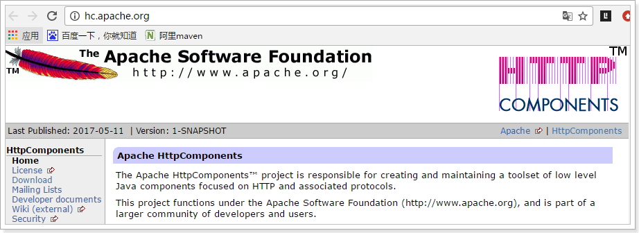

特点：

- 基于标准、纯净的Java语言。实现了Http1.0和Http1.1
- 以可扩展的面向对象的结构实现了Http全部的方法（GET, POST, PUT, DELETE, HEAD, OPTIONS, and TRACE）
- 支持HTTPS协议。
-  通过Http代理建立透明的连接。
-  自动处理Set-Cookie中的Cookie。

Rest风格：

- 查询：GET，/user/12
- 新增：POST, /user
- 修改：PUT, /user
- 删除：DELTE, /user/12


### 3.1.2.使用

我们导入课前资料提供的demo工程：《http-demo》

 

发起get请求：

```java
    @Test
    public void testGet() throws IOException {
        HttpGet request = new HttpGet("http://www.baidu.com");
        String response = this.httpClient.execute(request, new BasicResponseHandler());
        System.out.println(response);
    }

```

发起Post请求：

```java
@Test
public void testPost() throws IOException {
    HttpPost request = new HttpPost("http://www.oschina.net/");
    request.setHeader("User-Agent",
                      "Mozilla/5.0 (Windows NT 10.0; WOW64) AppleWebKit/537.36 (KHTML, like Gecko) Chrome/56.0.2924.87 Safari/537.36");
    String response = this.httpClient.execute(request, new BasicResponseHandler());
    System.out.println(response);
}
```

尝试访问昨天编写的接口：http://localhost/hello

这个接口返回一个User对象

```java
@Test
public void testGetPojo() throws IOException {
    HttpGet request = new HttpGet("http://localhost/hello");
    String response = this.httpClient.execute(request, new BasicResponseHandler());
    System.out.println(response);
}
```

我们实际得到的是一个json字符串：

```json
{
    "id": 8,
    "userName": "liuyan",
    "password": "123456",
    "name": "柳岩",
    "age": 21,
    "sex": 2,
    "birthday": "1995-08-07T16:00:00.000+0000",
    "created": "2014-09-20T03:41:15.000+0000",
    "updated": "2014-09-20T03:41:15.000+0000",
    "note": "柳岩同学在传智播客学表演"
}
```

如果想要得到对象，我们还需要手动进行Json反序列化，这一点比较麻烦。

### 3.1.3.Json转换工具

HttpClient请求数据后是json字符串，需要我们自己把Json字符串反序列化为对象，我们会使用JacksonJson工具来实现。

`JacksonJson`是SpringMVC内置的json处理工具，其中有一个`ObjectMapper`类，可以方便的实现对json的处理：

#### 对象转json

```java
// json处理工具
    private ObjectMapper mapper = new ObjectMapper();
    @Test
    public void testJson() throws JsonProcessingException {
        User user = new User();
        user.setId(8L);
        user.setAge(21);
        user.setName("柳岩");
        user.setUserName("liuyan");
        // 序列化
        String json = mapper.writeValueAsString(user);
        System.out.println("json = " + json);
    }
```

结果：

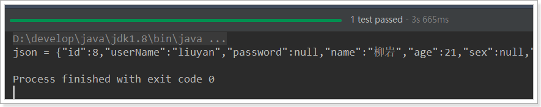


#### json转普通对象

```java
// json处理工具
private ObjectMapper mapper = new ObjectMapper();
@Test
public void testJson() throws IOException {
    User user = new User();
    user.setId(8L);
    user.setAge(21);
    user.setName("柳岩");
    user.setUserName("liuyan");
    // 序列化
    String json = mapper.writeValueAsString(user);

    // 反序列化，接收两个参数：json数据，反序列化的目标类字节码
    User result = mapper.readValue(json, User.class);
    System.out.println("result = " + result);
}
```

结果：


#### json转集合

json转集合比较麻烦，因为你无法同时把集合的class和元素的class同时传递到一个参数。

因此Jackson做了一个类型工厂，用来解决这个问题：

```java
// json处理工具
private ObjectMapper mapper = new ObjectMapper();
@Test
public void testJson() throws IOException {
    User user = new User();
    user.setId(8L);
    user.setAge(21);
    user.setName("柳岩");
    user.setUserName("liuyan");

    // 序列化,得到对象集合的json字符串
    String json = mapper.writeValueAsString(Arrays.asList(user, user));

    // 反序列化，接收两个参数：json数据，反序列化的目标类字节码
    List<User> users = mapper.readValue(json, mapper.getTypeFactory().constructCollectionType(List.class, User.class));
    for (User u : users) {
        System.out.println("u = " + u);
    }
}
```

结果：


#### json转任意复杂类型

当对象泛型关系复杂时，类型工厂也不好使了。这个时候Jackson提供了TypeReference来接收类型泛型，然后底层通过反射来获取泛型上的具体类型。实现数据转换。

```java
// json处理工具
private ObjectMapper mapper = new ObjectMapper();
@Test
public void testJson() throws IOException {
    User user = new User();
    user.setId(8L);
    user.setAge(21);
    user.setName("柳岩");
    user.setUserName("liuyan");

    // 序列化,得到对象集合的json字符串
    String json = mapper.writeValueAsString(Arrays.asList(user, user));

    // 反序列化，接收两个参数：json数据，反序列化的目标类字节码
    List<User> users = mapper.readValue(json, new TypeReference<List<User>>(){});
    for (User u : users) {
        System.out.println("u = " + u);
    }
}
```

结果：

 


## 3.3.Spring的RestTemplate

Spring提供了一个RestTemplate模板工具类，对基于Http的客户端进行了封装，并且实现了对象与json的序列化和反序列化，非常方便。RestTemplate并没有限定Http的客户端类型，而是进行了抽象，目前常用的3种都有支持：

- HttpClient
- OkHttp
- JDK原生的URLConnection（默认的）

首先在项目中注册一个`RestTemplate`对象，可以在启动类位置注册：

```java
@SpringBootApplication
public class HttpDemoApplication {

	public static void main(String[] args) {
		SpringApplication.run(HttpDemoApplication.class, args);
	}

	@Bean
	public RestTemplate restTemplate() {
        // 默认的RestTemplate，底层是走JDK的URLConnection方式。
		return new RestTemplate();
	}
}
```


在测试类中直接`@Autowired`注入：

```java
@RunWith(SpringRunner.class)
@SpringBootTest(classes = HttpDemoApplication.class)
public class HttpDemoApplicationTests {

	@Autowired
	private RestTemplate restTemplate;

	@Test
	public void httpGet() {
		User user = this.restTemplate.getForObject("http://localhost/hello", User.class);
		System.out.println(user);
	}
}
```

- 通过RestTemplate的getForObject()方法，传递url地址及实体类的字节码，RestTemplate会自动发起请求，接收响应，并且帮我们对响应结果进行反序列化。


学习完了Http客户端工具，接下来就可以正式学习微服务了。

# 4.初始SpringCloud

微服务是一种架构方式，最终肯定需要技术架构去实施。

微服务的实现方式很多，但是最火的莫过于Spring Cloud了。为什么？

- 后台硬：作为Spring家族的一员，有整个Spring全家桶靠山，背景十分强大。
- 技术强：Spring作为Java领域的前辈，可以说是功力深厚。有强力的技术团队支撑，一般人还真比不了
- 群众基础好：可以说大多数程序员的成长都伴随着Spring框架，试问：现在有几家公司开发不用Spring？SpringCloud与Spring的各个框架无缝整合，对大家来说一切都是熟悉的配方，熟悉的味道。
- 使用方便：相信大家都体会到了SpringBoot给我们开发带来的便利，而SpringCloud完全支持SpringBoot的开发，用很少的配置就能完成微服务框架的搭建


## 4.1.简介

SpringCloud是Spring旗下的项目之一，[官网地址：http://projects.spring.io/spring-cloud/](http://projects.spring.io/spring-cloud/)

Spring最擅长的就是集成，把世界上最好的框架拿过来，集成到自己的项目中。

SpringCloud也是一样，它将现在非常流行的一些技术整合到一起，实现了诸如：配置管理，服务发现，智能路由，负载均衡，熔断器，控制总线，集群状态等等功能。其主要涉及的组件包括：

netflix

- Eureka：注册中心
- Zuul：服务网关
- Ribbon：负载均衡
- Feign：服务调用
- Hystix：熔断器

以上只是其中一部分，架构图：


## 4.2.版本

SpringCloud的版本命名比较特殊，因为它不是一个组件，而是许多组件的集合，它的命名是以A到Z的为首字母的一些单词组成：

 

我们在项目中，会是以Finchley的版本。

其中包含的组件，也都有各自的版本，如下表：

| Component                 | Edgware.SR3    | Finchley.RC1     | Finchley.BUILD-SNAPSHOT |
| ------------------------- | -------------- | ---------------- | ----------------------- |
| spring-cloud-aws          | 1.2.2.RELEASE  | 2.0.0.RC1        | 2.0.0.BUILD-SNAPSHOT    |
| spring-cloud-bus          | 1.3.2.RELEASE  | 2.0.0.RC1        | 2.0.0.BUILD-SNAPSHOT    |
| spring-cloud-cli          | 1.4.1.RELEASE  | 2.0.0.RC1        | 2.0.0.BUILD-SNAPSHOT    |
| spring-cloud-commons      | 1.3.3.RELEASE  | 2.0.0.RC1        | 2.0.0.BUILD-SNAPSHOT    |
| spring-cloud-contract     | 1.2.4.RELEASE  | 2.0.0.RC1        | 2.0.0.BUILD-SNAPSHOT    |
| spring-cloud-config       | 1.4.3.RELEASE  | 2.0.0.RC1        | 2.0.0.BUILD-SNAPSHOT    |
| spring-cloud-netflix      | 1.4.4.RELEASE  | 2.0.0.RC1        | 2.0.0.BUILD-SNAPSHOT    |
| spring-cloud-security     | 1.2.2.RELEASE  | 2.0.0.RC1        | 2.0.0.BUILD-SNAPSHOT    |
| spring-cloud-cloudfoundry | 1.1.1.RELEASE  | 2.0.0.RC1        | 2.0.0.BUILD-SNAPSHOT    |
| spring-cloud-consul       | 1.3.3.RELEASE  | 2.0.0.RC1        | 2.0.0.BUILD-SNAPSHOT    |
| spring-cloud-sleuth       | 1.3.3.RELEASE  | 2.0.0.RC1        | 2.0.0.BUILD-SNAPSHOT    |
| spring-cloud-stream       | Ditmars.SR3    | Elmhurst.RELEASE | Elmhurst.BUILD-SNAPSHOT |
| spring-cloud-zookeeper    | 1.2.1.RELEASE  | 2.0.0.RC1        | 2.0.0.BUILD-SNAPSHOT    |
| spring-boot               | 1.5.10.RELEASE | 2.0.1.RELEASE    | 2.0.0.BUILD-SNAPSHOT    |
| spring-cloud-task         | 1.2.2.RELEASE  | 2.0.0.RC1        | 2.0.0.RELEASE           |
| spring-cloud-vault        | 1.1.0.RELEASE  | 2.0.0.RC1        | 2.0.0.BUILD-SNAPSHOT    |
| spring-cloud-gateway      | 1.0.1.RELEASE  | 2.0.0.RC1        | 2.0.0.BUILD-SNAPSHOT    |
| spring-cloud-openfeign    |                | 2.0.0.RC1        | 2.0.0.BUILD-SNAPSHOT    |

接下来，我们就一一学习SpringCloud中的重要组件。

# 5.微服务场景模拟

首先，我们需要模拟一个服务调用的场景。方便后面学习微服务架构

## 5.1.创建父工程


编写项目信息：

 

编写保存位置：


然后将Pom修改成这样：

```xml
<?xml version="1.0" encoding="UTF-8"?>
<project xmlns="http://maven.apache.org/POM/4.0.0"
         xmlns:xsi="http://www.w3.org/2001/XMLSchema-instance"
         xsi:schemaLocation="http://maven.apache.org/POM/4.0.0 http://maven.apache.org/xsd/maven-4.0.0.xsd">
    <modelVersion>4.0.0</modelVersion>

    <groupId>cn.itcast.demo</groupId>
    <artifactId>cloud-demo</artifactId>
    <version>1.0-SNAPSHOT</version>
    <packaging>pom</packaging>

    <parent>
        <groupId>org.springframework.boot</groupId>
        <artifactId>spring-boot-starter-parent</artifactId>
        <version>2.0.1.RELEASE</version>
        <relativePath/>
    </parent>

    <properties>
        <project.build.sourceEncoding>UTF-8</project.build.sourceEncoding>
        <project.reporting.outputEncoding>UTF-8</project.reporting.outputEncoding>
        <java.version>1.8</java.version>
        <spring-cloud.version>Finchley.RC1</spring-cloud.version>
        <mybatis.starter.version>1.3.2</mybatis.starter.version>
        <mapper.starter.version>2.0.2</mapper.starter.version>
        <druid.starter.version>1.1.9</druid.starter.version>
        <mysql.version>5.1.32</mysql.version>
        <pageHelper.starter.version>1.2.3</pageHelper.starter.version>
        <leyou.latest.version>1.0.0-SNAPSHOT</leyou.latest.version>
    </properties>

    <dependencyManagement>
        <dependencies>
            <!-- springCloud -->
            <dependency>
                <groupId>org.springframework.cloud</groupId>
                <artifactId>spring-cloud-dependencies</artifactId>
                <version>${spring-cloud.version}</version>
                <type>pom</type>
                <scope>import</scope>
            </dependency>
            <!-- mybatis启动器 -->
            <dependency>
                <groupId>org.mybatis.spring.boot</groupId>
                <artifactId>mybatis-spring-boot-starter</artifactId>
                <version>${mybatis.starter.version}</version>
            </dependency>
            <!-- 通用Mapper启动器 -->
            <dependency>
                <groupId>tk.mybatis</groupId>
                <artifactId>mapper-spring-boot-starter</artifactId>
                <version>${mapper.starter.version}</version>
            </dependency>
            <!-- 分页助手启动器 -->
            <dependency>
                <groupId>com.github.pagehelper</groupId>
                <artifactId>pagehelper-spring-boot-starter</artifactId>
                <version>${pageHelper.starter.version}</version>
            </dependency>
            <!-- mysql驱动 -->
            <dependency>
                <groupId>mysql</groupId>
                <artifactId>mysql-connector-java</artifactId>
                <version>${mysql.version}</version>
            </dependency>
        </dependencies>
    </dependencyManagement>

    <build>
        <plugins>
            <plugin>
                <groupId>org.springframework.boot</groupId>
                <artifactId>spring-boot-maven-plugin</artifactId>
            </plugin>
        </plugins>
    </build>

    <repositories>
        <repository>
            <id>spring-milestones</id>
            <name>Spring Milestones</name>
            <url>https://repo.spring.io/milestone</url>
            <snapshots>
                <enabled>false</enabled>
            </snapshots>
        </repository>
    </repositories>
</project>
```

这里已经对大部分要用到的依赖的版本进行了 管理，方便后续使用


## 5.2.服务提供者

我们新建一个项目，对外提供查询用户的服务。

### 5.2.1.创建module

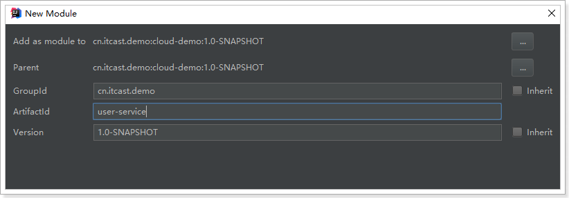


### 5.2.2.依赖

```xml
<?xml version="1.0" encoding="UTF-8"?>
<project xmlns="http://maven.apache.org/POM/4.0.0"
         xmlns:xsi="http://www.w3.org/2001/XMLSchema-instance"
         xsi:schemaLocation="http://maven.apache.org/POM/4.0.0 http://maven.apache.org/xsd/maven-4.0.0.xsd">
    <parent>
        <artifactId>cloud-demo</artifactId>
        <groupId>cn.itcast.demo</groupId>
        <version>1.0-SNAPSHOT</version>
    </parent>
    <modelVersion>4.0.0</modelVersion>

    <groupId>cn.itcast.demo</groupId>
    <artifactId>user-service</artifactId>
    <version>1.0-SNAPSHOT</version>

    <dependencies>
        <dependency>
            <groupId>org.springframework.boot</groupId>
            <artifactId>spring-boot-starter-web</artifactId>
        </dependency>
        <dependency>
            <groupId>org.mybatis.spring.boot</groupId>
            <artifactId>mybatis-spring-boot-starter</artifactId>
        </dependency>
        <dependency>
            <groupId>mysql</groupId>
            <artifactId>mysql-connector-java</artifactId>
        </dependency>
        <dependency>
            <groupId>tk.mybatis</groupId>
            <artifactId>mapper-spring-boot-starter</artifactId>
        </dependency>
    </dependencies>
</project>
```


项目结构：

 


### 5.1.2.编写代码

添加一个对外查询的接口：

```java
@RestController
@RequestMapping("user")
public class UserController {

    @Autowired
    private UserService userService;

    @GetMapping("/{id}")
    public User queryById(@PathVariable("id") Long id) {
        return this.userService.queryById(id);
    }
}
```

Service：

```java
@Service
public class UserService {

    @Autowired
    private UserMapper userMapper;

    public User queryById(Long id) {
        return this.userMapper.selectByPrimaryKey(id);
    }
}
```

mapper:

```java
public interface UserMapper extends tk.mybatis.mapper.common.Mapper<User>{
}
```

实体类：

```java
@Table(name = "tb_user")
public class User implements Serializable {

    private static final long serialVersionUID = 1L;

    @Id
    @GeneratedValue(strategy = GenerationType.IDENTITY)
    private Long id;

    // 用户名
    private String userName;

    // 密码
    private String password;

    // 姓名
    private String name;

    // 年龄
    private Integer age;

    // 性别，1男性，2女性
    private Integer sex;

    // 出生日期
    private Date birthday;

    // 创建时间
    private Date created;

    // 更新时间
    private Date updated;

    // 备注
    private String note;

   // 。。。省略getters和setters
}

```

属性文件,这里我们采用了yaml语法，而不是properties：

```yaml
server:
  port: 8081
spring:
  datasource:
    url: jdbc:mysql://localhost:3306/mydb01
    username: root
    password: 123
mybatis:
  type-aliases-package: cn.itcast.user.pojo
```

启动类：

```java
@SpringBootApplication
public class UserApplication {
    public static void main(String[] args) {
        SpringApplication.run(UserApplication.class, args);
    }
}
```

项目结构：

 

### 5.1.3.启动并测试：

启动项目，访问接口：http://localhost:8081/user/7

 


## 5.2.服务调用者

### 5.2.1.创建工程

与上面类似，这里不再赘述，需要注意的是，我们调用user-service的功能，因此不需要mybatis相关依赖了。


pom：

```xml
<?xml version="1.0" encoding="UTF-8"?>
<project xmlns="http://maven.apache.org/POM/4.0.0"
         xmlns:xsi="http://www.w3.org/2001/XMLSchema-instance"
         xsi:schemaLocation="http://maven.apache.org/POM/4.0.0 http://maven.apache.org/xsd/maven-4.0.0.xsd">
    <parent>
        <artifactId>cloud-demo</artifactId>
        <groupId>cn.itcast.demo</groupId>
        <version>1.0-SNAPSHOT</version>
    </parent>
    <modelVersion>4.0.0</modelVersion>

    <groupId>cn.itcast.demo</groupId>
    <artifactId>consumer-demo</artifactId>
    <version>1.0-SNAPSHOT</version>

    <dependencies>
        <dependency>
            <groupId>org.springframework.boot</groupId>
            <artifactId>spring-boot-starter-web</artifactId>
        </dependency>
        <!-- 添加OkHttp支持 -->
        <dependency>
            <groupId>com.squareup.okhttp3</groupId>
            <artifactId>okhttp</artifactId>
            <version>3.9.0</version>
        </dependency>
    </dependencies>
</project>
```


结构：

 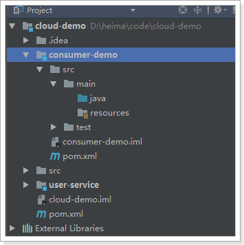


### 5.2.2.编写代码

首先在启动类中注册`RestTemplate`：

```java
@SpringBootApplication
public class ConsumerDemoApplication {

    @Bean
    public RestTemplate restTemplate() {
        // 这次我们使用了OkHttp客户端,只需要注入工厂即可
        return new RestTemplate(new OkHttp3ClientHttpRequestFactory());
    }

    public static void main(String[] args) {
        SpringApplication.run(ConsumerDemoApplication.class, args);
    }
}
```


然后编写UserDao，注意，这里不是调用mapper查数据库，而是通过RestTemplate远程查询user-service-demo中的接口：

```java
@Component
public class UserDao {

    @Autowired
    private RestTemplate restTemplate;

    public User queryUserById(Long id){
        String url = "http://localhost:8081/user/" + id;
        return this.restTemplate.getForObject(url, User.class);
    }
}
```


然后编写user-service，循环查询UserDAO信息：

```java
@Service
public class UserService {

    @Autowired
    private UserDao userDao;

    public List<User> querUserByIds(List<Long> ids){
        List<User> users = new ArrayList<>();
        for (Long id : ids) {
            User user = this.userDao.queryUserById(id);
            users.add(user);
        }
        return users;
    }
}
```

编写controller：

```java
@RestController
@RequestMapping("consume")
public class ConsumerController {

    @Autowired
    private UserService userService;

    @GetMapping
    public List<User> consume(@RequestParam("ids") List<Long> ids) {
        return this.userService.queryUserByIds(ids);
    }
}
```


### 5.2.3.启动测试：

因为我们没有配置端口，那么默认就是8080，我们访问：http://localhost:8080/consume?ids=6,7,8

 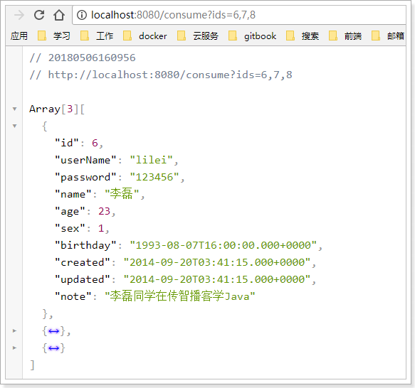

一个简单的远程服务调用案例就实现了。

## 5.3.有没有问题？

简单回顾一下，刚才我们写了什么：

- use-service-demo：一个提供根据id查询用户的微服务
- consumer-demo：一个服务调用者，通过RestTemplate远程调用user-service-demo

流程如下：

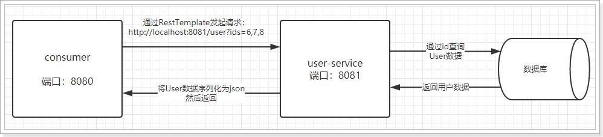

存在什么问题？

- 在consumer中，我们把url地址硬编码到了代码中，不方便后期维护
- consumer需要记忆user-service的地址，如果出现变更，可能得不到通知，地址将失效
- consumer不清楚user-service的状态，服务宕机也不知道
- user-service只有1台服务，不具备高可用性
- 即便user-service形成集群，consumer还需自己实现负载均衡

其实上面说的问题，概括一下就是分布式服务必然要面临的问题：

- 服务管理
  - 如何自动注册和发现
  - 如何实现状态监管
  - 如何实现动态路由
- 服务如何实现负载均衡
- 服务如何解决容灾问题
- 服务如何实现统一配置

以上的问题，我们都将在SpringCloud中得到答案。


# 6.Eureka注册中心

## 6.1.认识Eureka

首先我们来解决第一问题，服务的管理。

> 问题分析

在刚才的案例中，user-service对外提供服务，需要对外暴露自己的地址。而consumer（调用者）需要记录服务提供者的地址。将来地址出现变更，还需要及时更新。这在服务较少的时候并不觉得有什么，但是在现在日益复杂的互联网环境，一个项目肯定会拆分出十几，甚至数十个微服务。此时如果还人为管理地址，不仅开发困难，将来测试、发布上线都会非常麻烦，这与DevOps的思想是背道而驰的。

> 网约车

这就好比是 网约车出现以前，人们出门叫车只能叫出租车。一些私家车想做出租却没有资格，被称为黑车。而很多人想要约车，但是无奈出租车太少，不方便。私家车很多却不敢拦，而且满大街的车，谁知道哪个才是愿意载人的。一个想要，一个愿意给，就是缺少引子，缺乏管理啊。

此时滴滴这样的网约车平台出现了，所有想载客的私家车全部到滴滴注册，记录你的车型（服务类型），身份信息（联系方式）。这样提供服务的私家车，在滴滴那里都能找到，一目了然。

此时要叫车的人，只需要打开APP，输入你的目的地，选择车型（服务类型），滴滴自动安排一个符合需求的车到你面前，为你服务，完美！

> Eureka做什么？

Eureka就好比是滴滴，负责管理、记录服务提供者的信息。服务调用者无需自己寻找服务，而是把自己的需求告诉Eureka，然后Eureka会把符合你需求的服务告诉你。

同时，服务提供方与Eureka之间通过`“心跳”`机制进行监控，当某个服务提供方出现问题，Eureka自然会把它从服务列表中剔除。

这就实现了服务的自动注册、发现、状态监控。

## 6.2.原理图

> 基本架构：

 


- Eureka：就是服务注册中心（可以是一个集群），对外暴露自己的地址
- 提供者：启动后向Eureka注册自己信息（地址，提供什么服务）
- 消费者：向Eureka订阅服务，Eureka会将对应服务的所有提供者地址列表发送给消费者，并且定期更新
- 心跳(续约)：提供者定期通过http方式向Eureka刷新自己的状态


## 6.3.入门案例

### 6.3.1.编写EurekaServer

接下来我们创建一个项目，启动一个EurekaServer：

 

 


编写启动类：

```java
@SpringBootApplication
@EnableEurekaServer // 声明这个应用是一个EurekaServer
public class EurekaDemoApplication {

	public static void main(String[] args) {
		SpringApplication.run(EurekaDemoApplication.class, args);
	}
}
```

编写配置：

```yaml
server:
  port: 10086 # 端口
spring:
  application:
    name: eureka-server # 应用名称，会在Eureka中显示
eureka:
  client:
    register-with-eureka: false # 是否注册自己的信息到EurekaServer，默认是true
    fetch-registry: false # 是否拉取其它服务的信息，默认是true
    service-url: # EurekaServer的地址，现在是自己的地址，如果是集群，需要加上其它Server的地址。
      defaultZone: http://127.0.0.1:${server.port}/eureka

```

启动服务，并访问：http://127.0.0.1:10086/eureka


### 6.3.2.将user-service注册到Eureka

注册服务，就是在服务上添加Eureka的客户端依赖，客户端代码会自动把服务注册到EurekaServer中。


> 我们在user-service-demo中添加Eureka客户端依赖：

```xml
<!-- Eureka客户端 -->
<dependency>
    <groupId>org.springframework.cloud</groupId>
    <artifactId>spring-cloud-starter-netflix-eureka-client</artifactId>
</dependency>
```


> 在启动类上开启Eureka客户端功能

通过添加`@EnableDiscoveryClient`来开启Eureka客户端功能

```java
@SpringBootApplication
@EnableDiscoveryClient // 开启EurekaClient功能
public class UserServiceDemoApplication {
	public static void main(String[] args) {
		SpringApplication.run(UserServiceDemoApplication.class, args);
	}
}
```


> 编写配置

```yaml
server:
  port: 8081
spring:
  datasource:
    url: jdbc:mysql://localhost:3306/mydb01
    username: root
    password: 123
  application:
    name: user-service # 应用名称
mybatis:
  type-aliases-package: com.leyou.userservice.pojo
eureka:
  client:
    service-url: # EurekaServer地址
      defaultZone: http://127.0.0.1:10086/eureka
  instance:
    prefer-ip-address: true # 当调用getHostname获取实例的hostname时，返回ip而不是host名称
    ip-address: 127.0.0.1 # 指定自己的ip信息，不指定的话会自己寻找
```

注意：

- 这里我们添加了spring.application.name属性来指定应用名称，将来会作为应用的id使用。
- 不用指定register-with-eureka和fetch-registry，因为默认是true


> 重启项目，访问[Eureka监控页面](http://127.0.0.1:10086/eureka)查看


我们发现user-service服务已经注册成功了


### 6.3.3.消费者从Eureka获取服务

接下来我们修改consumer-demo，尝试从EurekaServer获取服务。

方法与消费者类似，只需要在项目中添加EurekaClient依赖，就可以通过服务名称来获取信息了！

1）添加依赖：

```xml
<!-- Eureka客户端 -->
<dependency>
    <groupId>org.springframework.cloud</groupId>
    <artifactId>spring-cloud-starter-netflix-eureka-client</artifactId>
</dependency>
```


2）在启动类开启Eureka客户端

```java
@SpringBootApplication
@EnableDiscoveryClient // 开启Eureka客户端
public class UserConsumerDemoApplication {
    @Bean
    public RestTemplate restTemplate() {
        return new RestTemplate(new OkHttp3ClientHttpRequestFactory());
    }
    public static void main(String[] args) {
        SpringApplication.run(UserConsumerDemoApplication.class, args);
    }
}

```

3）修改配置：

```yaml
server:
  port: 8080
spring:
  application:
    name: consumer # 应用名称
eureka:
  client:
    service-url: # EurekaServer地址
      defaultZone: http://127.0.0.1:10086/eureka
  instance:
    prefer-ip-address: true # 当其它服务获取地址时提供ip而不是hostname
    ip-address: 127.0.0.1 # 指定自己的ip信息，不指定的话会自己寻找
```

4）修改代码，用DiscoveryClient类的方法，根据服务名称，获取服务实例：

```java
@Service
public class UserService {

    @Autowired
    private RestTemplate restTemplate;

    @Autowired
    private DiscoveryClient discoveryClient;// Eureka客户端，可以获取到服务实例信息

    public List<User> queryUserByIds(List<Long> ids) {
        List<User> users = new ArrayList<>();
        // String baseUrl = "http://localhost:8081/user/";
        // 根据服务名称，获取服务实例
        List<ServiceInstance> instances = discoveryClient.getInstances("user-service");
        // 因为只有一个UserService,因此我们直接get(0)获取
        ServiceInstance instance = instances.get(0);
        // 获取ip和端口信息
        String baseUrl = "http://"+instance.getHost() + ":" + instance.getPort()+"/user/";
        ids.forEach(id -> {
            // 我们测试多次查询，
            users.add(this.restTemplate.getForObject(baseUrl + id, User.class));
            // 每次间隔500毫秒
            try {
                Thread.sleep(500);
            } catch (InterruptedException e) {
                e.printStackTrace();
            }
        });
        return users;
    }
}
```


5）Debug跟踪运行：


生成的URL：


访问结果：

 


## 6.4.Eureka详解

接下来我们详细讲解Eureka的原理及配置。

### 6.4.1.基础架构

Eureka架构中的三个核心角色：

- 服务注册中心

  Eureka的服务端应用，提供服务注册和发现功能，就是刚刚我们建立的eureka-demo

- 服务提供者

  提供服务的应用，可以是SpringBoot应用，也可以是其它任意技术实现，只要对外提供的是Rest风格服务即可。本例中就是我们实现的user-service

- 服务消费者

  消费应用从注册中心获取服务列表，从而得知每个服务方的信息，知道去哪里调用服务方。本例中就是我们实现的consumer-demo

### 6.4.2.高可用的Eureka Server

Eureka Server即服务的注册中心，在刚才的案例中，我们只有一个EurekaServer，事实上EurekaServer也可以是一个集群，形成高可用的Eureka中心。

> 服务同步

多个Eureka Server之间也会互相注册为服务，当服务提供者注册到Eureka Server集群中的某个节点时，该节点会把服务的信息同步给集群中的每个节点，从而实现**数据同步**。因此，无论客户端访问到Eureka Server集群中的任意一个节点，都可以获取到完整的服务列表信息。


> 动手搭建高可用的EurekaServer

我们假设要搭建两条EurekaServer的集群，端口分别为：10086和10087

1）我们修改原来的EurekaServer配置：

```yaml
server:
  port: 10086 # 端口
spring:
  application:
    name: eureka-server # 应用名称，会在Eureka中显示
eureka:
  client:
    service-url: # 配置其他Eureka服务的地址，而不是自己，比如10087
      defaultZone: http://127.0.0.1:10087/eureka

```

所谓的高可用注册中心，其实就是把EurekaServer自己也作为一个服务进行注册，这样多个EurekaServer之间就能互相发现对方，从而形成集群。因此我们做了以下修改：

- 删除了register-with-eureka=false和fetch-registry=false两个配置。因为默认值是true，这样就会吧自己注册到注册中心了。
- 把service-url的值改成了另外一台EurekaServer的地址，而不是自己

2）另外一台配置恰好相反：

```yaml
server:
  port: 10087 # 端口
spring:
  application:
    name: eureka-server # 应用名称，会在Eureka中显示
eureka:
  client:
    service-url: # 配置其他Eureka服务的地址，而不是自己，比如10087
      defaultZone: http://127.0.0.1:10086/eureka

```

注意：idea中一个应用不能启动两次，我们需要重新配置一个启动器：

 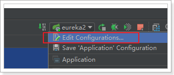

 


然后启动即可。

3）启动测试：


4）客户端注册服务到集群

因为EurekaServer不止一个，因此注册服务的时候，service-url参数需要变化：

```yaml
eureka:
  client:
    service-url: # EurekaServer地址,多个地址以','隔开
      defaultZone: http://127.0.0.1:10086/eureka,http://127.0.0.1:10087/eureka
```


### 6.4.3.服务提供者

服务提供者要向EurekaServer注册服务，并且完成服务续约等工作。

> 服务注册

服务提供者在启动时，会检测配置属性中的：`eureka.client.register-with-erueka=true`参数是否正确，事实上默认就是true。如果值确实为true，则会向EurekaServer发起一个Rest请求，并携带自己的元数据信息，Eureka Server会把这些信息保存到一个双层Map结构中。第一层Map的Key就是服务名称，第二层Map的key是服务的实例id。

> 服务续约

在注册服务完成以后，服务提供者会维持一个心跳（定时向EurekaServer发起Rest请求），告诉EurekaServer：“我还活着”。这个我们称为服务的续约（renew）；

有两个重要参数可以修改服务续约的行为：

```yaml
eureka:
  instance:
    lease-expiration-duration-in-seconds: 90
    lease-renewal-interval-in-seconds: 30
```

- lease-renewal-interval-in-seconds：服务续约(renew)的间隔，默认为30秒
- lease-expiration-duration-in-seconds：服务失效时间，默认值90秒

也就是说，默认情况下每个30秒服务会向注册中心发送一次心跳，证明自己还活着。如果超过90秒没有发送心跳，EurekaServer就会认为该服务宕机，会从服务列表中移除，这两个值在生产环境不要修改，默认即可。

但是在开发时，这个值有点太长了，经常我们关掉一个服务，会发现Eureka依然认为服务在活着。所以我们在开发阶段可以适当调小。

```yaml
eureka:
  instance:
    lease-expiration-duration-in-seconds: 10 # 10秒即过期
    lease-renewal-interval-in-seconds: 5 # 5秒一次心跳
```


> 实例id

先来看一下服务状态信息：

在Eureka监控页面，查看服务注册信息：


在status一列中，显示以下信息：

- UP(1)：代表现在是启动了1个示例，没有集群
- DESKTOP-2MVEC12:user-service:8081：是示例的名称（instance-id），
  - 默认格式是：`${hostname} + ${spring.application.name} + ${server.port}`
  - instance-id是区分同一服务的不同实例的唯一标准，因此不能重复。

我们可以通过instance-id属性来修改它的构成：

```yaml
eureka:
  instance:
    instance-id: ${spring.application.name}:${server.port}
```

重启服务再试试看：


### 6.4.4.服务消费者

> 获取服务列表

当服务消费者启动是，会检测`eureka.client.fetch-registry=true`参数的值，如果为true，则会从Eureka Server服务的列表只读备份，然后缓存在本地。并且`每隔30秒`会重新获取并更新数据。我们可以通过下面的参数来修改：

```yaml
eureka:
  client:
    registry-fetch-interval-seconds: 5
```

生产环境中，我们不需要修改这个值。

但是为了开发环境下，能够快速得到服务的最新状态，我们可以将其设置小一点。


### 6.4.5.失效剔除和自我保护

> 失效剔除

有些时候，我们的服务提供方并不一定会正常下线，可能因为内存溢出、网络故障等原因导致服务无法正常工作。Eureka Server需要将这样的服务剔除出服务列表。因此它会开启一个定时任务，每隔60秒对所有失效的服务（超过90秒未响应）进行剔除。

可以通过`eureka.server.eviction-interval-timer-in-ms`参数对其进行修改，单位是毫秒，生成环境不要修改。

这个会对我们开发带来极大的不变，你对服务重启，隔了60秒Eureka才反应过来。开发阶段可以适当调整，比如10S

> 自我保护

我们关停一个服务，就会在Eureka面板看到一条警告：


这是触发了Eureka的自我保护机制。当一个服务未按时进行心跳续约时，Eureka会统计最近15分钟心跳失败的服务实例的比例是否超过了85%。在生产环境下，因为网络延迟等原因，心跳失败实例的比例很有可能超标，但是此时就把服务剔除列表并不妥当，因为服务可能没有宕机。Eureka就会把当前实例的注册信息保护起来，不予剔除。生产环境下这很有效，保证了大多数服务依然可用。

但是这给我们的开发带来了麻烦， 因此开发阶段我们都会关闭自我保护模式：

```yaml
eureka:
  server:
    enable-self-preservation: false # 关闭自我保护模式（缺省为打开）
    eviction-interval-timer-in-ms: 1000 # 扫描失效服务的间隔时间（缺省为60*1000ms）
```


# 7.负载均衡Robbin

在刚才的案例中，我们启动了一个user-service，然后通过DiscoveryClient来获取服务实例信息，然后获取ip和端口来访问。

但是实际环境中，我们往往会开启很多个user-service的集群。此时我们获取的服务列表中就会有多个，到底该访问哪一个呢？

一般这种情况下我们就需要编写负载均衡算法，在多个实例列表中进行选择。

不过Eureka中已经帮我们集成了负载均衡组件：Ribbon，简单修改代码即可使用。

什么是Ribbon：


接下来，我们就来使用Ribbon实现负载均衡。


## 7.1.启动两个服务实例

首先我们启动两个user-service实例，一个8081，一个8082。

 

Eureka监控面板：


## 7.2.开启负载均衡

因为Eureka中已经集成了Ribbon，所以我们无需引入新的依赖。直接修改代码：

在RestTemplate的配置方法上添加`@LoadBalanced`注解：

```java
@Bean
@LoadBalanced
public RestTemplate restTemplate() {
    return new RestTemplate(new OkHttp3ClientHttpRequestFactory());
}
```


修改调用方式，不再手动获取ip和端口，而是直接通过服务名称调用：

```java
@Service
public class UserService {

    @Autowired
    private RestTemplate restTemplate;

    @Autowired
    private DiscoveryClient discoveryClient;

    public List<User> queryUserByIds(List<Long> ids) {
        List<User> users = new ArrayList<>();
        // 地址直接写服务名称即可
        String baseUrl = "http://user-service/user/";
        ids.forEach(id -> {
            // 我们测试多次查询，
            users.add(this.restTemplate.getForObject(baseUrl + id, User.class));
            // 每次间隔500毫秒
            try {
                Thread.sleep(500);
            } catch (InterruptedException e) {
                e.printStackTrace();
            }
        });
        return users;
    }
}
```

访问页面，查看结果：

 

完美！

## 7.3.源码跟踪

为什么我们只输入了service名称就可以访问了呢？之前还要获取ip和端口。

显然有人帮我们根据service名称，获取到了服务实例的ip和端口。它就是`LoadBalancerInterceptor`

我们进行源码跟踪：


继续跟入execute方法：发现获取了8082端口的服务


再跟下一次，发现获取的是8081：

 


## 7.4.负载均衡策略

Ribbon默认的负载均衡策略是简单的轮询，我们可以测试一下：

编写测试类，在刚才的源码中我们看到拦截中是使用RibbonLoadBalanceClient来进行负载均衡的，其中有一个choose方法，是这样介绍的：

 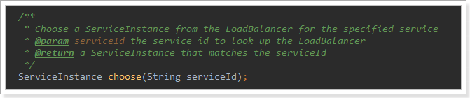

现在这个就是负载均衡获取实例的方法。

我们对注入这个类的对象，然后对其测试：

```java
@RunWith(SpringRunner.class)
@SpringBootTest(classes = UserConsumerDemoApplication.class)
public class LoadBalanceTest {

    @Autowired
    RibbonLoadBalancerClient client;

    @Test
    public void test(){
        for (int i = 0; i < 100; i++) {
            ServiceInstance instance = this.client.choose("user-service");
            System.out.println(instance.getHost() + ":" + instance.getPort());
        }
    }
}

```

结果：

 

符合了我们的预期推测，确实是轮询方式。


我们是否可以修改负载均衡的策略呢？

继续跟踪源码，发现这么一段代码：

 

我们看看这个rule是谁：

 

这里的rule默认值是一个`RoundRobinRule`，看类的介绍：

 

这不就是轮询的意思嘛。

我们注意到，这个类其实是实现了接口IRule的，查看一下：

 

定义负载均衡的规则接口。

它有以下实现：

 

SpringBoot也帮我们提供了修改负载均衡规则的配置入口：

```yaml
user-service:
  ribbon:
    NFLoadBalancerRuleClassName: com.netflix.loadbalancer.RandomRule
```

格式是：`{服务名称}.ribbon.NFLoadBalancerRuleClassName`，值就是IRule的实现类。


再次测试，发现结果变成了随机：

 


## 7.5.重试机制

Eureka的服务治理强调了CAP原则中的AP，即可用性和可靠性。它与Zookeeper这一类强调CP（一致性，可靠性）的服务治理框架最大的区别在于：Eureka为了实现更高的服务可用性，牺牲了一定的一致性，极端情况下它宁愿接收故障实例也不愿丢掉健康实例，正如我们上面所说的自我保护机制。

但是，此时如果我们调用了这些不正常的服务，调用就会失败，从而导致其它服务不能正常工作！这显然不是我们愿意看到的。

我们现在关闭一个user-service实例：

 

因为服务剔除的延迟，consumer并不会立即得到最新的服务列表，此时再次访问你会得到错误提示：


但是此时，8081服务其实是正常的。

因此Spring Cloud 整合了Spring Retry 来增强RestTemplate的重试能力，当一次服务调用失败后，不会立即抛出一次，而是再次重试另一个服务。

只需要简单配置即可实现Ribbon的重试：

```yaml
spring:
  cloud:
    loadbalancer:
      retry:
        enabled: true # 开启Spring Cloud的重试功能
user-service:
  ribbon:
    ConnectTimeout: 250 # Ribbon的连接超时时间
    ReadTimeout: 1000 # Ribbon的数据读取超时时间
    OkToRetryOnAllOperations: true # 是否对所有操作都进行重试
    MaxAutoRetriesNextServer: 1 # 切换实例的重试次数
    MaxAutoRetries: 1 # 对当前实例的重试次数
```

根据如上配置，当访问到某个服务超时后，它会再次尝试访问下一个服务实例，如果不行就再换一个实例，如果不行，则返回失败。切换次数取决于`MaxAutoRetriesNextServer`参数的值

引入spring-retry依赖

```xml
<dependency>
    <groupId>org.springframework.retry</groupId>
    <artifactId>spring-retry</artifactId>
</dependency>
```


我们重启user-consumer-demo，测试，发现即使user-service2宕机，也能通过另一台服务实例获取到结果！

 

# 0.学习目标

- 会配置Hystix熔断
- 会使用Feign进行远程调用
- 能独立搭建Zuul网关
- 能编写Zuul的拦截器


# 1.Hystrix

## 1.1.简介

Hystix，即熔断器。

主页：https://github.com/Netflix/Hystrix/


Hystix是Netflix开源的一个延迟和容错库，用于隔离访问远程服务、第三方库，防止出现级联失败。


## 1.2.熔断器的工作机制：


正常工作的情况下，客户端请求调用服务API接口：


当有服务出现异常时，直接进行失败回滚，服务降级处理：


当服务繁忙时，如果服务出现异常，不是粗暴的直接报错，而是返回一个友好的提示，虽然拒绝了用户的访问，但是会返回一个结果。

这就好比去买鱼，平常超市买鱼会额外赠送杀鱼的服务。等到逢年过节，超时繁忙时，可能就不提供杀鱼服务了，这就是服务的降级。

系统特别繁忙时，一些次要服务暂时中断，优先保证主要服务的畅通，一切资源优先让给主要服务来使用，在双十一、618时，京东天猫都会采用这样的策略。


## 1.3.动手实践

### 1.3.1.引入依赖

首先在user-consumer中引入Hystix依赖：

```xml
<dependency>
    <groupId>org.springframework.cloud</groupId>
    <artifactId>spring-cloud-starter-netflix-hystrix</artifactId>
</dependency>
```

### 1.3.2.开启熔断

```java
@SpringBootApplication
@EnableDiscoveryClient
@EnableHystrix
public class ConsumerDemoApplication {

    @Bean
    @LoadBalanced
    public RestTemplate restTemplate() {
        // 这次我们使用了OkHttp客户端,只需要注入工厂即可
        return new RestTemplate(new OkHttp3ClientHttpRequestFactory());
    }

    public static void main(String[] args) {
        SpringApplication.run(ConsumerDemoApplication.class, args);
    }
}
```


### 1.3.2.改造消费者

我们改造user-consumer，添加一个用来访问的user服务的DAO，并且声明一个失败时的回滚处理函数：

```java
@Component
public class UserDao {

    @Autowired
    private RestTemplate restTemplate;

    private static final Logger logger = LoggerFactory.getLogger(UserDao.class);

    @HystrixCommand(fallbackMethod = "queryUserByIdFallback")
    public User queryUserById(Long id){
        long begin = System.currentTimeMillis();
        String url = "http://user-service/user/" + id;
        User user = this.restTemplate.getForObject(url, User.class);
        long end = System.currentTimeMillis();
        // 记录访问用时：
        logger.info("访问用时：{}", end - begin);
        return user;
    }

    public User queryUserByIdFallback(Long id){
        User user = new User();
        user.setId(id);
        user.setName("用户信息查询出现异常！");
        return user;
    }
}
```

- `@HystrixCommand(fallbackMethod="queryUserByIdFallback")`：声明一个失败回滚处理函数queryUserByIdFallback，当queryUserById执行超时（默认是1000毫秒），就会执行fallback函数，返回错误提示。
- 为了方便查看熔断的触发时机，我们记录请求访问时间。

在原来的业务逻辑中调用这个DAO：

```java
@Service
public class UserService {

    @Autowired
    private UserDao userDao;

    public List<User> queryUserByIds(List<Long> ids) {
        List<User> users = new ArrayList<>();
        ids.forEach(id -> {
            // 我们测试多次查询，
            users.add(this.userDao.queryUserById(id));
        });
        return users;
    }
}
```

### 1.3.3.改造服务提供者

改造服务提供者，随机休眠一段时间，以触发熔断：

```java
@Service
public class UserService {

    @Autowired
    private UserMapper userMapper;

    public User queryById(Long id) throws InterruptedException {
        // 为了演示超时现象，我们在这里然线程休眠,时间随机 0~2000毫秒
        Thread.sleep(new Random().nextInt(2000));
        return this.userMapper.selectByPrimaryKey(id);
    }
}

```

### 1.3.4.启动测试

然后运行并查看日志：

id为9、10、11的访问时间分别是：

 

id为12的访问时间：

 

因此，只有12是正常访问，其它都会触发熔断，我们来查看结果：


### 1.3.5.优化

虽然熔断实现了，但是我们的重试机制似乎没有生效，是这样吗？

其实这里是因为我们的Ribbon超时时间设置的是1000ms:

​	

而Hystix的超时时间默认也是1000ms，因此重试机制没有被触发，而是先触发了熔断。

所以，Ribbon的超时时间一定要小于Hystix的超时时间。

我们可以通过`hystrix.command.default.execution.isolation.thread.timeoutInMilliseconds`来设置Hystrix超时时间。

```yaml
hystrix:
  command:
  	default:
        execution:
          isolation:
            thread:
              timeoutInMillisecond: 6000 # 设置hystrix的超时时间为6000ms
```


# 2.Feign

在前面的学习中，我们使用了Ribbon的负载均衡功能，大大简化了远程调用时的代码：

```java
String baseUrl = "http://user-service/user/";
User user = this.restTemplate.getForObject(baseUrl + id, User.class)
```

如果就学到这里，你可能以后需要编写类似的大量重复代码，格式基本相同，无非参数不一样。有没有更优雅的方式，来对这些代码再次优化呢？

这就是我们接下来要学的Feign的功能了。

## 2.1.简介

有道词典的英文解释：

​	

为什么叫伪装？

Feign可以把Rest的请求进行隐藏，伪装成类似SpringMVC的Controller一样。你不用再自己拼接url，拼接参数等等操作，一切都交给Feign去做。


项目主页：https://github.com/OpenFeign/feign


## 2.2.快速入门

### 2.2.1.导入依赖

```xml
<dependency>
    <groupId>org.springframework.cloud</groupId>
    <artifactId>spring-cloud-starter-openfeign</artifactId>
</dependency>
```

### 2.2.2.Feign的客户端

```java
@FeignClient("user-service")
public interface UserFeignClient {

    @GetMapping("/user/{id}")
    User queryUserById(@PathVariable("id") Long id);
}
```

- 首先这是一个接口，Feign会通过动态代理，帮我们生成实现类。这点跟mybatis的mapper很像
- `@FeignClient`，声明这是一个Feign客户端，类似`@Mapper`注解。同时通过`value`属性指定服务名称
- 接口中的定义方法，完全采用SpringMVC的注解，Feign会根据注解帮我们生成URL，并访问获取结果

改造原来的调用逻辑，不再调用UserDao：

```java
@Service
public class UserService {

    @Autowired
    private UserFeignClient userFeignClient;

    public List<User> queryUserByIds(List<Long> ids) {
        List<User> users = new ArrayList<>();
        ids.forEach(id -> {
            // 我们测试多次查询，
            users.add(this.userFeignClient.queryUserById(id));
        });
        return users;
    }
}
```

### 2.2.3.开启Feign功能

我们在启动类上，添加注解，开启Feign功能

```java
@SpringBootApplication
@EnableDiscoveryClient
@EnableHystrix
@EnableFeignClients // 开启Feign功能
public class UserConsumerDemoApplication {
    public static void main(String[] args) {
        SpringApplication.run(UserConsumerDemoApplication.class, args);
    }
}
```

- 你会发现RestTemplate的注册被我删除了。Feign中已经自动集成了Ribbon负载均衡，因此我们不需要自己定义RestTemplate了

### 2.2.4.启动测试：

访问接口：

 

正常获取到了结果。

## 2.3.负载均衡

Feign中本身已经集成了Ribbon依赖和自动配置：

​	

因此我们不需要额外引入依赖，也不需要再注册`RestTemplate`对象。

另外，我们可以像上节课中讲的那样去配置Ribbon，可以通过`ribbon.xx`来进行全局配置。也可以通过`服务名.ribbon.xx`来对指定服务配置：

```yaml
user-service:
  ribbon:
    ConnectTimeout: 250 # 连接超时时间(ms)
    ReadTimeout: 1000 # 通信超时时间(ms)
    OkToRetryOnAllOperations: true # 是否对所有操作重试
    MaxAutoRetriesNextServer: 1 # 同一服务不同实例的重试次数
    MaxAutoRetries: 1 # 同一实例的重试次数
```

全局的负载均衡配置：

```yaml
ribbon:
  ConnectTimeout: 250 # Ribbon的连接超时时间
  ReadTimeout: 1000 # Ribbon的数据读取超时时间
  OkToRetryOnAllOperations: true # 是否对所有操作都进行重试
  MaxAutoRetriesNextServer: 1 # 切换实例的重试次数
  MaxAutoRetries: 1 # 对当前实例的重试次数
```


## 2.4.Hystix支持

Feign默认也有对Hystix的集成：

​	

只不过，默认情况下是关闭的。我们需要通过下面的参数来开启：

```yaml
feign:
  hystrix:
    enabled: true # 开启Feign的熔断功能
```

但是，Feign中的Fallback配置不像Ribbon中那样简单了。

1）首先，我们要定义一个类，实现刚才编写的UserFeignClient，作为fallback的处理类

```java
@Component
public class UserFeignClientFallback implements UserFeignClient {
    @Override
    public User queryUserById(Long id) {
        User user = new User();
        user.setId(id);
        user.setName("用户查询出现异常！");
        return user;
    }
}

```

2）然后在UserFeignClient中，指定刚才编写的实现类

```java
@FeignClient(value = "user-service", fallback = UserFeignClientFallback.class)
public interface UserFeignClient {

    @GetMapping("/user/{id}")
    User queryUserById(@PathVariable("id") Long id);
}

```

3）重启测试：

我们关闭user-service服务，然后在页面访问：


## 2.5.请求压缩(了解)

Spring Cloud Feign 支持对请求和响应进行GZIP压缩，以减少通信过程中的性能损耗。通过下面的参数即可开启请求与响应的压缩功能：

```yaml
feign:
  compression:
    request:
      enabled: true # 开启请求压缩
    response:
      enabled: true # 开启响应压缩
```

同时，我们也可以对请求的数据类型，以及触发压缩的大小下限进行设置：

```yaml
feign:
  compression:
    request:
      enabled: true # 开启请求压缩
      mime-types: text/html,application/xml,application/json # 设置压缩的数据类型
      min-request-size: 2048 # 设置触发压缩的大小下限
```

注：上面的数据类型、压缩大小下限均为默认值。


## 2.6.日志级别(了解)

前面讲过，通过`logging.level.xx=debug`来设置日志级别。然而这个对Fegin客户端而言不会产生效果。因为`@FeignClient`注解修改的客户端在被代理时，都会创建一个新的Fegin.Logger实例。我们需要额外指定这个日志的级别才可以。

1）设置com.leyou包下的日志级别都为debug

```yaml
logging:
  level:
    com.leyou: debug
```

2）编写配置类，定义日志级别

```java
@Configuration
public class FeignConfig {
    @Bean
    Logger.Level feignLoggerLevel(){
        return Logger.Level.FULL;
    }
}
```

这里指定的Level级别是FULL，Feign支持4种级别：

​	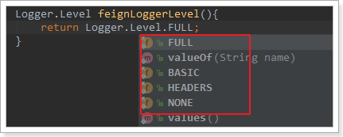

- NONE：不记录任何日志信息，这是默认值。
- BASIC：仅记录请求的方法，URL以及响应状态码和执行时间
- HEADERS：在BASIC的基础上，额外记录了请求和响应的头信息
- FULL：记录所有请求和响应的明细，包括头信息、请求体、元数据。


3）在FeignClient中指定配置类：

```java
@FeignClient(value = "user-service", fallback = UserFeignClientFallback.class, configuration = FeignConfig.class)
public interface UserFeignClient {
    @GetMapping("/user/{id}")
    User queryUserById(@PathVariable("id") Long id);
}
```

4）重启项目，即可看到每次访问的日志：


# 3.Zuul网关

通过前面的学习，使用Spring Cloud实现微服务的架构基本成型，大致是这样的：


我们使用Spring Cloud Netflix中的Eureka实现了服务注册中心以及服务注册与发现；而服务间通过Ribbon或Feign实现服务的消费以及均衡负载；通过Spring Cloud Config实现了应用多环境的外部化配置以及版本管理。为了使得服务集群更为健壮，使用Hystrix的融断机制来避免在微服务架构中个别服务出现异常时引起的故障蔓延。

 

在该架构中，我们的服务集群包含：内部服务Service A和Service B，他们都会注册与订阅服务至Eureka Server，而Open Service是一个对外的服务，通过均衡负载公开至服务调用方。我们把焦点聚集在对外服务这块，直接暴露我们的服务地址，这样的实现是否合理，或者是否有更好的实现方式呢？

 

先来说说这样架构需要做的一些事儿以及存在的不足：

- 首先，破坏了服务无状态特点。
  - 为了保证对外服务的安全性，我们需要实现对服务访问的权限控制，而开放服务的权限控制机制将会贯穿并污染整个开放服务的业务逻辑，这会带来的最直接问题是，破坏了服务集群中REST API无状态的特点。
  -  从具体开发和测试的角度来说，在工作中除了要考虑实际的业务逻辑之外，还需要额外考虑对接口访问的控制处理。
- 其次，无法直接复用既有接口。
  - 当我们需要对一个即有的集群内访问接口，实现外部服务访问时，我们不得不通过在原有接口上增加校验逻辑，或增加一个代理调用来实现权限控制，无法直接复用原有的接口。


面对类似上面的问题，我们要如何解决呢？答案是：服务网关！


为了解决上面这些问题，我们需要将权限控制这样的东西从我们的服务单元中抽离出去，而最适合这些逻辑的地方就是处于对外访问最前端的地方，我们需要一个更强大一些的均衡负载器的 服务网关。

 

服务网关是微服务架构中一个不可或缺的部分。通过服务网关统一向外系统提供REST API的过程中，除了具备服务路由、均衡负载功能之外，它还具备了`权限控制`等功能。Spring Cloud Netflix中的Zuul就担任了这样的一个角色，为微服务架构提供了前门保护的作用，同时将权限控制这些较重的非业务逻辑内容迁移到服务路由层面，使得服务集群主体能够具备更高的可复用性和可测试性。


## 3.1.简介

官网：https://github.com/Netflix/zuul

​	

Zuul：维基百科：

电影《捉鬼敢死队》中的怪兽，Zuul，在纽约引发了巨大骚乱。

事实上，在微服务架构中，Zuul就是守门的大Boss！一夫当关，万夫莫开！


## 3.2.Zuul加入后的架构

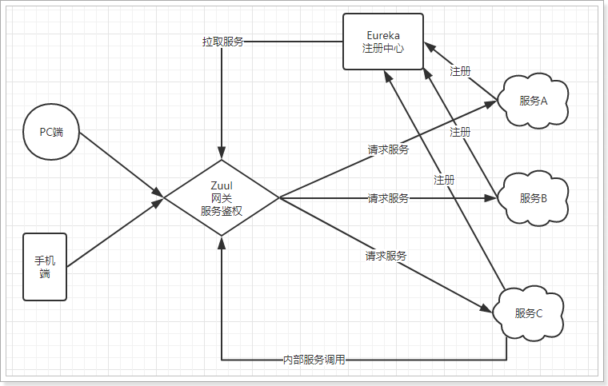


- 不管是来自于客户端（PC或移动端）的请求，还是服务内部调用。一切对服务的请求都会经过Zuul这个网关，然后再由网关来实现 鉴权、动态路由等等操作。Zuul就是我们服务的统一入口。

## 3.3.快速入门

### 3.3.1.新建工程

填写基本信息：


添加Zuul依赖：

```xml
<?xml version="1.0" encoding="UTF-8"?>
<project xmlns="http://maven.apache.org/POM/4.0.0"
         xmlns:xsi="http://www.w3.org/2001/XMLSchema-instance"
         xsi:schemaLocation="http://maven.apache.org/POM/4.0.0 http://maven.apache.org/xsd/maven-4.0.0.xsd">
    <parent>
        <artifactId>cloud-demo</artifactId>
        <groupId>cn.itcast.demo</groupId>
        <version>1.0-SNAPSHOT</version>
    </parent>
    <modelVersion>4.0.0</modelVersion>

    <groupId>cn.itcast.demo</groupId>
    <artifactId>zuul-demo</artifactId>
    <version>1.0-SNAPSHOT</version>

    <dependencies>
        <dependency>
            <groupId>org.springframework.cloud</groupId>
            <artifactId>spring-cloud-starter-netflix-zuul</artifactId>
        </dependency>
    </dependencies>
</project>
```


### 3.3.2.编写启动类

通过`@EnableZuulProxy `注解开启Zuul的功能：

```java
@SpringBootApplication
@EnableZuulProxy // 开启Zuul的网关功能
public class ZuulDemoApplication {

	public static void main(String[] args) {
		SpringApplication.run(ZuulDemoApplication.class, args);
	}
}
```

### 3.3.3.编写配置

```yaml
server:
  port: 10010 #服务端口
spring: 
  application:  
    name: api-gateway #指定服务名
```

### 3.3.4.编写路由规则

我们需要用Zuul来代理user-service服务，先看一下控制面板中的服务状态：


- ip为：127.0.0.1
- 端口为：8081

映射规则：

```yaml
zuul:
  routes:
    user-service: # 这里是路由id，随意写
      path: /user-service/** # 这里是映射路径
      url: http://127.0.0.1:8081 # 映射路径对应的实际url地址
```

我们将符合`path` 规则的一切请求，都代理到 `url`参数指定的地址

本例中，我们将 `/user-service/**`开头的请求，代理到http://127.0.0.1:8081

### 3.3.5.启动测试：

访问的路径中需要加上配置规则的映射路径，我们访问：http://127.0.0.1:8081/user-service/user/10

​	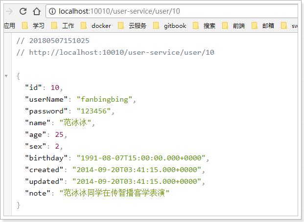


## 3.4.面向服务的路由

在刚才的路由规则中，我们把路径对应的服务地址写死了！如果同一服务有多个实例的话，这样做显然就不合理了。

我们应该根据服务的名称，去Eureka注册中心查找 服务对应的所有实例列表，然后进行动态路由才对！


### 3.4.1.添加Eureka客户端依赖

```xml
<dependency>
    <groupId>org.springframework.cloud</groupId>
    <artifactId>spring-cloud-starter-netflix-eureka-client</artifactId>
</dependency>
```


### 3.4.2.开启Eureka客户端发现功能

```java
@SpringBootApplication
@EnableZuulProxy // 开启Zuul的网关功能
@EnableDiscoveryClient
public class ZuulDemoApplication {

	public static void main(String[] args) {
		SpringApplication.run(ZuulDemoApplication.class, args);
	}
}
```

### 3.4.3.添加Eureka配置，获取服务信息

```yaml
eureka:
  client:
    registry-fetch-interval-seconds: 5 # 获取服务列表的周期：5s
    service-url:
      defaultZone: http://127.0.0.1:10086/eureka
  instance:
    prefer-ip-address: true
    ip-address: 127.0.0.1
```

### 3.4.4.修改映射配置，通过服务名称获取

因为已经有了Eureka客户端，我们可以从Eureka获取服务的地址信息，因此映射时无需指定IP地址，而是通过服务名称来访问，而且Zuul已经集成了Ribbon的负载均衡功能。

```yaml
zuul:
  routes:
    user-service: # 这里是路由id，随意写
      path: /user-service/** # 这里是映射路径
      serviceId: user-service # 指定服务名称
```


### 3.4.5.启动测试

再次启动，这次Zuul进行代理时，会利用Ribbon进行负载均衡访问：

​	

日志中可以看到使用了负载均衡器：


## 3.5.简化的路由配置

在刚才的配置中，我们的规则是这样的：

- `zuul.routes.<route>.path=/xxx/**`： 来指定映射路径。`<route>`是自定义的路由名
- `zuul.routes.<route>.serviceId=/user-service`：来指定服务名。

而大多数情况下，我们的`<route>`路由名称往往和 服务名会写成一样的。因此Zuul就提供了一种简化的配置语法：`zuul.routes.<serviceId>=<path>`

比方说上面我们关于user-service的配置可以简化为一条：

```yaml
zuul:
  routes:
    user-service: /user-service/** # 这里是映射路径
```

省去了对服务名称的配置。

## 3.6.默认的路由规则

在使用Zuul的过程中，上面讲述的规则已经大大的简化了配置项。但是当服务较多时，配置也是比较繁琐的。因此Zuul就指定了默认的路由规则：

- 默认情况下，一切服务的映射路径就是服务名本身。
  - 例如服务名为：`user-service`，则默认的映射路径就是：`/user-service/**`

也就是说，刚才的映射规则我们完全不配置也是OK的，不信就试试看。

## 3.7.路由前缀

配置示例：

```yaml
zuul:
  prefix: /api # 添加路由前缀
  routes:
      user-service: /user-service/** # 这里是映射路径
```

我们通过`zuul.prefix=/api`来指定了路由的前缀，这样在发起请求时，路径就要以/api开头。

路径`/api/user-service/user/1`将会被代理到`/user-service/user/1`


## 3.8.过滤器

Zuul作为网关的其中一个重要功能，就是实现请求的鉴权。而这个动作我们往往是通过Zuul提供的过滤器来实现的。

### 3.8.1.ZuulFilter

ZuulFilter是过滤器的顶级父类。在这里我们看一下其中定义的4个最重要的方法：

```java
public abstract ZuulFilter implements IZuulFilter{

    abstract public String filterType();

    abstract public int filterOrder();
    
    boolean shouldFilter();// 来自IZuulFilter

    Object run() throws ZuulException;// IZuulFilter
}
```

- `shouldFilter`：返回一个`Boolean`值，判断该过滤器是否需要执行。返回true执行，返回false不执行。
- `run`：过滤器的具体业务逻辑。
- `filterType`：返回字符串，代表过滤器的类型。包含以下4种：
  - `pre`：请求在被路由之前执行
  - `routing`：在路由请求时调用
  - `post`：在routing和errror过滤器之后调用
  - `error`：处理请求时发生错误调用
- `filterOrder`：通过返回的int值来定义过滤器的执行顺序，数字越小优先级越高。


### 3.8.2.过滤器执行生命周期：

这张是Zuul官网提供的请求生命周期图，清晰的表现了一个请求在各个过滤器的执行顺序。

​	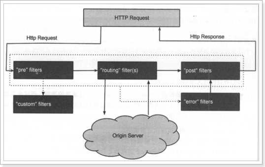

- 正常流程：
  - 请求到达首先会经过pre类型过滤器，而后到达routing类型，进行路由，请求就到达真正的服务提供者，执行请求，返回结果后，会到达post过滤器。而后返回响应。
- 异常流程：
  - 整个过程中，pre或者routing过滤器出现异常，都会直接进入error过滤器，再error处理完毕后，会将请求交给POST过滤器，最后返回给用户。
  - 如果是error过滤器自己出现异常，最终也会进入POST过滤器，而后返回。
  - 如果是POST过滤器出现异常，会跳转到error过滤器，但是与pre和routing不同的时，请求不会再到达POST过滤器了。

所有内置过滤器列表：

​	

### 3.8.3.使用场景

场景非常多：

- 请求鉴权：一般放在pre类型，如果发现没有访问权限，直接就拦截了
- 异常处理：一般会在error类型和post类型过滤器中结合来处理。
- 服务调用时长统计：pre和post结合使用。

## 3.9.自定义过滤器

接下来我们来自定义一个过滤器，模拟一个登录的校验。基本逻辑：如果请求中有access-token参数，则认为请求有效，放行。

### 3.9.1.定义过滤器类

```java
@Component
public class LoginFilter extends ZuulFilter{
    @Override
    public String filterType() {
        // 登录校验，肯定是在前置拦截
        return "pre";
    }

    @Override
    public int filterOrder() {
        // 顺序设置为1
        return 1;
    }

    @Override
    public boolean shouldFilter() {
        // 返回true，代表过滤器生效。
        return true;
    }

    @Override
    public Object run() throws ZuulException {
        // 登录校验逻辑。
        // 1）获取Zuul提供的请求上下文对象
        RequestContext ctx = RequestContext.getCurrentContext();
        // 2) 从上下文中获取request对象
        HttpServletRequest req = ctx.getRequest();
        // 3) 从请求中获取token
        String token = req.getParameter("access-token");
        // 4) 判断
        if(token == null || "".equals(token.trim())){
            // 没有token，登录校验失败，拦截
            ctx.setSendZuulResponse(false);
            // 返回401状态码。也可以考虑重定向到登录页。
            ctx.setResponseStatusCode(HttpStatus.UNAUTHORIZED.value());
        }
        // 校验通过，可以考虑把用户信息放入上下文，继续向后执行
        return null;
    }
}

```


### 3.9.2.测试

没有token参数时，访问失败：

​	

添加token参数后：

​	

## 3.10.负载均衡和熔断

Zuul中默认就已经集成了Ribbon负载均衡和Hystix熔断机制。但是所有的超时策略都是走的默认值，比如熔断超时时间只有1S，很容易就触发了。因此建议我们手动进行配置：

```yaml
zuul:
  retryable: true
ribbon:
  ConnectTimeout: 250 # 连接超时时间(ms)
  ReadTimeout: 2000 # 通信超时时间(ms)
  OkToRetryOnAllOperations: true # 是否对所有操作重试
  MaxAutoRetriesNextServer: 2 # 同一服务不同实例的重试次数
  MaxAutoRetries: 1 # 同一实例的重试次数
hystrix:
  command:
    default:
      execution:
        isolation:
          thread:
            timeoutInMilliseconds: 6000
```


