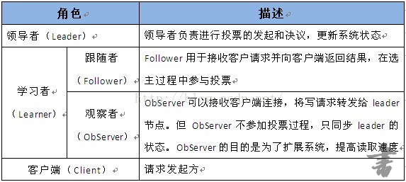

# zookeeper

### 1.定义

ZooKeeper是一个分布式的，开放源码的分布式应用程序协调服务，是Google的Chubby一个开源的实现，是Hadoop和Hbase的重要组件。它是一个/为分布式应用提供一致性服务的软件，提供的功能包括：配置维护、域名服务、分布式同步、组服务等。

ZooKeeper的目标就是封装好复杂易出错的关键服务，将简单易用的接口和性能高效、功能稳定的系统提供给用户。

ZooKeeper包含一个简单的原语集，提供Java和C的接口。

ZooKeeper代码版本中，提供了分布式独享锁、选举、队列的接口，代码在zookeeper-3.4.3\src\recipes。其中分布锁和队列有Java和C两个版本，选举只有Java版本。

ZooKeeper是以Fast Paxos算法为基础的，Paxos 算法存在活锁的问题，即当有多个proposer交错提交时，有可能互相排斥导致没有一个proposer能提交成功，而Fast Paxos作了一些优化，通过选举产生一个leader (领导者)，只有leader才能提交proposer，具体算法可见Fast Paxos。

**ZooKeeper的基本运转流程：**

1、选举Leader。

2、同步数据。

3、选举Leader过程中算法有很多，但要达到的选举标准是一致的。

4、Leader要具有最高的执行ID，类似root权限。

5、集群中大多数的机器得到响应并接受选出的Leader。

### 2.zookeeper

zookeeper端口：2181（向外提供服务端口） 2888（主从通信端口） 3888（选举端口）

#### 2.1zookeeper文件系统

每个子目录项如 NameService 都被称作为znode，和文件系统一样，我们能够自由的增加、删除znode，在一个znode下增加、删除子znode，唯一的不同在于znode是可以存储数据的。 

Znode有两种类型：
​	短暂（ephemeral）：客户端和服务器端断开连接后，创建的节点自己删除
​	持久（persistent）：客户端和服务器端断开连接后，创建的节点不删除 

Znode有四种形式的**目录节点**（默认是persistent ）

1、**PERSISTENT**-持久化目录节点 

客户端与zookeeper断开连接后，该节点依旧存在 

2、**PERSISTENT_SEQUENTIAL**-持久化顺序编号目录节点 

客户端与zookeeper断开连接后，该节点依旧存在，只是Zookeeper给该节点名称进行顺序编号 

3、**EPHEMERAL**-临时目录节点 

客户端与zookeeper断开连接后，该节点被删除 

4、**EPHEMERAL_SEQUENTIAL**-临时顺序编号目录节点 

客户端与zookeeper断开连接后，该节点被删除，只是Zookeeper给该节点名称进行顺序编号 

#### 2.2zookeeper通知机制  

客户端注册监听它关心的目录节点，当目录节点发生变化（数据改变、被删除、子目录节点增加删除）时，zookeeper会通知客户端。

**注意：zookeeper监听只监听一次。**

### 3.作用

#### 3.1.Zookeeper命名服务

在zookeeper的文件系统里创建一个目录，即有唯一的path。在我们使用tborg无法确定上游程序的部署机器时即可与下游程序约定好path，通过path即能互相探索发现。

#### 3.2  Zookeeper的配置管理（统一资源配置）

程序总是需要配置的，如果程序分散部署在多台机器上，要逐个改变配置就变得困难。现在把这些配置全部放到zookeeper上去，保存在 Zookeeper 的某个目录节点中，然后所有相关应用程序对这个目录节点进行监听，一旦配置信息发生变化，每个应用程序就会收到 Zookeeper 的通知，然后从 Zookeeper 获取新的配置信息应用到系统中就好。

#### 3.3  Zookeeper集群管理

所谓集群管理无在乎两点：是否有机器退出和加入、选举master。 

对于第一点，所有机器约定在父目录GroupMembers下创建临时目录节点，然后监听父目录节点的子节点变化消息。一旦有机器挂掉，该机器与 zookeeper的连接断开，其所创建的临时目录节点被删除，所有其他机器都收到通知：某个兄弟目录被删除，于是，所有人都知道：它上船了。

新机器加入也是类似，所有机器收到通知：新兄弟目录加入，highcount又有了，对于第二点，我们稍微改变一下，所有机器创建临时顺序编号目录节点，每次选取编号最小的机器作为master就好。  

#### 3.4	Zookeeper分布式锁

  有了zookeeper的一致性文件系统，锁的问题变得容易。锁服务可以分为两类，一个是保持独占，另一个是控制时序。 

对于第一类，我们将zookeeper上的一个znode看作是一把锁，通过createznode的方式来实现。所有客户端都去创建 /distribute_lock 节点，最终成功创建的那个客户端也即拥有了这把锁。用完删除掉自己创建的distribute_lock 节点就释放出锁。 

对于第二类， /distribute_lock 已经预先存在，所有客户端在它下面创建临时顺序编号目录节点，和选master一样，编号最小的获得锁，用完删除，依次方便。
  

#### 3.5	Zookeeper队列管理

两种类型的队列：

1、同步队列，当一个队列的成员都聚齐时，这个队列才可用，否则一直等待所有成员到达。 

​	在约定目录下创建临时目录节点，监听节点数目是否是我们要求的数目。 

2、队列按照 FIFO 方式进行入队和出队操作。 

​	和分布式锁服务中的控制时序场景基本原理一致，入列有编号，出列按编号。

### 4.分布式与数据复制 

Zookeeper作为一个集群提供一致的数据服务，自然，它要在所有机器间做数据复制。数据复制的好处： 

1、容错：一个节点出错，不致于让整个系统停止工作，别的节点可以接管它的工作； 

2、提高系统的扩展能力 ：把负载分布到多个节点上，或者增加节点来提高系统的负载能力； 

3、提高性能：让客户端本地访问就近的节点，提高用户访问速度。   

从客户端读写访问的透明度来看，数据复制集群系统分下面两种： 

1、**写主**(WriteMaster) ：对数据的修改提交给指定的节点。读无此限制，可以读取任何一个节点。这种情况下客户端需要对读与写进行区别，俗称读写分离； 

2、**写任意**(Write Any)：对数据的修改可提交给任意的节点，跟读一样。这种情况下，客户端对集群节点的角色与变化透明。  

对**zookeeper**来说，它采用的方式是**写任意**。通过增加机器，它的读吞吐能力和响应能力扩展性非常好，而写，随着机器的增多吞吐能力肯定下降（这也是它建立observer的原因），而响应能力则取决于具体实现方式，是延迟复制保持最终一致性，还是立即复制快速响应。

### 5.Zookeeper角色描述




典型的主从架构
​	 主:leader
​	 从:follow

observer：不参与投票

**节点数要求是奇数。必须要有半数以上存活。**

### 6.Zookeeper设计目的

1.最终一致性：client不论连接到哪个Server，展示给它都是同一个视图，这是zookeeper最重要的性能。 

2.可靠性：具有简单、健壮、良好的性能，如果消息被到一台服务器接受，那么它将被所有的服务器接受。 

3.实时性：Zookeeper保证客户端将在一个时间间隔范围内获得服务器的更新信息，或者服务器失效的信息。但由于网络延时等原因，Zookeeper不能保证两个客户端能同时得到刚更新的数据，如果需要最新数据，应该在读数据之前调用sync()接口。 

4.等待无关（wait-free）：慢的或者失效的client不得干预快速的client的请求，使得每个client都能有效的等待。 

5.原子性：更新只能成功或者失败，没有中间状态。 

6.顺序性：包括全局有序和偏序两种：全局有序是指如果在一台服务器上消息a在消息b前发布，则在所有Server上消息a都将在消息b前被发布；偏序是指如果一个消息b在消息a后被同一个发送者发布，a必将排在b前面。   

### 7.Zookeeper工作原理

  Zookeeper 的核心是原子广播，这个机制保证了各个Server之间的同步。实现这个机制的协议叫做Zab协议。Zab协议有两种模式，它们分别是恢复模式（选主）和广播模式（同步）。当服务启动或者在领导者崩溃后，Zab就进入了恢复模式，当领导者被选举出来，且大多数Server完成了和 leader的状态同步以后，恢复模式就结束了。状态同步保证了leader和Server具有相同的系统状态。 

为了保证事务的顺序一致性，zookeeper采用了递增的事务id号（zxid）来标识事务。所有的提议（proposal）都在被提出的时候加上了zxid。实现中zxid是一个64位的数字，它高32位是epoch用来标识leader关系是否改变，每次一个leader被选出来，它都会有一个新的epoch，标识当前属于那个leader的统治时期。低32位用于递增计数。  

### 8.zk读写数据流程


#### 8.1	写流程

客户端连接到集群中某一个节点

客户端发送写请求

服务端连接节点，把该写请求转发给leader

leader处理写请求，一半以上的从节点也写成功，返回给客户端成功。

#### 8.2	读流程

客户端连接到集群中某一节点

读请求，直接返回。

### 9.zookeeper客户端

Zookeeper客户端提供了基本的操作，比如，创建会话、创建节点、读取节点、更新数据、删除节点和检查节点是否存在等。但对于开发人员来说，Zookeeper提供的基本操纵还是有一些不足之处。

**Zookeeper API不足之处**

（1）Zookeeper的Watcher是一次性的，每次触发之后都需要重新进行注册； 

（2）Session超时之后没有实现重连机制； 

（3）异常处理繁琐，Zookeeper提供了很多异常，对于开发人员来说可能根本不知道该如何处理这些异常信息； 

（4）只提供了简单的byte[]数组的接口，没有提供针对对象级别的序列化； 

（5）创建节点时如果节点存在抛出异常，需要自行检查节点是否存在； 

（6）删除节点无法实现级联删除；

#### 9.1	zkClient

ZkClient是一个开源客户端，在Zookeeper原生API接口的基础上进行了包装，更便于开发人员使用。内部实现了Session超时重连，Watcher反复注册等功能。像dubbo等框架对其也进行了集成使用。

虽然ZkClient对原生API进行了封装，但也有它自身的不足之处：

- 几乎没有参考文档；

- 异常处理简化（抛出RuntimeException）；

- 重试机制比较难用；

- 没有提供各种使用场景的实现；

**maven依赖**

```xml
<dependency>
     <groupId>org.apache.zookeeper</groupId>
     <artifactId>zookeeper</artifactId>
     <version>3.4.9</version>
 </dependency>
 <dependency>
     <groupId>com.github.sgroschupf</groupId>
     <artifactId>zkclient</artifactId>
     <version>0.1</version>
 </dependency>
```

```java
public class TestZK {
	
	private static String connectString = "linux01:2181,linux02:2181,linux03:2181";
	private static int sessionTimeout = 2000;
	private ZooKeeper zkClient = null;
	private CountDownLatch latch = new CountDownLatch(1);

	@Before
	public void init() throws Exception {

		//在创建zk对象的时候使用的是异步机制，所以有个回调机制，告诉我们是否连接成功
		zkClient = new ZooKeeper(connectString, sessionTimeout, new Watcher() {
				@Override
			public void process(WatchedEvent event) {
					
//				System.out.println(event.getType() + "--" + event.getPath());
					//System.out.println("客户端已经和服务端建立好连接");
					latch.countDown();

			}
		});
	}
	
	@Test
	public void create() throws Exception {
		latch.await();
		// 数据的增删改查
		// 参数1：要创建的节点的路径； 参数2：节点数据 ； 参数3：节点权限 ；参数4：节点的类型
		String nodeCreated = zkClient.create("/eclipse", "hello zk".getBytes(), Ids.OPEN_ACL_UNSAFE,CreateMode.PERSISTENT);
		System.out.println(nodeCreated);
	}
	
	@Test
	public void getData() throws Exception {
		latch.await();
		Stat stat = new Stat();
		
		byte[] b = zkClient.getData("/eclipse", false, stat);
		
		System.out.println(stat.getCtime());
		System.out.println(new String(b));
	}
	
	@Test
	public void getData1() throws Exception {
		latch.await();
		byte[] b = zkClient.getData("/eclipse", new Watcher() {
			
			@Override
			public void process(WatchedEvent arg0) {
				System.out.println("数据发生改变");
				
			}
		}, null);
		
		// 延时阻塞
		Thread.sleep(Long.MAX_VALUE);
		
	}
	
	@Test
	public void getChildren() throws Exception {
		latch.await();
		List<String> children = zkClient.getChildren("/", true);

		for (String child : children) {
			System.out.println(child);
		}

		// 延时阻塞
		Thread.sleep(Long.MAX_VALUE);
	}
	
	@Test
	public void getChildren1() throws Exception {
		latch.await();
		List<String> children = zkClient.getChildren("/eclipse", new Watcher() {
			
			@Override
			public void process(WatchedEvent event) {
				System.out.println("eclipse节点下的子节点发生了变化");
				List<String> children1 = null;
				try {
					children1 = zkClient.getChildren("/eclipse",false);
				} catch (KeeperException e) {
					// TODO Auto-generated catch block
					e.printStackTrace();
				} catch (InterruptedException e) {
					// TODO Auto-generated catch block
					e.printStackTrace();
				}

				for (String child : children1) {
					System.out.println(child);
				}
			}
		});

		
		// 延时阻塞
		Thread.sleep(Long.MAX_VALUE);
	}

	@Test
	public void exist() throws Exception {
		latch.await();
		Stat stat = zkClient.exists("/eclipse1", false);

		System.out.println(stat == null ? "not exist" : "exist");
	}

	@Test
	public void exist1() throws Exception {
		latch.await();
		Stat stat = zkClient.exists("/eclipse", new Watcher() {
			
			@Override
			public void process(WatchedEvent event) {
				System.out.println("======================");
				
			}
		});
		Thread.sleep(Long.MAX_VALUE);
		
		System.out.println(stat == null ? "not exist" : "exist");
	}
}

```

#### 9.2	Curator

为了更好的实现Java操作zookeeper服务器，后来出现了Curator框架，非常的强大，目前已经是Apache的顶级项目，里面提供了更多丰富的操作，例如session超时重连、主从选举、分布式计数器、分布式锁等等适用于各种复杂的zookeeper场景的API封装。

**maven依赖**

```xml
<dependency>
    <groupId>org.apache.curator</groupId>
    <artifactId>curator-framework</artifactId>
    <version>3.2.1</version>
</dependency>
<dependency>
    <groupId>org.apache.curator</groupId>
    <artifactId>curator-recipes</artifactId>
    <version>3.2.1</version>
</dependency>
<dependency>
    <groupId>org.apache.curator</groupId>
    <artifactId>curator-client</artifactId>
    <version>3.2.1</version>
</dependency>
```

```java
public class CuratorHelloworld {
    private static final String CONNECT_ADDR = "192.168.1.102:2181,192.168.1.104:2181,192.168.1.105:2181";
    private static final int SESSION_TIMEOUT = 5000;
 
    public static void main(String[] args) throws Exception {
        //重试策略，初试时间1秒，重试10次
        RetryPolicy policy = new ExponentialBackoffRetry(1000, 10);
        //通过工厂创建Curator
        CuratorFramework curator = CuratorFrameworkFactory.builder().connectString(CONNECT_ADDR)
                .sessionTimeoutMs(SESSION_TIMEOUT).retryPolicy(policy).build();
        //开启连接
        curator.start();
 
        ExecutorService executor = Executors.newCachedThreadPool();
 
        /**创建节点，creatingParentsIfNeeded()方法的意思是如果父节点不存在，则在创建节点的同时创建父节点；
         * withMode()方法指定创建的节点类型，跟原生的Zookeeper API一样，不设置默认为PERSISTENT类型。
         * */
        curator.create().creatingParentsIfNeeded().withMode(CreateMode.PERSISTENT)
                .inBackground((framework, event) -> { //添加回调
                    System.out.println("Code：" + event.getResultCode());
                    System.out.println("Type：" + event.getType());
                    System.out.println("Path：" + event.getPath());
                }, executor).forPath("/super/c1", "c1内容".getBytes());
        Thread.sleep(5000); //为了能够看到回调信息
        String data = new String(curator.getData().forPath("/super/c1")); //获取节点数据
        System.out.println(data);
        Stat stat = curator.checkExists().forPath("/super/c1"); //判断指定节点是否存在
        System.out.println(stat);
        curator.setData().forPath("/super/c1", "c1新内容".getBytes()); //更新节点数据
        data = new String(curator.getData().forPath("/super/c1"));
        System.out.println(data);
        List<String> children = curator.getChildren().forPath("/super"); //获取子节点
        for(String child : children) {
            System.out.println(child);
        }
        //放心的删除节点，deletingChildrenIfNeeded()方法表示如果存在子节点的话，同时删除子节点
        curator.delete().guaranteed().deletingChildrenIfNeeded().forPath("/super");
        curator.close();
    }
}

```

### 10.zk特点

1）Zookeeper：一个领导者（leader），多个跟随者（follower）组成的集群。

2）Leader负责进行投票的发起和决议，更新系统状态

3）Follower用于接收客户请求并向客户端返回结果，在选举Leader过程中参与投票

4）集群中只要有半数以上节点存活，Zookeeper集群就能正常服务。

5）全局数据一致：每个server保存一份相同的数据副本，client无论连接到哪个server，数据都是一致的。

6）更新请求顺序进行，来自同一个client的更新请求按其发送顺序依次执行。

7）数据更新原子性，一次数据更新要么成功，要么失败。

8）实时性，在一定时间范围内，client能读到最新数据。

### 11.配置zk集群

（1）将安装包到上传到/opt/software/目录下

（2）解压zookeeper安装包到/opt/modules/目录下 
  	 **tar -zxvf zookeeper-3.4.8.tar.gz -C /opt/modules/**

（3）在/opt/modules/zookeeper-3.4.8/这个目录下创建zkData
  		**mkdir zkData**

（4）重命名/opt/modules/zookeeper-3.4.8/conf这个目录下的zoo_sample.cfg为zoo.cfg
  		**cp zoo_sample.cfg zoo.cfg**
​     		zoo.cfg内容：
​      		**dataDir=/opt/modules/zookeeper-3.4.8/zkData**

​	**server.1=linux01:2888:3888** 
​		**server.2=linux02:2888:3888**
​		**server.3=linux03:2888（主从通信端口）:3888（选举端口）**

如果配置observer：**server.3=linux03:2888:3888:observer**

​	server.A=B:C:D
​		A是一个数字，表示这个是第几号服务器；
​		B是这个服务器的ip地址
​		C是follow与leader的通信端口
​		D是选举端口

在dataDir下建一个myid文件

**vim myid**

写入1

（5）、将modules下的zookeeper-3.4.8这个目录发送162,163这两台主机
  	 	**scp -r zookeeper-3.4.8/ root@linux02:/opt/modules/**

（6）、修改162,163这两台主机myid中的值

161为1,162为2,163为3。值与第几号服务器对应。

   (7)启动zk
​      		**bin/zkServer.sh start**

（8）可以查看每台zk的状态
​       		**bin/zkServer.sh status**

对zoo.cfg文件的属性说明
​	tickTime=2000：客户端每个心跳包的时间
​	initLimit=10：Leader与follow初始通信所等的心跳数(当leader产生了之后，leader会等其他的follow，但是最多等10个心跳包的时间也就是20秒)
​	syncLimit=5：Leader和follow同步尝试的次数
​	dataDir=/opt/modules/zookeeper-3.4.8/zkData：保存zookeeper的数据

### 12.cli（command line）的操作

help
​    创建节点：create /persistent_test "helloword"
​    ls / ：查看节点
​    get /app1:查看这个节点存放的数据
​    create -e /app-emphemeral 8888
​    create -s /app2/aa 888
​    set /app1 999  ：修改数据
​    get /app1 watch ：对节点的数据加监听，这种监听只有一次
​    ls /app1 watch：监听子节点
​    delete /app1/bb： 删除节点
​    rmr /app2 ：递归删除
​    stat /app1 ：查看这个节点的状态信息


    1）czxid- 引起这个znode创建的zxid，创建节点的事务的zxid
    2）ctime - znode被创建的毫秒数(从1970年开始)
    3）mzxid - znode最后更新的zxid
    4）mtime - znode最后修改的毫秒数(从1970年开始)
    5）pZxid-znode最后更新的子节点zxid
    6）cversion - znode子节点变化号，znode子节点修改次数
    7）dataversion - znode数据变化号
    8）aclVersion - znode访问控制列表的变化号
    9）ephemeralOwner- 如果是临时节点，这个是znode拥有者的session id。如果不是临时节点则是0。
    10）dataLength- znode的数据长度
    11）numChildren - znode子节点数量
### 13.CAP理论

**Consistency**(一致性), 数据一致更新，所有数据变动都是同步的。
​	**Availability**(可用性) 任何时候都要保证能读写数据。
​	**Partition tolerance**(分区容错性)：在分布式中，机器与机器之间无法正常通信是正常情况，但是要保证系统在这种情况下能提供服务。

在一个分布式的架构中，只能满足CAP中任何2点即可，当然，也不可能满足3点，但是有一点是强制满足的，就是分区容错性这点是必须满足的。

**zk是满足了CP**。

### 14.BASE理论

Basically Available（基本可用）
​	Soft-state（ 软状态/柔性事务）
​	Eventual Consistency（最终一致性）
​	BASE模型是传统ACID模型的反面，不同与ACID，BASE强调牺牲高一致性，从而获得可用性，数据允许在一段时间内的不一致，只要保证最终一致就可以了。

但是必须保证A(原子性)和D（持久性），降低一致性（C）和隔离性(I)。