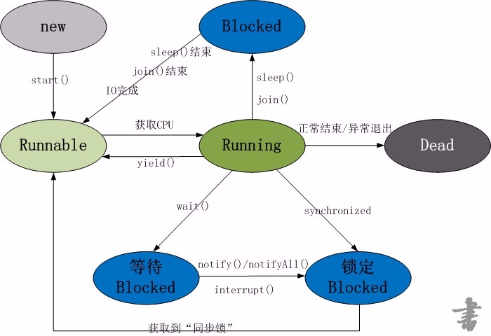
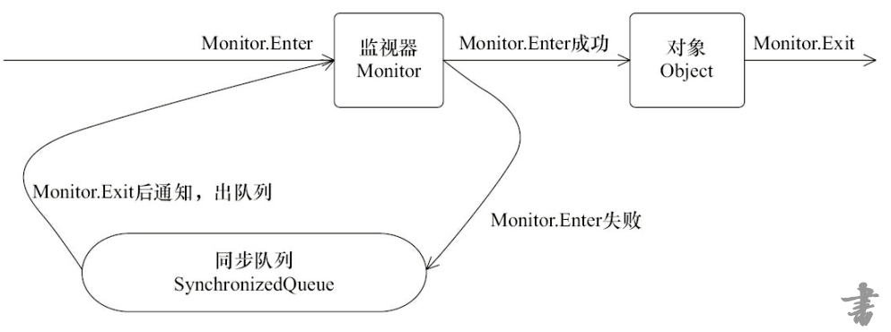
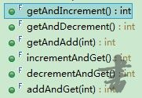
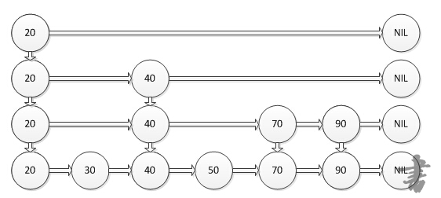
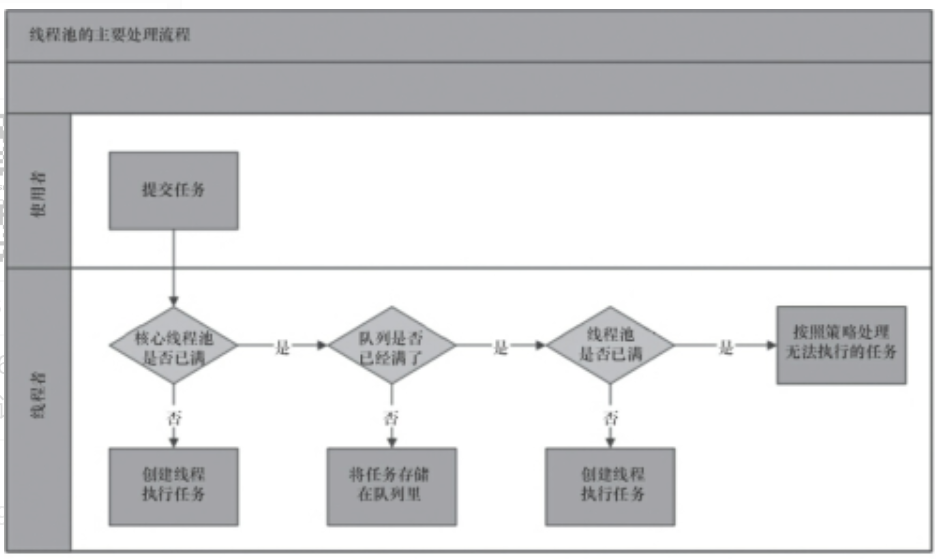
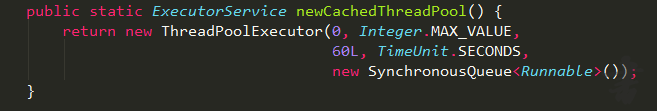
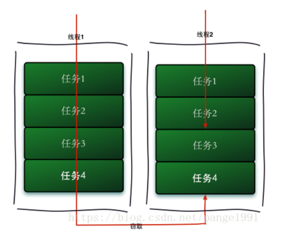
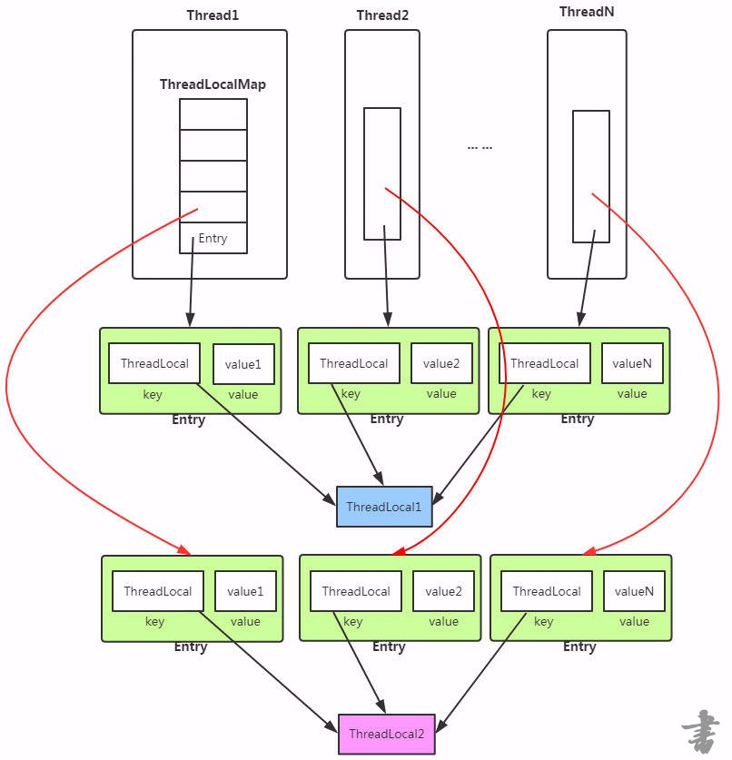

# 1、进程与线程？
## 进程 
### 1. 定义：
&emsp;&emsp;进程（Process）是计算机中的程序关于某数据集合上的一次运行活动，是系统进行资源分配和调度的基本单位，是操作系统结构的基础。
在早期面向进程设计的计算机结构中，进程是程序的基本执行实体；
在当代面向线程设计的计算机结构中，进程是线程的容器。程序是指令、数据及其组织形式的描述；
进程是程序的实体。  
**狭义定义：**进程是正在运行的程序的实例（an instance of a computer program that is being executed）。  
**广义定义：**进程是一个具有一定独立功能的程序关于某个数据集合的一次运行活动。它是操作系统动态执行的基本单元，在传统的操作系统中，进程既是基本的分配单元，也是基本的执行单元。
### 2. 特征：
**动态性：**进程的实质是程序在多道程序系统中的一次执行过程，进程是动态产生，动态消亡的。  
**并发性：**任何进程都可以同其他进程一起并发执行。  
**独立性：**进程是一个能独立运行的基本单位，同时也是系统分配资源和调度的独立单位。  
**异步性：**由于进程间的相互制约，使进程具有执行的间断性，即进程按各自独立的、不可预知的速度向前推进。  
**结构特征：**进程由程序、数据和进程控制块三部分组成。
## 线程 
### 1. 定义：
&emsp;&emsp;线程，有时被称为轻量进程(Lightweight Process，LWP），是程序执行流的最小单元。  
&emsp;&emsp;一个标准的线程由线程ID，当前指令指针(PC），寄存器集合和堆栈组成。  
&emsp;&emsp;线程是进程中的一个实体，是被系统独立调度和分派的基本单位，线程自己不拥有系统资源，只拥有一点儿在运行中必不可少的资源，但它可与同属一个进程的其它线程共享进程所拥有的全部资源。
由于线程之间的相互制约，致使线程在运行中呈现出间断性。  
&emsp;&emsp;线程是程序中一个单一的顺序控制流程。进程内有一个相对独立的、可调度的执行单元，是系统独立调度和分派CPU的基本单位指令运行时的程序的调度单位。在单个程序中同时运行多个线程完成不同的工作，称为多线程。
##### 守护线程
在一个线程调用start方法之前，调用setDaemon方法，可以将一个线程转化成守护线程。
守护线程只有一个作用，就是为其他线程提供服务，比如计时器的功能或者清除过时缓存等，当程序只有守护线程在工作的话，jvm便会退出。
### 2. 基本状态： ###
**就绪：**
&emsp;&emsp;就绪状态是指线程具备运行的所有条件，逻辑上可以运行，在等待处理机；    
**阻塞：**
&emsp;&emsp;阻塞状态是指线程在等待一个事件（如某个信号量），逻辑上不可执行；   
**运行：**
&emsp;&emsp;运行状态是指线程占有处理机正在运行；
# 2、如何实现线程？这两种方式哪种方式好？ #
## 创建线程： ##
### 1.继承Thread类创建线程 ###
&emsp;&emsp;Thread类本质上是实现了Runnable接口的一个实例，代表一个线程的实例。启动线程的唯一方法就是通过Thread类的start()实例方法。start()方法是一个native方法，它将启动一个新线程，并执行run()方法。这种方式实现多线程很简单，通过自己的类直接extend Thread，并复写run()方法，就可以启动新线程并执行自己定义的run()方法。

    public class MyThread extends Thread {  
    　　public void run() {  
    　　 System.out.println("MyThread.run()");  
    　　}  
    }  
     
    MyThread myThread = new MyThread();  
    myThread.start();  
### 2、实现Runnable接口创建线程 ###
	public class MyThread extends OtherClass implements Runnable {  
	　　public void run() {  
	　　 System.out.println("MyThread.run()");  
	　　}  
	}  
	//为了启动MyThread，需要首先实例化一个Thread，并传入自己的MyThread实例：  
	MyThread myThread = new MyThread();  
	Thread thread = new Thread(myThread);  
	thread.start();  
### 3、实现Callable接口通过FutureTask包装器来创建Thread线程 ###
**通过Callable和FutureTask创建线程**  
a. 创建Callable接口的实现类 ，并实现Call方法   
b. 创建Callable实现类的实现，使用FutureTask类包装Callable对象，该FutureTask对象封装了Callable对象的Call方法的返回值   
c. 使用FutureTask对象作为Thread对象的target创建并启动线程   
d. 调用FutureTask对象的get()来获取子线程执行结束的返回值  
​		
​	public class ThreadDemo03 {
​		public static void main(String[] args) {
​			Callable<Object> oneCallable = new Tickets<Object>();
​			FutureTask<Object> oneTask = new FutureTask<Object>(oneCallable);
​			Thread t = new Thread(oneTask);
​			System.out.println(Thread.currentThread().getName());
​			t.start();
​			}
​		
		}
	class Tickets<Object> implements Callable<Object>{
		//重写call方法
		@Override
		public Object call() throws Exception {
		// TODO Auto-generated method stub
		System.out.println(Thread.currentThread().getName()+"-->我是通过实现Callable接口通过FutureTask包装器来实现的线程");
		return null;
	}   
	}
### 4、通过线程池创建线程 ###
	public class ThreadDemo05{
	
	    private static int POOL_NUM = 10;     //线程池数量
	    public static void main(String[] args) throws InterruptedException {
	        ExecutorService executorService = Executors.newFixedThreadPool(5);  
	        for(int i = 0; i<POOL_NUM; i++)  
	        {  
	            RunnableThread thread = new RunnableThread();
	            //Thread.sleep(1000);
	            executorService.execute(thread);  
	        }
	        //关闭线程池
	        executorService.shutdown(); 
	    }   
	}
	class RunnableThread implements Runnable  
	{     
	    @Override
	    public void run()  
	    {  
	        System.out.println("通过线程池方式创建的线程：" + Thread.currentThread().getName() + " ");  
	    }  
	}  
## 方式优缺点 ##
**1. 采用实现Runnable、Callable接口的方式创见多线程时**  
**优势:**  
&emsp;&emsp;(1). 线程类只是实现了Runnable接口或Callable接口，还可以继承其他类。  
&emsp;&emsp;(2). 在这种方式下，多个线程可以共享同一个target对象，所以非常适合多个相同线程来处理同一份资源的情况，从而可以将CPU、代码和数据分开，形成清晰的模型，较好地体现了面向对象的思想。  
**劣势：**  
&emsp;&emsp;编程稍微复杂，如果要访问当前线程，则必须使用Thread.currentThread()方法。

**2. 使用继承Thread类的方式创建多线程时**  
**优势是：**  
&emsp;&emsp;编写简单，如果需要访问当前线程，则无需使用Thread.currentThread()方法，直接使用this即可获得当前线程。  
**劣势是：**  
&emsp;&emsp;线程类已经继承了Thread类，所以不能再继承其他父类。  
**3、Runnable和Callable的区别**  
&emsp;&emsp;(1) Callable规定重写call(),Runnable重写run()。  
&emsp;&emsp;(2) Callable的任务执行后可返回值，而Runnable的任务是不能返回值的。  
&emsp;&emsp;(3) call方法可以抛出异常，run方法不可以。  
&emsp;&emsp;(4) 运行Callable任务可以拿到一个Future对象，表示异步计算的结果。它提供了检查计算是否完成的方法，以等待计算的完成，并检索计算的结果。通过Future对象可以了解任务执行情况，可取消任务的执行，还可获取执行结果。
#### futureTask
既实现了runnable，又实现了future，将线程包装成一个可以返回结果的线程任务，通过调用get方法阻塞地获取线程执行结果。
下列代码是自己创建线程或者采用线程池创建线程后对future的利用。
```
package cn.kgc.concurrent.queue;

import org.junit.Test;

import java.util.concurrent.*;
import java.util.concurrent.atomic.AtomicInteger;

/**
 * @ProjectName: algorithm
 * @Package: cn.kgc.concurrent.queue
 * @ClassName: CallableAndFuture
 * @Author: Xu.Xin
 * @Description: callable和future的测试类
 * @Date: 2018/10/20 21:02
 * @Version: 1.0
 */
public class CallableAndFuture {
    private AtomicInteger atomicInteger = new AtomicInteger(5);
    @Test
    public void testFutureTask() throws ExecutionException, InterruptedException {
        FutureTask<Integer> task = new FutureTask<>(() -> atomicInteger.addAndGet(1));
        Thread thread = new Thread(task);
        thread.start();
        Integer result = task.get();
        System.out.println(result);
    }
    @Test
    public void testPool() throws ExecutionException, InterruptedException {
        ExecutorService pool = Executors.newFixedThreadPool(5);
        Future<Integer> future = pool.submit(() -> atomicInteger.addAndGet(1));
        Integer result = future.get();
        System.out.println(result);
    }
}

```
# 3、如何启动线程？

### run()方法与start()的区别 ###
&emsp;&emsp;1. start（）方法来启动线程，真正实现了多线程运行，这时无需等待run方法体代码执行完毕而直接继续执行下面的代码。  
&emsp;&emsp;通过调用Thread类的start()方法来启动一个线程，这时此线程是处于就绪状态，并没有运行。然后通过此Thread类调用方法run()来完成其运行操作的，这里方法run()称为线程体，它包含了要执行的这个线程的内容，Run方法运行结束，此线程终止，而CPU再运行其它线程。  
&emsp;&emsp;2. run（）方法当作普通方法的方式调用。程序还是要顺序执行，要等待run方法体执行完毕后，才可继续执行下面的代码；程序中只有主线程这一个线程，其程序执行路径还是只有一条，这样就没有达到写线程的目的。  

# 4、线程的状态？

&emsp;&emsp;线程从创建、运行到结束总是处于下面五个状态之一：新建状态、就绪状态、运行状态、阻塞状态及死亡状态。  

### 1. 新建状态 
&emsp;&emsp;实现Runnable接口和继承Thread可以得到一个线程类，new一个实例出来，线程就进入了初始状态。
### 2. 就绪状态 ###
&emsp;&emsp;（1）就绪状态只是说你资格运行，调度程序没有挑选到你，你就永远是就绪状态。  
&emsp;&emsp;（2）调用线程的start()方法，此线程进入就绪状态。  
&emsp;&emsp;（3）当前线程sleep()方法结束，其他线程join()结束，等待用户输入完毕，某个线程拿到对象锁，这些线程也将进入就绪状态。  
&emsp;&emsp;（4）当前线程时间片用完了，调用当前线程的yield()方法，当前线程进入就绪状态。  
&emsp;&emsp;（5）锁池里的线程拿到对象锁后，进入就绪状态。
### 3. 运行状态 ###
&emsp;&emsp;线程调度程序从可运行池中选择一个线程作为当前线程时线程所处的状态。这也是线程进入运行状态的唯一一种方式。这时真正开始执行run()方法。  
### 4. 阻塞状态 ###
&emsp;&emsp;阻塞状态是线程因为某种原因放弃CPU使用权，暂时停止运行。直到线程进入就绪状态，才有机会转到运行状态。阻塞的情况分三种：  
&emsp;&emsp;(1) 等待阻塞 -- 通过调用线程的wait()方法，让线程等待某工作的完成。  
&emsp;&emsp;(2) 同步阻塞 -- 线程在获取synchronized同步锁失败(因为锁被其它线程所占用)，它会进入同步阻塞状态。  
&emsp;&emsp;(3) 其他阻塞 -- 通过调用线程的sleep()或join()或发出了I/O请求时，线程会进入到阻塞状态。当sleep()状态超时、join()等待线程终止或者超时、或者I/O处理完毕时，线程重新转入就绪状态。  
### 5.死亡状态 ###
&emsp;&emsp;有两个原因会导致线程死亡：  
&emsp;&emsp;（1）run方法正常退出而自然死亡；  
&emsp;&emsp;（2）一个未捕获的异常终止了run方法而使线程猝死；  
&emsp;&emsp;当线程的run()方法完成时，或者主线程的main()方法完成时，我们就认为它终止了。这个线程对象也许是活的，但是，它已经不是一个单独执行的线程。线程一旦终止了，就不能复生。  
&emsp;&emsp;为了确定线程在当前是否存活着（就是要么是可运行的，要么是被阻塞了），需要使用isAlive方法，如果是可运行或被阻塞，这个方法返回true；如果线程仍旧是new状态且不是可运行的，或者线程死亡了，则返回false。    
&emsp;&emsp;在一个终止的线程上调用start()方法，会抛出java.lang.IllegalThreadStateException异常。
图解：

# 5、synchronized

### synchronized ###
&emsp;&emsp;Java语言的关键字，可用来给对象和方法或者代码块加锁，当它锁定一个方法或者一个代码块的时候，同一时刻最多只有一个线程执行这段代码。当两个并发线程访问同一个对象object中的这个加锁同步代码块时，一个时间内只能有一个线程得到执行。另一个线程必须等待当前线程执行完这个代码块以后才能执行该代码块。然而，当一个线程访问object的一个加锁代码块时，另一个线程仍可以访问该object中的非加锁代码块。   
&emsp;&emsp;它包括两种用法：synchronized 方法和 synchronized 块。  
&emsp;&emsp;Synchronized先天具有重入性（即在同一锁程中，线程不需要再次获取同一把锁）。  
&emsp;&emsp;使用Synchronized进行同步，其关键就是必须要对对象的监视器monitor进行获取，当线程获取monitor后才能继续往下执行，否则就只能等待。而这个获取的过程是互斥的，即同一时刻只有一个线程能够获取到monitor。  
&emsp;&emsp;每个对象拥有一个计数器，当线程获取该对象锁后，计数器就会加一，释放锁后就会将计数器减一。
线程出现异常导致线程中止的话，会释放同步锁。若捕获处理了异常，则不会释放同步锁。


### synchronized方法  
在方法的声明前加入synchronized关键字，eg:  

	public synchronized void methodA(){
	};
&emsp;&emsp;这个方法在同一时刻只能被一个线程访问，从而保证了多线程访问的安全性。然而，当一个方法体规模非常大时，把该方法声明为synchronized会大大影响程序的执行效率。
### synchronized块 ###
	synchronized (syncObject){
	//代码
	}
&emsp;&emsp;对程序来讲同步的部分很影响运行效率，而一个方法通常是先创建一些局部变量，再对这些变量做一些操作，如运算，显示等等； 
而同步所覆盖的代码越多，对效率的影响就越严重。因此我们通常尽量缩小其影响范围。如何做？同步代码块。我们只把一个方法中该同步的地方同步，比如运算。
### 类锁与对象锁 ###
&emsp;&emsp;synchronized修饰非静态方法、同步代码块的synchronized (this)用法和synchronized (非this对象)的用法锁的是对象，线程想要执行对应同步代码，需要获得对象锁。  
&emsp;&emsp;synchronized修饰静态方法以及同步代码块的synchronized (类.class)用法锁的是类，线程想要执行对应同步代码，需要获得类锁。  
**区别**  
&emsp;&emsp;1. 如果多线程同时访问同一类的类锁（synchronized 修饰的静态方法）以及对象锁（synchronized 修饰的非静态方法），这两个方法执行是异步的，原因：类锁和对象锁是2中不同的锁。   
&emsp;&emsp;2. 类锁对该类的所有对象都能起作用，而对象锁不能。
### 其他线程常见api
#### setPriority
设置线程优先级，1~10，越高优先级越大。Thread.MIN_PRIORITY = 1，Thread.NORM_PRIORITY = 5，Thread.MAX_PRIORITY = 10。
#### yield
对cpu的一个暗示，即当前线程愿意让出当前使用的处理器。 cpu可以自由地忽略这个提示。
#### join
等待调用的对象线程死亡后，join后面的代码才得到执行。

# 6、生产者与消费者问题(能代码模拟)

### 1. 模式 ###
&emsp;&emsp;生产者生产数据到缓冲区中，消费者从缓冲区中取数据；    
&emsp;&emsp;如果缓冲区已经满了，则生产者线程阻塞；  
&emsp;&emsp;如果缓冲区为空，那么消费者线程阻塞。
### 2.实现方式一：synchronized、wait和notify  ### 
```
	package producerConsumer;
	//wait 和 notify
	public class ProducerConsumerWithWaitNofity {
	    public static void main(String[] args) {
	        Resource resource = new Resource();
	        //生产者线程
	        ProducerThread p1 = new ProducerThread(resource);
	        ProducerThread p2 = new ProducerThread(resource);
	        ProducerThread p3 = new ProducerThread(resource);
	        //消费者线程
	        ConsumerThread c1 = new ConsumerThread(resource);
	        //ConsumerThread c2 = new ConsumerThread(resource);
	        //ConsumerThread c3 = new ConsumerThread(resource);
	    
	        p1.start();
	        p2.start();
	        p3.start();
	        c1.start();
	        //c2.start();
	        //c3.start();
	    }


​	    
​	    
​	}
​	/**
​	 * 公共资源类
​	 * @author 
​	 *
​	 */
​	class Resource{//重要
​	    //当前资源数量
​	    private int num = 0;
​	    //资源池中允许存放的资源数目
​	    private int size = 10;
​	
	    /**
	     * 从资源池中取走资源
	     */
	    public synchronized void remove(){
	        if(num > 0){
	            num--;
	            System.out.println("消费者" + Thread.currentThread().getName() +
	                    "消耗一件资源，" + "当前线程池有" + num + "个");
	            notifyAll();//通知生产者生产资源
	        }else{
	            try {
	                //如果没有资源，则消费者进入等待状态
	                wait();
	                System.out.println("消费者" + Thread.currentThread().getName() + "线程进入等待状态");
	            } catch (InterruptedException e) {
	                e.printStackTrace();
	            }
	        }
	    }
	    /**
	     * 向资源池中添加资源
	     */
	    public synchronized void add(){
	        if(num < size){
	            num++;
	            System.out.println(Thread.currentThread().getName() + "生产一件资源，当前资源池有" 
	            + num + "个");
	            //通知等待的消费者
	            notifyAll();
	        }else{
	            //如果当前资源池中有10件资源
	            try{
	                wait();//生产者进入等待状态，并释放锁
	                System.out.println(Thread.currentThread().getName()+"线程进入等待");
	            }catch(InterruptedException e){
	                e.printStackTrace();
	            }
	        }
	    }
	}
	/**
	 * 消费者线程
	 */
	class ConsumerThread extends Thread{
	    private Resource resource;
	    public ConsumerThread(Resource resource){
	        this.resource = resource;
	    }
	    @Override
	    public void run() {
	        while(true){
	            try {
	                Thread.sleep(1000);
	            } catch (InterruptedException e) {
	                e.printStackTrace();
	            }
	            resource.remove();
	        }
	    }
	}
	/**
	 * 生产者线程
	 */
	class ProducerThread extends Thread{
	    private Resource resource;
	    public ProducerThread(Resource resource){
	        this.resource = resource;
	    }
	    @Override
	    public void run() {
	        //不断地生产资源
	        while(true){
	            try {
	                Thread.sleep(1000);
	            } catch (InterruptedException e) {
	                e.printStackTrace();
	            }
	            resource.add();
	        }
	    }
	    
	}
```
### 方式二：lock和condition的await、signalAll ###
	package producerConsumer;
	
	import java.util.concurrent.locks.Condition;
	import java.util.concurrent.locks.Lock;
	import java.util.concurrent.locks.ReentrantLock;
	/**
	 * 使用Lock 和 Condition解决生产者消费者问题
	 * @author tangzhijing
	 *
	 */
	public class LockCondition {
	        public static void main(String[] args) {
	            Lock lock = new ReentrantLock();
	            Condition producerCondition = lock.newCondition();
	            Condition consumerCondition = lock.newCondition();
	            Resource2 resource = new Resource2(lock,producerCondition,consumerCondition);
	            
	            //生产者线程
	            ProducerThread2 producer1 = new ProducerThread2(resource);
	            
	            //消费者线程
	            ConsumerThread2 consumer1 = new ConsumerThread2(resource);
	            ConsumerThread2 consumer2 = new ConsumerThread2(resource);
	            ConsumerThread2 consumer3 = new ConsumerThread2(resource);
	            
	            producer1.start();
	            consumer1.start();
	            consumer2.start();
	            consumer3.start();
	        }
	}
	/**
	 * 消费者线程
	 */
	class ConsumerThread2 extends Thread{
	    private Resource2 resource;
	    public ConsumerThread2(Resource2 resource){
	        this.resource = resource;
	        //setName("消费者");
	    }
	    public void run(){
	        while(true){
	            try {
	                Thread.sleep((long) (1000 * Math.random()));
	            } catch (InterruptedException e) {
	                e.printStackTrace();
	            }
	            resource.remove();
	        }
	    }
	}
	/**
	 * 生产者线程
	 * @author tangzhijing
	 *
	 */
	class ProducerThread2 extends Thread{
	    private Resource2 resource;
	    public ProducerThread2(Resource2 resource){
	        this.resource = resource;
	        setName("生产者");
	    }
	    public void run(){
	        while(true){
	                try {
	                    Thread.sleep((long) (1000 * Math.random()));
	                } catch (InterruptedException e) {
	                    e.printStackTrace();
	                }
	                resource.add();
	        }
	    }
	}
	/**
	 * 公共资源类
	 * @author tangzhijing
	 *
	 */
	class Resource2{
	    private int num = 0;//当前资源数量
	    private int size = 10;//资源池中允许存放的资源数目
	    private Lock lock;
	    private Condition producerCondition;
	    private Condition consumerCondition;
	    public Resource2(Lock lock, Condition producerCondition, Condition consumerCondition) {
	        this.lock = lock;
	        this.producerCondition = producerCondition;
	        this.consumerCondition = consumerCondition;
	 
	    }
	    /**
	     * 向资源池中添加资源
	     */
	    public void add(){
	        lock.lock();
	        try{
	            if(num < size){
	                num++;
	                System.out.println(Thread.currentThread().getName() + 
	                        "生产一件资源,当前资源池有" + num + "个");
	                //唤醒等待的消费者
	                consumerCondition.signalAll();
	            }else{
	                //让生产者线程等待
	                try {
	                    producerCondition.await();
	                    System.out.println(Thread.currentThread().getName() + "线程进入等待");
	                } catch (InterruptedException e) {
	                    e.printStackTrace();
	                }
	            }
	        }finally{
	            lock.unlock();
	        }
	    }
	    /**
	     * 从资源池中取走资源
	     */
	    public void remove(){
	        lock.lock();
	        try{
	            if(num > 0){
	                num--;
	                System.out.println("消费者" + Thread.currentThread().getName() 
	                        + "消耗一件资源," + "当前资源池有" + num + "个");
	                producerCondition.signalAll();//唤醒等待的生产者
	            }else{
	                try {
	                    consumerCondition.await();
	                    System.out.println(Thread.currentThread().getName() + "线程进入等待");
	                } catch (InterruptedException e) {
	                    e.printStackTrace();
	                }//让消费者等待
	            }
	        }finally{
	            lock.unlock();
	        }
	    }
	    
	}
### 方式三：BlockingQueue  ###
	package producerConsumer;
	
	import java.util.concurrent.BlockingQueue;
	import java.util.concurrent.LinkedBlockingQueue;
	
	//使用阻塞队列BlockingQueue解决生产者消费者
	public class BlockingQueueConsumerProducer {
	    public static void main(String[] args) {
	        Resource3 resource = new Resource3();
	        //生产者线程
	        ProducerThread3 p = new ProducerThread3(resource);
	        //多个消费者
	        ConsumerThread3 c1 = new ConsumerThread3(resource);
	        ConsumerThread3 c2 = new ConsumerThread3(resource);
	        ConsumerThread3 c3 = new ConsumerThread3(resource);
	 
	        p.start();
	        c1.start();
	        c2.start();
	        c3.start();
	    }
	}
	/**
	 * 消费者线程
	 * @author tangzhijing
	 *
	 */
	class ConsumerThread3 extends Thread {
	    private Resource3 resource3;
	 
	    public ConsumerThread3(Resource3 resource) {
	        this.resource3 = resource;
	        //setName("消费者");
	    }
	 
	    public void run() {
	        while (true) {
	            try {
	                Thread.sleep((long) (1000 * Math.random()));
	            } catch (InterruptedException e) {
	                e.printStackTrace();
	            }
	            resource3.remove();
	        }
	    }
	}
	/**
	 * 生产者线程
	 * @author tangzhijing
	 *
	 */
	class ProducerThread3 extends Thread{
	    private Resource3 resource3;
	    public ProducerThread3(Resource3 resource) {
	        this.resource3 = resource;
	        //setName("生产者");
	    }
	 
	    public void run() {
	        while (true) {
	            try {
	                Thread.sleep((long) (1000 * Math.random()));
	            } catch (InterruptedException e) {
	                e.printStackTrace();
	            }
	            resource3.add();
	        }
	    }
	}
	class Resource3{
	    private BlockingQueue resourceQueue = new LinkedBlockingQueue(10);
	    /**
	     * 向资源池中添加资源
	     */
	    public void add(){
	        try {
	            resourceQueue.put(1);
	            System.out.println("生产者" + Thread.currentThread().getName()
	                    + "生产一件资源," + "当前资源池有" + resourceQueue.size() + 
	                    "个资源");
	        } catch (InterruptedException e) {
	            e.printStackTrace();
	        }
	    }
	    /**
	     * 向资源池中移除资源
	     */
	    public void remove(){
	        try {
	            resourceQueue.take();
	            System.out.println("消费者" + Thread.currentThread().getName() + 
	                    "消耗一件资源," + "当前资源池有" + resourceQueue.size() 
	                    + "个资源");
	        } catch (InterruptedException e) {
	            e.printStackTrace();
	        }
	    }
	}
# 7、wait,notify,notifyAll?wait与sleep区别？
- 对象.wait代表的是对象调用该方法所在的线程放入了这个对象对应的waitset中，该waitset可以放所有能用该对象的线程。
- 对象.notify()代表的是该对象对应的waitset中的等待线程，随机唤醒一个
- 对象.notifyAll()代表的是该对象对应的waitset中的等待线程，全部唤醒
### 1、wait() ###
&emsp;&emsp;wait()的作用是使当前执行代码的线程进行等待，将当前线程置入"预执行队列"中，并且wait()所在的代码处停止执行，直到接到通知或被中断。在调用wait()之前，线程必须获得该对象的锁，因此只能在同步方法/同步代码块中调用wait()方法。  
### 2、notify()与notifyAll（） ###
&emsp;&emsp;notify()的作用是，如果有多个线程等待，那么线程规划器随机挑选出一个wait的线程，对其发出通知notify()，并使它等待获取该对象的对象锁。注意"等待获取该对象的对象锁"，这意味着，即使收到了通知，wait的线程也不会马上获取对象锁，必须等待notify()方法的线程释放锁才可以。和wait()一样，notify()也要在同步方法/同步代码块中调用。  
&emsp;&emsp;wait()方法可以使调用该线程的方法释放共享资源的锁，然后从运行状态退出，进入等待队列，直到再次被唤醒。  
&emsp;&emsp;notify()方法可以随机唤醒等待队列中等待同一共享资源的一个线程，并使得该线程退出等待状态，进入可运行状态。  
&emsp;&emsp;notifyAll()方法可以使所有正在等待队列中等待同一共享资源的全部线程从等待状态退出，进入可运行状态。 
&emsp;&emsp;notify()与notifyAll（）都不释放锁资源。
### 3. wait与sleep区别 ###
&emsp;&emsp;（1）这两个方法来自不同的类分别是Thread和Object。    
&emsp;&emsp;（2）最主要是sleep方法没有释放锁，而wait方法释放了锁，使得其他线程可以使用同步控制块或者方法(锁代码块和方法锁)。    
&emsp;&emsp;（3）wait，notify和notifyAll只能在同步控制方法或者同步控制块里面使用，而sleep可以在任何地方使用(使用范围)。    
&emsp;&emsp;（4）sleep必须捕获异常，而wait，notify和notifyAll不需要捕获异常。    
&emsp;&emsp;（5）sleep方法属于Thread类中方法，表示让一个线程进入睡眠状态，等待一定的时间之后，自动醒来进入到可运行状态，不会马上进入运行状态，因为线程调度机制恢复线程的运行也需要时间，一个线程对象调用了sleep方法之后，并不会释放他所持有的所有对象锁，所以也就不会影响其他进程对象的运行。但在sleep的过程中过程中有可能被其他对象调用它的interrupt(),产生InterruptedException异常，如果你的程序不捕获这个异常，线程就会异常终止，进入TERMINATED状态，如果你的程序捕获了这个异常，那么程序就会继续执行catch语句块(可能还有finally语句块)以及以后的代码。    
&emsp;&emsp;（6）注意sleep()方法是一个静态方法，也就是说他只对当前对象有效，通过t.sleep()让t对象进入sleep，这样的做法是错误的，它只会是使当前线程被sleep 而不是t线程 。   
&emsp;&emsp;（7）wait属于Object的成员方法，一旦一个对象调用了wait方法，必须要采用notify()和notifyAll()方法唤醒该进程;如果线程拥有某个或某些对象的同步锁，那么在调用了wait()后，这个线程就会释放它持有的所有同步资源，而不限于这个被调用了wait()方法的对象。wait()方法也同样会在wait的过程中有可能被其他对象调用interrupt()方法而产生。 

# 8、死锁？什么是死锁？怎么避免死锁？

### 死锁 ###
&emsp;&emsp;死锁是指两个或两个以上的进程在执行过程中，由于竞争资源或者由于彼此通信而造成的一种阻塞的现象，若无外力作用，它们都将无法推进下去。此时称系统处于死锁状态或系统产生了死锁，这些永远在互相等待的进程称为死锁进程。  
&emsp;&emsp;**规范定义**  
&emsp;&emsp;集合中的每一个进程都在等待只能由本集合中的其他进程才能引发的事件，那么该组进程是死锁的。  
&emsp;&emsp;**产生条件**  
&emsp;&emsp;虽然进程在运行过程中，可能发生死锁，但死锁的发生也必须具备一定的条件，死锁的发生必须具备以下四个必要条件。  
&emsp;&emsp;1）互斥条件：指进程对所分配到的资源进行排它性使用，即在一段时间内某资源只由一个进程占用。如果此时还有其它进程请求资源，则请求者只能等待，直至占有资源的进程用毕释放。  
&emsp;&emsp;2）请求和保持条件：指进程已经保持至少一个资源，但又提出了新的资源请求，而该资源已被其它进程占有，此时请求进程阻塞，但又对自己已获得的其它资源保持不放。  
&emsp;&emsp;3）不剥夺条件：指进程已获得的资源，在未使用完之前，不能被剥夺，只能在使用完时由自己释放。  
&emsp;&emsp;4）环路等待条件：指在发生死锁时，必然存在一个进程——资源的环形链，即进程集合{P0，P1，P2，···，Pn}中的P0正在等待一个P1占用的资源；P1正在等待P2占用的资源，……，Pn正在等待已被P0占用的资源。  
&emsp;&emsp;**避免**    
&emsp;&emsp;三种用于避免死锁的技术：  
&emsp;&emsp;（1）加锁顺序（线程按照一定的顺序加锁）  
&emsp;&emsp;&emsp;&emsp;如果一个线程（比如线程3）需要一些锁，那么它必须按照确定的顺序获取锁。它只有获得了从顺序上排在前面的锁之后，才能获取后面的锁。按照顺序加锁是一种有效的死锁预防机制。但是，这种方式需要你事先知道所有可能会用到的锁(并对这些锁做适当的排序)，但总有些时候是无法预知的。  
&emsp;&emsp;（2）加锁时限（线程尝试获取锁的时候加上一定的时限，超过时限则放弃对该锁的请求，并释放自己占有的锁）  
&emsp;&emsp;&emsp;&emsp;若一个线程没有在给定的时限内成功获得所有需要的锁，则会进行回退并释放所有已经获得的锁，然后等待一段随机的时间再重试。这段随机的等待时间让其它线程有机会尝试获取相同的这些锁，并且让该应用在没有获得锁的时候可以继续运行(加锁超时后可以先继续运行干点其它事情，再回头来重复之前加锁的逻辑)。  
&emsp;&emsp;（3）死锁检测  
&emsp;&emsp;&emsp;&emsp;主要是针对那些不可能实现按序加锁并且锁超时也不可行的场景，每当一个线程获得了锁，会在线程和锁相关的数据结构中（map、graph等等）将其记下。除此之外，每当有线程请求锁，也需要记录在这个数据结构中。当一个线程请求锁失败时，这个线程可以遍历锁的关系图看看是否有死锁发生。  
&emsp;&emsp;&emsp;&emsp;那么当检测出死锁时，这些线程该做些什么呢？  
&emsp;&emsp;&emsp;&emsp;一个可行的做法是释放所有锁，回退，并且等待一段随机的时间后重试。这个和简单的加锁超时类似，不一样的是只有死锁已经发生了才回退，而不会是因为加锁的请求超时了。虽然有回退和等待，但是如果有大量的线程竞争同一批锁，它们还是会重复地死锁（原因同超时类似，不能从根本上减轻竞争）。  
&emsp;&emsp;&emsp;&emsp;一个更好的方案是给这些线程设置优先级，让一个（或几个）线程回退，剩下的线程就像没发生死锁一样继续保持着它们需要的锁。如果赋予这些线程的优先级是固定不变的，同一批线程总是会拥有更高的优先级。为避免这个问题，可以在死锁发生的时候设置随机的优先级。

# 9、volatile
###### 并发编程中的三个概念
1. 原子性：即一个操作或者多个操作 要么全部执行并且执行的过程不会被任何因素打断，要么就都不执行。
2. 可见性：指当多个线程访问同一个变量时，一个线程修改了这个变量的值，其他线程能够立即看得到修改的值。
3. 有序性：即程序执行的顺序按照代码的先后顺序执行。
###### Java内存模型
Java内存模型规定所有的变量都是存在主存当中（类似于前面说的物理内存），每个线程都有自己的工作内存（类似于前面的高速缓存）。线程对变量的所有操作都必须在工作内存中进行，而不能直接对主存进行操作。并且每个线程不能访问其他线程的工作内存。
###### volatile
volatile是一种稍弱的同步机制，在访问volatile变量时不会执行加锁操作，也就不会执行线程阻塞，因此volatilei变量是一种比synchronized关键字更轻量级的同步机制。
一旦一个共享变量（类的成员变量、类的静态成员变量）被volatile修饰之后，那么就具备了两层语义：
1. 保证了不同线程对这个变量进行操作时的可见性，即一个线程修改了某个变量的值，这新值对其他线程来说是立即可见的。
修饰的成员变量在每次被线程访问时，都强迫从共享内存中重读该成员变量的值。而且，当成员变量发生变化时，强迫线程将变化值回写到共享内存。这样在任何时刻，两个不同的线程总是看到某个成员变量的同一个值。 
**volatile关键字和synchronized关键字都实现了内存可见性。**
2. 禁止进行指令重排序。
```
import java.util.concurrent.TimeUnit;

public class T {
	volatile boolean running = true;
	void m() {
		System.out.println("m start");
		while(running) {
		}
		System.out.println("m end!");
	}
		
	public static void main(String[] args) {
		T t = new T();
		
		new Thread(t::m, "t1").start();
		
		try {
			TimeUnit.SECONDS.sleep(3);
		} catch (InterruptedException e) {
			e.printStackTrace();
		}
		
		t.running = false;				
	}	
}
```
###### 误区
线程1对变量进行读取操作之后，被阻塞了的话，并没有对inc值进行修改。然后虽然volatile能保证线程2对变量inc的值读取是从内存中读取的，但是线程1没有进行修改，所以线程2根本就不会看到修改的值。
根源就在这里，自增操作不是原子性操作，而且volatile也无法保证对变量的任何操作都是原子性的。
###### 使volatile 变量提供理想的线程安全
1. 对变量的写操作不依赖于当前值。  
2. 该变量没有包含在具有其他变量的不变式中。
  
# 10、CAS算法？CAS算法常见问题?(ABA问题，每次只能对一个变量进行原子操作)

### 1、CAS算法 ###
CAS：Compare and Swap，即比较再交换。  
&emsp;&emsp;CAS(比较并交换)是CPU指令级的操作,只有一步原子操作,所以非常快。    
&emsp;&emsp;jdk5增加了并发包java.util.concurrent.*,其下面的类使用CAS算法实现了区别于synchronouse同步锁的一种乐观锁。JDK 5之前Java语言是靠synchronized关键字保证同步的,这是一种独占锁,也是是悲观锁。  

### 2、CAS算法理解 ###
CAS是一种无锁算法，CAS有3个操作数，内存值V，旧的预期值A，要修改的新值B。当且仅当预期值A和内存值V相同时，将内存值V修改为B，否则什么都不做。  
&emsp;&emsp;也就是指当两者进行比较时，如果相等，则证明共享数据没有被修改，替换成新值，然后继续往下运行；如果不相等，说明共享数据已经被修改，放弃已经所做的操作，然后重新执行刚才的操作。容易看出 CAS 操作是基于共享数据不会被修改的假设，采用了类似于数据库的commit-retry 的模式。当同步冲突出现的机会很少时，这种假设能带来较大的性能提升。
其中对于比较后的交换，cas采用锁cpu总线的方式保证原子性。

### 3、CAS应用 ###
在原子类变量中,如java.util.concurrent.atomic中的AtomicXXX,都使用了这些底层的JVM支持为数字类型的引用类型提供一种高效的CAS操作,而在java.util.concurrent中的大多数类在实现时都直接或间接的使用了这些原子变量类。
### 4、CAS常见问题 ###
（1）ABA问题 
&emsp;&emsp;什么是ABA： 
&emsp;&emsp;&emsp;&emsp;CAS算法实现一个重要前提需要取出内存中某时刻的数据，而在下时刻比较并替换，那么在这个时间差类会导致数据的变化。 
&emsp;&emsp;&emsp;&emsp;比如说一个线程one从内存位置V中取出A，这时候另一个线程two也从内存中取出A，并且two进行了一些操作变成了B，然后two又将V位置的数据变成A，这时候线程one进行CAS操作发现内存中仍然是A，然后one操作成功。尽管线程one的CAS操作成功，但不代表这个过程没有问题——对于线程one，线程two的修改已经丢失。 
&emsp;&emsp;解决方案： 
&emsp;&emsp;&emsp;&emsp;a、使用版本号 
&emsp;&emsp;&emsp;&emsp;&emsp;&emsp;ABA问题的解决思路是使用版本号，每次变量更新的时候版本号加1，那么A->B->A就会变成1A->2B->3A。 
&emsp;&emsp;&emsp;&emsp;b、jdk自带原子变量 

​		从jdk1.5开始，jdk的Atomic包里就提供了一个类AtomicStampedReference来解决ABA问题，这个类中的compareAndSet方法的作用就是首先检查当前引用是否等于预期引用，并且检查当前标志是否等于预期标志，如果全部相等，则以原子方式将该引用和该标志的值更新为指定的新值。  
&emsp;&emsp;&emsp;&emsp;&emsp;&emsp;AtomicMarkableReference和AtomicStampedReference功能相似，但AtomicMarkableReference描述更加简单的是与否的关系。它的定义就是将状态戳简化为true|false。  
（2）循环时间长开销大  
&emsp;&emsp;自旋CAS如果长时间不成功，会给CPU带来非常大的执行开销。如果jvm能支持处理器提供的pause指令，那么效率会有一定的提升。pause指令有两个作用：  
&emsp;&emsp;&emsp;&emsp;第一，它可以延迟流水线执行指令（de-pipeline），使CPU不会消耗过多的执行资源，延迟的时间取决于具体实现的版本，在一些处理器上延迟时间是零。  
&emsp;&emsp;&emsp;&emsp;第二，它可以避免在退出循环的时候因内存顺序冲突（Memory Order Violation）而引起CPU流水线被清空（CPU Pipeline Flush），从而提高CPU的执行效率。  
（3）只能保证一个共享变量的原子操作  
&emsp;&emsp;当对一个共享变量执行操作时，我们可以使用循环CAS的方式来保证原子操作，但是多个共享变量操作时，循环CAS就无法保证操作的原子性，这个时候就可以用锁。还有一个方法，就是把多个共享变量合并成一个共享变量来操作。比如，有两个共享变量i=2,j=a合并一下ij=2a，然后用CAS来操作ij。从java1.5开始，JDK提供了AtomicReference类来保证引用对象之间的原子性，就可以把多个变量放在一个对象里来进行CAS操作。

# 11、concurrent下的atomic包下的常见类

### 1. 基本类型 ###
AtomicBoolean：原子更新布尔类型。  
AtomicLong：原子更新长整型。  
AtomicInteger：原子更新整型。 
以AtomicInteger为例，常用方法如下：  

### 2. 数组 ###
AtomicIntegerArray：原子更新整型数组里的元素。  
AtomicLongArray：原子更新长整型数组里的元素。  
AtomicReferenceArray：原子更新引用类型数组里的元素。  
### 3. 引用 ###
AtomicReference：原子更新引用类型。  
AtomicReferenceFieldUpdater：原子更新引用类型里的字段。  
AtomicMarkableReference：原子更新带有标记位的引用类型。可以原子的更新一个布尔类型的标记位和引用类型。  
### 4. 字段 ###
AtomicIntegerFieldUpdater：原子更新整型的字段的更新器。  
AtomicLongFieldUpdater：原子更新长整型字段的更新器。  
AtomicStampedReference：原子更新带有版本号的引用类型。  

# 12、concurrent下的两个子包？

### 1. atomic ###
### 2. locks ###
# 13、连接池？什么是连接池？为什么使用连接池？常用的连接池？(dbcp,c3p0,druid)

&emsp;&emsp;连接池是创建和管理一个连接的缓冲池的技术，这些连接准备好被任何需要它们的线程使用。  

### 优点 ###
**减少连接创建时间**  
&emsp;&emsp;虽然与其它数据库相比 GBase 提供了较为快速连接功能，但是创建新的 JDBC 连接仍会招致网络和 JDBC 驱动的开销。如果这类连接是“循环”使用的，使用该方式这些花销就可避免。  
**简化的编程模式**    
&emsp;&emsp;当使用连接池时，每一个单独的线程能够像创建了一个自己的 JDBC 连接一样操作，允许用户直接使用JDBC编程技术。  
**受控的资源使用**    
&emsp;&emsp;如果用户不使用连接池，而是每当线程需要时创建一个新的连接，那么用户的应用程序的资源使用会产生非常大的浪费并且可能会导致高负载下的异常发生。连接池能够使性能最大化，同时还能将资源利用控制在一定的水平之下，如果超过该水平，应用程序将崩溃而不仅仅是变慢。
### 常用的连接池 ###
**1. DBCP**  
&emsp;&emsp;DBCP(DataBase connection pool),数据库连接池。是 apache 上的一个 java 连接池项目，也是 tomcat 使用的连接池组件。单独使用dbcp需要2个包：commons-dbcp.jar,commons-pool.jar   

    dbcp 连接池
    class JdbcUtil
    {
        private static BasicDataSource bds;
        static{
        	if(bds==null){
    		    bds= new BasicDataSource();
    	    }
    	    //分别设置数据库的连接参数
    	    bds.setDriverClassName();
    	    bds.setUrl();
    	    bds.setUsername();
    	    bds.setPassword();
        }
        public static Connection getConnection(){
        	return bds.getConnection();
    	}
    在spring中配置dbcp:
    beans.xml:
    <bean
    class="org.springframework.beans.factory.config.PropertyPlaceholderConfigurer">
    <property name="locations">
    <value>classpath:jdbc.properties</value>
    </property>
    </bean>
    <bean id="dataSource" destroy-method="close"
    class="org.apache.commons.dbcp.BasicDataSource">
    <property name="driverClassName" value="${jdbc.driverClassName}" />
    <property name="url" value="${jdbc.url}" />
    <property name="username" value="${jdbc.username}" />
    <property name="password" value="${jdbc.password}" />
    </bean>
    jdbc.properties：//放在classpath下
    jdbc.driverClassName=com.mysql.jdbc.Driver
    jdbc.url=jdbc:mysql://localhost:3306/数据库名
    jdbc.username=root
    jdbc.password=********
**c3p0**  
&emsp;&emsp;C3P0是一个开源的JDBC连接池，它实现了数据源和JNDI绑定，支持JDBC3规范和JDBC2的标准扩展。目前使用它的开源项目有Hibernate，Spring等。导入jar包(c3p0-0.9.1.2.jar)。配置与代码基本同上。  
&emsp;&emsp;c3p0与dbcp区别  
&emsp;&emsp;&emsp;&emsp;dbcp没有自动回收空闲连接的功能  
&emsp;&emsp;&emsp;&emsp;c3p0有自动回收空闲连接功能  
**druid**  
&emsp;&emsp;DRUID是阿里巴巴开源平台上一个数据库连接池实现，它结合了C3P0、DBCP、PROXOOL等DB池的优点，同时加入了日志监控，可以很好的监控DB池连接和SQL的执行情况，可以说是针对监控而生的DB连接池。  
&emsp;&emsp;Druid内置提供了一个StatViewServlet用于展示Druid的统计信息。  

# 14、synchronized和lock的区别？重入锁的公平锁与非公平锁？

类别|synchronized|Lock
:-:|:-:|:-:
存在层次|Java的关键字，在jvm层面上|是一个类
锁的释放|1、以获取锁的线程执行完同步代码，释放锁  2、线程执行发生异常，jvm会让线程释放锁|需在finally中手工释放锁（unlock()方法释放锁），不然容易造成线程死锁
锁的获取|假设A线程获得锁，B线程等待。如果A线程阻塞，B线程会一直等待|分情况而定，Lock有多个锁获取的方式，除了得不到锁一直阻塞外，还可以通过调用tryLock尝试获得锁，超时后线程可以不用一直等待
锁状态|无法判断|可以判断
锁类型|可重入 不可中断  非公平|可重入 可判断 可公平（两者皆可，通过构造方法传入boolean区分）
性能|少量同步|大量同步
### 重入锁 ###
&emsp;&emsp;重入锁（ReentrantLock）是一种递归无阻塞的同步机制。 
重入锁，也叫做递归锁，指的是同一线程 外层函数获得锁之后 ，内层递归函数仍然有获取该锁的代码，但不受影响。   
&emsp;&emsp;在JAVA环境下 ReentrantLock 和synchronized 都是 可重入锁。  
&emsp;&emsp;ReentrantLock（重入锁）的实现是基于其内部类FairSync(公平锁)和NonFairSync(非公平锁)实现的。其可重入性是基于Thread.currentThread()实现的: 如果当前线程已经获得了执行序列中的锁， 那执行序列之后的所有方法都可以获得这个锁。   
&emsp;&emsp;ReentrantLock 的公平锁和非公平锁都委托了 AbstractQueuedSynchronizer#acquire 去请求获取。   
### 公平锁   
&emsp;&emsp;公平和非公平锁的队列都基于锁内部维护的一个双向链表，表结点Node的值就是每一个请求当前锁的线程。公平锁则在于每次都是依次从队首取值。  
&emsp;&emsp;锁的实现方式是基于如下几点：   
&emsp;&emsp;&emsp;&emsp;表结点Node和状态state的volatile关键字。  
&emsp;&emsp;&emsp;&emsp;sum.misc.Unsafe.compareAndSet的原子操作。  
### 非公平锁  
&emsp;&emsp;在等待锁的过程中， 如果有任意新的线程妄图获取锁，都是有很大的几率直接获取到锁的。  
&emsp;&emsp;与公平锁的区别在于新晋获取锁的进程会有多次机会去抢占锁。如果被加入了等待队列后则跟公平锁没有区别。

# 15、读写锁ReadWriteLock?好处？Condition的作用？

### ReadWriteLock ###
&emsp;&emsp;ReadWriteLock管理一组锁，一个是只读的锁，一个是写锁。读锁可以在没有写锁的时候被多个线程同时持有，写锁是独占的。   
&emsp;&emsp;读写锁比互斥锁允许对于共享数据更大程度的并发。每次只能有一个写线程，但是同时可以有多个线程并发地读数据。ReadWriteLock适用于读多写少的并发情况。  
&emsp;&emsp;Java并发包中ReadWriteLock是一个接口，主要有两个方法，如下：

	public interface ReadWriteLock {
	    /**
	     * 返回读锁
	     */
	    Lock readLock();
	
	    /**
	     * 返回写锁
	     */
	    Lock writeLock();
	}

Java并发库中ReetrantReadWriteLock实现了ReadWriteLock接口并添加了可重入的特性。  
ReentrantReadWriteLock有如下特性：   
&emsp;&emsp; （1） 获取顺序    
&emsp;&emsp; （2） 非公平模式（默认）   
&emsp;&emsp;      当以非公平初始化时，读锁和写锁的获取的顺序是不确定的。非公平锁主张竞争获取，可能会延缓一个或多个读或写线程，但是会比公平锁有更高的吞吐量。   
&emsp;&emsp; （3）公平模式   
&emsp;&emsp;     当以公平模式初始化时，线程将会以队列的顺序获取锁。当当前线程释放锁后，等待时间最长的写锁线程就会被分配写锁；或者有一组读线程组等待时间比写线程长，那么这组读线程组将会被分配读锁。   
&emsp;&emsp;当有写线程持有写锁或者有等待的写线程时，一个尝试获取公平的读锁（非重入）的线程就会阻塞。这个线程直到等待时间最长的写锁获得锁后并释放掉锁后才能获取到读锁。   
&emsp;&emsp;（4） 可重入    
&emsp;&emsp;允许读锁可写锁可重入。写锁可以获得读锁，读锁不能获得写锁。   
&emsp;&emsp;（5） 锁降级   
&emsp;&emsp;允许写锁降低为读锁   
&emsp;&emsp;（6）中断锁的获取   
&emsp;&emsp;在读锁和写锁的获取过程中支持中断   
&emsp;&emsp;（7）支持Condition   
&emsp;&emsp;写锁提供Condition实现   
&emsp;&emsp;（8）监控   
&emsp;&emsp;提供确定锁是否被持有等辅助方法  
### Condition ###
&emsp;&emsp;线程之间除了同步互斥，还要考虑通信。在Java5之前我们的通信方式为：wait 和 notify。  
&emsp;&emsp;在Condition中，用await()替换wait()，用signal()替换notify()，用signalAll()替换notifyAll()，传统线程的通信方式，Condition都可以实现，这里注意，Condition是被绑定到Lock上的，要创建一个Lock的Condition必须用newCondition()方法。Condition的强大之处在于，对于一个锁，我们可以为多个线程间建立不同的Condition。  
&emsp;&emsp;如果采用Object类中的wait(), notify(), notifyAll()实现的话，当写入数据之后需要唤醒读线程时，不可能通过notify()或notifyAll()明确的指定唤醒读线程，而只能通过notifyAll唤醒所有线程，但是notifyAll无法区分唤醒的线程是读线程，还是写线程。所以，通过Condition能够更加精细的控制多线程的休眠与唤醒。
```
public class MyContainer2<T> {
	final private LinkedList<T> lists = new LinkedList<>();
	final private int MAX = 10; //最多10个元素
	private int count = 0;
	
	private Lock lock = new ReentrantLock();
	private Condition producer = lock.newCondition();
	private Condition consumer = lock.newCondition();
	
	public void put(T t) {
		try {
			lock.lock();
			while(lists.size() == MAX) { //想想为什么用while而不是用if？
				producer.await();
			}
			
			lists.add(t);
			++count;
			consumer.signalAll(); //通知消费者线程进行消费
		} catch (InterruptedException e) {
			e.printStackTrace();
		} finally {
			lock.unlock();
		}
	}
	
	public T get() {
		T t = null;
		try {
			lock.lock();
			while(lists.size() == 0) {
				consumer.await();
			}
			t = lists.removeFirst();
			count --;
			producer.signalAll(); //通知生产者进行生产
		} catch (InterruptedException e) {
			e.printStackTrace();
		} finally {
			lock.unlock();
		}
		return t;
	}
	
	public static void main(String[] args) {
		MyContainer2<String> c = new MyContainer2<>();
		//启动消费者线程
		for(int i=0; i<10; i++) {
			new Thread(()->{
				for(int j=0; j<5; j++) System.out.println(c.get());
			}, "c" + i).start();
		}
		
		try {
			TimeUnit.SECONDS.sleep(2);
		} catch (InterruptedException e) {
			e.printStackTrace();
		}
		
		//启动生产者线程
		for(int i=0; i<2; i++) {
			new Thread(()->{
				for(int j=0; j<25; j++) c.put(Thread.currentThread().getName() + " " + j);
			}, "p" + i).start();
		}
	}
}
```

# 16、常用的并发容器？什么引入并发容器？ConcurrentHashMap？ConcurrentHashMap为什么安全并且效率高？
### 早期的容器并发相关知识
1. Vector Hashtable ：早期使用synchronized实现 
2. ArrayList HashSet ：未考虑多线程安全（未实现同步）
3. HashMap vs Hashtable  = StringBuilder vs StringBuffer
4. Collections.synchronized工厂方法使用的也是synchronized
5. 即使使用vector等容器的方法是线程安全的，但是如果需要调用多个安全的方法，也是需要保证这些方法是原子性的，不然也存在高并发隐患。

### ConcurrentHashMap ###
&emsp;&emsp;ConcurrentHashMap是一个高效并发的HashMap,它采用了减小锁粒度的手段，内部进一步细分成了若干个小的HashMap,称为Segment段。默认情况下，一个ConcurrentHashMap被分为16个段。多ConcurrentHashMap操作时，并不是将整个ConcurrentHashMap加锁，而是首先根据hashCode定位到要操作的Segment,然后对该段进行加锁。在多线程环境下，如果多个线程操作同一个ConcurrentHashMap的不同Segment,可以做到真正的并行，大大提高了效率。  
&emsp;&emsp;实现了的HashMap的功能，并且实现了接口ConcurrentMap所定义的原子的putIfAbsent, remove和replace方法。在实际的应用中，散列表一般是读多写少。ConcurrentHashMap 就针对读操作做了大量的优化，运用了很多并发技巧，如不可变对象和使用volatile保证内存可见性，这样，在大多数情况下读操作甚至无需加锁也能获得正确的值。
### CopyOnWriteArrayList ###
&emsp;&emsp;CopyOnWriteArrayList提供高效地读取操作，使用在读多写少的场景。CopyOnWriteArrayList读取操作不用加锁，且是安全的；写操作时，先copy一份原有数据数组，再对复制数据进行写入操作，最后将复制数据替换原有数据，从而保证写操作不影响读操作。  
&emsp;&emsp;线程安全的ArrayList，其所有写操作都是通过对底层数组进行一次新的复制来实现的，代价昂贵，适合读多写少的情况。另外，正是由于它通过复制的实现方式，CopyOnWriteArrayList提供了一种特别的功能：快照。
### ConcurrentLinkedQueue ###
&emsp;&emsp;线程安全的基于Linked List 实现的非阻塞的无限队列。提供非实时数据。  
&emsp;&emsp;ConcurrentLinkedQueue使用链表作为数据结构，它采用无锁操作，可以任务是高并发环境下性能最好的队列。  
&emsp;&emsp;ConcurrentLinkedQueue是非阻塞线程安全队列，无界，故不太适合做生产者消费者模式，而LinkedBlockingQueue是阻塞线程安全队列，可以做到有界，通常用于生产者消费者模式。
### ConcurrentSkipListMap ###
&emsp;&emsp;SkipList（跳表）是一种随机性的数据结构，用于替代红黑树，因为它在高并发的情况下，性能优于红黑树。跳表实际上是以空间换取时间。跳表的基本模型示意图如下：

ConcurrentSkipListMap的实现就是实现了一个无锁版的跳表，主要是利用无锁的链表的实现来管理跳表底层，同样利用CAS来完成替换。

# 17、ConcurrentHashMap---Hashmap  TreeMap---ConcurrentSkipListMap

**ConcurrentHashMap---Hashmap**  
&emsp;&emsp;hashmap本质数据加链表。根据key取得hash值，然后计算出数组下标，如果多个key对应到同一个下标，就用链表串起来，新插入的在前面。  
&emsp;&emsp;在hashMap的基础上，ConcurrentHashMap将数据分为多个segment，默认16个（concurrency level），然后每次操作对一个segment加锁，避免多线程锁得几率，提高并发效率。   
&emsp;&emsp;区别：  
&emsp;&emsp;&emsp;&emsp;1. HashMap不是线程安全的，而ConcurrentHashMap是线程安全的。    
&emsp;&emsp;&emsp;&emsp;2. ConcurrentHashMap采用锁分段技术，将整个Hash桶进行了分段segment，也就是将这个大的数组分成了几个小的片段segment，而且每个小的片段segment上面都有锁存在，那么在插入元素的时候就需要先找到应该插入到哪一个片段segment，然后再在这个片段上面进行插入，而且这里还需要获取segment锁。  
&emsp;&emsp;&emsp;&emsp;3. ConcurrentHashMap让锁的粒度更精细一些，并发性能更好。  
**TreeMap---ConcurrentSkipListMap**   
TreeMap  
&emsp;&emsp;TreeMap 是一个有序的key-value集合，它是通过红黑树实现的。  
&emsp;&emsp;TreeMap 继承于AbstractMap，所以它是一个Map，即一个key-value集合。  
&emsp;&emsp;TreeMap 实现了NavigableMap接口，意味着它支持一系列的导航方法。比如返回有序的key集合。  
&emsp;&emsp;TreeMap 实现了Cloneable接口，意味着它能被克隆。  
&emsp;&emsp;TreeMap 实现了java.io.Serializable接口，意味着它支持序列化。  
&emsp;&emsp;TreeMap基于红黑树（Red-Black tree）实现。该映射根据其键的自然顺序进行排序，或者根据创建映射时提供的 Comparator 进行排序，具体取决于使用的构造方法。  
&emsp;&emsp;TreeMap的基本操作 containsKey、get、put 和 remove 的时间复杂度是 log(n) 。  
&emsp;&emsp;另外，TreeMap是非同步的。 它的iterator 方法返回的迭代器是fail-fastl的。   
ConcurrentSkipListMap  
&emsp;&emsp;ConcurrentSkipListMap提供了一种线程安全的并发访问的排序映射表。内部是SkipList（跳表）结构实现，在理论上能够O(log(n))时间内完成查找、插入、删除操作。   
&emsp;&emsp;存储结构  
&emsp;&emsp;ConcurrentSkipListMap存储结构跳跃表（SkipList）：  
&emsp;&emsp;&emsp;&emsp;1、最底层的数据节点按照关键字升序排列。  
&emsp;&emsp;&emsp;&emsp;2、包含多级索引，每个级别的索引节点按照其关联数据节点的关键字升序排列。  
&emsp;&emsp;&emsp;&emsp;3、高级别索引是其低级别索引的子集。  
&emsp;&emsp;&emsp;&emsp;4、如果关键字key在级别level=i的索引中出现，则级别level<=i的所有索引中都包含key。  

# 18、CopyOnWriteArrayList，CopyOnWriteArraySet？

### CopyOnWriteArrayList ###
&emsp;&emsp;CopyOnWriteArrayList容器的实现原理：简单地说，就是在需要对容器进行操作的时候，将容器拷贝一份，对容器的修改等操作都在容器的拷贝中进行，当操作结束，再把容器容器的拷贝指向原来的容器。这样设计的好处是实现了读写分离，并且读读不会发生阻塞。  
**CopyOnWriteArrayList的缺点**  

1. 内存占用问题。  
&emsp;&emsp;因为需要将原来的对象进行拷贝，这需要一定的开销。特别是当容器对象过大的时候，因为拷贝而占用的内存将增加一倍（原来驻留在内存的对象仍然在使用，拷贝之后就有两份对象在内存中，所以增加了一倍内存）。而且，在高并发的场景下，因为每个线程都拷贝一份对象在内存中，这种情况体现得更明显。由于JVM的优化机制，将会触发频繁的Young GC和Full GC，从而使整个系统的性能下降。  
2. 数据一致性问题。  
&emsp;&emsp;CopyOnWriteArrayList不能保证实时一致性，因为读线程在将引用重新指向原来的对象之前再次读到的数据是旧的，所以CopyOnWriteArrayList 只能保证最终一致性。因此在需要实时一致性的场景CopyOnWriteArrayList是不能使用的。  
总结：    
&emsp;&emsp;（1）CopyOnWriteArrayList适用于读多写少的场景  
&emsp;&emsp;（2）在并发操作容器对象时不会抛出ConcurrentModificationException，并且返回的元素与迭代器创建时的元素是一致的  
&emsp;&emsp;（3）容器对象的复制需要一定的开销，如果对象占用内存过大，可能造成频繁的YoungGC和Full GC  
&emsp;&emsp;（4）CopyOnWriteArrayList不能保证数据实时一致性，只能保证最终一致性  
### CopyOnWriteArraySet ###
&emsp;&emsp;基于CopyOnWriteArrayList实现，其唯一的不同是在add时调用的是CopyOnWriteArrayList的addIfAbsent方法，其遍历当前Object数组，如Object数组中已有了当前元素，则直接返回，如果没有则放入Object数组的尾部，并返回。

# 19、队列
## 队列
队列是一种特殊的线性表，特殊之处在于它只允许在表的前端（front）进行删除操作，而在表的后端（rear）进行插入操作，和栈一样，队列是一种操作受限制的线性表。进行插入操作的端称为队尾，进行删除操作的端称为队头。队列中没有元素时，称为空队列。
队列的数据元素又称为队列元素。在队列中插入一个队列元素称为入队，从队列中删除一个队列元素称为出队。因为队列只允许在一端插入，在另一端删除，所以只有最早进入队列的元素才能最先从队列中删除，故队列又称为先进先出（FIFO—first in first out）线性表。  
## 阻塞队列
使用非阻塞队列的时候有一个很大问题就是：它不会对当前线程产生阻塞，那么在面对类似消费者-生产者的模型时，就必须额外地实现同步策略以及线程间唤醒策略，这个实现起来就非常麻烦。但是有了阻塞队列就不一样了，它会对当前线程产生阻塞，比如一个线程从一个空的阻塞队列中取元素，此时线程会被阻塞直到阻塞队列中有了元素。当队列中有元素后，被阻塞的线程会自动被唤醒（不需要我们编写代码去唤醒）。这样提供了极大的方便性。
### 队列类型
自从Java 1.5之后，在java.util.concurrent包下提供了若干个阻塞队列，主要有以下几个：
#### ArrayBlockingQueue
- ArrayBlockingQueue是一个阻塞式的队列，继承自AbstractBlockingQueue,间接的实现了Queue接口和Collection接口。底层以数组的形式保存数据(实际上可看作一个循环数组)。常用的操作包括 add ,offer,put，remove,poll,take,peek。  
- 在创建ArrayBlockingQueue对象时必须制定容量大小。并且可以指定公平性与非公平性，默认情况下为非公平的，即不保证等待时间最长的队列最优先能够访问队列。
#### LinkedBlockingQueue
1. LinkedBlockingQueue是一个基于已链接节点的，范围任意的blocking queue  
2. 此队列按FIFO（先进先出）排序元素  
3. 新元素插入到队列的尾部，并且队列获取操作会获得位于队列头部的元素  
4. 链接队列的吞吐量通常要高于基于数组的对列（ArrayBlockingQueue）,但是在大多数并发应用程序中，其可预知的性能要低  
5. 可选的容量范围构造方法参数作为防止队列过度扩展的一种方法，如果未指定容量，则等于Integer.MAX_VALUE，除非插入节点会使队列超出容量，否则每次插入后会动态地创建链接节点
#### PriorityBlockingQueue
一个无界有序的阻塞队列，排序规则和的PriorityQueue一致，只是增加了阻塞操作。同样的该队列不支持插入null元素，同时不支持插入非comparable的对象。它的迭代器并不保证队列保持任何特定的顺序，如果想要顺序遍历，考虑使用Arrays.sort(pq.toArray())。该类不保证同等优先级的元素顺序，如果你想要强制顺序，就需要考虑自定义顺序或者是Comparator使用第二个比较属性。
以上2种队列都是先进先出队列，而PriorityBlockingQueue却不是，它会按照元素的优先级对元素进行排序，按照优先级顺序出队，每次出队的元素都是优先级最高的元素。注意，此阻塞队列为无界阻塞队列，即容量没有上限（通过源码就可以知道，它没有容器满的信号标志），前面2种都是有界队列。
#### DelayQueue
基于PriorityQueue，一种延时阻塞队列，DelayQueue中的元素只有当其指定的延迟时间到了，才能够从队列中获取到该元素。DelayQueue也是一个无界队列，因此往队列中插入数据的操作（生产者）永远不会被阻塞，而只有获取数据的操作（消费者）才会被阻塞。
每次放入元素后，新元素都需要和延时最小的元素比较谁延时小，并且在延时最小的元素出队后，再选出一个最小的元素。
#### linkedTransferQueue
实现接口TransferQueue，允许生产者传输一个元素给消费者，消费者在接收该元素前，生产者阻塞。
特殊方法：
- transfer（E e）向队尾加一个元素，且在该元素出队之前阻塞；
- tryTransfer（E e，time time）向队尾加一个元素，且在该元素出队之前阻塞，直到设定的时间到了以后停止阻塞，且元素也销毁了；
#### SynchronousQueue
不能传入容量，该队列容量为1。一个不存储元素的阻塞队列，每个插入操作必须等到另一个线程调用移除操作，否则插入操作一直处于阻塞状态，吞吐量通常要高于LinkedBlockingQuene；

#### 数据结构
DEFAULT_INITIAL_CAPACITY：默认队列容量11
MAX_ARRAY_SIZE：最大可分配队列容量Integer.MAX_VALUE - 8，减8是因为有的VM实现在数组头有些内容
queue：队列元素数组。平衡二叉堆实现，父节点下标是n，左节点则是2n+1，右节点是2n+2。最小的元素在最前面
size：当前队列中元素的个数
comparator：决定队列中元素先后顺序的比较器
lock：所有public方法的锁
notEmpty：队列为空时的阻塞条件
allocationSpinLock：扩容数组分配资源时的自旋锁，CAS需要
q：PriorityQueue只用于序列化的时候，为了兼容之前的版本。只有在序列化和反序列化的时候不为null
  
### 常见方法
- add(E e)
add方法用来向队尾存入元素，如果队列满，则抛异常；
- remove(E e)
remove方法向队首删除移除元素，如果队列为空，则抛异常；
- put(E e)
  put方法用来向队尾存入元素，如果队列满，则等待；
- take()
  take方法用来从队首取元素，如果队列为空，则等待；
- offer(E e,long timeout, TimeUnit unit)
  offer方法用来向队尾存入元素，如果队列满，则等待一定的时间，当时间期限达到时，如果还没有插入成功，则返回false；否则返回true；
- poll(long timeout, TimeUnit unit)
  poll方法用来从队首取元素，如果队列空，则等待一定的时间，当时间期限达到时，如果取到，则返回null；否则返回取得的元素；
### 总结
- 在并发编程中，一般推荐使用阻塞队列，这样实现可以尽量地避免程序出现意外的错误。
- 阻塞队列使用最经典的场景就是socket客户端数据的读取和解析，读取数据的线程不断将数据放入队列，然后解析线程不断从队列取数据解析。还有其他类似的场景，只要符合生产者-消费者模型的都可以使用阻塞队列。
- 不需要显式地线程同步，阻塞队列已经实现了同步


# 20、线程池

### 概念
&emsp;&emsp;线程池是一种多线程处理形式，处理过程中将任务添加到队列，然后在创建线程后自动启动这些任务。线程池线程都是后台线程。每个线程都使用默认的堆栈大小，以默认的优先级运行，并处于多线程单元中。如果某个线程在托管代码中空闲（如正在等待某个事件）,则线程池将插入另一个辅助线程来使所有处理器保持繁忙。如果所有线程池线程都始终保持繁忙，但队列中包含挂起的工作，则线程池将在一段时间后创建另一个辅助线程但线程的数目永远不会超过最大值。超过最大值的线程可以排队，但他们要等到其他线程完成后才启动。

### 组成部分  
1、线程池管理器（ThreadPoolManager）:用于创建并管理线程池  
2、工作线程（WorkThread）: 线程池中线程  
3、任务接口（Task）:每个任务必须实现的接口，以供工作线程调度任务的执行。  
4、任务队列:用于存放没有处理的任务。提供一种缓冲机制。

### 线程池使用代码示例
```
public class TestThrowPool  {
	private static Executor executor = Executors.newFixedThreadPool(10);
	
	public static void main(String[] args) {
		for (int i = 0; i < 20; i++) {
			executor.execute(new Throwx());			
		}
		
	}
	
	static class Throwx implements Runnable {

		@Override
		public void run() {
			System.out.println(Thread.currentThread().getName());
			
		}
		
	} 
}
```
### ThreadPoolExecutor
Executors是java线程池的工厂类，通过它可以快速初始化一个符合业务需求的线程池

&emsp;&emsp;keepAliveTime：表示线程没有任务执行时最多保持多久时间会终止  
##### corePoolSize
线程池中的核心线程数，当提交一个任务时，线程池创建一个新线程执行任务，直到当前线程数等于corePoolSize；如果当前线程数为corePoolSize，继续提交的任务被保存到阻塞队列中，等待被执行；如果执行了线程池的prestartAllCoreThreads()方法，线程池会提前创建并启动所有核心线程。

##### maximumPoolSize
线程池中允许的最大线程数。如果当前阻塞队列满了，且继续提交任务，则创建新的线程执行任务，前提是当前线程数小于maximumPoolSize；

##### keepAliveTime
线程空闲时的存活时间，即当线程没有任务执行时，继续存活的时间；默认情况下，该参数只在线程数大于corePoolSize时才有用；

##### workQueue
用来保存等待被执行的任务的阻塞队列，且任务必须实现Runable接口，在JDK中提供了如下阻塞队列：
1. ArrayBlockingQueue：基于数组结构的有界阻塞队列，按FIFO排序任务；
2. LinkedBlockingQuene：基于链表结构的阻塞队列，按FIFO排序任务，吞吐量通常要高于ArrayBlockingQuene；
3. SynchronousQuene：一个不存储元素的阻塞队列，每个插入操作必须等到另一个线程调用移除操作，否则插入操作一直处于阻塞状态，吞吐量通常要高于LinkedBlockingQuene；
4. priorityBlockingQuene：具有优先级的无界阻塞队列；
##### threadFactory
线程工厂，主要用来创建线程。
##### handler
表示当拒绝处理任务时的策略，有以下四种取值：  
- ThreadPoolExecutor.AbortPolicy:丢弃任务并抛出  RejectedExecutionException异常。 
- ThreadPoolExecutor.DiscardPolicy：也是丢弃任务，但是不抛出异常。   
- ThreadPoolExecutor.DiscardOldestPolicy：丢弃队列最前面的任务，然后重新尝试执行任务（重复此过程）  
- ThreadPoolExecutor.CallerRunsPolicy：由调用线程处理该任务 


### Exectors（线程池分类）
Exectors工厂类提供了线程池的初始化接口，主要有如下几种
#### newFixedThreadPool
初始化一个指定线程数的线程池，其中corePoolSize == maximumPoolSize，使用LinkedBlockingQuene作为阻塞队列，不过当线程池没有可执行任务时，也不会释放线程。
#### newCachedThreadPool
1、初始化一个可以缓存线程的线程池，默认缓存60s，线程池的线程数可达到Integer.MAX_VALUE，即2147483647，内部使用SynchronousQueue作为阻塞队列；
2、和newFixedThreadPool创建的线程池不同，newCachedThreadPool在没有任务执行时，当线程的空闲时间超过keepAliveTime，会自动释放线程资源，当提交新任务时，如果没有空闲线程，则创建新线程执行任务，会导致一定的系统开销；

所以，使用该线程池时，一定要注意控制并发的任务数，否则创建大量的线程可能导致严重的性能问题。


#### newSingleThreadExecutor
初始化的线程池中只有一个线程，如果该线程异常结束，会重新创建一个新的线程继续执行任务，唯一的线程可以保证所提交任务的顺序执行，内部使用LinkedBlockingQueue作为阻塞队列。
#### newScheduledThreadPool
初始化的线程池可以在指定的时间内周期性的执行所提交的任务，在实际的业务场景中可以使用该线程池定期的同步数据。
#### newWorkStealingPool
工作窃取(work-stealing)算法是指某个线程从其他队列里窃取任务来执行。
一个大任务分割为若干个互不依赖的子任务，为了减少线程间的竞争，把这些子任务分别放到不同的队列里，并未每个队列创建一个单独的线程来执行队列里的任务，线程和队列一一对应。比如线程1负责处理1队列里的任务，2线程负责2队列的。
但是有的线程会先把自己队列里的任务干完，而其他线程对应的队列里还有任务待处理。干完活的线程与其等着，不如帮其他线程干活，于是它就去其他线程的队列里窃取一个任务来执行。
而在这时它们可能会访问同一个队列，所以为了减少窃取任务线程和被窃取任务线程之间的竞争，通常会使用双端队列，被窃取任务线程永远从双端队列的头部拿任务执行，而窃取任务线程永远从双端队列的尾部拿任务执行。


### 线程池重要方法
#### ExecutorInstance.execute()
通过execute()方法提交的任务，必须实现Runnable接口，该方式提交的任务不能获取返回值，因此无法判断任务是否执行成功。
#### ExecutorServiceInstance.submit()
通过submit()方法提交的任务，可以获取任务执行完的返回值。
#### ExecutorServiceInstance.shutdown() 
是用来关闭线程池的，此时线程池不能够接受新的任务，它会等待所有任务执行完毕。  
#### ExecutorServiceInstance.shutdownNow()
是用来关闭线程池的，此时线程池不能接受新的任务，并且会去尝试终止正在执行的任务。
#### ExecutorServiceInstance.isTerminated
判断线程池是否终止，调用了shutdown但是还没有终止的，该方法也返回false。
#### ExecutorServiceInstance.isShutdown
判断线程池是否shutdown，只要调用shutdown，shutdownNow都返回true。
### 源码解析
https://www.jianshu.com/p/87bff5cc8d8c  

# 21、ThreadLocal？ 

&emsp;&emsp;hreadLocal是一个本地线程副本变量工具类。主要用于将私有线程和该线程存放的副本对象做一个映射，各个线程之间的变量互不干扰，在高并发场景下，可以实现无状态的调用，特别适用于各个线程依赖不通的变量值完成操作的场景。  
下图为ThreadLocal的内部结构图

  

从上面的结构图，我们已经窥见ThreadLocal的核心机制：

&emsp;&emsp;每个Thread线程内部都有一个Map。  
&emsp;&emsp;Map里面存储线程本地对象（key）和线程的变量副本（value），也就是一个线程可以装多个threadLocal，每个threadLocal只能装一个东西。
&emsp;&emsp;但是，Thread内部的Map是由ThreadLocal维护的，由ThreadLocal负责向map获取和设置线程的变量值。  
&emsp;&emsp;所以对于不同的线程，每次获取副本值时，别的线程并不能获取到当前线程的副本值，形成了副本的隔离，互不干扰。  
#### ThreadLocal类提供如下几个核心方法：  
&emsp;&emsp;get()方法用于获取当前线程的副本变量值。  
&emsp;&emsp;set()方法用于保存当前线程的副本变量值。  
&emsp;&emsp;initialValue()为当前线程初始副本变量值。  
&emsp;&emsp;remove()方法移除当前前程的副本变量值。  

# 22、其他并发相关类
### CountDownLatch
实例该类可以传入一个数字，调用对象.await()会判断latch对象保存的数字是否为0，若为0（开闸）则继续执行后面的代码，若不为0则当前线程等待，直到latch对象保存的数字为0继续执行后面的代码。
调用对象.countDown()可以将保存的数字减1。
```

public class TestCountDownLatch {
	static CountDownLatch latch = new CountDownLatch(2);

	public static void main(String[] args) throws Exception{
		new Thread(new Runnable() {
			
			@Override
			public void run() {
				try {
					System.out.println("主业务线程启动");
					latch.await();
					
					System.out.println("主业务开始执行。。。。。。。。。");
					TimeUnit.SECONDS.sleep(3);
					
					System.out.println("主业务执行完毕。。。。。。。。。");
				} catch (InterruptedException e) {
					e.printStackTrace();
				}
				
				
			}
		}).start();
		
		
		TimeUnit.SECONDS.sleep(1);
		
		
		new Thread(new Runnable() {
			
			@Override
			public void run() {
				try {
					
					
					System.out.println("子业务1111111开始执行。。。。。。。。。");
					TimeUnit.SECONDS.sleep(3);
					
					System.out.println("子业务1111111业务执行完毕。。。。。。。。。");
					
					latch.countDown();
				} catch (InterruptedException e) {
					e.printStackTrace();
				}
				
				
			}
		}).start();
		
		new Thread(new Runnable() {
			
			@Override
			public void run() {
				try {
					
					
					System.out.println("子业务2222222222开始执行。。。。。。。。。");
					TimeUnit.SECONDS.sleep(3);
					
					System.out.println("子业务2222222222222业务执行完毕。。。。。。。。。");
					
					latch.countDown();
				} catch (InterruptedException e) {
					e.printStackTrace();
				}
				
				
			}
		}).start();
		
		
		
		
		
	}
}


```
### CyclicBarrier
可循环使用（Cyclic）的屏障（Barrier）。它要做的事情是，让一组线程到达一个屏障（也可以叫同步点）时被阻塞，直到最后一个线程到达屏障时，屏障才会开门，所有被屏障拦截的线程才会继续运行。
CyclicBarrier默认的构造方法是CyclicBarrier（int parties），其参数表示屏障拦截的线程数量，每个线程调用await方法告诉CyclicBarrier我已经到达了屏障
CyclicBarrier还提供一个更高级的构造函数CyclicBarrier（int parties，Runnable barrier-Action），用于在线程到达屏障时，优先执行barrierAction
```
public class TestCyclicBarrier {

	public static void main(String [] args) throws Exception{
		final CyclicBarrier cb=new CyclicBarrier(2,new Runnable() {
			
			@Override
			public void run() {
				System.out.println("=======开始汇总=============");
			}
		});
		
		new Thread(new Runnable() {
			
			@Override
			public void run() {
				System.out.println(Thread.currentThread().getName());
				try {
					TimeUnit.SECONDS.sleep(5);
					cb.await();
					System.out.println("======="+ Thread.currentThread().getName() +"开始继续执行=============");
				} catch (Exception e) {
					e.printStackTrace();
				}
				
			}
		}).start();
		
		new Thread(new Runnable() {
			
			@Override
			public void run() {
				System.out.println(Thread.currentThread().getName());
				try {
					TimeUnit.SECONDS.sleep(5);
					cb.await();
					System.out.println("======="+ Thread.currentThread().getName() +"开始继续执行=============");
				} catch (Exception e) {
					e.printStackTrace();
				}
				
			}
		}).start();					
	}
}
```
### Semaphore
3个坑，5个人的问题，只要有一个离开，下一个就去占，相当某对象锁lock有三把锁可以用。
- semaphore.acquire()；该方法用于让当前线程获得进入令牌
- semaphore.release()；该方法用于让当前线程释放进入令牌
```
public class TestSemaphore implements Runnable{
	private Semaphore semaphore = new Semaphore(3);//3个坑
	Random r = new Random();
	
	public synchronized void m1() {
		 try {
	            semaphore.acquire();//获取进入坑的令牌
	            System.out.println(Thread.currentThread().getName() + "a");
	            
	            
	            TimeUnit.SECONDS.sleep(r.nextInt(10));
	            // 释放允许，将占有的信号量归还
	            semaphore.release();
	            System.out.println(Thread.currentThread().getName() + "b");
	        } catch (InterruptedException e) {
	            e.printStackTrace();
	        }

	}
	@Override
	public void run() {
		m1();
	}
	
	public static void main(String[] args) {
		TestSemaphore ts = new TestSemaphore();
		new Thread(ts,"1").start();
		new Thread(ts,"2").start();
		new Thread(ts,"3").start();
		new Thread(ts,"4").start();
		new Thread(ts,"5").start();
		new Thread(ts,"6").start();
		new Thread(ts,"7").start();
	}

}
```

　　

　

　

　　
　　