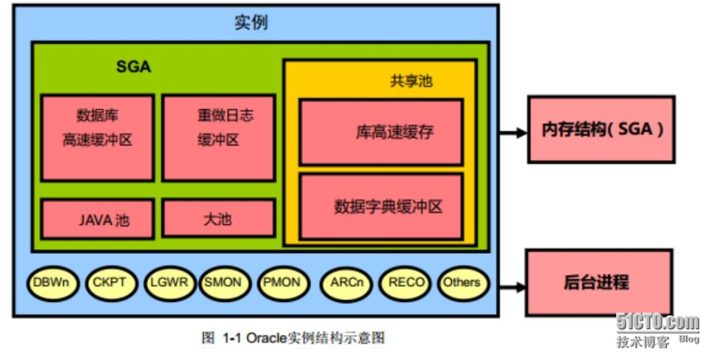

# JDBC

## 各数据库开启驱动及连接方式
1. MySQL(http://www.mysql.com) mysql-connector-java-2.0.14-bin.jar ;
```
  Class.forName( "org.gjt.mm.mysql.Driver" );
  cn = DriverManager.getConnection( 
"jdbc:mysql://MyDbComputerNameOrIP:3306/myDatabaseName", sUsr, sPwd ); 
  ```
2. PostgreSQL(http://www.de.postgresql.org) pgjdbc2.jar ;
```
  Class.forName( "org.postgresql.Driver" ); 
  cn = DriverManager.getConnection( "jdbc:postgresql://MyDbComputerNameOrIP/myDatabaseName", sUsr, sPwd ); 
```
3. Oracle(http://www.oracle.com/ip/deploy/database/oracle9i/) classes12.zip ;
```
  Class.forName( "oracle.jdbc.driver.OracleDriver" ); 
  cn = DriverManager.getConnection( "jdbc:oracle:thin:MyDbComputerNameOrIP:1521:ORCL", sUsr, sPwd ); 
```
4. Sybase(http://jtds.sourceforge.net) jconn2.jar ;
```
  Class.forName( "com.sybase.jdbc2.jdbc.SybDriver" ); 
  cn = DriverManager.getConnection( "jdbc:sybase:Tds:MyDbComputerNameOrIP:2638", sUsr, sPwd ); 
  //(Default-Username/Password: "dba"/"sql") 
```
5. Microsoft SQLServer(http://jtds.sourceforge.net) ;
```
  Class.forName( "net.sourceforge.jtds.jdbc.Driver" ); 
  cn = DriverManager.getConnection( "jdbc:jtds:sqlserver://MyDbComputerNameOrIP:1433/master", sUsr, sPwd ); 
```
6. Microsoft SQLServer(http://www.microsoft.com) ;
```
  Class.forName( "com.microsoft.jdbc.sqlserver.SQLServerDriver" ); 
  cn = DriverManager.getConnection( "jdbc:microsoft:sqlserver://MyDbComputerNameOrIP:1433;databaseName=master", sUsr, sPwd ); 
```
7. ODBC 
```
  Class.forName( "sun.jdbc.odbc.JdbcOdbcDriver" ); 
  Connection cn = DriverManager.getConnection( "jdbc:dbc:" + sDsn, sUsr, sPwd ); 
```
8.DB2 
```
Class.forName("com.ibm.db2.jdbc.net.DB2Driver"); 
  String url="jdbc:db2://192.9.200.108:6789/SAMPLE" 
  cn = DriverManager.getConnection( url, sUsr, sPwd ); 
```
9.access由于access并不是作为一项服务运行，所以url的方法对他不适用。access可以通过odbc，也可以通过服务器映射路径的形式 找到.mdb文件,参见http://rmijdbc.objectweb.org/Access/access.html 

# 数据库
### 关系型数据库
oracle,mysql,mariadb,db2,sqlserver,sybase
### nosql型数据库
redis,mangodb,hbase
********************************
### ORACLE

###### 安装及配置ORACLE
1. 安装oracle
2. 进入到sqlplus(oracle自带的一个cli(command line)的客户端)，输入如下命令：
```
sqlplus /nolog
SQL> conn / as sysdba
[SQL> conn 用户名/密码 [as sysdba](仅仅在连接sys时需要,若不添加则会警告是否为普通操作用户)。]
SQL> alter user scott identified by tiger account unlock;//用户密码修改为tiger。
```
3.安装图形化客户端
 PLSQL Developer
4. 其他配置可以进入：
```
%ORACLE_HOME%\product\11.2.0\dbhome_1\NETWORK\ADMIN\tnsnames.ora
```
###### SQL语言
- DML:增加（INSERT）、修改(UPDATE)、删除(DELETE)、查询(SELECT)
- DDL:建表（CREATE）、删表(DROP)
- DCL:权限控制
*******************
### 查询（PPT1）
###### 查询基本格式
```
SELECT 字段1,字段2
FROM  表名;
```
查询所有字段：
```
SELECT *
FROM 表名;
```
###### ||
字符串连接，相当于 mysql中的 +比如:‘abc’ || 'def' 结果为：'abcdef'；字符串用单引号
###### distinct
用于去除重复行
###### 显示表结构
只能用于sql-plus，用于显示表结构
```
SQL> DESC EMP
Name     Type         Nullable Default Comments 
-------- ------------ -------- ------- -------- 
EMPNO    NUMBER(4)                              
ENAME    VARCHAR2(10) Y                         
JOB      VARCHAR2(9)  Y                         
MGR      NUMBER(4)    Y                         
HIREDATE DATE         Y                         
SAL      NUMBER(7,2)  Y                         
COMM     NUMBER(7,2)  Y                         
DEPTNO   NUMBER(2)    Y                        
SQL> 
```
**********
### 查询的复杂操作（PPT2~3）
###### WHERE、ORDER
1. where  （and、or、 <>）
2. between and ，in ，like，is null
3. order by排序（ASC，DESC），多字段排序：
```
ORDER BY sal DESC，empno ASC
```
###### 伪表DUAL
该表为伪表，专门用于对函数、表达式进行测试的。
###### 字符，数字函数
- lower,upper,initcap（参数）：
将参数转换成全部小写、大写、首字母大写
- concat（str1，str2）：
将字符拼接到一起
- substr（str，开始位置（从1开始），结束位置）：
将字符从指定位置截断
- lpad,rpad（字符，字符长度，填充内容）：
从左或者从右填充字符，如下：
```
SELECT LPAD(12312,7,'*')
FROM   DUAL;

result: **12312
```
- round(数字，何处开始保留)：
根据给定的保留位置四舍五入保留数字：
```
SELECT ROUND(45.926, 2)
FROM   DUAL;

relult： 45.93
```
- trunc（数字，位置）：
将数字的给定位置之后的数据归零，且不显示出来。个位数为0位。
```
SELECT TRUNC(45.926, -1)
FROM   DUAL;

result：40
```
- mod（数字1，数字2）:
将数字1对数字2取余数
- sysdate：
以date格式显示当前日期
- nvl(a,10)、nvl2(a,10,20)：
1. nvl当a为空的时候就把当做10来处理，如果不为空，原值是多少就是多少
2. nvl2当a为空的时候就当做20来处理，如果不为空，就当做10来处理
###### 数据类型转换函数
- to_char：
```TO_CHAR(date\number, 'format_model')```
1. 必须包含在单引号中而且大小写敏感。
2. 可以包含任意的有效的日期格式。


3. 数字格式如下：


- to_number：
```TO_NUMBER(char[,'format_model'] )```
-to_date：
```TO_DATE('12-Jan-90', 'DD-Mon-RR');```
###### 条件判断函数
1. case：
```
CASE expr WHEN comparison_expr1 THEN return_expr1
         [WHEN comparison_expr2 THEN return_expr2
          WHEN comparison_exprn THEN return_exprn
          ELSE else_expr]
END

```
2.decode：
```
DECODE(col|expression, search1, result1 
      [, search2, result2,...,]
      [, default])

```
**********
### 连接（PPT4）
###### 笛卡尔集
省略连接条件或连接条件无效时，oracle只能将两个表的所有表中的所有行互相连接，即成为笛卡尔集
###### 等值连接
```
SELECT	table1.column, table2.column
FROM	table1, table2
WHERE	table1.column1 = table2.column2;

或者

SELECT table1.column, table2.column
FROM table1 JOIN table2
ON table1.column1 = table2.column2;

```
- 多个连接条件使用 AND 操作符
- 使用别名区分多个表
- NATURAL JOIN 子句，会以两个表中具有相同名字的列为条件创建等值连接。
- 在NATURAL JOIN 子句创建等值连接时，可以使用 USING 子句指定等值连接中需要用到的列。


###### 非等值连接
```
SELECT e.last_name, e.salary, j.grade_level
FROM   employees e, job_grades j
WHERE  e.salary 
       BETWEEN j.lowest_sal AND j.highest_sal;

```
###### 外连接
- 使用外连接可以查询不满足连接条件的数据。
- 两个表在连接过程中除了返回满足连接条件的行以外还返回左（或右）表中不满足条件的行 ，这种连接称为左（或右） 外联接。
- 两个表在连接过程中除了返回满足连接条件的行以外还返回两个表中不满足条件的行 ，这种连接称为满 外联接。
- 使用+号的原则是那边数据较少使用在哪边，或者哪边数据较多，使用相应边的JOIN语句
```
SELECT	table1.column, table2.column
FROM	table1, table2
WHERE	table1.column(+) = table2.column;

或者

SELECT	table1.column, table2.column
FROM	table1 LEFT OUTER JOIN table2
ON	    table1.column = table2.column;
```
###### 自连接
```
SELECT worker.last_name || ' works for ' 
       || manager.last_name
FROM   employees worker, employees manager
WHERE  worker.manager_id = manager.employee_id ;

```
********
### 分组函数（PPT5）
###### 常见分组函数
max（该列最大值）,min（该列最小值）,avg（该列平均值）,sum（该列总和）,count（该列行数）。
**以上函数忽略空值**
###### 如何分组
使用GROUP BY
需要查询的列必须存在于分组函数或者group中，不然会报错。
###### 分组中选择
不能使用WHERE 直接处理分组函数，但可以使用HAVING替换。
###### 查询大体顺序
```
   SELECT
   FROM
   WHERE
   GROUP BY 
   HAVING
   ORDER BY
```
********
### 子查询（PPT6）
 子查询 (内查询) 在主查询之前一次执行完成。
- 子查询的结果被主查询使用 (外查询)。
- 子查询要包含在括号内。 
- 将子查询放在比较条件的右侧。
- 除非进行Top-N 分析，否则不要在子查询中使用ORDER BY 子句。
- 单行操作符对应单行子查询，多行操作符对应多行子查询。
********
### 数据增删改（PPT8）
###### 增加数据
```
INSERT INTO 表名 VALUES(值1，值2，值3...)
INSERT INTO 表名(字段1，字段2，字段3...) VALUES (值1，值2，值3...)
INSERT INTO 表名 SELECT * FROM 表名
INSERT INTO 表名(字段1，字段2，字段3...) SELECT 字段1，字段2，字段3 ... FROM 表名
```
###### 更新数据
```
UPDATE 表名 SET 字段1=值1 WHERE
UPDATE 表名 SET 字段1=值1,字段2=值2 WHERE 

相关更新
UPDATE 表1 SET 字段=(SELECT 字段 FROM 表2 WHERE 表1.关联字段=表2.关联字段)
```
###### 删除数据
DELETE FROM 表名 WHERE
DELETE FROM 表名;
- DELETE和TRUNCATE
1、DELETE可以删除满足条件的，但是TRUNCATE只能全清除
2、DELETE删除的数据可以回滚，但是TRUNCATE不能回滚
3、都来做清除的时候TRUNCATE效率高(HW high water)
###### 事务：
转账：张三---->李四
1、从张三的账户上减去80000
2、从李四账户加上80000
	
- 事务的特性：ACID
  A:原子性
  C：一致性
  I：隔离性
  D：持久性
- 事务开始：执行了一个DML命令之后会自动开启
- 事务结束：commit、rollback、执行了一个DDL、DCL命令、正常结束或者非正常结束
- 错误ORA-01555：事务a执行了一个DML命令，但没有及时commit，其他事务同时执行了许多的DML命令，使得数据库暂存区装满，新的命令覆盖了事务a执行的DML命令，此时事务a执行commit命令时，就会报错

###### 事务隔离：
```
 没有隔离级别会出现的问题：
       1、丢失更新
					1000
			卡             存折
			事务开启
			1000           事务开启
			存100            1000
			                 取了200
			提交             
							提交
							800
       2、脏读
	       		 1000
			卡             存折
			事务开启
			1000           事务开启
			存100            1000
			                 查询
							 1100
			读到了别人还未提交的数据
	   3、不可重复读
					1000
			卡             存折
			事务开启
			1000           事务开启
			存100            1000
			 提交            查询
							 1100
	   4、幻读
	        事务1
			10            事务2
			                10
		     增加1人       
			 提交         
                            11
    
```
1. 未提交读:如果一个事务已经开始写数据，则另外一个数据则不允许同时进行写操作，但允许其他事务读此行数据。该隔离级别可以通过“排他写锁”实现。（写的时候，任何时候都可以读，写的时候别人不能写）
2. 提交读：读取数据的事务允许其他事务继续访问该行数据，但是未提交的写事务将会禁止其他事务访问该行。这可以通过“瞬间共享读锁”和“排他写锁”实现。（写的时候，必须提交了以后才能读，读的时候可以写）
3. 可重复读：读取数据的事务将会禁止写事务（但允许读事务），写事务则禁止任何其他事务。(读的时候不能写，写的时候不能读和写)
4. 串读:提供严格的事务隔离。它要求事务序列化执行，事务只能一个接着一个地执行，但不能并发执行。如果仅仅通过“行级锁”是无法实现事务序列化的，必须通过其他机制保证新插入的数据不会被刚执行查询操作的事务访问到。（读写排队一个一个来）

###### 操作隔离级别
- 使用:select @@tx_isolation可以查询当前的隔离级别
- 改变隔离级别：```set session|global transaction isolation level read uncommitted | read committed|repeatable read| serializable;```
- 开启事务：start transaction;
- mysql默认的隔离级别是 repeatable read
- oracle默认的隔离级别是 read committed

###### 锁
 - 共享锁(s锁）：若事务T对数据D加S锁，则其它事务只能对D加S锁，而不能加X锁，直至T释放D上的S锁；一般要求在读取数据前要向该数据加共享锁，所以共享锁又称为读锁。

- 排它锁(x锁,独占锁）：若事务T对数据D加X锁，则其它任何事务都不能再对D加任何类型的锁，直至T释放D上的X锁；一般要求在修改数据前要向该数据加排它锁，所以排它锁又称为写锁。

### 表格的创建删除（PPT9）
常见的数据库对象：表、视图、
序列、索引、同义词
###### 字段的类型
- id number(6，3)：表示id最多只能是6个字符，且有3个字符必须为小数，故最大值为999.999
- varchar2变长的字符串
- char：定长的字符串,不够的用空格补
- long:在一个表中只允许存在一个列为long
- blob与clob：在一个表中可以有多列为blob和clob， blob：存一切，clob：存文本
- rowid：数据实在的存储位置
###### 数据字典
用户建的表就叫表
oracle系统中会有一些表来管理我们用户的表，对oracle内置这些表称为数据字典，如user_tables
###### 创建表
- 没有创建表的权限：以最高权限用户进去对scott用户授创建表权限
```
>sqlplus /nolog
SQL> conn / as sysdba
已连接。
SQL> conn sys/orcl as sysdba
已连接。
SQL> grant create table to scott;
授权成功。
```
- 创建表
```
常规创建
CREATE TABLE t_user(id number(5),name varchar2(10))
使用子查询
create table emp_bak 
as select * from emp
创建表只要表结构，不要数据
create table emp_bak1
as select * from emp where 1=2
```
###### 表的管理
- 增加列：
```
ALTER TABLE t_user ADD (name2 varchar2(10))
```
- 修改列：只能修改列的类型，不能修改列名
```
ALTER TABLE t_user MODIFY (name2 number(10))
```
- 删除列：
```
常规删除
ALTER TABLE t_user DROP COLUMN name2
先设置禁止使用，再在空闲时期删除	  
ALTER TABLE t_user SET UNUSED (name1)
ALTER TABLE t_user DROP UNUSED COLUMNS
```
###### 表的其他操作
- 删除表：
```drop table 表名;```
- 重命名表：
```rename 原名 to 新名;```
- 清空表
```TRUNCATE TABLE 表名;```
*********
### 约束（PPT10）
用于约束数据，避免储存错误数据，但实际使用中应该尽可能通过程序来限制数据，而不是使用数据库来检查。
###### not null
数据不能为空值
```
CREATE.......
CONSTRAINT emp_hiredate_nn
NOT NULL

ALTER TABLE......
MODIFY CONSTRAINT emp_hiredate_nn
NOT NULL
```
###### unique
数据不能重复
```
CREATE.......
CONSTRAINT emp_hiredate_un
UNIQUE(column)

ALTER TABLE......
ADD CONSTRAINT emp_hiredate_un
UNIQUE(column)
```
###### primary key
主键，数据不能为空值以及不能重复
代码写法同unique
###### foreign key
外键，数据约束必须满足其他表链接的列的唯一键约束
- ON DELETE CASCADE: 当父表中的列被删除是，子表中相对应的列也被删除
- ON DELETE SET NULL: 子表中相应的列置空

```
CONSTRAINT emp_dept_fk FOREIGN KEY (department_id)
REFERENCES departments(department_id),
```
###### check
设置其他自定义约束条件
```
CONSTRAINT emp_salary_min  
CHECK (salary > 0)
```
###### primary key 和unuqie区别？
**************
### 视图（PPT11）
###### 什么是视图？
- 控制数据访问
- 简化查询
- 数据独立性
- 避免重复访问相同的数据
###### 创建视图
```CREATE [OR REPLACE] VIEW 视图名 AS xx(子查询)```
1. 视图的数据是否可以修改
  可以，如果要限制视图不能修改可以在建视图的时候指定with read only
  ```
CREATE OR REPLACE VIEW v_emp AS
SELECT empno,ename
FROM emp
WITH READ ONLY
```
2. 修改了数据是否会影响到原表？
  影响，因为指向同一个rowid
###### 删除视图
```DROP VIEW 视图名```
###### 显示视图结构
```DESC 视图名;```
###### 物化视图
- 普通视图的数据和基表的数据是同一份数据
- 物化视图的数据和基表的数据不是同一份数据	
###### 查询重写
######  rownum
- 是一个伪列，可以生成表的行号（从1开始），但是直接使用该伪列，选择没有1的行时会出问题
- 想要利用伪列，一般是现将伪劣显示出来，再在父表上使用已经转化成常规列的rownum
- 常用于分页
*************
### 索引，序列，同义词（PPT12）
#### 序列
###### 创建序列
```CREATE SEQUENCE 序列名```
###### 使用序列
- nextval：拿到下一个值
- currval:获取当前的值
###### 作用
- 主要用于提供主键值
- 代替应用代码
- 将序列值装入内存可以提高访问效率
###### 裂缝
表a使用了某序列，表b也使用了某序列，有序序列号是共享的，所以可能出现表里面的序号并不是连续的。
#### 索引
###### 索引作用
通过快速定位数据的方法，减少磁盘 I/O，索引是不是越多越好
###### 索引的创建：
```CREATE INDEX 索引名 ON 表名(列名1,列名2...)```
###### 什么时候使用索引
--表的数据量大，但是返回的数据量小（2%-4%）
###### 删除索引
```DROP INDEX 索引名```
###### 使用索引（必须要将用到的索引放在where后面）
- 不是放在where后面的一定都会去找索引
 1. where后面的 字段本身没有建索引
 2. 针对数据量少的情况，没有必要走索引
 3. 匹配规则(联合索引)，左匹配规则
 4. null值不能被索引
####  同义词
创建：CREATE SYNONYM 同义词名称 FOR xx;
删除同义词：DROP SYNONYM 同义词名称
###### 作用
1) 多用户协同开发中，可以屏蔽对象的名字及其持有者。如果没有同义词，当操作其他用户的表时，必须通过user名.object名的形式，采用了Oracle同义词之后就可以隐蔽掉user名。
2) 为用户简化sql语句。同时如果自己建的表的名字很长，可以为这个表创建一个Oracle同义词来简化sql开发。
3) 为分布式数据库的远程对象提供位置透明性。
 ####  dblink
1、保证在tnsnames中配置的字符串能连接到对方的服务器
2、创建database link
3、使用
		   select * from emp@efg(efg就是建立的db link名称)
两台都是oracle情况才能连接
**************
### 数据库表设计三范式及表的关系
####    表的设计工具：
先建立数据模型（power designer）
#### 三范式
1. 原子性，即每个字段都不可以在分割了。
2. 唯一性，即每个表只描述一个实体，这个实体要有主键，非主关键字要完全依赖主键，正因为说是完全依赖，是因为在组合主键存在的情况下，非主关键字不能只依赖部分关键字。
3. 独立性，一个表中不能包含其他表中已经存在的非主键字段信息，也就是说只可以包含其他表的主键信息，非主键字段信息相对独立，为了减少数据冗余。
#### 表之间的关系
###### 判断规则
表与表之间的关系始终要站在两张表的角度分别进行判断。
###### 一对一关系
两个角度都是一张表对应一张表的情况。
设计思路：
1. 通过主键关联
```
用户：身份证号(pk)   姓名   性别
身份证 ：身份证号(pk)   发证机关   有效期
```
2. 通过外键关联
只需要在一端拥有另外一端的外键
```
用户    ：编号(pk)   姓名   性别   身份证号(fk)
身份证  ：身份证号(pk)   发证机关   有效期
			   
或者：
用户    ：编号(pk)   姓名   性别  
身份证  ：身份证号(pk)   发证机关   有效期   用户表的编号(fk)
```
###### 一对多的关系
站在一端来说是一对多，站在另外一端来说是一对一。
设计思路：
在多的一端拥有一的一端的外键
###### 多对多的关系
站在两端来说，都是一对多
设计思路：一定要引入第三张表(中间表)
```
用户表：编号(pk)   姓名  
角色表：编号(pk)   名称
用户角色关系表（联合主键）：用户编号(pk)    角色编号(pk)
用户角色关系表（独立主键）：编号(pk)     用户编号(pk)    角色编号(pk)
```
**********
### 授权（PPT13）
认证：让系统知道你是谁？
授权：你能在系统里面做什么？
#### 用户
###### 创建用户
```
CREATE USER 用户名 IDENTIFIED BY 密码;
```
###### 修改密码
```
ALTER USER scott IDENTIFIED BY 新密码 ;
```
###### 授权
```
 GRANT 权限 TO 用户;
```
###### 部分授权
```
grant select(empno,ename)
on emp
to scott
```
###### 回收授权
```
1. revoke 权限 from 用户[角色];	 
2. revoke 权限 on 对象 from 用户[角色];
```

#### 角色
###### 创建角色
```
CREATE ROLE manager;
```
###### 为角色赋予权限
```
GRANT create table, create view 		  
TO manager; 

```
###### 将角色赋予用户
```
GRANT manager TO DEHAAN, KOCHHAR;     
```
*******
### set操作（PPT15）
统一操作方法
```
SELECT *
FROM EMP
SET操作
SELECT *
FROM DEPT
```
###### UNION
连接，但是有重复的会剔除
###### UNION ALL
连接，不去除重复的
###### INTERSECT
两个集合取交集
###### minus
两个集合取补集，相当于第一个表的元素减去第二张表，相同的去掉，第一张不相同的元素留下，与第二张表不相同的无关
********
### 分组函数扩展
#### rollup
```
GROUP BY ROLLUP (group_by_expression1, group_by_expression2)
```
ROLLUP 产生n + 1种分组结果，例如上面的代码，分别是同时考虑expression1、expression2条件的结果，考虑expression1条件的结果，以及全部条件都不考虑的结果，共3种情况。
**一般用作小计**
#### cube
```
GROUP BY CUBE (group_by_expression1, group_by_expression2)
```
CUBE 产生2的次方种分组结果，例如上面的代码，分别是同时考虑expression1、expression2条件的结果，考虑expression1条件的结果，考虑expression2条件的结果，以及全部条件都不考虑的结果，共4种情况。
#### grouping
```
SELECT .... GROUPING(expression1), GROUPING(expression2)
...
GROUP BY ROLLUP OR CUBE (group_by_expression1, group_by_expression2)
```
- 使用 GROUPING 函数，可以找到哪些列在该行中参加了分组
- GROUPING 函数返回 0 或 1,当该列值为空返回1。
#### grouping set
```
GROUP BY GROUPING SETS  ((department_id,job_id), (job_id,manager_id));
```
用于取代普通的groupby语句和set的组合。
*******
### 行列转换
就是将形如下表：

转换成形如此表：

方法：
```
SELECT name,
		SUM(DECODE(course,'语文',score,0)) 语文,
		SUM(DECODE(course,'数学',score,0)) 数学,
		SUM(DECODE(course,'物理',score,0)) 物理
	FROM kechen
	GROUP BY name
	
	
SELECT name,sum(case course when '语文' then score else 0 end) 语文,sum(case course when '数学' then score else 0 end) 数学,sum(case course when '物理' then score else 0 end) 物理
FROM kechen
GROUP BY name
```
*******
### 剔除重复数据
```
create table myrole as select * from t_role;

insert into myrole(name,description) values ('zs','123');
insert into myrole(name,description) values ('zs','123');
insert into myrole(name,description) values ('zs','123');
insert into myrole(name,description) values ('zs','123');

mysql:
delete from myrole where id not in (select sub.* from (select min(id) as id from myrole group by name,description) as sub);
oracle:
delete from myrole where rowid not in (select min(rowid) from myrole group by name,description);
```
********
### 子查询扩展（PPT18）
#### 存在查询(exists)	
```
SELECT employee_id, last_name, job_id, department_id
FROM   employees outer
WHERE  EXISTS ( SELECT 'X'
                 FROM   employees
                 WHERE  manager_id =  outer.employee_id
               );

```
用于取代WHERE IN，NOT EXISTS则为不存在查询。
#### with语句
使用 WITH 子句, 可以避免在 SELECT 语句中重复书写相同的语句块
```
WITH dept_costs  AS (
   SELECT  d.department_name, SUM(e.salary) AS dept_total
   FROM    employees e, departments d
   WHERE   e.department_id = d.department_id
   GROUP BY d.department_name
),
avg_cost    AS (
   SELECT SUM(dept_total)/COUNT(*) AS dept_avg
   FROM   dept_costs
)
SELECT * 
FROM   dept_costs 
WHERE  dept_total >
        (SELECT dept_avg 
         FROM avg_cost)
ORDER BY department_name;
```
*******
### 多级查询
```
SELECT empno, ename, job, mgr,level
FROM   emp
START  WITH  empno = 7839 --从哪开始
CONNECT BY PRIOR empno = mgr --从上到下
EMPNO ENAME      JOB         MGR      LEVEL
----- ---------- --------- ----- ----------
 7839 KING       PRESIDENT                1
 7566 JONES      MANAGER    7839          2
 7788 SCOTT      ANALYST    7566          3
 7876 ADAMS      CLERK      7788          4
 7902 FORD       ANALYST    7566          3
 7369 SMITH      CLERK      7902          4
 7698 BLAKE      MANAGER    7839          2
 7499 ALLEN      SALESMAN   7698          3
 7521 WARD       SALESMAN   7698          3
 7654 MARTIN     SALESMAN   7698          3
 7844 TURNER     SALESMAN   7698          3
 7900 JAMES      CLERK      7698          3
 7782 CLARK      MANAGER    7839          2
 7934 MILLER     CLERK      7782          3
14 rows selected


SELECT empno, ename, job, mgr,level
FROM   emp
START  WITH  empno = 7934 --从哪开始
CONNECT BY PRIOR mgr = empno --从下到上
EMPNO ENAME      JOB         MGR      LEVEL
----- ---------- --------- ----- ----------
 7934 MILLER     CLERK      7782          1
 7782 CLARK      MANAGER    7839          2
 7839 KING       PRESIDENT                3
```
- 其中SECECT中的level是个伪列，代表了该行与子级查询开始的元素相差几个层级。
其中，代码：
```CONNECT BY PRIOR column1 = column2```
- 父级关键字在前面，则从顶向底查询，反之则从底向顶查询。
- 通过where可以增加筛选条件，修剪枝叶。
*****************
### 其他（PPT20）
#### 外部表
```
CREATE DIRECTORY emp_dir AS 'e:/abc'  --在本地建立好文件夹及外部文档用于转换成外部表
  
CREATE TABLE EXTER_TEST    --创建外部表，设置外部表的各列数据类型，与外部文档数据应对应
(
     ID              NUMBER(5)      ,
     NAME            VARCHAR(12)    ,
     SEX             VARCHAR(8)     ,
     AGE             NUMBER(3)      
) ORGANIZATION EXTERNAL   --告诉系统这是外部表
(
            type oracle_loader              --调用oracle的加载器
            default directory emp_dir    --设置默认文件夹为刚才创建好的文件夹
            access parameters
            (
                    records delimited by newline    --外部文档的每一行为表的每一行
                    fields terminated by ','    --以外部文档的每个，分割每一行，生成相应字段
            )
            location ('test.txt')     --加载的外部文档名字
);
```
#### insert多表插入
###### 无条件
```
INSERT  ALL   
INTO sal_history VALUES(EMPID,HIREDATE,SAL)
INTO mgr_history VALUES(EMPID,MGR,SAL)
SELECT employee_id EMPID, hire_date HIREDATE,salary SAL,manager_id MGR 
FROM  employees   
WHERE employee_id > 200;
```
###### 有条件
```
INSERT ALL  
WHEN SAL > 10000 THEN   INTO sal_history VALUES(EMPID,HIREDATE,SAL)  
WHEN MGR > 200   THEN   INTO mgr_history VALUES(EMPID,MGR,SAL)  
SELECT employee_id EMPID,hire_date HIREDATE,  
salary SAL, manager_id MGR 
FROM   employees    
WHERE  employee_id > 200;
```
