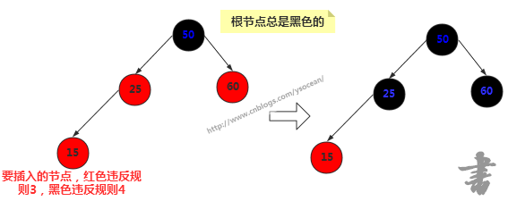

# 树
同时具备数组查找快的优点以及链表插入和删除快的优点
## 二叉树
树的每个节点最多只能有两个子节点，其中有一种特殊的二叉树，若它的左子树不空，则左子树上所有结点的值均小于它的根结点的值； 若它的右子树不空，则右子树上所有结点的值均大于它的根结点的值； 它的左、右子树也分别为二叉排序树。
#### 特点
如果插入的数据是随机的，则效率很高，但是如果插入的数据是有序的，比如从小到大的顺序【10,20,30,40,50】插入到二叉搜索树中，从大到小就是全部在左边，这和链表没有任何区别了，这种情况下查找的时间复杂度为O(N)，而不是O(logN)。当然这是在最不平衡的条件下，实际情况下，二叉搜索树的效率应该在O(N)和O(logN)之间，这取决于树的不平衡程度。
#### 节点属性
比较主要的是：
保存的数据
左节点
右节点
#### 二叉树类
比较主要的属性是：
根节点
比较主要的方法是：
插入（从根开始遍历向下，比较大小直到找到该插入的位置，将父类引用指向该节点）
查找（从根开始遍历向下，比较大小直到找到该值）
查找最大值，最小值（从根开始遍历向下，一直找最左边或者最右边）
遍历：
前序顺序是（根节点排最先，然后先左后右，递归实现）；
中序顺序是(先左后根最后右，递归实现）；
后序顺序是（先左后右最后根，递归实现）。
删除：
分为删除节点没有子节点，有一个子节点和有两个子节点
1. 没有子节点，直接删除父节点的引用指向
2. 有一个子节点，将父节点的相应方向的引用指向子节点
3. 有两个子节点，找到需要删除节点的继承节点（删除节点右子节点的最左子节点），如果正好就是删除节点的右节点，则让删除节点的父节点引用指向该继承节点。如果是删除节点右节点的左子节点，则在此之前多做一步事，让继承节点的右节点接在继承节点父节点的右边。继承节点再去接删除节点的父节点，左右节点。
###### 代码
接口
```
package cn.kgc.tree;

/**
 * @ProjectName: algorithm
 * @Package: cn.kgc.tree
 * @ClassName: BinaryTree
 * @Author: Xu.Xin
 * @Description: 二叉树的接口
 * @Date: 2018/10/11 18:38
 * @Version: 1.0
 */
public interface BinaryTree<T extends Comparable<T>> {
    boolean insert(T key);
    Node<T> find(T key);
    boolean delete(T key);
    Node<T> findMax();
    Node<T> findMin();
    void infixOrder();
    void preOrder();
    void postOrder();

    /**
     * @ProjectName: algorithm
     * @Package: cn.kgc.tree
     * @ClassName: Node
     * @Author: Xu.Xin
     * @Description: 节点接口
     * @Date: 2018/10/12 11:59
     * @Version: 1.0
     */
    interface Node<T extends Comparable<T>> {
        void display();
    }


}
```
实现
```
package cn.kgc.tree;

/**
 * @ProjectName: algorithm
 * @Package: cn.kgc.tree
 * @ClassName: MyBinaryTree
 * @Author: Xu.Xin
 * @Description: 二叉树的实现
 * @Date: 2018/10/11 18:50
 * @Version: 1.0
 */
public class MyBinaryTree<T extends Comparable<T>> implements BinaryTree<T> {


    private MyNode<T> root;
    @Override
    public boolean insert(T key) {
        if(key == null) {
            return false;
        }
        if(root == null) {
            root = new MyNode<>(key);
        } else {
            MyNode<T> current = root;
            MyNode<T> next;
            int result;
            while((result = current.getData().compareTo(key)) != 0) {
                next = (result > 0) ? current.getLeftChild() : current.getRightChild();
                if(next == null) {
                    if(result > 0) {
                        current.setLeftChild(new MyNode(key));
                    } else {
                        current.setRightChild(new MyNode(key));
                    }
                } else {
                    current = next;
                }
            }
        }
        return true;
    }

    @Override
    public Node<T> find(T key) {
        if(key == null || root == null) {
            return null;
        }
        MyNode<T> current = root;
        int result;
        while((result = current.getData().compareTo(key)) != 0) {
            current = (result > 0) ? current.getLeftChild() : current.getRightChild();
            if(current == null) {
                return null;
            }
        }
        return current;
    }


    @Override
    public Node<T> findMax() {
        MyNode<T> current = root;
        MyNode<T> max = current;
        while(current != null) {
            max = current;
            current = current.getRightChild();
        }
        return max;
    }

    @Override
    public Node<T> findMin() {
        MyNode<T> current = root;
        MyNode<T> min = current;
        while(current != null) {
            min = current;
            current = current.getLeftChild();
        }
        return min;
    }

    @Override
    public boolean delete(T key) {
        MyNode<T> current = root;
        MyNode<T> parentNode = null;
         boolean isLeft = true;
        while(current != null && current.data.compareTo(key) != 0) {
            parentNode = current;
            if(current.data.compareTo(key) > 0) {
                isLeft = true;
                current = current.leftChild;
            } else if(current.data.compareTo(key) < 0) {
                isLeft = false;
                current = current.rightChild;
            }
        }
        if(current == null) {
            return false;
        }
        return delete(current,parentNode,isLeft);
    }

    private boolean delete(MyNode<T> delNode, MyNode<T> parentNode, boolean isLeft) {
        if(delNode == root) {
           root = null;
           return true;
        }
       switch(delNode.getChildCount()) {
           case 0:
               parentNode.deleteChild(isLeft);
               break;
           case 1:
               if(delNode.leftChild != null) {
                   parentNode.insertChild(isLeft,delNode.leftChild);
                   delNode.leftChild = null;
               } else {
                   parentNode.insertChild(isLeft,delNode.rightChild);
                   delNode.rightChild = null;
               }
               break;
           case 2:
               MyNode<T> successor = getSuccessor(delNode);
               parentNode.insertChild(isLeft,successor);
               delNode.leftChild = null;
               delNode.rightChild = null;
               break;
           default:
               break;
       }
        return false;
    }

    private MyNode<T> getSuccessor(MyNode<T> delNode) {
        MyNode<T> successorParent = delNode;
        MyNode<T> successor = delNode.rightChild;
        MyNode<T> current = successor.leftChild;
        while(current != null) {
            successorParent = successor;
            successor = current;
            current = current.leftChild;
        }
        if(delNode.rightChild != successor) {
            successor.leftChild = delNode.leftChild;
            successorParent.leftChild = successor.rightChild;
            successor.rightChild = delNode.rightChild;
        }
        return successor;
    }

    @Override
    public void infixOrder() {
        infixOrder(root);
    }

    private void infixOrder(MyNode<T> current) {
        if(current != null) {
            infixOrder(current.getLeftChild());
            current.display();
            infixOrder(current.getRightChild());
        }
    }

    @Override
    public void preOrder() {
        preOrder(root);
    }

    private void preOrder(MyNode<T> current) {
        if(current != null) {
            current.display();
            infixOrder(current.getLeftChild());
            infixOrder(current.getRightChild());
        }
    }

    @Override
    public void postOrder() {
        postOrder(root);
    }

    private void postOrder(MyNode<T> current) {
        if(current != null) {
            infixOrder(current.getLeftChild());
            infixOrder(current.getRightChild());
            current.display();
        }
    }


    /**
     * @ProjectName: algorithm
     * @Package: cn.kgc.tree
     * @ClassName: Node
     * @Author: Xu.Xin
     * @Description: 二叉树节点
     * @Date: 2018/10/11 18:43
     * @Version: 1.0
     */
    public class MyNode<T extends Comparable<T>> implements Node<T>{
        private T data;
        private MyNode<T> leftChild;
        private MyNode<T> rightChild;


        private MyNode(T data) {
            this.data = data;
        }

        @Override
        public void display() {
            System.out.println(data);
        }
        private T getData() {
            return data;
        }

        private void setData(T data) {
            this.data = data;
        }

        private MyNode getLeftChild() {
            return leftChild;
        }

        private void setLeftChild(MyNode leftChild) {
            this.leftChild = leftChild;
        }

        private MyNode getRightChild() {
            return rightChild;
        }

        private void setRightChild(MyNode rightChild) {
            this.rightChild = rightChild;
        }

        private int getChildCount() {
            int count = 0;
            if(leftChild != null) {
                count++;
            }
            if(rightChild != null) {
                count++;
            }
            return count;
        }

        @Override
        public String toString() {
            return "Node{" +
                    "data=" + data +
                    ", leftChild=" + leftChild +
                    ", rightChild=" + rightChild +
                    '}';
        }

        public void deleteChild(boolean isLeft) {
            if(isLeft) {
                leftChild = null;
            } else {
                rightChild = null;
            }
        }

        public void insertChild(boolean isLeft, MyNode<T> child) {
            if(isLeft) {
                leftChild = child;
            } else {
                rightChild = child;
            }
        }
    }

}

```
*****
## 红黑树
为了能够以较快的时间O(logN)来搜索一棵树，我们需要保证树总是平衡的（或者大部分是平衡的），也就是说每个节点的左子树节点个数和右子树节点个数尽量相等。红-黑树的就是这样的一棵平衡树，对一个要插入的数据项（删除也是），插入例程要检查会不会破坏树的特征，如果破坏了，程序就会进行纠正，根据需要改变树的结构，从而保持树的平衡。
#### 问题
但是由于插入，删除等都可能涉及到旋转，导致插入，删除效率不比二叉树高。但是对于有序的数据，红黑树依然能保证高效的查询效率
#### 节点属性
红黑布尔值
保存数据
左节点
右节点
父节点
#### 自我修复
红-黑树主要通过三种方式对平衡进行修正，改变节点颜色、左旋和右旋。

###### 改变节点颜色

　　

　　新插入的节点为15，一般新插入颜色都为红色，那么我们发现直接插入会违反规则3，改为黑色却发现违反规则4。这时候我们将其父节点颜色改为黑色，父节点的兄弟节点颜色也改为黑色。通常其祖父节点50颜色会由黑色变为红色，但是由于50是根节点，所以我们这里不能改变根节点颜色。

###### 右旋

　　首先要说明的是节点本身是不会旋转的，旋转改变的是节点之间的关系，选择一个节点作为旋转的顶端，如果做一次右旋，这个顶端节点会向下和向右移动到它右子节点的位置，它的左子节点会上移到它原来的位置。右旋的顶端节点必须要有左子节点。

　　
```
 * 左旋示意图：对节点y进行右旋
 *        p                   p
 *       /                   /
 *      y                   x
 *     / \                 / \
 *    x  ry   ----->      lx  y
 *   / \                     / \
 * lx  rx                   rx ry
```
右旋做了三件事：
 * 将x的右子节点赋给y的左子节点,并将y赋给x右子节点的父节点(x右子节点非空时)
 * 将y的父节点p(非空时)赋给x的父节点，同时更新p的子节点为x(左或右)
 * 将x的右子节点设为y，将y的父节点设为x

###### 左旋

　　左旋的顶端节点必须要有右子节点。

　　
```
 * 左旋示意图：对节点x进行左旋 
 *     p                       p 
 *    /                       / 
 *   x                       y 
 *  / \                     / \ 
 * lx  y      ----->       x  ry 
 *    / \                 / \ 
 *   ly ry               lx ly 
```
左旋做了三件事： 
 * 将y的左子节点赋给x的右子节点,并将x赋给y左子节点的父节点(y左子节点非空时) 
 * 将x的父节点p(非空时)赋给y的父节点，同时更新p的子节点为y(左或右) 
 * 将y的左子节点设为x，将x的父节点设为y 

 　　**注意**：我们改变颜色也是为了帮助我们判断何时执行什么旋转，而旋转是为了保证树的平衡。光改变节点颜色是不能起到任何作用的，旋转才是关键的操作，在新增节点或者删除节点之后，可能会破坏二叉树的平衡，那么何时执行旋转以及执行什么旋转，这是我们需要重点关注的。
