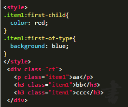
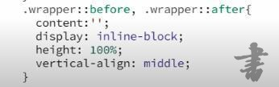
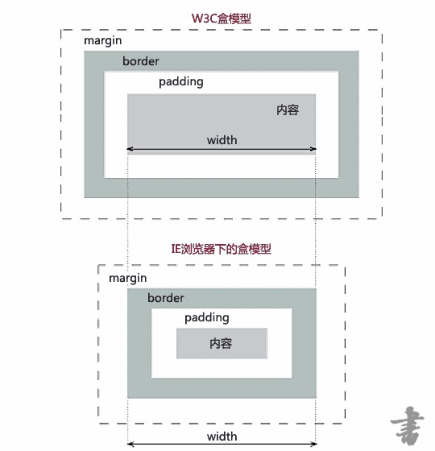
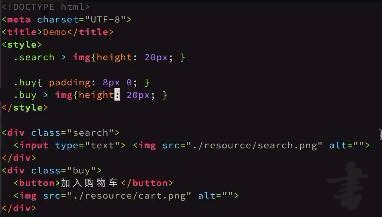
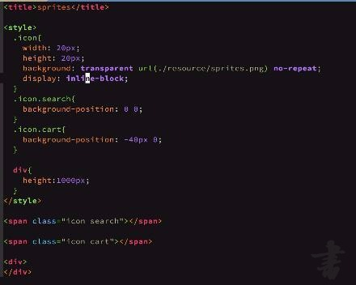
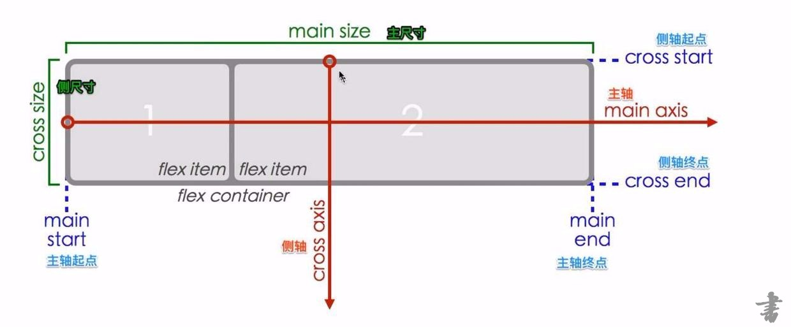
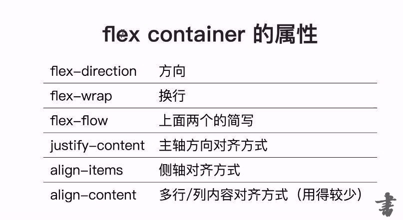
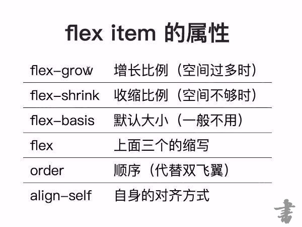

## css的全称是什么
Cascading Style Sheets（层叠样式表），用于给HTML页面添加布局，增加样式
*****
## css有哪几种引入方式？link和@import有什么区别
1. 内联式
直接用属性值style=“XXX”写在html中需要使用样式的各类标签里，例如 `<p style="color:red;font-size:20px">this is some text</p>`。
2. 内部式
直接在html的<head>标签中加入<style>XXX</style>。形如：
```
<!DOCTYPE html>
<html>
<head>
  <meta charset="utf-8">
  <title>JS Bin</title>
  <style>
    p {
      color:red;
      font-size:20px;
      }
  </style>
</head>
<body>
<p>this is some text</p>
</body>
</html>
```
3. 外部式
单独编制.css文件，并在html的中采用`<link rel="stylesheet" type="text/css" href="css文件路径">` 引入样式。
4. 导入式
单独编制.css文件，并在html的<head>标签中加入`<style>@import url（“css文件路径”）</style>` 引入样式。
###### link标签引入的css文件和用@import导入的css的区别
- link属于HTML标签，可以用在任何地方，而@import完全是CSS的语法，只能用在style标签中。

- 加载顺序的差别。当一个页面被加载的时候，link引用的CSS会同时被加载，而@import引用的CSS 会等到页面全部被下载完再被加载。
- 兼容性的差别，由于@import是CSS2.1提出的所以老的浏览器不支持，@import只有在IE5以上的才能识别，而link标签无此问题。
- 使用dom控制样式时的差别。当使用javascript控制dom去改变样式的时候，只能使用link标签，因为@import不是dom可以控制的。
*****
## 引用css样式的路径
- css/a.css 相对路径，以当前html页面所在目录为基准来定位目标文件。

- ./css/a.css 仍然是相对路径，前面两个字符“./”代表当前目录，可以不加，与上述路径相同。
- b.css 相对路径，在当前html页面所在目录中的b.css文件。
- ../imgs/a.png 相对路径，在当前html页面所在目录的上一级目录中有一个imgs文件夹，imgs文件下有- a.png文件。
- /Users/hunger/project/css/a.css绝对路径，文件或目录在计算机上的真正位置，在本地计算机上可以通过该路径找到a.css文件。
- /static/css/a.css 网络路径，从网站的根目录到达a.css文件。
****
## 如果我想在js.jirengu.com上展示一个图片，需要怎么操作?
由于jsbin是一个在线代码编辑工具，其所使用的网络协议为http协议，因此在jsbin上无法引用采用file协议的本地链接，无论你想在js.jirengu.com上展示一张图片，还是引用一个css样式，都需要先将图片（或其他）上传到网络中，获取其网络链接路径。
可以通过专门的网站将文件上传，获取网络链接。如 [极简图床](http://yotuku.cn/#/)。
缺点是如果该网站挂掉了，图片也跟着挂点了。
*****
## 列出5条以上html和 css 的书写规范
###### HTML书写规范
1. 为每个HTML页面的第一行添加标准模式（standard mode）的声明
2. HTML属性应当按照一定的顺序依次排列，来确保代码的易读性
3. 标签、属性、属性命名由小写英文、数字和_组成，且所有标签必须闭合，属性值必须用双引号""
4. 避免使用中文拼音尽量简易并要求语义化
5. 多用无兼容性问题的HTML内置标签
###### 细化HTML书写规范
1. 命名技巧
- 语义化标签优先
- 基于功能命名、基于内容命名、基于表现命名（不推荐基于表现命名，因为设计经常会有变动，变动最频繁的则是一个元素的表现形式，若用表现来命名，一旦改动其表现，那么要么需要逐一修改命名，要么就只有让其命名与实际表现不符，都是不可取的。）
- 简略、明了、无后患
```
.wrap或.wrapper -- 用于外侧包裹
.container或 .ct -- 包裹容器
.header -- 用于头部
.body -- 页面 body
.footer -- 页面尾部
aside、sidebar -- 用于侧边栏
.content -- 和header footer 对应，用于主要内容
.navigation -- 导航元素
.pagination -- 分页
.tabs > .tab -- tab 切换
.breadcrumbs -- 导航列表、面包屑
.dropdown -- 下拉菜单
.article -- 文章
.main -- 用于主体
.thumbnail -- 头像，小图像
.media -- 媒体资源
.panel -- 面板
.tooltip -- 鼠标放置上去的提示
.popup -- 鼠标点击弹出的提示
.button、.btn -- 按钮
.ad -- 广告
.subnav -- 二级导航
.menu -- 菜单
.tag -- 标签
.message或者.notice -- 提示消息
.summary -- 摘要
.logo -- logo
.search -- 搜索框
.login -- 登录
.register -- 注册
.username -- 用户名
.password -- 密码
.banner -- 广告条
.copyright -- 版权
.modal或者 .dialog -- 弹窗
```
###### CSS书写规范
1. 语法建议统一使用小写
2. id和class单词之间的连接建议使用中横线“-”
3. 属性值是0的省略单位
4. 缩进建议两个空格
5. 不使用内联的style属性定义样式
6. 选择器 与 { 之间包含空格，属性名冒号后面添加一个空格，声明加分号
7. 小数不用写前缀，0.5s -> .5s
8. 尽量缩写
###### 参考资料
[google html css编码规范](https://google.github.io/styleguide/htmlcssguide.xml)
 [bootstrap 编码规范](http://codeguide.bootcss.com/)


## class 和 id 的使用场景
##### id
指定标签的唯一标识。
格式：```<input type=password id="userpwd" />```
应用场景：
根据提供的唯一id号，快速获取标签对象。如：document.getElementById(id)
用于充当label标签for属性的值：示例：<label for='userid'>用户名：</label>，表示单击此label标签时，id为userid的标签获得焦点。
特性 ：id属性的值，可以理解为一个元素的身份证，在当前的page页面要是唯一的，用这个ID号能够找到的是唯一的元素。
##### class
指定标签的类名。
格式：```<input type=button class="btnsubmit" />```
应用场景： CSS操作，把一些特定样式放到一个class类中，需要此样式的标签，可以在添加此类。
特性： 可以把多个类，放在一个class属性里，但必须用空格隔开；如：class='btnsubmit btnopen'
往往将具有同类特性的多个元素均设定同一个class，就如同把它们安排到同一个班级里面一样。
****
##  CSS选择器
- 基础选择器

|基础选择器|选择器的含义|
|------------|-----------|
|* |通用元素选择器，匹配页面任何元素|
|#id| id选择器，匹配特定id的元素|
|.class |类选择器，匹配class包含(不是等于)特定类的元素|
|p/h1/div等element |标签选择器，直接输入标签名称来匹配所有同名称标签|
- 组合选择器

|组合选择器|选择器的含义|
|------------|-----------|
|E,F|多元素选择器，用,分隔，同时匹配元素E或元素F|
|E F|后代选择器，用空格分隔，匹配E元素所有的后代（不只是子元素、子元素向下递归）元素F|
|E>F|子元素选择器，用>分隔，匹配E元素的所有直接子元素F|
|E+F|直接相邻选择器，匹配E元素之后的相邻的同级元素F|
|E~F |普通相邻选择器（弟弟选择器），匹配E元素之后的同级元素F（无论直接相邻与否）|
|.class1.class2 |id和class选择器和选择器连写的时候中间没有分隔符，.和 # 本身充当分隔符的元素,匹配同时有.class1和.class2的元素|
|element#id |id和class选择器和选择器连写的时候中间没有分隔符，.和 #本身充当分隔符的元素|
- 属性选择器

|属性选择器|选择器的含义|
|------------|-----------|
|E[attr] |匹配所有具有属性为attr的元素（div[id]能选择所有具有id属性的div）|
|E[attr=value] |匹配所有属性为value的元素（div[type=text]匹配type=text的div）|
|E[attr~=value] |匹配所有属性attr具有多个空格分隔，其中一个值等于value的元素|
|E[attr ^=value] |匹配属性attr的值以value开头的元素|
|E[attr $=value]|匹配属性attr的值以value结尾的元素|
|E[attr *=value]|匹配属性attr的值包含value的元素|
- 伪类选择器

|伪类选择器|选择器的含义|
|------------|-----------|
|E:link	|匹配所有未被点击的链接|
|E:visited	|匹配所有已被点击的链接|
|E:active|	匹配鼠标已经其上按下、还没有释放的E元素|
|E:hover	|匹配鼠标悬停其上的E元素|
|E:focus	|匹配获得当前焦点的E元素|
|E:checked|	匹配表单中被选中的radio或checkbox元素|
|E::selection|	匹配用户当前选中的元素|
|E:first-child|	在E的父元素中匹配作为长子（第一个子女）的元素E，等同于:nth-child(1) ,若第一个元素不为E，则选择无效|
| E:nth-child(n) | 匹配其父元素的第n个子元素，第一个编号为1，若第n个元素不为E，则选择无效 |
| E:last-child | 匹配父元素的最后一个子元素，等同于:nth-last-child(1)，若最后一个元素不为E，则选择无效|
| E:nth-last-child(n) | 匹配其父元素的倒数第n个子元素，第一个编号为1，若倒数第n个元素不为E，则选择无效 |
| E:first-of-type | 匹配父元素下使用同种标签的第一个子元素，等同于:nth-of-type(1) |
| E:nth-of-type(n) | 与:nth-child()作用类似，但是仅匹配使用同种标签的元素，仅按同种标签排序。|
| E:last-of-type | 匹配父元素下使用同种标签的最后一个子元素，等同于:nth-last-of-type(1) | |
| E:nth-last-of-type(n) | 与:nth-last-child() 作用类似，但是仅匹配使用同种标签的元素，仅按同种标签排序。 |
| E:only-child | 匹配父元素下仅有的一个子元素，等同于:first-child:last-child或 :nth-child(1):nth-last-child(1) |
| E:only-of-type | 匹配父元素下使用同种标签的唯一一个子元素，等同于:first-of-type:last-of-type或 :nth-of-type(1):nth-last-of-type(1) |
| E:empty | 匹配一个不包含任何子元素的元素E，文本节点也被看作子元素 |
| E:not(selector) | 匹配不符合当前全部选择器的所有元素E |

其中：n的取值：
1. 可以是自然数：1，2，3，4，5
2. 也可以使用数列公式：2n+1, 2n, 4n-1
3. 以及 英文odd（奇数）, even（偶数）

- 伪元素选择器

|伪元素选择器|选择器的含义|
|------------|-----------|
| E::first-line | 匹配E元素内容的第一行 |
| E::first-letter | 匹配E元素内容的第一个字母 |
| E::before | 在E元素之前插入生成的内容，常通过content："XXXX"来描述插入内容 |
| E::after | 在E元素之后插入生成的内容，常通过content："XXXX"来描述插入内容  |
*******
## 选择器的优先级是怎样的?对于复杂场景如何计算优先级？
###### 优先级（从高到低排列）
1. 在属性后面使用 !important 会覆盖页面内任何位置定义的元素样式
2. 作为style属性写在元素标签上的内联样式
3. id选择器
4. 类选择器
5. 伪类选择器
6. 属性选择器
7. 标签选择器
8. 通配符选择器
9. 浏览器自定义
###### 复杂场景计算方法
我们人为定义如下4个值：
- 行内样式 <div style="xxx"></div> ==> a
- ID 选择器 ==> b
- 类，属性选择器和伪类选择器 ==> c
- 标签选择器、伪元素 ==> d
每个要判断优先级的选择器，每有一个上述的选择器，就给相应的（a\b\c\d）值加1。最后得出一个（X,X,X,X）的集合。例如：
```
*             {}  /* a=0 b=0 c=0 d=0 -> 0,0,0,0 */
p             {}  /* a=0 b=0 c=0 d=1 -> 0,0,0,1 */
a:hover       {}  /* a=0 b=0 c=0 d=2 -> 0,0,0,2 */
ul li         {}  /* a=0 b=0 c=0 d=2 -> 0,0,0,2 */
ul ol+li      {}  /* a=0 b=0 c=0 d=3 -> 0,0,0,3 */
h1+input[type=hidden]{}  /* a=0 b=0 c=1 d=2 -> 0,0,1,1 */
ul ol li.active   {}  /* a=0 b=0 c=1 d=3 -> 0,0,1,3 */
#ct .box p        {}  /* a=0 b=1 c=1 d=1 -> 0,1,1,1 */
div#header:after  {}  /* a=0 b=1 c=0 d=2 -> 0,1,0,2 */
style=""          /* a=1 b=0 c=0 d=0 -> 1,0,0,0 */
```
这个集合中第一位的数值越大，优先级越高，若数值相等，则比较后一位数的数值大小，以此类推。
*****
## a:link, a:hover, a:active, a:visited 的顺序是怎样的？ 为什么？
- a:hover 必须被置于 a:link 和 a:visited 之后，才是有效的。
- a:active 必须被置于 a:hover 之后(如果没有a:hover则必须被置于 a:link 和 a:visited 之后)，才是有效的。

原因：
1. 当鼠标移动到a标签上，此时与标签颜色相关的选择器有：a:link,a:visited,a:hover,这三个选择器,被写在最后的选择器会覆盖掉之前的选择器，要想实现“a:hover”的效果，需要将a:hover置于 a:link 和 a:visited 之后。
2. 当鼠标点击a标签，此时与标签颜色相关的选择器有：a:link,a:visited,a:hover和a:active，这四个选择器,被写在最后的选择器会覆盖掉之前的选择器，因此要想实现“a:active”的效果，需要将a:active置于a:link,a:visited,a:hover 之后。
*****
## 以下选择器分别是什么意思?
```
#header{}                    /*ID为header的元素*/
.header{}                    /*CLASS为header的元素*/
.header  .logo{}              /*class为header 中 class为logo的子元素*/
.header.mobile{}             /*类名同时包含header和mobile的元素，如class = 'header mobile'*/
.header p, .header h3{}      /*header类的后代p标签或者header类的后代h3标签*/
#header .nav>li{}            /*id为header的后代中，类名为nav的直接子元素中的li标签*/
#header a:hover{}            /*id为header的后代a标签在hover状态（鼠标悬停）下的样式*/
#header .logo~p{}            /*id为header的后代中，类名为logo的元素的后面的同级元素中的p标签*/
#header input[type="text"]{} /*id为header的后代中，属性type的值为"text"的input标签元素集合*/
```
*****
## 列出你知道的伪类选择器
###### :lang 伪类
使你有能力为不同的语言定义特殊的规则。在下面的例子中，:lang 类为属性值为 no 的 q 元素定义引号的类型：
```
<html>
<head>

<style type="text/css">
q:lang(no)
   {
   quotes: "~" "~"
   }
</style>

</head>

<body>
<p>文字<q lang="no">段落中的引用的文字</q>文字</p>
</body></html>
```
*****
## div:first-child和div:first-of-type的作用和区别
- div:first-child会按照div的父元素下的所有子元素进行排序，当div不是其父元素的第一个元素时，选择无效。同理，使用div:nth-child（n）时，当div不是其父元素的第n个元素时，选择无效。
- div:first-of-type会按照div的父元素下的所有div子元素进行排序，与其他元素无关，故无所谓div是不是其父元素下的所有元素中的第一位。
例如如下的代码：

- .item1:first-child{}选择的是item1的父元素ct下的第一个元素，故选中了排在第一的<p>标签，相应的其aa字体就变为了红色。
- .item1:first-of-type{}选择的是item1的父元素ct下的第一个同标签元素，例题中有<p>和<h3>两个标签都满足类为item1。故两个标签都被选出了排在第一个的元素。也就是aa和bb被加上了蓝色的背景色。
****
## div :first-child和div :first-of-type（增加了空格）
- div :first-child选择了div的后代的父元素的第一个子元素。其实也就是div的第一个子元素。
- div :first-of-type选择了div的后代的父元素的第一个同标签子元素。由于：前面未定义元素，所以系统会选择对所有的标签都排序，且都选择出排在第一个的元素。

## 块级元素和行内元素分别有哪些？列出4条以上的特性区别
块级元素：div , p , form, ul, li , ol, dl, form, address, fieldset, hr, menu, table
行内元素：span, strong, em, br, img , input, label, select, textarea,iframe,button
###### 区别
1. 块级元素独占一行，行内元素的长度就是内容的长度。
2. 块级元素可以设置宽高，行内元素不能设定宽和高，只能设定行高，字体高，padding、margin等来撑大容器。
3. 块级元素可以包含行内元素，但行内元素不能包含块级元素。
4. 块级元素的padding，margin值设置有效，行内元素padding，margin上下的值设置无效，但左右有效。但上下padding，margin只能撑大容器，不能改变文档本身与上下元素的距离；
****
## 什么是 CSS 继承? 哪些属性能继承，哪些不能？
###### CSS 继承
继承就是子元素继承了父元素的CSS样式的属性，也就是只需要在父元素上设置可以继承的属性，其子元素会自动获得同样的样式属性。
###### 可以继承的属性
1. 字体：family，size，weight，line-height
2. 文本：letter-spacing，word-spacing，text-align, text-indent
3. 列表：list-style-type
4. 颜色：color，ps：a标签不能继承父元素的字体颜色，原因是a标签自己有默认字体颜色，会覆盖掉继承自父元素的字体颜色；
###### 不可继承的属性
1. display
2. float
3. padding和margin
4. 背景相关，比如颜色图片等
5. position
6. border
7. width、height
*******
## 如何让块级元素水平居中？如何让行内元素水平居中?
- inline和inline类的元素可以用{text-align: center；}来居中,，对块级元素使用{text-align: center；}，不会对其产生影响，但由于该属性可以继承，因此可以对块级元素的inline子元素产生效果。
**注意： 这个方法对 inline, inline-block, inline-table, inline-flex 元素都有效**

- 块级元素的水平方向居中，首先给他设定一个宽度，然后设定{margin=0 auto；}
- 如果想让多个块级元素在同一行中水平居中时，最好的处理方式就是修改块级元素的 display 的属性值。一种方式是将 display 的值设置为inline-block（然后再对其父元素使用{text-align: center；}），另一种是flex。
- position:absolute可以实现水平垂直居中，用于对块级元素居中（行内元素也会自动将display设定为block）。

```
body{
  position:relative;
  width:250px;
  height:250px;
}
div{
  width: 100px;
  height:100px;
  position:absolute;
  left:50%;
  top: 50%;
  margin-left: -50px;
  margin-top: -50px;
}
```
**注意：首先给其父元素设定一个非static的定位。**
**适用：块级元素 但在IE版本低于7时不能正常工作**
还可以不给元素定义宽高，不设置负margin，增加一个属性：transform：translate（-50%，-50%）；
-  用position对块级元素居中的另一种方式：
```
#parent {
position: relative;
}
#child {
position: absolute;
top: 0;
bottom: 0;
left: 0;
right: 0;
width: 随意;
height: 随意;
margin: auto;
}
```
- 另一种水平垂直居中方式：需要居中元素与其父元素设置为inline-block。需要居中元素再设置vertical-align：middle。最后在父元素设置如下代码：


- 元素为flex时，justify-content:center可以水平居中。
*****
## 垂直居中
- 元素不设置height，加上上下padding，元素内的文字不管是多少行，都是垂直居中的。
- 若文档明确的只有一行，不会修改，则可以用height=line-height实现垂直居中。（最好把上下padding设置为0）

- 元素为flex时，align-items:center可以垂直居中。
- 将父元素设置为：display: table-cell，再加上vertical-align：middle，text-align: center即可。缺点则是父元素变为了table-cell，可能会出现一些不想要的特性。
**注：vertical-align:middle这个属性一般情况下只对行内元素生效，对块级元素只有table-cell生效。**
- 在父元素下设置一个子元素.floater，让其左浮动且高为父元素的一半，在对需要居中的元素清理浮动，设置负margin为其高度的一半。即可。
**注：.floater这个子元素没有其他用处，可以用伪类::before或::after来代替，节省标签。**
*****
## 单行文本溢出加 ...如何实现?
实现方法：
- white-space: nowrap;（文本不换行）
- overflow: hidden;（文本溢出部分隐藏）
- text-overflow:ellipsis;（文本溢出加省略号）
三条属性，缺一不可。
****
## px, em, rem 有什么区别?
###### px
px像素（Pixel）。相对长度单位。像素px是相对于显示器屏幕分辨率而言的。(引自CSS2.0手册)。IE无法调整那些使用px作为单位的字体大小，它的大小是固定的。
由于值是固定的，则如果要同时修改多个内容的字体大小，只能逐一修改。
###### em
- em的值并不是固定的；
- em会继承父级元素的字体大小。
em会随着父元素的改变改变，因此同时修改多个内容的字体大小，也就变成了修改夫级元素的字体大小，方便调整得多。
但是要**注意**，em存在字体大小的重复声明（逐层复合的连锁反应）。
###### rem
rem是CSS3新增的一个相对单位（root em，根em），这个单位引起了广泛关注。这个单位与em有什么区别呢？区别在于使用rem为元素设定字体大小时，仍然是相对大小，但相对的只是HTML根元素。这个单位可谓集相对大小和绝对大小的优点于一身，通过它既可以做到只修改根元素就成比例地调整所有字体大小，又可以避免字体大小逐层复合的连锁反应。目前，除了IE8及更早版本外，所有浏览器均已支持rem。应对方法也很简单，就是多写一个绝对单位的声明。
###### 总结
选择使用什么字体单位主要由你的项目来决定，如果你的用户群都使用最新版的浏览器，那推荐使用rem，如果要考虑兼容性，那就使用px,或者两者同时使用。
****
## 解释下面代码的作用?为什么要加引号? 字体里\5b8b\4f53代表什么?
```
body{
font: 12px/1.5 tahoma,arial,'Hiragino Sans GB','\5b8b\4f53',sans-serif;
}
```
font: 12px/1.5指字体大小12px，行高1.5倍。
tahoma,arial,'Hiragino Sans GB','\5b8b\4f53',sans-serif都是字体名称，代表使用字体的优先级。先用tahoma，如果没有这个字体那么按顺序选用arial，以此类推。
'Hiragino Sans GB'加引号是因为其中有空格，否则会被认为是三个单词。
\5b8b\4f53是unicode的编码方式，代表宋体。

ps：知道一个字体的中文，如何获得对应的unicode的编码呢？
这里有一个简单的方法：
任意网页打开“开发者工具”，进入console，在文本框中输入escape("你想搜索的字体中文或英文")，例如：
```
>escape("宋体")
<"%u5B8B%u4F53"
>escape("仿宋")
<"%u4EFF%u5B8B"
```
将系统给出的编码中“%u”改成“\”，既得到相应的unicode码。
****
## IE 盒模型和W3C盒模型有什么区别?

- W3C盒模型：
总宽度 = margin-left + border-left + padding-left + width + padding-right + border-right + margin-right

- IE盒模型
IE盒模型的计算方式和W3C的很相似，但有一点是非常不同的，这就是：填充和边框并不被包含在计算的范围内。
总宽度 = margin-left + width + margin-right
这就意味着一旦元素拥有横向的内边距或边框，实际的内容区域（content area ）就要缩小来创造出他们占据的空间。

兼容性方面：在chrome， ie9+, ie6、7、8(添加  !doctype html启用标准模式后)，浏览器会使用 W3C盒模型（即标准盒模型）。
而如果html没有doctype声明的话，在ie6、7、8中会进入混杂模式（即怪异模式），浏览器会使用 IE盒模型。

ps：想要人为改变浏览器使用的盒模型，则使用css属性box-sizing：
- box-sizing: border-box即使用IE盒模型
- box-sizing: content-box即使用W3C盒模型。
*****
## line-height: 2和line-height: 200%有什么区别?
- 数值：继承的时候，浏览器会先将line-height这个属性继承给子元素，再由子元素计算(子元素自身字体大小的2倍)。

- 百分数：继承的时候，浏览器会先将行高对应的具体的数值计算出来(父元素字体的2倍)以后再继承。
*****
## inline-block
###### 有什么特性？
inline-block是结合了inline和block两者的特性于一身，简单的说：
- 设置了inline-block属性的元素既拥有了block元素可以设置width和height的特性，又保持了inline元素不换行的特性

- inline-block属性的元素，可以包含块级元素
- inline-block属性的元素，可以，像块级元素一样设置margin、padding。不存在行内元素的特性
###### 如何去除缝隙？
缝隙是什么呢，它们是空白符。要去除空白符产生的间隙，首先要理解空白符归根结底是个字符，通过设置font-size属性可以控制产生的间隙的大小，要去除空白符产生的间隙设置font-size属性为0px。然后再需要显示字的子元素里面把font-size设回来。
还有一个小方法，可以通过将标签写在一排，就不存在空格了。
###### 高度不一样的inline-block元素如何顶端对齐?
高度不一样的inline-block元素默认基线对齐，设置vertical-align：top or bottom实现顶端/底端对齐。
***
## icon 的各种实现方法
###### img
最原始的方法：每一个icon就是一张img，通过vertical-align等方式放置在合适的位置。

优点：
- img可以任意设置大小，位置。
- img通过vertical-align可以设置对齐方式。

缺点：
- icon如果有很多则需要添加很多的img，每一张img都需要发送一次请求，则请求数很多，会给网络服务器造成很大的压力。
- 

###### CSS sprite
网速512k,如果加载一张大一点的图片要很久很久，所以如果想要提高页面的打开速度，最好将图片做的越小越好，提高用户体验。如果是随着时代的发展，网速已经达到完全可以支撑的程度，所以这个时候如果页面上还过多的小图片，就将给浏览器发送过多的请求，造成服务器的压力。我们现在需要将页面上的一些小的图片做成一张大图，将来在页面请求服务器的时候只需要发送一条请求就可以将所有的图片全部拿到。这一张图片就叫做精灵图，也叫雪碧技术，css sprite。

优点：
- 一张图、一个请求解决所有icon，解决服务器的压力，这是较img法最明显的优势。

缺点：
- 图片无法完美缩放
- 很多的icon合成了一张图，那么一旦其中有一个icon要调整，则需要从新合成一张新的大图。那么代码里面的各种icon的引用可能都需要逐条修改。

实现方法：
1. 首先获得所有需要合成的icon图片（png格式可以支持透明，最好），然后修改好icon的尺寸。采用ps合成或者其他方式将图片合成为一张大图。
推荐一个合成图片的网站[CSS Sprites Generator](https://www.toptal.com/developers/css/sprite-generator)（还能自动生成css代码哦）
2. 写好html，在需要显示icon的地方写上空的span标签。
3. css里面针对这些span标签，把合成好的大图设置为他们的背景图片。设置好适合icon大小的背景框高宽（注意：display：inline-block以后才能设置高宽）。
4.采用background-position对背景图片进行偏移，直到偏移出想要的icon。



###### iconfont
如果把icon变成字体，同样也能实现icon的展示，且及没有img法的缺点（请求过多），也没有CSS sprite的缺点（图片无法缩放，修改困难），于是程序员就开始把一堆堆的icon设置为一个字体库。想用哪个icon，只需要打出对应的编码即可，这样图片就完美转化成了文字。
实现方式：
1. 制作字体文件
制作或者获取别人制作的字体文件，推荐使用[阿里巴巴矢量图标库](http://www.iconfont.cn/)。该网站有大量已经做好的字体文件可以下载。
2. 声明font-family
在css里面声明代码形如：
```
@font-face {font-family: "iconfont";
  src: url('iconfont.eot?t=1520394627733'); /* IE9*/
  src: url('iconfont.eot?t=1520394627733#iefix') format('embedded-opentype'), /* IE6-IE8 */
  url('data:application/x-font-woff;charset=utf-8;base64,d09GRgABAAAAAAcwAAsAAAAACowAAQAAAAAAAAAAAAAAAAAAAAAAAAAAAABHU1VCAAABCAAAADMAAABCsP6z7U9TLzIAAAE8AAAARAAAAFZW7koMY21hcAAAAYAAAABeAAABhqHABr5nbHlmAAAB4AAAA2MAAAR0+H4Q82hlYWQAAAVEAAAALwAAADYQqkj8aGhlYQAABXQAAAAcAAAAJAfeA4RobXR4AAAFkAAAAAwAAAAMC+kAAGxvY2EAAAWcAAAACAAAAAgAdgI6bWF4cAAABaQAAAAfAAAAIAEmAVVuYW1lAAAFxAAAAUUAAAJtPlT+fXBvc3QAAAcMAAAAJAAAADXH5EB7eJxjYGRgYOBikGPQYWB0cfMJYeBgYGGAAJAMY05meiJQDMoDyrGAaQ4gZoOIAgCKIwNPAHicY2Bk/sE4gYGVgYOpk+kMAwNDP4RmfM1gxMjBwMDEwMrMgBUEpLmmMDgwVLxQYm7438AQw9zA0AAUZgTJAQAmCgyQeJzFkMENgDAMAy9t6QMxRV88GIgXc3TkblFMKA8mqCXHimMpUYAFiOIhJrAL48Ep19yPrO4nz2SpEait9K7+U0U0y65BJTMNNm/1H5vXfXT6CnVQJ7byknADqicMHwAAeJxFUj2MG0UUnrc/M2N7z+td7+7Ya6931+v1GA7sy9peFz7uUBJF/ARdSKJEFBRUCAkCBVIQClIkxE8RpBOioYAiijgokFJQoegKQkFFwhV0pyiCgoIGEQkpoIUZny1WM+9P733vvW8W6Qj9e1+9pTZQHQ3QMXQSnUEI8Dp0q0oAMZ8MlXVwY91lTlXlCY9J0h2qTwDrYsfL8kmfYYJNqEIHxnGW86HCYTrZUuaQeQFAs+Wfs9O2re5CucE77xXPKNfBDZO2ufV48fRj204W1ellw7abtn2NYl2niqKZVXiNeSW9VMbFDd303VvhI0oIRpP7p19Yi1r2Sx9OLgUpKwFcvQr1VlTd27Z8S5wrvle3m6S2Rhv+WtJz4PKvlUbdCPq/IPE1pVD3lW9QFdnoAvoEfYo+QzfQl+gm2kc/ogP0M7qHfkN/oIeAoQwW+JDACDbhKcFJ0sUBJFUgbmwNAWI3TnmfLwKETyf9LnatZAhdTJZyEQvA8eaCnCyfjY9klgv2vGwbRHwLdOlOluFJfkSbZFZ4S/RkOt4C6a5LWLcDbOwm0nK8tM8JO0b4TCgJyV22Da7DxjxZZM6hLwpnIpuv0OQ4WT5NBQYXtz4UXTPPwWRlzFYvm6yMdCyl7O54IGpisZqYFFYVbGXw//PGRNx4AROL7jIk+wpX4Xssus1CgAdgFm14UBjqqzO1vBFwOP4GrdAAT09PsY/zZ3Pcpgal+FGcLyIyvq7Ts2uxcb5ivEzoPx9j2rBuY8rsPUxFrdAC5kkqHPw8JgAEl6YiQpU7tupHbuy+El3UKhrbNaNv7TPDrt0CZmm2rVnsb6p/YDGg+LpOi5tx7DjOX53BYHMweHik9lkYDsPwT6k6Hfi+rFOqlzEhRb9UgvH7FL9VHBimyUzzp4ppeqaZyjkGUrxLdXCkUfyu07el8ZysVr6I2CGE7Gs4rNSKE/N3vhI/NQ9aJ15/U+Di4vPeaNSTtybdDqbpaJTKS/Gls4ZxToNym+BTi7EPbUb1nszrCV+g3N0R62/IXhuCih0enMKkZ7VakRe7jfiCpnm7x6vxyXmz9lGtObcaQjRr7EDSxuw7su6a4KB4EeTymwNY6iuShNXBgnRxQNv5DtOiB3Jrz4Sl/oGI5zNId/E2lB7l/gcRqqz8AHicY2BkYGAA4oMJxyrj+W2+MnCzMIDAtaNNzQj6/0MWBmYJIJeDgQkkCgBODAtaAHicY2BkYGBu+N/AEMPCAAJAkpEBFTADAEcJAmwEAAAAA+kAAAQAAAAAAAAAAHYCOnicY2BkYGBgZvRkkGQAASYg5gJCBob/YD4DABIVAX0AeJxlj01OwzAQhV/6B6QSqqhgh+QFYgEo/RGrblhUavdddN+mTpsqiSPHrdQDcB6OwAk4AtyAO/BIJ5s2lsffvHljTwDc4Acejt8t95E9XDI7cg0XuBeuU38QbpBfhJto41W4Rf1N2MczpsJtdGF5g9e4YvaEd2EPHXwI13CNT+E69S/hBvlbuIk7/Aq30PHqwj7mXle4jUcv9sdWL5xeqeVBxaHJIpM5v4KZXu+Sha3S6pxrW8QmU4OgX0lTnWlb3VPs10PnIhVZk6oJqzpJjMqt2erQBRvn8lGvF4kehCblWGP+tsYCjnEFhSUOjDFCGGSIyujoO1Vm9K+xQ8Jee1Y9zed0WxTU/3OFAQL0z1xTurLSeTpPgT1fG1J1dCtuy56UNJFezUkSskJe1rZUQuoBNmVXjhF6XNGJPyhnSP8ACVpuyAAAAHicY2BigAAuBuyAmZGJkZmRhYGxgj05IzEvOSOVgQEAGX4DZg==') format('woff'),
  url('iconfont.ttf?t=1520394627733') format('truetype'), /* chrome, firefox, opera, Safari, Android, iOS 4.2+*/
  url('iconfont.svg?t=1520394627733#iconfont') format('svg'); /* iOS 4.1- */
}
```
**注意声明里面的各种字体文件的路径的本地与第三方的区别(上述代码使用的是本地链接)。**
3. 使用font-family
引用有字体声明的css文件既可以使用该字体。
对于每个icon对应什么编码，又有两种方式：
- 使用html 实体
- 使用css：before

一个简单方法：
- 阿里巴巴矢量图标库在你下载各种icon的时候会自动生成4个字体文件和一个iconfont.css，我们只需要在写入html的时候，先引用生成的css，再将需要添加icon的元素的class=“iconfont icon-xxx”。即可。
- 也可以在阿里巴巴矢量图标库生成css的网络链接，查到icon对应的class。。即可在html上引用css的网络链接和命名class。
****
## 让一个元素"看不见"有几种方式？有什么区别?
- display:none;(脱离文档流 不占据位置)
- opacity:0，（透明但仍然在文档流中）。
- visibility:hidden,基本与opacity一致。
- text-indent:让某段文字彻底移走，表面上看不到，但是元素依旧在原地.
- z-index:设置为无限大的值如9999或-9999让其覆盖或者被其他元素覆盖.(同级)
- 用一个<span>设置为inline-block，设置宽、高并让它移动到某个位置然后设置背景色为白色，实现一个遮罩的方式。
******

## 元素全屏方式
1. 
```
选择器{
position：absolute；
left: 0;
right: 0;
top: 0;
bottom: 0;
}
```
2. 
 ```
选择器{
width: 100%;
height: 100%;
}
```

### 浮动元素有什么特征？对父容器、其他浮动元素、普通元素、文字分别有什么影响?

**浮动元素：**浮动元素的框可以向左或者向右移动，直到它的外边缘碰到父元素包含框(内边距里面)或者另一个浮动元素的边框为止；浮动元素不在文档普通流之中，因此文档普通流中的块级元素感知不到浮动元素的存在。

**对父容器的影响：**不与父容器发生外边距合并(产生BFC效果)，且无法撑开父元素。

**对其他浮动元素的影响：**父容器足够宽，与其他浮动元素同一水平方向依次排列。父容器宽度在同一水平方向上不能同时容纳全部浮动元素时，超出父容器宽度的浮动元素向下移动,直到有足够的空间,如果水平排列三个以上高度不同浮动元素，那么向下移动的时候可能被卡住。

**对普通元素的影响：**浮动元素之前的普通元素不受影响。浮动元素之后的普通元素因感知不到浮动元素的存在会被浮动元素覆盖。

**对文字的影响：**文字所在行框因为浮动元素的挤压而缩短，从而围绕浮动元素排列。
*****
### 清除浮动指什么? 如何清除浮动? 两种以上方法

**清除浮动指：**消除浮动元素对其他元素因浮动造成的高度塌陷的问题。

**清除浮动的方法：**
1. 在需要消除浮动的元素最后增加一个空的div子元素，给空的div子元素设置样式clear:both。
缺点：增加了一个无意义的元素。

2. 由于BCF具有识别浮动元素的特性，我们可以将需要消除浮动的元素设置成BCF。
缺点：让一个元素成为BCF，就势必会给这个元素增加一些特殊属性。如果我们正好需要用到这个属性，则此方法可行。而如果我们不想用到这个属性，则这个方法就存在缺陷。
3.  在需要消除浮动的元素设定一个伪类选择器::after，代码如下：
```
.clearfix:after{
      content: "";
      display: block;
      clear: both;
  }
```
******
### 有几种定位方式，分别是如何实现定位的，参考点是什么，使用场景是什么？

**三种主要定位方式：**

*   relative 相对定位。元素不脱离文档流。参考点：自身在文档流中的位置。使用场景：一般作为绝对定位的元素参考点，或者页面图片的小偏移。

*   absolute 绝对定位。元素脱离文档流。参考点：距离最近的非static祖先元素位置。如果元素没有已定位的祖先元素，那么他的位置就相对于初始包含块html来定位。使用场景：元素的水平垂直居中。
*   fixed 固定定位。元素脱离文档流。参考点：参考浏览器窗口的位置。使用场景：相对于浏览器窗口位置始终不变的显示窗口，比如：固定边栏和底栏。
*****
### 4、z-index 有什么作用? 如何使用?
因为绝对定位的元素脱离了普通流，所以绝对定位的元素可以覆盖页面上的其它元素。这时可以通过给元素设置z-index属性来控制叠放顺序，该属性值越高，元素位置越靠上。
******
### 5、 position:relative和负margin都可以使元素位置发生偏移，二者有什么区别？
*   position:relative 只相对自己原本位置发生偏移，不影响其它普通流中元素的位置。
*   margin：除了让元素自身发生偏移还影响其它普通流中的元素。
*****
### 6、BFC 是什么？如何生成 BFC？BFC 有什么作用？举例说明
1、BFC就是“块级格式化上下文”的意思，创建了 BFC的元素就是一个独立的盒子，不过只有Block-level box可以参与创建BFC， 它规定了内部的Block-level Box如何布局，并且与这个独立盒子里的布局不受外部影响，当然它也不会影响到外面的元素。

**BFC的特性**：

*   内部的Box会在垂直方向，从顶部开始一个接一个地放置。

*   Box垂直方向的距离由margin决定。属于同一个BFC的两个相邻Box的margin会发生叠加

*   每个元素的margin box的左边， 与包含块border box的左边相接触(对于从左往右的格式化，否则相反)。即使存在浮动也是如此。

*   BFC的区域不会与float box叠加。

*   BFC就是页面上的一个隔离的独立容器，容器里面的子元素不会影响到外面的元素，反之亦然。

*   计算BFC的高度时，浮动元素也参与计算。

2、如何生成BFC：
*   float 除了none以外的值
*   overflow 除了visible 以外的值（hidden，auto，scroll ）
*   display (table-cell，table-caption，inline-block, flex, inline-flex)
*   position值为（absolute，fixed）

3、BFC有什么作用：
*   1、解决margin重叠问题
*   2、用于布局
*   3、用于清除内部浮动，计算BFC高度。
****
### 7、在什么场景下会出现外边距合并？如何合并？如何不让相邻元素外边距合并？给个父子外边距合并的范例

1、**外边距合并：**

外边距合并指的是，两个在普通文档流中的“相邻”元素外边距相遇的时候发生合并的情况。这个所谓的“相邻”可以是父子关系相邻，兄弟关系相邻，甚至如果一个元素内部没有东西，自身的上下边距相遇时都会发生外边距合并。当两个外边距都是正数时，取两者之中的较大者；当两个外边距都是负数时，取两者之间绝对值较大者；当两个外边距一正一负时，取的是两者的和。

**合并场景：**

*   1、相邻元素外边距合并，合并后取两者外边距较大者。解决办法：其中一个元素设置为display: inline-block;
*   2、嵌套元素的外边距合并（父元素不设置padding和border把它们的外边距分开时，最上面的元素的上外边距和最下外面的元素下边距分别与父元素的上下外边距发生合并）。代码中父容器container和子元素box1的上外边距合并，与子元素box2的下外边距合并。解决方法：父元素与其第一个子元素或最后一个子元素之间设置边框、内边距、行内内容，创建块格式化上下文、或者清除浮动将两者的 margin-top或者margin-bottom分开。

*   3、自身的合并。一个元素如果里面没有东西，也没有边框和padding，那么它自身的外边距就会融合，也会发生外边距合并。解决方法： margin-top 与 margin-bottom 之间设置边框、内边距、行内内容、height、min-height 将两者分开。

## 什么是flex布局
- flex布局是与方向无关的

- 空间自动分配、自动对齐
- 适用于简单的线性布局，更复杂的布局要交给grid布局
****
## 基本概念







