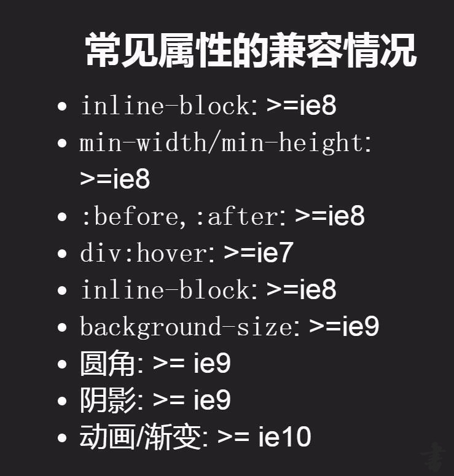

### 什么是 CSS hack
CSS hack由于不同厂商的浏览器，比如Internet Explorer,Safari,Mozilla Firefox,Chrome等，或者是同一厂商的浏览器的不同版本，如IE6和IE7，对CSS的解析认识不完全一样，因此会导致生成的页面效果不一样，得不到我们所需要的页面效果。 这个时候我们就需要针对不同的浏览器去写不同的CSS，让它能够同时兼容不同的浏览器，能在不同的浏览器中也能得到我们想要的页面效果。
*****
### 谈一谈浏览器兼容的思路

1.  要不要做
    *   针对目标客户群体考虑，要不要实现浏览器兼容。比如是面向年轻群体，还是面向政府或单位部门。
    *   实现难度和成本考虑，比较一下投入产出比。
附 [浏览器市场份额](http://tongji.baidu.com/data/browser)。

2.  做到什么程度
    *   综合考量需要做到什么浏览器什么版本的兼容，比如兼容到IE7 还是IE6
3.  怎么做？
    *   优雅降级还是渐进增强
    *   根据兼容需求选用框架/库
    *   利用条件注释、CSS Hack、js 能力检测做一些修补
******
### 常见属性兼容性


****
### 列举5种以上浏览器兼容的写法
1.  IE条件注释法
    ```
    只在IE下生效
    <!--[if IE]>
    这段文字只在IE浏览器显示
    <![endif]-->
    只在IE6下生效
    <!--[if IE 6]>
    这段文字只在IE6浏览器显示
    <![endif]-->
    只在IE6以上版本生效
    <!--[if gte IE 6]>
    这段文字只在IE6以上(包括)版本IE浏览器显示
    <![endif]-->
    只在IE8上不生效
    <!--[if ! IE 8]>
    这段文字在非IE8浏览器显示
    <![endif]-->
    非IE浏览器生效
    <!--[if !IE]>
    这段文字只在非IE浏览器显示
    <![endif]-->
    ```
2.  CSS属性前缀法
```
   .hack{  
   /*demo1 */  
   /*demo1 注意顺序，否则IE6/7下可能无法正确显示，导致结果显示为白色背景*/  
       background-color:red; /* All browsers */  
       background-color:blue !important;/* All browsers but IE6 */  
       *background-color:black; /* IE6, IE7 */  
       +background-color:yellow;/* IE6, IE7*/  
       background-color:gray\9; /* IE6, IE7, IE8, IE9, IE10 */  
       background-color:purple\0; /* IE8, IE9, IE10 */  
       background-color:orange\9\0;/*IE9, IE10*/  
       _background-color:green; /* Only works in IE6 */  
       *+background-color:pink; /*  WARNING: Only works in IE7 ? Is it right? */  
   }  
   .hacktest{   
       background-color:blue;      /* 都识别，此处针对firefox */  
       background-color:red\9;      /*all ie*/  
       background-color:yellow\0;    /*for IE8/IE9/10 最新版opera也认识*/  
       +background-color:pink;        /*for ie6/7*/  
       _background-color:orange;       /*for ie6*/  
   }
```
3  浏览器私有前缀添加
```
    -webkit-border-radius: 50%;//chrome
    -o-border-radius: 50%;//opera
    -moz-border-radius: 50%;//FixFore
    -ms-border-radius: 50%;//IE edge
```
4.  选择器前缀法
```
*html *前缀只对IE6生效
    *+html *+前缀只对IE7生效
    @media screen\9{...}只对IE6/7生效
    @media \0screen {body { background: red; }}只对IE8有效
    @media \0screen\,screen\9{body { background: blue; }}只对IE6/7/8有效
    @media screen\0 {body { background: green; }} 只对IE8/9/10有效
    @media screen and (min-width:0\0) {body { background: gray; }} 只对IE9/10有效
    @media screen and (-ms-high-contrast: active), (-ms-high-contrast: none) {body { background: orange; }} 只对IE10有效
```

5.  使用Moderniz
****
### 以下工具/名词是做什么的

1.  条件注释

利用IE6~9的漏洞（可识别特定特定注释）来区分IE各版本，或区分IE和非IE的一种css hack技术。

2.  IE Hack

指的是利用IE浏览器漏洞来兼容IE低版本，有CSS属性前缀法、选择器前缀法以及IE条件注释法

3.  js 能力检测

使用JS的语法检测浏览器支持的属性和方法。

4.  html5shiv.js

兼容性工具。引入后可在IE6~8（不支持html5标签）上模拟html5标签

5.  respond.js

兼容性工具。引入后在IE6~8（不支持css3）上模拟CSS3 Media Queries

6.  css reset

兼容性工具，思想是重置所有浏览器默认样式，让一切归零。

7.  normalize.css

兼容性工具。引入后可在默认的HTML元素样式上提供跨浏览器的高度一致性。相比于传统的CSS reset，Normalize.css是一种现代的、为HTML5准备的优质替代方案。

8.  Modernizr

Modernizr是一个 JavaScript 库，用于检测用户浏览器的 HTML5 与 CSS3 特性。该工具会为浏览器的html标签生成一批的css的class名称，标记当前浏览器支持和不支持的特性。我们利用html标签上的类名，就可以为不同版本的不同浏览器添加兼容样式。使用时可直接引入CDN链接即可。

9.  postCSS

它可以被理解为一个平台，可以让一些插件在上面跑，它提供了一个解析器，可以将CSS解析成抽象语法树，通过PostCSS这个平台，我们能够开发一些插件，来处理CSS。热门插件如autoprefixer，它可以帮我们处理兼容问题，只需正常写CSS，autoprefixer可以帮我的自动生成兼容性代码
*****
### 一般在哪个网站查询属性兼容性？

[查询兼容性3](http://caniuse.com/)

[查询hack写法9](http://browserhacks.com/)

